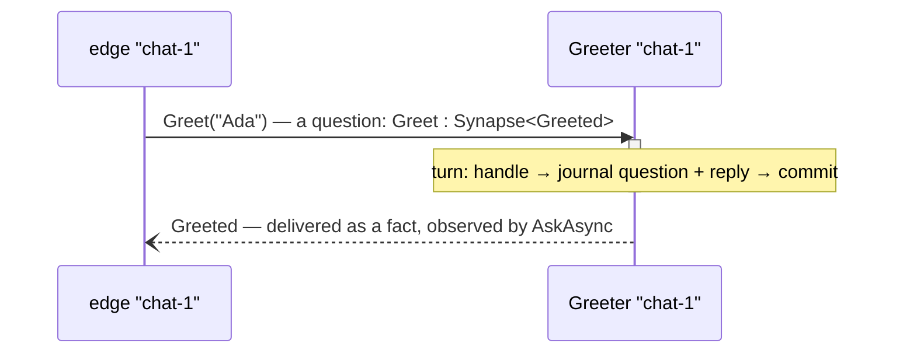
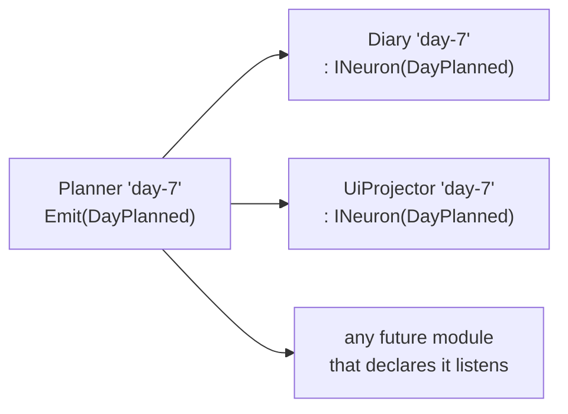
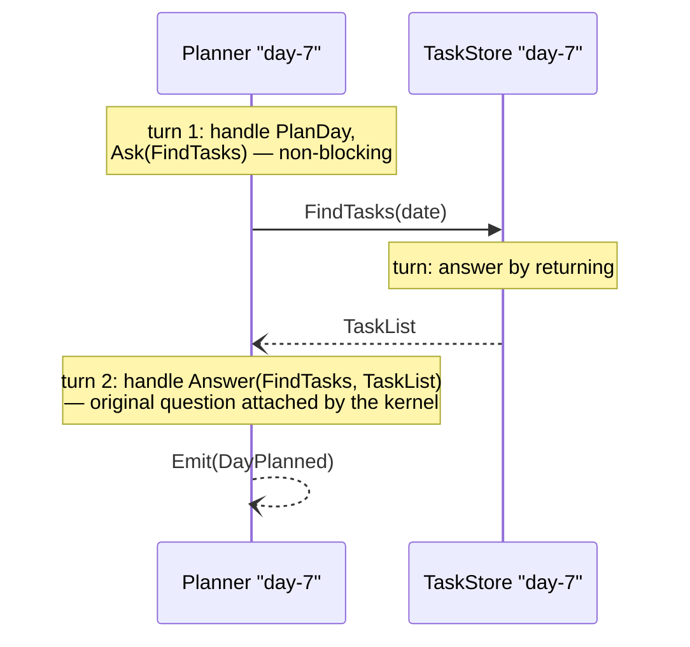
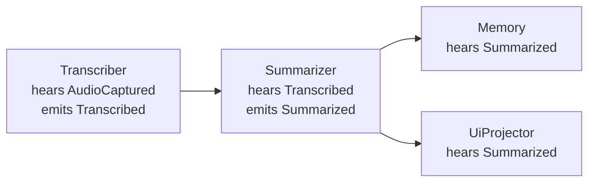
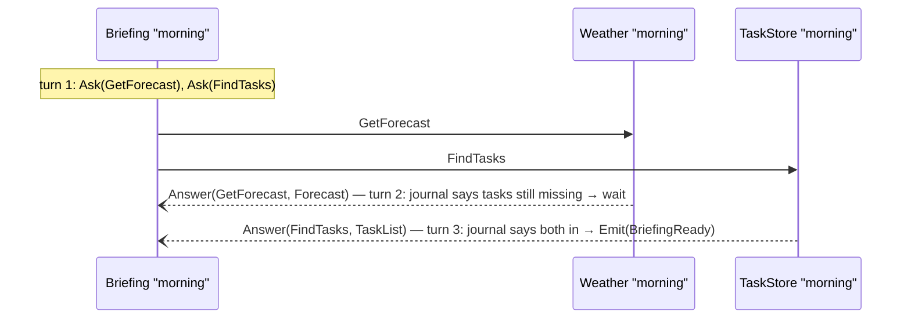
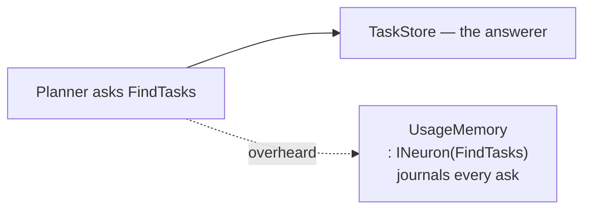
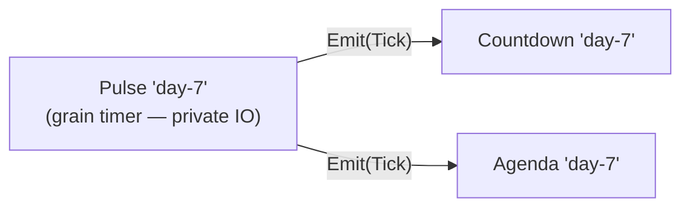
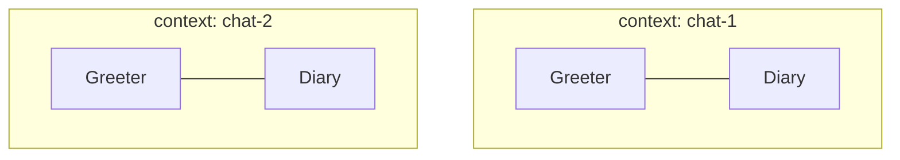
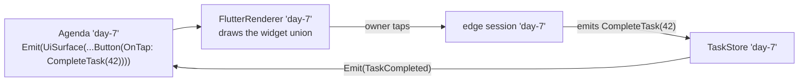
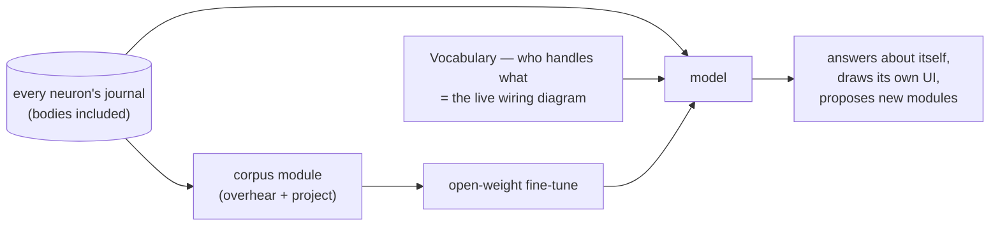

# DigitalBrain flows — every behavior the core can express

The core defines three interactions — **Announce**, **Ask→Answer**, **Continue** — plus
the context rule (instance name = context, emissions inherit it). Everything below is a
composition of those. No flow has a coordinator; behavior emerges from declarations.
Each flow names the test that secures it — a flow without its test does not exist.

---

## 1 · Ask → Answer — the direct response

*When: the edge (UI, HTTP, test) or a neuron needs one typed answer.*



```csharp
public sealed record Greet(string Who) : Synapse<Greeted>;

public sealed class Greeter : Neuron, INeuron<Greet, Greeted>
{
    public Task<Greeted> HandleAsync(Greet fact, CancellationToken ct)
        => Task.FromResult(new Greeted($"Hello, {fact.Who}!"));
}

Greeted greeted = await session.AskAsync(new Greet("Ada"), ct);   // TReply inferred
```

**Secured by:** `AskAsync` returns the typed reply; both journals show the round trip
with provenance; boot fails loudly if zero or two kinds answer `Greet`.

---

## 2 · Announce → Listen — the nervous system

*When: something happened and whoever cares should know. The speaker names nobody.*



```csharp
Emit(new DayPlanned(date, tasks));          // in some handler

public sealed class Diary : Neuron, INeuron<DayPlanned>;   // hearing IS the behavior
```

**Secured by:** every listener's journal holds the reception with the emitter as
source; adding a listener module changes no existing code (the test adds one and
asserts it hears).

---

## 3 · Ask → Answer → Continue — multi-turn thought without state

*When: a neuron needs another's answer to keep working. It never waits — it declares
what resuming looks like.*



```csharp
public sealed class Planner : Neuron, INeuron<PlanDay>, INeuron<Answer<FindTasks, TaskList>>
{
    public Task HandleAsync(PlanDay fact, CancellationToken ct)
    { Ask(new FindTasks(fact.Date)); return Task.CompletedTask; }

    public Task HandleAsync(Answer<FindTasks, TaskList> a, CancellationToken ct)
    { Emit(new DayPlanned(a.Question.Date, a.Reply.Tasks)); return Task.CompletedTask; }
}
```

**Secured by:** the continuation handler receives the *original typed question*; the
planner holds zero fields; killing the silo between turn 1 and turn 2 loses nothing
(restart test).

---

## 4 · Chain — pipelines without a pipeline

*When: multi-stage processing. Each stage only declares what it consumes and announces
what it produced. The pipeline is emergent — reorder or extend it by shipping modules.*



**Secured by:** the causal chain is reconstructible across journals by source +
sequence alone (the test walks it end to end); no stage names another.

---

## 5 · Fan-out / Fan-in — scatter, gather, join on your own journal

*When: one goal needs several answers. The join state is not a field — it is the
neuron's own journal.*



The continuation handler asks its **own journal** "do I have the other answer yet?" —
the journal is the join counter, the timeout ledger, and the audit trail in one.

**Secured by:** `BriefingReady` is emitted exactly once regardless of answer arrival
order (test permutes the order); a restart mid-gather still completes.

---

## 6 · Overhear — observation without participation

*When: audit, analytics, memory, debugging. Questions are facts too — a listener may
declare any question type and hear every ask without being the answerer.*



**Secured by:** the overhearing module's journal mirrors the traffic with provenance;
removing it changes nothing else (the fine-tuning corpus is built on this flow).

---

## 7 · Pulse — time as a fact

*When: timers, countdowns, schedules. Time enters the brain as an ordinary announced
fact from a module whose private helper is a timer.*



**Secured by:** consumers are tested by emitting `Tick` directly — time is mockable
because it is just a fact.

---

## 8 · Contexts — one brain, many parallel worlds

*When: everything. The instance name is the context; the same modules run "chat-1" and
"chat-2" as fully isolated columns with separate journals — concurrency for free.*



**Secured by:** two sessions interleave asks; each context's journals contain only its
own conversation.

---

## 9 · The UI loop — pixels are facts

*When: any surface. A renderer module listens to `UiSurface` facts; a tap IS the
synapse the button carried. No controller, no view-model, no binding layer.*



**Secured by:** the whole loop is asserted from journals — surface emitted, tap fact
delivered, state fact announced, new surface emitted. A UI test with no UI running.

---

## 10 · Introspection — the brain reads itself

*When: self-awareness, the model understanding the owner, debugging. Nothing here is
machinery — it is reads over what already exists.*



**Secured by:** an introspection test asks the brain what happened and asserts the
answer against the journals it was derived from.

---

## The algebra in one line

**hear** (declare) · **say** (`Emit`) · **ask** (`Ask`) · **answer** (`return`) ·
**continue** (declare `Answer<Q,R>`) — five moves, one context rule, and every flow
above is a composition. A behavior that cannot be expressed as such a composition is
the signal to grill the behavior, not to grow the core.
