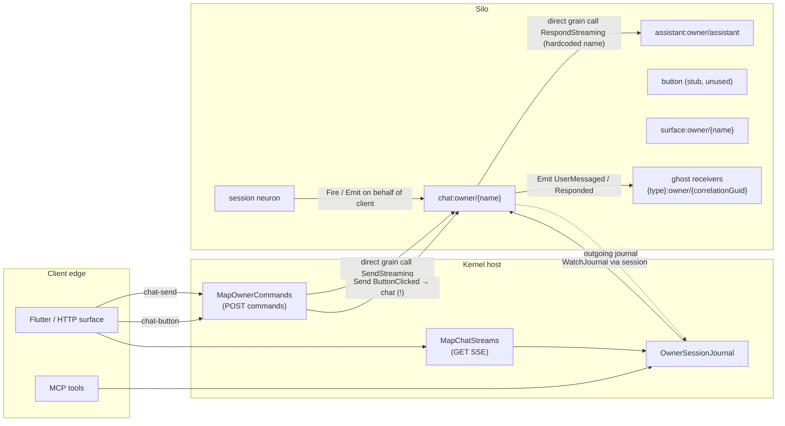
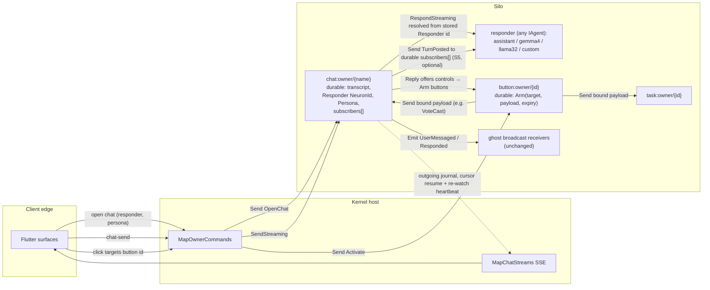

# DigitalBrain interconnection architecture review

Reviewed at HEAD `bbc5454d` (2026-08-09). Scope: how neurons get connected — multi-chat, model-bound conversations, UI surfaces, controls with identity. Evidence from DigitalBrain code, the IAW reference repo, and Orleans docs (learn.microsoft.com, verified 2026-08-09). This is a decision review; nothing is implemented here.

Note on sources: `Claude.md` and `CORE-DESIGN.md` no longer exist at HEAD (no `.md` files in the repo root). The constraints they carried survive in code and are cited from code below — most explicitly the Aspire streams comment in `DigitalBrainRuntimeHostingExtensions.cs:13-17` and the concurrency gate in `NeuronConcurrency.cs`.

---

## 1. Executive recommendation

**Bindings become durable state; buttons become armed dispatch neurons; Orleans Streams stay out of the interconnect.**

The gap the owner senses is real, but it is not "we need streams." It is: **DigitalBrain has no first-class notion of a *relation* between neuron instances.** Every connection today is one of (a) a compile-time constant (`Chat.DefaultResponder()` hardcodes `assistant:owner/assistant`), (b) a compile-time manifest (broadcast catalog → per-*type* ghost receivers), or (c) a volatile in-memory watcher list. Nothing durable says "chat `a` is answered by Gemma4 with prompt P" or "this button, when clicked, completes task T's user action."

Recommended target (Option 5, hybrid — detailed in §6):

1. **Binding as durable record on the bound neuron.** `Chat` gains durable `Responder: NeuronId` + `Persona` state, set at open/bind time, defaulting to today's assistant. Resolution happens by stored `NeuronId`, not by constant.
2. **Controls with identity via bound dispatch (C2).** `Button` becomes a real neuron: `Arm(target, payload, expiry)` when a reply offers it; a click is an HTTP Send **to the button id**; the button emits `ButtonActivated` into its own journal (audit) and Sends its bound domain synapse to its bound target. Chat stops implementing `IHandle<ButtonClicked>` as a god-switch.
3. **Observation stays journal-watch; domain facts stay on the synapse outbox.** Multi-subscriber "responder follows chat" (S5) is a durable subscriber list on the chat that the chat Sends to — bounded fan-out over the existing outbox — not a stream.
4. **Orleans Streams: not now.** Every guarantee the interconnect needs (durability, dedupe, replay-from-cursor, ordering, causation lineage, journal audit) is stronger in the existing outbox+journal machinery than in the provisioned Azure Queue provider (at-least-once, not rewindable, not FIFO under failure — the code comment already says exactly this, and the docs confirm it). Streams earn a place only at a future edge (cross-brain egress, unbounded fan-out), and none of S1–S6 is that edge.

Strongest argument against this recommendation, and the response, in §7.

The owner's five success questions are answered directly: §6 (Q1, Q2, Q3), §5 (Q4), §8 (Q5).

---

## 2. Current topology

### 2.1 All connection mechanisms at HEAD (A1)

| # | Mechanism | Path | Durability |
|---|-----------|------|------------|
| 1 | **Send** (directed synapse) | `Neuron.SendAsync` → `FireAsync` → durable `_outbox` → `DrainAsync` → `INeuron.Deliver` grain call | Durable, retried (`MaximumAttempts`/`RetryHorizon`), receiver dedupes by `SynapseId` (`_handled`, 4096 remembered) → effectively-once handling |
| 2 | **Emit** (broadcast) | `Neuron.EmitAsync` → `BroadcastCatalog.HandlerGrainTypes` → `NeuronId.BroadcastReceiver(grainType, owner, correlation)` → same outbox | Durable; receivers are per-**type** ghost instances named by the correlation GUID |
| 3 | **Reply** | `ReplyAsync` → `FireAsync(response, [_handling.Caller], …)` — same correlation, same outbox | Durable, directed back at the delivery's caller |
| 4 | **Direct grain call** | `Chat.DefaultResponder().RespondStreaming(...)` ([Chat.cs:97](src/Modules/UI/DigitalBrain.Modules.UI/Chat/Chat.cs)); HTTP → `GetGrainProxy<IChat>(chatName).SendStreaming(...)` ([MapOwnerCommands.cs:119](src/Kernel/DigitalBrain.Kernel/MapOwnerCommands.cs)) | Not a synapse: no outbox, no journal entry for the call itself, no retry. The *facts* (`UserMessaged`, `Responded`) are separately emitted |
| 5 | **Journal watch** | `INeuron.Watch(kind, cursor, IJournalObserver)` → volatile `_watchers` list → push after each commit (`NotifyWatchersAsync`) | Journal durable with cursor resume; the *subscription* is volatile (in-memory, dropped on error, lost on deactivation) |
| 6 | **HTTP SSE** | `MapChatStreams` → `OwnerSessionJournal.WatchChatOutgoingAsync(chatName)` → session grain → chat outgoing journal → `ChatTurnEvent` projection | Projection of #5 |
| 7 | **HTTP command bus** | `MapOwnerCommands`: `chat-send` → direct `SendStreaming`; `chat-button` → `SendAsync<IChat>(chatName, ButtonClicked)`; `surface-open` → `SendAsync<ISurface>` | Rides #1/#4 |
| 8 | **Orleans Streams** | Provisioned only: Azure Queue provider `"DigitalBrain"`, 8 queues, `PubSubStore` tables ([DigitalBrainHostingExtensions.cs:27-34](src/Kernel/Aspire/DigitalBrain.Aspire.Hosting/DigitalBrainHostingExtensions.cs)) | **Zero production usage.** No `GetStream`, `SubscribeAsync`, or `[ImplicitStreamSubscription]` anywhere in `src` |
| 9 | **MCP/authorization SSE** | `OwnerSessionJournal.WatchAuthorizationOutgoingAsync` | Projection of #5 |

The former unimplemented `IBroadcastSubscribers` extension point has been removed. `EmitAsync`
now resolves only reflected handlers plus durable graph connections
([NeuronMessagePipeline.cs:30](src/Kernel/DigitalBrain.Core/Neuron/NeuronMessagePipeline.cs)).



### 2.2 Who receives an Emit (A2)

[NeuronMessagePipeline.cs:34-44](src/Kernel/DigitalBrain.Core/Neuron/NeuronMessagePipeline.cs):

```csharp
var receivers = catalog.HandlerGrainTypes(synapseType)
    .Select(grainType => NeuronId.BroadcastReceiver(grainType, Id.Owner, correlation))
    .Concat(await SubscribedReceiversAsync(synapse)...)
```

with [NeuronId.cs:34-35](src/Kernel/DigitalBrain.Abstractions/Identity/NeuronId.cs):

```csharp
public static NeuronId BroadcastReceiver(string type, OwnerId owner, CorrelationId correlation)
    => new(type, owner, correlation.Value.ToString("D"));
```

So broadcast receivers are **per-type, not per-instance**: each handler grain *type* gets exactly one delivery, at a fresh instance whose *name is the correlation GUID* (the "ghost"). Named instances like `chat:owner/main` can never receive a broadcast — their name is not a correlation GUID. The subscribers leg could add named instances, but is unimplemented. Consequences:

- Broadcast handlers are correlation-scoped and state-isolated by construction (each ghost has its own durable journals/outbox — note this also means **every Emit with N handler types writes N ghost grains' durable state**, a real storage cost per emission).
- A ghost can `ReplyAsync` to the emitter (journal-observed Ask): the client's `SendRequestAsync` watches the **session** incoming journal for the correlated response ([DigitalBrainClient.cs:184-207](src/Kernel/DigitalBrain.Client/DigitalBrainClient.cs)) — the two-source shape: session + ghosts.

### 2.3 Multi-instance chats today (A3)

Works: every `chat:owner/{name}` has isolated transcript (`IDurableList` keyed state), isolated journals, and per-name SSE (`?chatName=` → that chat's outgoing journal only). Nothing cross-wires — journal watch is instance-scoped by construction.

Shared incorrectly: **the responder.** `AssistantName = "assistant"` is a private const; all chats resolve the same assistant instance. Also shared: the demo god-switch semantics of `ButtonClicked` (every chat has the same `show-time` behavior compiled in).

Impossible: per-chat responder/model/prompt (no state, no API); enumerating chats (no directory/index neuron — the UI must know names out-of-band); a responder observing a chat (no durable subscription mechanism).

### 2.4 Chat ↔ assistant binding (A4)

[Chat.cs:179-180](src/Modules/UI/DigitalBrain.Modules.UI/Chat/Chat.cs):

```csharp
private IAssistant DefaultResponder()
    => GrainFactory.GetGrain<IAssistant>(NeuronId.For<IAssistant>(Id.Owner, AssistantName).ToGrainId());
```

Compile-time constant; "chat C uses model M / agent A / prompt P" requires a code change. The AI module already has per-model contracts (`IGemma4`, `ILlama32`, `IQwen35`, `IGpt56`, all `IAgent`), so the *targets* for a binding exist — only the binding doesn't.

### 2.5 UI subscription binding (A5) — and a latent gap

HTTP SSE → `OwnerSessionJournal.WatchChatOutgoingAsync` → `brain.WatchJournalAsync` → session grain → `chat.Watch(kind, cursor, observer)`. N surfaces on one chat = N observers; each re-`Watch` from the same observer replaces its old registration ([NeuronJournal.cs:27-43](src/Kernel/DigitalBrain.Core/Neuron/NeuronJournal.cs)).

**Gap (affects S1/S6):** `_watchers` is in-memory per activation. If a watched neuron deactivates idle and later reactivates, the watcher list is empty and the SSE observer never hears again — the client has no periodic re-watch (the 100 ms polling loop is only the fallback when `CreateObjectReference` is unavailable, [DigitalBrainClient.cs:117-134](src/Kernel/DigitalBrain.Client/DigitalBrainClient.cs)). Orleans docs recommend exactly this remedy for observers: "Active clients should resubscribe on a timer to keep their subscriptions active" (learn.microsoft.com/dotnet/orleans/grains/observers). Fix belongs in Phase 1 regardless of topology choice.

---

## 3. Scenario stress results (B)

| # | Scenario | Today | Verdict |
|---|----------|-------|---------|
| S1 | 3 chats, 3 surfaces, no cross-wiring | Journal watch is instance-scoped; works. But no chat directory (UI must know names), and the watcher-loss-on-deactivation gap above can silently stall a surface | **Mostly works; two gaps** |
| S2 | Chat A→Gemma4, B→Llama, C→custom agent+prompt | Impossible: responder is a compiled constant; no binding state, no open-chat parameters | **Broken** |
| S3 | Reply offers 2 vote buttons as button neurons; click addresses button id; result lands in same chat | `Button` is an empty stub (`class Button : Neuron, IButton;`); HTTP routes clicks to the **chat** (`SendAsync<IChat>(chatName, ButtonClicked)`); chat filters on hardcoded `show-time` id and drops everything else silently | **Broken** |
| S4 | Task module offers a control in chat; click completes the task user-action | `TaskNeuron` has `IHandle<CompleteUserAction>` but nothing routes a chat click to it; would require chat to grow task-specific dispatch (god-switch) | **Broken without C2** |
| S5 | Responder optionally subscribes to a chat's turns | No durable grain-to-grain subscription. A neuron could pass itself as `IJournalObserver`, but the watcher list is volatile and drop-on-error — acceptable for a UI edge, wrong for a domain reaction | **Missing** |
| S6 | Teardown: close chat / expire offer / disarm buttons, no zombies | Journal watchers: dropped on error, `Unwatch` on dispose — but also silently lost on deactivation (the same coin). Buttons: nothing to tear down yet. Streams (if adopted): explicit subscriptions persist in `PubSubStore` until `UnsubscribeAsync` — a genuine zombie source that today's design simply doesn't have | **Half-works; button/subscription teardown must be designed with Phase 2/3** |

---

## 4. Binding-model options compared (D)

| Option | S1 | S2 | S3/S4 | S5 | S6 | Reentrancy/journal rules | Migration cost |
|---|---|---|---|---|---|---|---|
| **D1. Hardcoded resolution** (baseline) | ok | ✗ | ✗ | ✗ | n/a | respects them (trivially) | — |
| **D2. Durable binding state on chat** (`Responder`, `Persona` set at open/bind) | ok | **✓** | needs D2b (buttons) | partial | binding removable | unchanged — resolution is data-driven, call shape identical | Small: one synapse + state + fallback |
| **D3. Synapse-graph only** (chat Sends `TurnPosted` to responder; responder Replies) | ok | ✓ | ✓ via bound Send | **✓** | remove subscriber record | *Improves* them: decomposes the monolithic streaming turn into separate single-threaded turns, no A→B→A cycle | Medium: changes the interactive path; streaming UX must come from journal watch instead of the direct call |
| **D4. Stream-per-instance** (`chat/{owner}/{name}/turns` etc.) | ok | needs binding anyway | ✗ for clicks (commands are directed, not fan-out) | ✓ but weaker delivery | ✗ explicit subs persist in PubSubStore; resume ceremony on every activation | Delivery outside outbox: no causation lineage, no journal-is-outbox atomicity; at-least-once redelivery must re-enter neuron dedupe | High: infra on hot path + new failure modes |
| **D5. Hybrid (recommended)** = D2 for binding + D2b armed buttons + journal-watch for observation + D3-style Sends only where a durable reaction is wanted | ✓ | ✓ | ✓ | ✓ | ✓ | respects all four non-negotiables (§6.2) | Incremental; phases in §8 |
| **D6. IAW-style `IStreamConsumer<T>` auto-subscribe** | ok | ✗ (still needs binding) | ✗ | ✓ nominally | ✗ hidden lifecycle | Violates the audit rule: subscription is a side effect of activation, invisible in any journal; IAW even double-writes (event log `WriteStateAsync` **then** `OnNextAsync` — non-atomic, [Agent.Events.cs:34-49](../Projects/IAW/src/Core/Agents/Agent.Events.cs)) which journal-is-outbox exists to prevent | High, and pulls the design backwards |

D2 detail — where the binding lives is a real decision (§9): on the chat (chat owns its responder; simplest, recommended), on a separate `binding` neuron (relations first-class, queryable; heavier), or per-conversation in the responder (wrong: responders are shared).

---

## 5. Orleans Streams: fit matrix (C)

### 5.1 What is already provisioned, and what the code forbids (C1)

[DigitalBrainRuntimeHostingExtensions.cs:13-19](src/Kernel/Aspire/DigitalBrain.Aspire/DigitalBrainRuntimeHostingExtensions.cs):

```csharp
// Deliberate Azure Queue stream layout for a small single-silo product composition:
// ~8 physical queues, ~20 streams/queue headroom (2× safety). Visibility is double a
// one-minute cache window. Azure Queue streams are at-least-once, not rewindable, and
// not FIFO under failure — weaker than the durable synapse outbox; do not move outbox
// traffic onto this provider.
```

Every clause of that comment is confirmed by the docs (learn.microsoft.com/dotnet/orleans/streaming — stream semantics; …/streaming/streams-programming-apis — rewindable streams; …/implementation/streams-implementation/azure-queue-streams — tuning, where the "visibility = 2× cache time" rule comes from):

- **At-least-once:** "others provide at-least-once delivery (such as Azure Queue Streams)". Failed processing → message not deleted → reappears → redelivery.
- **Not rewindable:** "The SMS … and Azure Queue providers are *not* rewindable." No replay from a cursor; only Event Hubs is rewindable.
- **Not FIFO under failure:** "Azure Queue streams don't guarantee FIFO order because the underlying Azure Queues don't guarantee order in failure cases."

### 5.2 Mapping IAW's pattern onto neurons (C2)

IAW auto-subscribes on activation by reflecting over `IStreamConsumer<>` interfaces ([Agent.Streams.cs:23-45](../Projects/IAW/src/Core/Agents/Agent.Streams.cs), called from `OnActivateAsync`, [Agent.cs:152](../Projects/IAW/src/Core/Agents/Agent.cs)) and publishes to dynamic ids like `thread/{threadScope}/{eventName}` ([Agent.Events.cs:40](../Projects/IAW/src/Core/Agents/Agent.Events.cs)). Its tests and DevUI run on `AddMemoryStreams`; its hosting registers a `PubSubStore` (memory locally, Cosmos in the cloud path) but no durable stream provider was found in `IAWHostingExtensions` — IAW leans on memory streams, which the Orleans docs mark non-durable and dev/test-only.

Translated to DigitalBrain the ids would be `chat/{owner}/{name}/turns`, `button/{owner}/{id}/activations`. Two shapes exist:

- **Implicit subscription** maps stream `<key, namespace>` to consumer grain `<key, GrainType>` (docs: "stream `<XXX, MyStreamNamespace>` maps to consumer grain `<XXX, MyGrainType>`"). The consumer's grain key must *equal* the stream key — so `chat.turns` with key `owner/a` could only implicitly wake `responder:owner/a`, a distinct responder instance per chat. That contradicts binding to a *shared* model instance (S2) unless responders are per-chat facades.
- **Explicit `SubscribeAsync`** allows arbitrary binding but persists the subscription in `PubSubStore` and requires the resume ceremony on every activation (`GetAllSubscriptionHandles()` + `ResumeAsync`) — and unsubscribed-but-forgotten handles are the classic zombie (S6).

The interesting part of IAW worth keeping is not streams — it is **capability discovery from typed interfaces** (`GetMetadata`/`GetCapabilities` reflecting over `IReceiver<>`/`IStreamConsumer<>`, [Agent.Lifecycle.cs](../Projects/IAW/src/Core/Agents/Agent.Lifecycle.cs)). DigitalBrain already has the superior analog: `IHandle<T>`/`IEmit<T>` on contracts + the compiled manifest.

### 5.3 Journal Watch vs stream subscribe vs Send/Emit (C3)

| Property | Journal Watch | Azure Queue stream | Send/Emit synapse (outbox) |
|---|---|---|---|
| Durability of the *fact* | Durable journal, survives everything | Message durable until consumed, then gone | Durable journal + durable outbox entry |
| Delivery guarantee | Push is best-effort; recovery = re-Watch from cursor (`ResumeSequence`) | At-least-once with redelivery | At-least-once + receiver dedupe by `SynapseId` = effectively once |
| Replay from cursor | **Yes** — that is the API (`afterSequence`) | **No** (not rewindable) | Incoming journal is replayable for audit |
| Ordering | Per-neuron sequence, strict | Not FIFO under failure | Per-sender sequence; single-threaded receiver turns |
| Dynamic create/destroy | Any neuron id, zero setup | Streams are virtual (cheap create) but explicit subs persist until unsubscribed | Any receiver id, zero setup |
| Coupling to activation | Watcher list dies with activation (needs re-watch heartbeat) | Implicit subs *activate* the consumer on traffic (nice); explicit subs need resume ceremony | Deliver activates the receiver (virtual actor default) |
| Reentrancy interaction | Push is a one-way observer call; observers are non-reentrant but external to grain turns | Stream events arrive as grain calls → serialized like any turn; `StatelessWorker` consumers are undefined behavior per docs | The entire model is built around serialized turns |
| Audit | The journal *is* the audit | Invisible to journals unless separately recorded (IAW's non-atomic double-write) | Journal-is-outbox: fact and delivery commit together |

### 5.4 Can streams replace the broadcast catalog? (C4)

The modern Orleans analog of the catalog is the **Broadcast Channel** (implicit subscriptions, "best-effort, fire-and-forget", "not persistent — messages are lost if no subscribers are active", learn.microsoft.com/dotnet/orleans/streaming/broadcast-channel). That is strictly weaker than today's broadcast, which rides the durable outbox with retries and lands in durable ghost journals. Azure Queue streams with implicit subs could mimic the per-type fan-out but would forfeit causation lineage and the atomic journal+outbox commit. **No — the catalog stays.** Fan-out to UI/session edges is already served better by journal watch (cursor resume beats non-rewindable queues for a UI reconnect, which is the actual edge case that matters).

### 5.5 Azure Queue provider operational notes (C5)

Dynamic stream ids are free (streams are virtual; ids are just names — Orleans 7+ `StreamId` is string-based). Scale: settings are per-queue; more queues spread load; per-stream ordering makes the busiest single stream the gating factor. Redelivery: the runtime deletes a message only after successful consumer processing; failure → reappears after `MessageVisibilityTimeout` (the 2-minute setting) → duplicate delivery, breaking FIFO. There is no built-in poison-queue in the Orleans AQ adapter — undeliverable messages recycle until they expire, so a poison policy would be app-level work. All of this is machinery the outbox already has (attempts, retry horizon, abandonment telemetry, refusal settling) — adopting streams means rebuilding it.

**Verdict (owner Q4):** Orleans Streams are justified only when *all three* hold: (1) the receiver set is unbounded or unknown to the sender, (2) delivery may be lossy-but-redelivered without a durable causation record, and (3) consumers live outside the brain's journal discipline (external egress, cross-brain federation, telemetry firehose). None of S1–S6 qualifies. Keep the provisioned infra dormant or delete it (§9, decision 4).

---

## 6. Recommended target topology



### 6.1 The pieces

**Q1 — create chat X bound to responder Y:** `OpenChat(chatName, responder: NeuronId, persona?)` is a synapse handled by the chat; it durably stores `Responder` and `Persona`. `DefaultResponder()` becomes the fallback when no binding exists (today's behavior, preserved). The HTTP command bus grows a `chat-open` kind. Rebinding is `BindResponder(...)`, same shape. The binding is data; the call shape (`RespondStreaming` inside the chat's turn) is unchanged, so the reentrancy discipline and the streaming UX are untouched.

**Q2 — surface Z subscribes only to chat X:** unchanged — journal watch on `chat:owner/X` outgoing, already instance-scoped. Add the missing re-watch heartbeat (client re-issues `Watch` from its cursor on an interval; idempotent because `Watch` replaces the same observer's registration).

**Q3 — button B receives a click without chat being a sink:**
- Chat's reply offers controls → for each offer the chat **Sends `Arm(offerCommandId, label, target: NeuronId, payload: Synapse, expiry)`** to `button:owner/{deterministic id}` (recommended id: `{chatName}.{offerCommandId}.{buttonKey}` — idempotent re-offer, addressable teardown; see §9 decision 3).
- HTTP `chat-button` kind is replaced by `control-activate` targeting the **button id**: `SendAsync<IButton>(buttonId, Activate(...))`.
- The button's `HandleAsync(Activate)`: if disarmed/expired → throw `NeuronAuthorizationException` (the outbox records the delivery as `refused` and settles — teardown semantics for free, [NeuronOutbox.cs:200-233](src/Kernel/DigitalBrain.Core/Neuron/NeuronOutbox.cs)); if armed → emit `ButtonActivated` (audit in the button's own journal) and **Send the bound payload to the bound target**. For S3 that payload is a chat-declared domain synapse (`VoteCast`), for S4 it is `CompleteUserAction` to the task. Chat handles `VoteCast` and Replies into its transcript; it never sees a raw UI click. This is option **C2**; pure **B** (`ButtonActivated` only, someone else routes) just moves the god-switch, and **C1** (domain switch inside Button) makes the button know every module — both rejected.
- Disarm: chat (or offer owner) Sends `Disarm` on expiry/close; the button zeroes its binding. No subscription registry exists, so nothing can leak (S6).

**S5 — responder follows a chat:** a durable `subscribers: NeuronId[]` list on the chat, mutated by `Subscribe`/`Unsubscribe` synapses; after committing a turn the chat Sends `TurnPosted` to each subscriber via the normal outbox. Bounded fan-out (a handful of responders), durable, deduped, and teardown is deleting a record. This is deliberately *not* built until a concrete consumer exists (§8 Phase 3).

### 6.2 Invariants preserved (the non-negotiables)

1. **Reentrancy:** no new call cycles. The chat→responder call keeps its one direction; button dispatch is fire-via-outbox (separate turns, no A→B→A). Multi-responder S5 runs as detached turns, so the "one logical conversation turn is single-threaded" rule holds for the interactive path and is *not* required to change.
2. **Journals are audit source:** every new fact (`OpenChat`, `Arm`, `ButtonActivated`, `VoteCast`, `TurnPosted`) is a synapse through the outbox → journaled. No prompts/secrets in journals: `Persona` lives in durable *state*, not in an emitted synapse (only a persona *name/reference* may appear in synapses — §9 decision 2).
3. **Outbox durability for domain delivery:** streams remain out of the delivery path entirely.
4. **Concurrency gate:** nothing here needs `[Reentrant]`/`[AlwaysInterleave]`; `NeuronConcurrency.RequireSerializedTurns` stays as-is.

---

## 7. What we reject and why

**Rejected: Orleans Streams as the interconnect (the owner's hypothesis, stress-tested).** The counter-hypothesis from the prompt survives contact with the docs: streams as primary interconnect regress durability (at-least-once queue vs journal-is-outbox), ordering (non-FIFO under failure vs per-neuron sequences), replay (not rewindable vs cursor resume), audit (invisible to journals), and add a persistent-subscription lifecycle that is a new zombie class. The one thing streams add — sender-blind dynamic fan-out — is not needed by any of S1–S6, all of which are *directed* relations (chat→responder, button→target, surface→chat).

**Strongest argument against the recommendation (steelman):** "Durable subscriber lists + armed buttons re-implement pub-sub by hand; Orleans already ships pub-sub (PubSubStore) and IAW proves auto-subscribe works. You are building bespoke machinery out of not-invented-here." Response: the bespoke machinery **already exists and is the product's spine** — outbox, dedupe, refusal settling, journals. Adopting Orleans pub-sub would not delete that machinery; it would add a second, weaker delivery system beside it, plus the resume ceremony and the subscription-leak class, to serve scenarios that need at most a handful of durable directed edges. IAW "proves" the pattern only on memory streams with a non-atomic event-log double-write — precisely the failure journal-is-outbox was built to close. The hand-rolled subscriber list is ~a durable list plus two synapses; the stream adoption is a provider on the hot path plus new failure modes. Fold only if a scenario appears with unbounded/unknown receivers — then revisit §5.5's three-condition test.

**Rejected: IAW-style activation-time auto-subscribe (D6)** — hidden topology, violates the audit rule (subscriptions never appear in any journal), and its typed-interface ergonomics are already served by `IHandle<T>`/`IEmit<T>` + manifest.

**Rejected: per-instance broadcast (extending `IBroadcastSubscribers` as the binding mechanism).** It answers "who else hears this synapse type" — a *type*-level question — while S2/S3/S4 need *instance*-level directed edges with payload (target + prompt + expiry). Implementing the registry to simulate directed edges would abuse broadcast for addressing. Leave the interface dead or delete it (§9 decision 5).

**Rejected: renaming as a lever (F).** The turn synapse names are adequate. One real change earns its keep: `Responded` should carry the **author** (`Responder: NeuronId`) once multi-responder chats exist — otherwise the transcript cannot attribute turns. If a rename ever rides along, `Message`/`Reply` (`chat.message`, `chat.reply`) is the consistent pair for a multi-responder world — but do it opportunistically, not as a migration of its own.

---

## 8. Migration phases + first failing proofs

There are **no test projects at HEAD** (no `*Test*.csproj` under `src`), so Phase 0 also re-seeds the test tree — per the established taxonomy, `NeuronTest` and `DigitalBrainTest` are the only two kinds.

**Phase 0 — proofs that fail today (write these first; do not fix yet):**
- **P0-binding (DigitalBrainTest):** open chats `a` and `b`, request binding `a`→`gemma4`, `b`→`llama32`; assert the two chats' turns are answered by different responders. *Fails: no binding API exists.*
- **P0-button (DigitalBrainTest):** a reply offers a control bound to a task user-action; activate it by **button neuron id**; assert `TaskNeuron` received `CompleteUserAction` and the chat transcript gained the outcome turn. *Fails: `Button` is a stub and clicks route to the chat.*
- **P0-isolation (control, should pass):** two chats, one surface each; assert no cross-delivered turn events. *Documents that S1 already holds.*
- **P0-watch-resume (NeuronTest):** watch a neuron's journal, force deactivation, append a fact; assert the observer eventually hears it. *Fails today: watcher list is lost on deactivation — fixed by the Phase 1 heartbeat.*

**Phase 1 — binding (smallest vertical slice):** `OpenChat`/`BindResponder` synapses; durable `Responder`+`Persona` on `Chat`; `DefaultResponder()` as fallback; `chat-open` HTTP kind; client re-watch heartbeat. Turns P0-binding and P0-watch-resume green. Aspire build + integration tests green before proceeding.

**Phase 2 — controls with identity:** `IButton` contract grows `Arm`/`Disarm`/`Activate` synapses + durable binding; chat offer path arms buttons; HTTP `control-activate` targets button ids; delete `IHandle<ButtonClicked>` from `IChat` (and the `show-time` god-switch); wire the S4 task proof. Turns P0-button green.

**Phase 3 — durable turn subscription (only if a consumer exists):** `Subscribe`/`Unsubscribe` + `TurnPosted` Sends from chat. Gate: an actual S5 feature (e.g., a critic agent following a chat) must be on the roadmap first.

**Phase 4 — streams (deferred indefinitely):** revisit only if the §5.5 three-condition test is met by a real scenario. Until then, decide dormant-vs-delete for the provisioned infra (§9 decision 4).

---

## 9. Open decisions for the owner (nothing below is implemented until picked)

1. **Where bindings live:** on the chat (recommended — owner of the conversation owns its responder) vs a first-class `binding` neuron (relations queryable/enumerable, supports a future topology view, but heavier). Affects Phase 1.
2. **Persona/prompt storage:** durable chat state referenced by name (recommended — keeps prompts out of journals per the audit rule) vs full prompt text in the `OpenChat` synapse (simpler, but journals then carry prompts).
3. **Button identity scheme:** deterministic `{chat}.{offerCommandId}.{key}` (idempotent re-offers, addressable disarm; recommended) vs random GUID (opaque, needs an index to tear down).
4. **Provisioned streams infra:** delete (matches deletion-heavy taste; ~40 lines + one Azurite queue/table pair, trivially re-addable) vs keep dormant (zero code risk, small infra noise, invites misuse). No production code references it either way.
5. **`IBroadcastSubscribers`:** delete the dead extension point vs keep as the future hook for named-instance broadcast. If S5 ships via durable subscriber lists (recommended), nothing needs it.
6. **`Responded` attribution:** add `Responder: NeuronId` field now (cheap, forward-compatible) vs at Phase 1. Rename to `Message`/`Reply` opportunistically or never.
7. **Chat directory:** is "enumerate my chats" (S1's soft gap) wanted? If yes, an index neuron (`chats:owner/index`) updated by `OpenChat` — small Phase 1 rider.

---

## 10. Appendix: file evidence

| Claim | Evidence |
|---|---|
| Outbox is durable, retried, abandoning, refusal-settling | [NeuronMessagePipeline.cs:125-157](src/Kernel/DigitalBrain.Core/Neuron/NeuronMessagePipeline.cs) (`outbox.Add(...)`), [NeuronOutbox.cs:109-243](src/Kernel/DigitalBrain.Core/Neuron/NeuronOutbox.cs) (`DrainAsync`, `Exhausted`, `TryDeliverAsync` catching `NeuronAuthorizationException` → `"refused"`) |
| Receiver dedupe by SynapseId | [NeuronTurnCoordinator.cs:34-44](src/Kernel/DigitalBrain.Core/Neuron/NeuronTurnCoordinator.cs) (duplicate short-circuit), [NeuronDeliveryMemory.cs:39-49](src/Kernel/DigitalBrain.Core/Neuron/NeuronDeliveryMemory.cs), [Neuron.cs:15](src/Kernel/DigitalBrain.Core/Neuron/Neuron.cs) (4096 bound) |
| Broadcast = per-type ghost keyed by correlation | [NeuronMessagePipeline.cs:30-47](src/Kernel/DigitalBrain.Core/Neuron/NeuronMessagePipeline.cs), [NeuronId.cs:34-35](src/Kernel/DigitalBrain.Abstractions/Identity/NeuronId.cs), [BroadcastCatalog.cs:37-38](src/Kernel/DigitalBrain.Core/BroadcastCatalog.cs) |
| Dynamic broadcast subscribers removed | `EmitAsync` resolves reflected handler types and graph connections in [NeuronMessagePipeline.cs:30-44](src/Kernel/DigitalBrain.Core/Neuron/NeuronMessagePipeline.cs) |
| Reply targets the delivery's caller, same correlation | [NeuronMessagePipeline.cs:71-85](src/Kernel/DigitalBrain.Core/Neuron/NeuronMessagePipeline.cs) |
| Hardcoded chat→assistant binding | [Chat.cs:18,179-180](src/Modules/UI/DigitalBrain.Modules.UI/Chat/Chat.cs) |
| Button is a stub; clicks routed to chat; god-switch | [Button.cs:6](src/Modules/UI/DigitalBrain.Modules.UI/Button/Button.cs), [MapOwnerCommands.cs:65-68](src/Kernel/DigitalBrain.Kernel/MapOwnerCommands.cs), [Chat.cs:131-148](src/Modules/UI/DigitalBrain.Modules.UI/Chat/Chat.cs) |
| UI SSE = journal watch projection per chat name | [MapChatStreams.cs:44-53](src/Kernel/DigitalBrain.Kernel/MapChatStreams.cs), [OwnerSessionJournal.cs:26-39](src/Kernel/DigitalBrain.Kernel/OwnerSessionJournal.cs) |
| Watchers volatile, drop-on-error, replace-on-rewatch | [NeuronJournal.cs:27-49](src/Kernel/DigitalBrain.Core/Neuron/NeuronJournal.cs), [NeuronJournal.cs:64-77](src/Kernel/DigitalBrain.Core/Neuron/NeuronJournal.cs) |
| Client watch has no re-subscribe heartbeat; polling only as fallback | [DigitalBrainClient.cs:107-149](src/Kernel/DigitalBrain.Client/DigitalBrainClient.cs) |
| Concurrency gate forbids reentrancy attributes | [NeuronConcurrency.cs:9-43](src/Kernel/DigitalBrain.Core/Neuron/NeuronConcurrency.cs) |
| Streams provisioned, never used; outbox-on-streams forbidden | [DigitalBrainHostingExtensions.cs:27-34](src/Kernel/Aspire/DigitalBrain.Aspire.Hosting/DigitalBrainHostingExtensions.cs), [DigitalBrainRuntimeHostingExtensions.cs:13-42](src/Kernel/Aspire/DigitalBrain.Aspire/DigitalBrainRuntimeHostingExtensions.cs); `grep GetStream|SubscribeAsync|ImplicitStreamSubscription` over `src` → only Microsoft.Extensions.AI `GetStreamingResponseAsync` hits |
| Task module has the S4 handler waiting | [TaskNeuron.cs:18](src/Modules/Tasks/Tasks/TaskNeuron.cs) (`IHandle<CompleteUserAction>`) |
| Per-model contracts exist as binding targets | `src/Modules/AI/Contracts/Ollama/IGemma4.cs`, `ILlama32.cs`, `IQwen35.cs`, `OpenAI/IGpt56.cs` (all `IAgent`) |
| IAW auto-subscribe + thread-scoped ids + non-atomic double-write | [Agent.Streams.cs:23-45](../Projects/IAW/src/Core/Agents/Agent.Streams.cs), [Agent.cs:152](../Projects/IAW/src/Core/Agents/Agent.cs), [Agent.Events.cs:34-49](../Projects/IAW/src/Core/Agents/Agent.Events.cs); memory streams in tests ([AgentTest.cs:21](../Projects/IAW/src/Testing/AgentTest.cs)) |
| Orleans semantics (delivery, rewindability, ordering, implicit mapping, broadcast channel, observers, reentrancy) | learn.microsoft.com/dotnet/orleans: `streaming` (stream semantics), `streaming/streams-programming-apis` (rewindable, explicit/implicit subscription, resume ceremony, AQ redelivery), `streaming/broadcast-channel` (best-effort, non-persistent, implicit-only), `implementation/streams-implementation/azure-queue-streams` (tuning: visibility = 2× cache), `grains/observers` (best-effort, resubscribe-on-timer, non-reentrant execution), `grains/request-scheduling` (single-threaded turns, deadlock cycles) |
