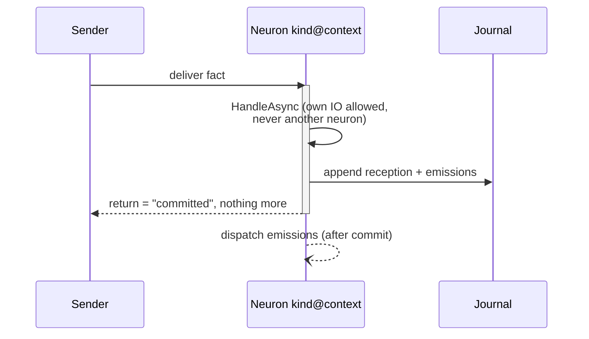
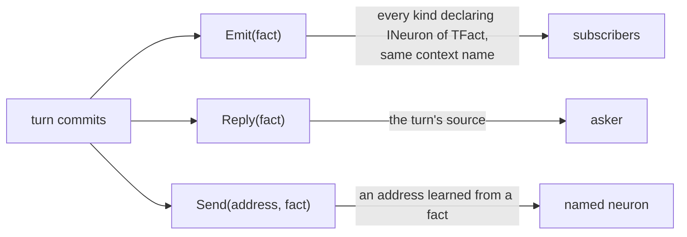
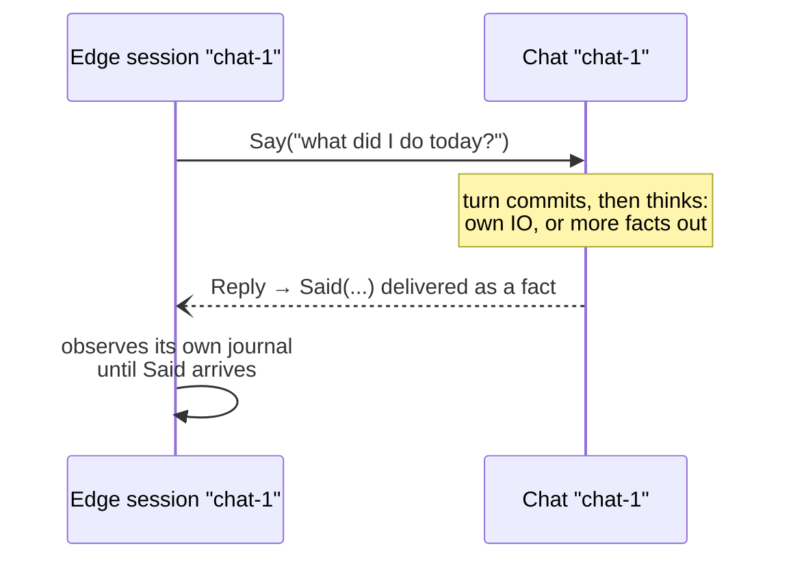
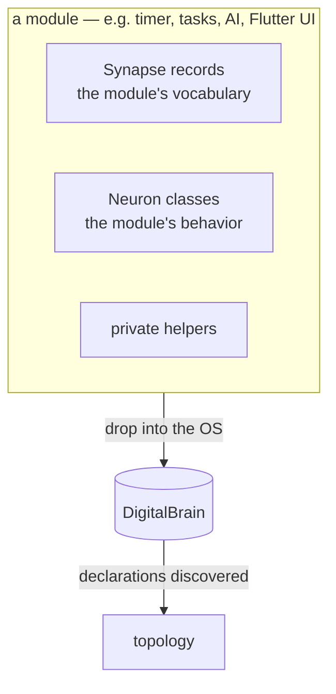
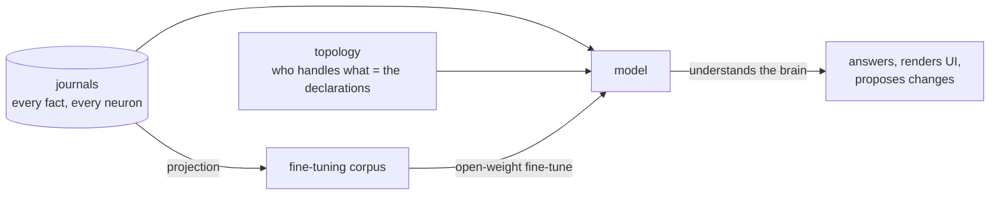
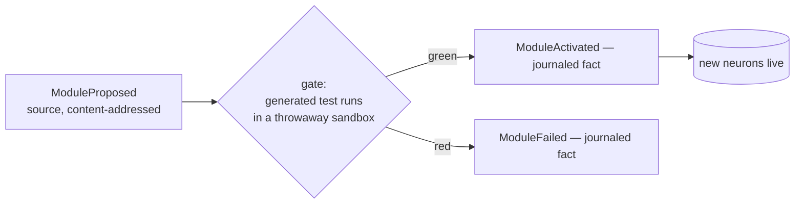

# DigitalBrain OS — how it works

One page. If a concept is not on it, the core refuses to contain it.

## The OS in three sentences

1. A **Synapse** is an immutable fact.
2. A **Neuron** handles facts and remembers everything it heard and said — its
   **journal** is its memory and the OS's only record of truth.
3. Facts travel by **communication, not orchestration**: a neuron declares what it
   handles, and that declaration is its address and its subscription. Nobody wires
   anything.

Everything else — UI, AI, tasks, timers, storage — is a module, and a module ships
**only neurons and synapses** (plus private helpers it keeps to itself).

## The envelope is the ABI

Every fact travels with exactly four fields, and this schema is frozen:

```
SynapseMetadata(Source: NeuronId, Sequence, Timestamp)   NeuronId(Kind: string, Name: string)
```

- `Kind` is the neuron's logical name (never a CLR `Type` — grown modules must not be
  chained to loaded assemblies).
- `Name` is the **context**. Emissions inherit the emitter's name, so facts stay in
  their conversation: `Greeter "chat-1"` emits → `Diary "chat-1"` hears. The edge picks
  the name when it first speaks; system neurons use a well-known name. This one rule
  answers "which instance gets the broadcast" with zero new concepts.
- `Sequence` is the fact's position in its source's journal — identity and causation
  (adjacency) in one number.
- Fact **bodies live in the journal**. The journal is the delivery queue, the audit
  record, and the training corpus — one structure, three consumers.

## One turn

A turn is the atomic unit of existence. Nothing observable happens outside one.



The return of a delivery means exactly one thing: *the fact and its consequences are
committed*. It is never the answer.

## How facts travel — three routings, one bus



- `Emit` — the default. The emitter names nobody; consumers exist because they
  declared `INeuron<TFact>`. This is what makes modules shippable and lets the OS
  rewire itself.
- `Reply` — the directed answer, journaled like any emission.
- `Send(address)` — directed at an identity learned from a fact (e.g. a source
  address seen earlier). There is no type-coupled send; naming another module's class
  is orchestration and is forbidden.

**Neurons never await neurons.** A response is a new fact in a new turn. Multi-step
work is a fact protocol, not a call chain — this deletes the deadlock class that
crippled every predecessor.

## Asking from the edge

The edge (UI, HTTP, tests) is itself an address. Asking is observing:



A same-turn reply may ride back on the delivery call as a fast path; correctness is
identical if it arrives ten turns later. There is no result wrapper in the brain:
**the result pattern IS the reply fact**. A neuron that cannot do something replies
with a fact that says so — errors are vocabulary, not exceptions. Exceptions are for
kernel bugs only.

## What a module is



The Flutter UI is exactly this: neurons that consume `UiSurface : Synapse` (a closed
widget union; a `Button` carries the `Synapse` it fires) and emit intent facts. The AI
module: neurons that consume conversation facts, await their model IO inside their own
turn, and emit response facts. Timer: a neuron whose timer fires a normal fact at
itself's context. None of them touch the kernel; none of them know each other.

## Self-awareness

Not a feature — a consequence. Three faculties, all reads:



- Any neuron's journal is readable through the same transport that delivers facts.
- The topology is enumerable: the set of `INeuron<TFact>` declarations *is* the wiring
  diagram — nothing else exists to be out of date.
- **Usage recording is free**: the owner's every interaction is already facts in
  journals. The fine-tuning corpus is a projection of journals — a module, not a
  kernel feature. The OS learns you because it never forgets what you said and can
  read exactly what it did in response.

## How it grows

Staged. Today modules are compiled assemblies; the architecture assumes nothing static:



Code lifecycle is journaled facts like everything else — a brain that cannot read its
own change history has amnesia. *No neuron without a green test* is a runtime
invariant, not a CI convention. Privileged changes require the owner's tap.

## What the core refuses to contain

Each of these killed or crippled a predecessor (evidence: CORE-RESEARCH.md):

- Orchestrators, workflow engines, sagas — flows emerge from declarations.
- Correlation ids as API — causation is journal adjacency; identity is fact + actor.
- Result/error wrapper types in the brain — replies are facts.
- A second bus, a second envelope, streams beside calls — one bus, one envelope.
- Type-coupled sends, `System.Type` in addresses, AQN in durable data.
- Registration, DI ceremony, constructor forwarding, attributes on modules.
- Retry policies, dedup windows, durable outboxes — until journal-resume dispatch
  lands, and then only the minimal receiver-side duplicate check.
- Fake proofs: stub gates, synthetic observations, "durable" names on volatile things.
