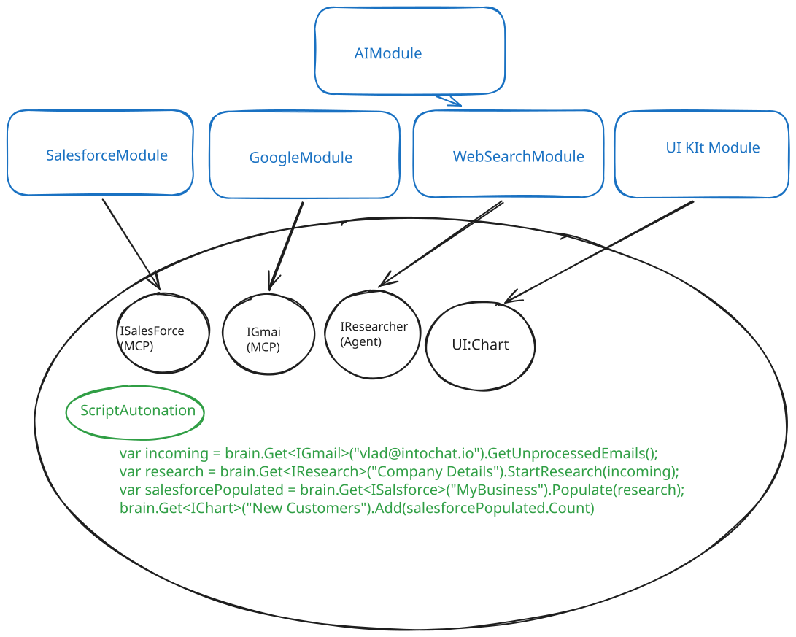

# DigitalBrain

Personal “alive OS”: Orleans **neurons** (durable grains) exchange **synapses** (facts) over a live **synapse graph** the owner and assistant rewrite at runtime.

**Kernel** — single-threaded turns, journal-is-outbox, emit (graph-routed) vs send (directed).  
**Modules** — AI, Execution, UI, MCP SaaS (Salesforce/Gmail), Memory, Time, …  
**Run** — `dotnet run --project src/Kernel/DigitalBrain.AppHost`

## CoreV2 cutover baseline

`DigitalBrain.slnx` compiles only the CoreV2 framework under `src/CoreV2` and its tests under `tests/CoreV2`. The retained V1 source under `src/Kernel` and `src/Modules` is intentionally unreferenced until its scheduled removal; it is not part of the compiled product boundary.

CI verifies the CoreV2 architecture, Abstractions, Core, and Proof suites independently and builds the full solution in Release with warnings treated as errors. See [plans/COREV2.md](plans/COREV2.md) for the verified framework scope.
