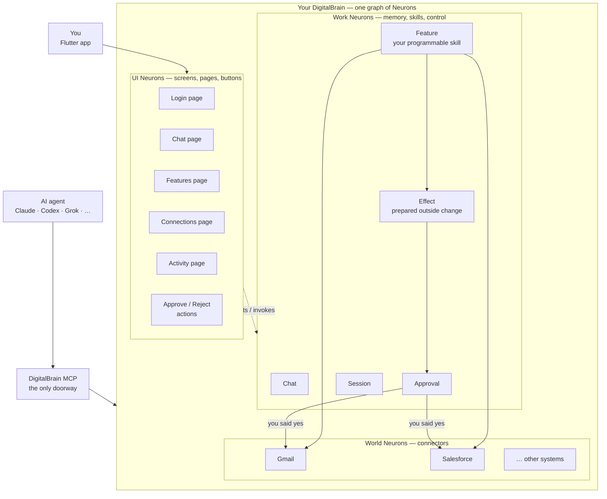
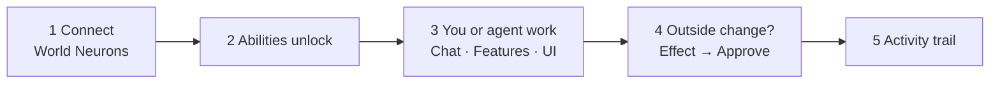

# DigitalBrain

**One living workspace where you and AI agents work together — safely.**

DigitalBrain is a personal OS built on **.NET Aspire + Orleans**. The product axiom is simple:

> **Everything addressable is a Neuron** — pages, buttons, Chat, Features, Gmail, Salesforce, Approvals.

Not a metaphor. Login is a Neuron. The Chat page is a Neuron. Gmail is a Neuron. A Feature you install (or write with real logic) is a Neuron. People and agents share **one brain**. The app is a **live window**. Outside changes need **your approval**.

Product story for stakeholders: **[Wiki](https://github.com/digitalbraintech/brain/wiki)** · deep design: [`EVERYTHING-IS-A-NEURON.md`](EVERYTHING-IS-A-NEURON.md) · way of working: [`CLAUDE.md`](CLAUDE.md)

---

## Everything is a Neuron



| Layer | Examples | Meaning |
|-------|----------|---------|
| **UI Neurons** | Login, Chat page, Connections, Approve button | What you see and click — not a separate app model |
| **Work Neurons** | Chat, Feature, Effect, Approval, Session | Memory, skills, control |
| **World Neurons** | Gmail, Salesforce, … | Real systems, **same Neuron kind** as Login |

**Same kind of thing. Different jobs. One brain.**

Because **UI contracts** and **connector contracts** are both Neuron contracts, Features can compose complex logic *inside* DigitalBrain — project UI, call Gmail/Salesforce under grants, and still pass every outside write through **Effect → your Approve/Reject**.



---

## Retained execution path

Keep one path:

`Client → Edge/Auth → INO operation → deterministic function or bounded model workflow → effect gate → connector adapter`

Commands and queries use typed grain interfaces. Orleans streams are reserved for progress, fan-out, and observability.

---

## Quick start (local)

From repo root:

```powershell
aspire doctor
dotnet build
dotnet test --logger "console;verbosity=minimal"
```

- After `git clean -fdx`, `dotnet build` (or `aspire start`) auto-initializes the CodeGraph index via MSBuild target.
- Use the `codegraph` MCP server for architecture queries.

Full stack:

```sh
aspire start
```

See [CLAUDE.md](CLAUDE.md) for the complete way of working (Elon’s 5-step algorithm, MCP-first iteration, Context7 + CodeGraph + Aspire ritual).

---

## Test suites

The root test command is expected to run every test with zero skips:

```powershell
dotnet test --logger "console;verbosity=minimal"
```

- **Real-stack E2E** (`tests/DigitalBrain.E2ETests`) boots the full Aspire AppHost + Orleans silo and drives it over real gRPC/gRPC-Web.
- **AppHost model tests** (`tests/DigitalBrain.AppHostTests`) inspect the declared Aspire resource graph without starting it.

Do not keep a separate `aspire run` / `aspire start` session alive while running the full root test suite; the E2E fixture owns its AppHost lifecycle.

---

## Core ideas (engineering)

- **Neuron ontology** — one addressable kind for UI, work, connectors, Features, Effects; differences are traits, not parallel runtimes.
- **External mutation rail** — durable effect plans with approval evidence, idempotency, lease/fence checks, and outcome verification.
- **External edge** — UI gRPC plus DigitalBrain MCP (agents enter *this* brain, not a tool mall).
- **Orleans** — typed grain interfaces for commands and queries; streams only for progress, fan-out, and observability.
- **Aspire hosting** — AppHost wires replicas, Ollama, storage, MCP, Flutter client.
- **Self-evolution** — user-visible mutations (Features, automations) go through the human-approved, journaled rail.

Use CodeGraph MCP (see `.mcp.json` and CLAUDE.md) as the primary tool for architecture and codebase understanding.

---

## Target dependency direction

```text
Provider Contracts       Feature SDK       Kernel Contracts
       ^                      ^                  ^
       |                      |                  |
Provider Integrations    Feature releases    Kernel runtime
       ^                      ^                  ^
       +---------- RuntimeHost authority -------+
                              ^
                    MCP/UI + FeatureHost
                              ^
                 AppHost resource composition
```

Dependencies point inward toward the three contract seams. `DigitalBrain.RuntimeHost` is the only process project allowed to compose the kernel with concrete providers. `DigitalBrain.AppHost` models resources and references process projects without owning their service registrations.

No external mutation may bypass `InoEffectPlanAuthority`, durable approval evidence, idempotency, lease/fence checks, and outcome verification.

---

## Working rules (see CLAUDE.md)

- Always follow Elon’s 5 steps **in order**: less dumb reqs → delete (target 10%+) → simplify → accelerate → automate last.
- **CodeGraph MCP** for architecture understanding (prefer over manual file crawls).
- **Context7** for every library/framework API before touching code.
- **Aspire MCP + CLI** for inspection/restarts/logs/traces (prefer over full runs).
- Tests: `dotnet test --logger "console;verbosity=minimal"` from root. No `--filter`.
- Delete superseded documentation. Keep this README and CLAUDE.md current.
- Relative paths. Self-explanatory names. No vacuous summaries.
- Self-evolution is non-negotiable for mutations.

---

## Status

AppHost + kernels + self-evolution rail are live. Product narrative: [wiki](https://github.com/digitalbraintech/brain/wiki). Design axiom: [EVERYTHING-IS-A-NEURON.md](EVERYTHING-IS-A-NEURON.md). Day-to-day rules: [CLAUDE.md](CLAUDE.md).

---

**In one line:** Pages, buttons, Chat, Gmail, Salesforce, and the skills you build are all Neurons — one programmable brain, live window, you approve what touches the world.
