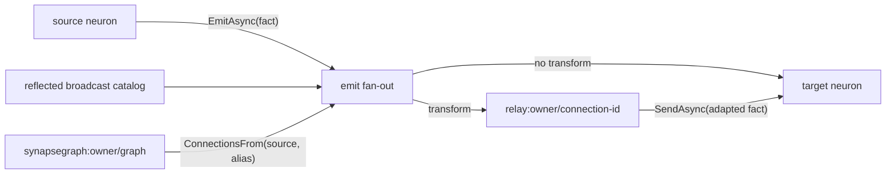

# DigitalBrain unified interconnect: the Synapse Graph

> Current architecture record, 2026-08-11. Production source is the behavioral truth;
> `plans/RATIFIED-PRODUCT-DEFINITION.md` is product scope. The original Bind-era proposal and its
> proof history remain available in git history; `INTERCONNECT-REVIEW.md` remains the evidence base.
>
> The central automated-test project was intentionally deleted by owner decision. Current
> verification is source inspection, a zero-warning solution build, Flutter `lib/` analysis, and
> live AppHost smoke. Final hardening will introduce module-owned test projects/frameworks.

## 1. One interconnect

Neurons are durable Orleans grains. Synapses are facts. A neuron either:

- `EmitAsync(synapse)` — sender-blind fan-out to reflected broadcast handlers plus live Synapse
  Graph connections; or
- `SendAsync(receiver, synapse)` — directed delivery that never consults the graph.

The client facade uses `FireAsync`: without a target it has emit semantics; with a receiver or
`Get<T>(name)` it is directed. Every accepted outgoing fact is journaled. Receiver delivery uses
the durable outbox, and receiver dedupe by `SynapseId` makes at-least-once delivery effectively
once.



Orleans Streams remain provisioned but are deliberately not the neuron interconnect. Moving
journal/outbox traffic to Streams would lose the atomic audit and replay boundary.

## 2. The durable graph

`ISynapseGraph` is the `synapsegraph` grain at instance `graph`, one per owner. Its durable record
is `SynapseConnection`:

```text
ConnectionId, Source, SynapseAlias, Target, Transform?, ExpiresAt?
```

The permanent wire family is:

- `db.connect` → `db.connected`
- `db.disconnect` → `db.disconnected`
- `db.synapse-connection`

Connect replaces the record with the same `ConnectionId`; Disconnect addresses that identity.
Live queries are `ConnectionsFrom`, `ConnectionOf`, and `Connections`. Expired records do not
route. These wire aliases are data contracts and must not be renamed.

An untransformed connection delivers directly to its target. A transformed connection first
delivers to `ConnectionRelayNeuron`, which re-reads the live connection, applies either a
DI-registered `ISynapseTransform` or declarative `to:<alias>{Target=Source}` mapping, and sends the
adapted fact to the target. Transform failures settle as authorization refusals instead of
retrying for 30 minutes.

The same connection store supports role resolution. `ChatTurnWorker` asks
`ConnectionsFrom(chatId, "role:responder")`; the first target is the agent, with the assistant as
the timeout/no-connection fallback. No responder identity is duplicated in Chat state.

## 3. Kernel invariants

1. A handler cannot await the effect of its own `SendAsync`; the outbox timer runs between turns.
   `Neuron.FlushOutboxAsync` is the explicit inline drain when a route must exist before exposure.
2. An emission with zero receivers is journaled but creates no outbox entry. Create routes before
   exposing clickable or otherwise observable state.
3. A handler turn stages incoming fact, outgoing facts, and outbox entries into one
   `WriteStateAsync`; do not split that invariant across filters or Streams.
4. Deterministic validation and authorization failures use `NeuronAuthorizationException` so
   delivery settles. Other handler exceptions follow the bounded retry policy.
5. Delivery depth is bounded, which terminates connection cycles.
6. Every non-framework grain call between neurons is reified as capability facts. Kernel
   infrastructure interfaces belong in `CapabilityInvocation.FrameworkInterfaces`.
7. Only `RequestSynapse<TResponse>` contracts materialize as model tools.
8. Declaring `IHandle<T>` adds `T` to the broadcast catalog. Routed-only sinks must not implement
   a broadcast handler accidentally.
9. Keyword dispatch in handlers is forbidden. Product behavior is contracts plus connections.

## 4. Product flows on the graph

### Authenticated workspace

The Kernel host uses ASP.NET Core Identity cookie auth with an Azure Tables user store and an
authenticated fallback policy. Bootstrap/login/logout/me and the OAuth callback are the intended
anonymous lifecycle endpoints. A Development-only loopback option can synthesize the local actor;
HTTPS is required beyond loopback.

The host derives `ActorContext` from the authenticated principal and scopes chat and surface names
as `{principal:N}.{local}`. Durable owner commands carry the verified actor. Client/model supplied
identity is stripped and replaced at the trusted boundary.

### Durable conversations through Execution

Chat owns the transcript and a FIFO turn queue. One turn is active per conversation; distinct
conversations can run concurrently. Starting a turn creates an `IExecution` whose worker is
`ChatTurnWorker`. HTTP/SSE only observes the journal: disconnecting detaches the observer and never
cancels the Execution. Explicit `chat.cancel-turn` is versioned and advances the queue after the
terminal bridge.

Execution owns attempts, blockers, worker liveness, bounded command receipts, a bounded operation
ledger, attempt-stable operation keys, and `OutcomeUncertain` reconciliation. It never blindly
retries a started non-idempotent operation. `ExecutionTerminal` is only a wake-up; Chat re-reads the
Execution snapshot as authority and applies each revision idempotently.

### Generic MCP integrations

Salesforce and Gmail use `McpServerDefinition` on the same generic MCP rail. The live MCP catalog,
not provider/action-specific synapses, defines available operations:

- `db.mcp.list-tools`
- `db.mcp.call-tool`

All catalog tools, including destructive ones, are callable. The safety boundary is verified actor
identity, per-principal protected tokens, integration subject, journal/audit facts, and bounded
calls—not a blanket destructive-tool ban. OAuth uses one bounded, expiring, one-shot PKCE flow.
Authorization state and completed codes are principal-bound; codes are host-only and tokens never
enter journals.

`FireRowsAs` can adapt tabular MCP results into a known synapse alias (for example
`ui.chart-point`), after which normal graph routing applies. Salesforce Contracts remains a
permanent module-contract boundary for neuron/synapse interfaces; it is not janitor trash even
while the current external surface is generic MCP.

### UI vocabulary

The UI module owns stable generic vocabulary and neurons: chart points, diagram nodes/edges,
buttons, notes, timer cards, chat, and surfaces. Domain integrations shape data into `ui.*`
contracts; they do not call Flutter controls or encode provider-specific UI synapses. Flutter kit
is standalone and renders the same parts in chat and surfaces.

### Self-programming surface

The assistant receives exactly three constant tools:

1. `find_capabilities(intent)`
2. `get_neurons(type?)`
3. `fire(contract, arguments, target?)`

Contracts and live topology remain data. The model can discover `db.connect`, fire it, trigger a
source, and later inspect what it built. Data flows source → graph/relay → target; it does not flow
through the model.

Owner rewiring scripts are .NET file-based apps under `src/Kernel/DigitalBrain.Scripting`. They use
`DigitalBrainClient.ConnectAsync(args)` and the same `IDigitalBrain` facade; generated Behavior
workers are a later stage and must not be conflated with trusted owner scripts.

## 5. Composition boundaries

A module separates a contracts assembly (neuron interfaces and synapses) from an implementation
assembly (grains and optional `Core.IModule` DI hook). `DigitalBrainRuntime.Add` reflects manifests
from contracts and scans implementations for handlers and module hooks. There are no handwritten
compiled manifests and no `DigitalBrain:Modules` class-name enablement switch.

The current Kernel composition includes Abstractions, AI, Introspection, Memory, Execution, Time,
UI/Chat, and SDK MCP contracts plus their implementations. AppHost separately configures external
resources for AI, Memory, UI, Google/Gmail, and Salesforce. Those two catalogs are still duplicated;
collapsing them is a later structural decision, not an opportunistic Stage-1 edit.

## 6. Next structural seams

Stage 2 starts by extracting Conversation so the dependency direction becomes
`UI → Conversations ← AI`, with durable canonical messages and a provider-neutral responder.
After that it formalizes SDK authorization/OAuth and webhook-ingress rails. The webhook slice is
kept as the ingress seed; X/Twitter becomes its first product consumer during Behavior work.

Deferred decisions remain explicit:

- conversation-history storage shape;
- `ConnectionGraphNeuron` versus `TopologyGraphNeuron` rename (wire aliases stay unchanged);
- single module catalog and broader project consolidation;
- per-emission graph-call caching, only after measurement;
- refusal-reason visibility for model tool calls;
- delivery-pulse events for animated Brain Map edges;
- the per-module automated-testing framework in final hardening.
