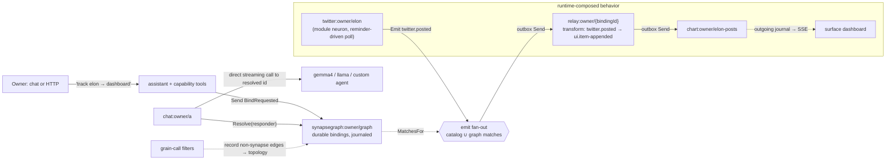

# DigitalBrain unified interconnect: the Synapse Graph

> **Terminology (renamed 2026-08-10, owner decision — Connect family):** what this document historically calls *Bind/Bound/Unbind/Unbound/binding/route* is now **`Connect`/`Connected`/`Disconnect`/`Disconnected`/connection** in code. One record, `SynapseConnection`, replaced both `SynapseBinding` and `SynapseRoute`; graph verbs are `ConnectionsFrom`/`ConnectionOf`/`Connections`; the relay is `ConnectionRelayNeuron`; wire aliases are `db.connect`/`db.connected`/`db.disconnect`/`db.disconnected`/`db.synapse-connection`; the script host is `DigitalBrainScriptHost` (freeing the word "connection" for exactly one meaning). Prose below keeps its original wording as the historical record.

> **ALL FIVE PHASES COMPLETE (2026-08-10) — 30 tests green.** The remaining three closed in one pass: **Phase 2's vocabulary is product** (`ui.chart-point` + `ChartNeuron` in the UI module; `chart-point.cs` runs the owner's original sketch; the `WantsChart` demo god-switch is deleted — it was intercepting any message containing "chart"). **Phase 4's act half is proven** (`SelfProgrammingProofs`): a chat turn resolved its graph-bound responder, the *real* capability machinery discovered `db.bind` by exact-term match, materialized it as a tool (`Bind`/`Unbind` are now `RequestSynapse<Bound>`/`<Unbound>` — the graph Replies confirmations, required by tool materialization), and a **scripted fake `IChatClient`** issued the tool call that created the binding — after which a poke flowed feed → relay transform → chart. The brain wired itself from a conversation; only the LLM was fake. **Phase 5 is closed as decided** (Stage 3 script engine = none-until-needed): declarative data-authored transforms work (`to:ui.item-appended{Title=Text}` — parsed by the relay, no code registration; `DeclarativeSynapseTransform` + `SynapseTypeIndex` in Core), and `ObservedCallProofs` documents that non-synapse grain calls are already journaled as capability facts (the reification filters are the observation layer). Third review round fixed the graph manifest's missing `Emitted` confirmations. Known asymmetry recorded: declarative morphs bind missing value-type fields to defaults silently (validating constructors fail loud); negative alias-cache in `SynapseTypeIndex` assumes eager assembly loading (true today, a trap for future lazy plugins).
>
> **Scripting status (2026-08-09): single-file apps, not a project.** `DigitalBrain.Scripting` (the temp-csproj probe generator) is deleted; owner scripts are now .NET file-based apps in `src/Kernel/DigitalBrain.Scripting/*.cs` with `#:project` directives — `chat-probe.cs` and `rebind-chat-responder.cs` compile-verified. `DigitalBrainClient.ConnectAsync(args)` exists literally (C# 14 static extension member in `DigitalBrain.Aspire`): builds a host from args/env, requires `ConnectionStrings:clustering` (refusal message tells the owner where to find it), defaults streams to the clustering connection, activates the brain, returns `IDigitalBrain`. Scripts are the owner-facing rewiring surface today: `dotnet run rebind-chat-responder.cs -- main default --ConnectionStrings:clustering "…"` rebinds a chat's model via the graph. Open from the owner's sketch: `FireSynapse` as the client verb (today `EmitAsync`/`SendAsync` — rename is a decision, not done) and `ChartPoint` (needs the `ui.*` vocabulary productization before that exact line runs).
>
> **Phase 3 + Phase 4 read/discover status (2026-08-09): landed and proven — 22 tests.** Resolve-mode is live: `Chat.ResponderAsync` resolves its responder from the graph (`ChatRoles.Responder` = "role:responder", deterministic `ResponderBindingId` for replace-semantics rebinding, `DefaultResponder` fallback on no-binding *and* on graph timeout). The button god-switch is dissolved: `Button` is a real neuron emitting `ui.button-activated`; the chat's time-button offer arms a `button → chat` binding with the `ui.button-activated → chat.show-time` transform; `IChat` handles `ShowTime`, not raw clicks; the kernel HTTP map routes clicks to the button id (wire contract unchanged). Topology answers with live bindings (`TopologyRead.Bindings`), and `db.bind`/`db.unbind` are declared capabilities (Introspection module manifest — placement is movable). Two review rounds drove real fixes: a click during the arming window was **silently lost** (zero-receiver emissions create no outbox entry) — closed by a new kernel primitive, `Neuron.FlushOutboxAsync`, born of the discovery that *a turn cannot await the effect of its own Send* (the drain timer only fires between turns); plus timeout-degradation to the default responder and capability-manifest hygiene (`chat.show-time` is internal wiring, not a tool). Still open for productization: per-emission graph-call caching (decision 2), physical sweep of expired bindings and button-grain lifecycle (offers currently arm eternal bindings — set an offer expiry policy), `ShowTime` offer validation, and the full self-programming integration proof (assistant wires a binding from a chat turn — needs scripted LLM edges in the harness).
>
> **PoC status (2026-08-09): landed and proven.** Phases 0–2 are implemented TDD-style at HEAD: `SynapseGraphNeuron` (durable bindings, `Bind`/`Unbind`/`RoutesFor`/`RouteOf`), the emit-path graph consult in `Neuron.Messaging` (replacing the deleted `IBroadcastSubscribers`), and `BindingRelayNeuron` with DI-registered `ISynapseTransform`s. 15 tests in `src/Tests/DigitalBrain.Tests` prove routing, teardown, expiry, transforms, correlation threading, cycle-guard termination, fan-out, source/owner isolation, live rebinding, foreign-source refusal, and settled transform failures. Two review-driven fixes landed: `ISynapseGraph` joined `CapabilityInvocation.FrameworkInterfaces` (route lookups are infrastructure — without this every emission reified two durable capability facts, and a failing relay leaked journal entries per retry), and relay transform failures now settle as refusals instead of retrying for 30 minutes. Known accepted costs, unchanged from §10: one graph grain call per emission (decision 2 — the version-stamped cache remains open) and the linear binding scan in the graph (deliberately unindexed for now: a side-car index would diverge from durable state under turn rollback; index it only together with rollback-aware rebuild). Not yet built: resolve-mode chat binding (§6 Phase 3), self-programming capabilities (Phase 4), scripting (Phase 5), and productizing the `ui.*` vocabulary (the PoC's `ItemAppended` lives in the test module).

Successor to [INTERCONNECT-REVIEW.md](INTERCONNECT-REVIEW.md) (which stays as the evidence base — topology map, Orleans streams fit matrix, doc citations). This document responds to the owner's directive: *"the system should handle literally any behavior and program itself at runtime; treat the current wiring as fundamentally wrong and plan a new one; IDigitalBrain becomes a facade over Orleans that manages bindings."*

Planning artifact only. Pseudocode before implementation; nothing here is built.

---

## 1. The requirements, restated

The Twitter scenario is the spec. "Track `TwitterAccountNeuron("elon")`; when he posts, add the post to my dashboard — a dashboard the brain itself composed out of a surface and a chart." Distilled:

- **R1 — runtime topology.** "When X emits S, deliver (a form of) S to Y" must be creatable at runtime, from a natural-language request, with no new compiled `IHandle<T>`.
- **R2 — runtime-composed UI.** Dashboard = neuron instances (surface, chart) created and wired at runtime, not a compiled screen.
- **R3 — one mechanism.** Chat↔responder, button→task, twitter→chart: the same primitive, not three bespoke wirings.
- **R4 — self-programming.** The model must be able to *read* the current wiring and *write* new wiring as data (bindings are citizens, like behaviors).
- **R5 — scripting seam.** Future user-authored logic attaches to the wiring, not to neuron classes.
- **R6 — facade.** `IDigitalBrain` owns topology verbs; Orleans is an implementation detail behind it.

---

## 2. Verdict on the two proposed mechanisms

### 2.1 "Each neuron implicitly subscribes to a stream of `<Synapse>`"

**Rejected as transport; the goal behind it is adopted as data.** Three hard facts (all cited in the review, §5):

1. **Implicit subscriptions cannot express the Twitter binding.** Orleans maps stream `<key, namespace>` → consumer grain `<key, GrainType>` — the consumer's grain key must *equal* the stream key. `twitter:owner/elon` → `chart:owner/elon-posts` has different keys on each side, so implicit subscription literally cannot route it. You'd need explicit `SubscribeAsync`, which persists handles in `PubSubStore`, requires the resume ceremony on every activation, and creates the forgotten-handle zombie class — the exact lifecycle problem R1 is trying to escape.
2. **The provisioned provider is weaker than the outbox on every axis that matters** — at-least-once, not rewindable, not FIFO under failure (your own comment in [DigitalBrainRuntimeHostingExtensions.cs:13-17](src/Kernel/Aspire/DigitalBrain.Aspire/DigitalBrainRuntimeHostingExtensions.cs), confirmed by the Orleans docs). Runtime-composed behavior *raises* the value of replay, ordering, and audit — you will want to ask "why did my dashboard update?" and get a journal answer.
3. **The decoupling streams buy is achievable one layer up.** What you actually want is *sender-blindness*: the twitter neuron must not know about dashboards. Sender-blindness is a property of **where receivers are decided**, not of the transport. Make receivers *data* (a binding store consulted at emit time) and the producer is exactly as decoupled as with streams — while delivery keeps riding the durable, deduped, journaled outbox.

The kernel already anticipated this: `EmitAsync` has a second receiver source, `SubscribedReceiversAsync` → `IBroadcastSubscribers` ([Neuron.Messaging.cs:36,42-60](src/Kernel/DigitalBrain.Core/Neuron/Neuron.Messaging.cs)) — dynamic receivers concatenated into the same durable fan-out. It was never implemented. **The unified architecture is: implement that seam as a graph, generalized to per-instance sources and transforms.**

### 2.2 "Incoming/outgoing grain call filters handle journaling"

**Rejected for journaling; adopted for observation and enforcement.**

- Journaling cannot move to `IIncomingGrainCallFilter`/`IOutgoingGrainCallFilter` without breaking the strongest invariant in the codebase: **journal-is-outbox atomicity**. A turn commits the incoming fact, the outgoing facts, and the outbox entries in *one* `WriteStateAsync` ([Neuron.Lifecycle.cs:62-70](src/Kernel/DigitalBrain.Core/Neuron/Neuron.Lifecycle.cs)); on failure the checkpoint rolls all of it back together. A filter writes at call boundaries — a different time than the state commit — so a crash between the two produces journal/delivery divergence. That is precisely the IAW double-write defect the review flagged (`WriteStateAsync` then `OnNextAsync`, non-atomic). Note also: the instinct "journaling should be infrastructure, not neuron code" is *already satisfied* — journaling lives in the `Neuron` base class; `Chat` never journals by hand.
- What filters are genuinely right for: the **un-journaled edges**. `Chat → assistant.RespondStreaming(...)` and `HTTP → chat.SendStreaming(...)` are plain grain calls, invisible to every journal and to the Introspection topology. An incoming call filter on neuron grains can (a) record non-synapse call edges into telemetry/topology so the model sees *all* wiring, and (b) enforce policy — e.g., refuse non-contract cross-neuron calls except allow-listed query/streaming interfaces. That closes the audit blind spot without touching durability.

---

## 3. What is actually wrong today — and what is not

**Agreed — the wiring layer is not salvageable for R1–R5.** Compile-time catalog + hardcoded `DefaultResponder()` + per-feature binding state (the previous review's Phase 1/2 recommendation) all share one flaw: *every relation kind is a bespoke compiled artifact.* Chat's responder needed custom state + synapses; buttons needed custom `Arm` state; Twitter→dashboard would need yet another. That is the "total mess" — n relation kinds, n mechanisms — and it can never program itself. The previous review's §6 special-cases are hereby superseded (they dissolve into the graph — §6 below).

**Not agreed — the kernel is not wrong; it is the enabling layer.** A system that rewires itself at runtime needs, more than anything: durable facts (journals), effectively-once delivery (outbox + dedupe), cascade limits (`DeliveryPolicy.MaximumDepth` guard, [Neuron.Outbox.cs:80](src/Kernel/DigitalBrain.Core/Neuron/Neuron.Outbox.cs) — a runaway-binding-cycle brake that already exists), refusal settling, single-threaded turns, and a topology query (`ReadTopologyRequest`, [IntrospectionNeuron.cs:105](src/Modules/Introspection/Introspection/IntrospectionNeuron.cs)). Rebuilding from zero would re-derive exactly this substrate. The plan below **replaces the wiring layer and keeps the kernel.**

---

## 4. The unified model: *everything is a binding*

One sentence: **neurons emit facts; a durable, journaled Synapse Graph decides who hears them and in what form; the same graph answers "who is my X?" for directed calls; `IDigitalBrain` (and the model, via capability tools) reads and writes the graph.**

### 4.1 The binding record

```
Binding {
  BindingId                        // stable identity, addressable for unbind
  Source:      NeuronId | TypePattern   // "twitter:owner/elon"  or  "twitter:owner/*"
  SynapseAlias: string                  // "twitter.posted"
  Target:      NeuronId                 // "chart:owner/elon-posts"
  Transform:   TransformRef?            // null = deliver as-is; else named transform / script ref
  Lifetime:    UntilRemoved | Expiry(t) | Correlation(c)
  CreatedBy:   owner-command | brain | module-manifest
}
```

Bindings live in a **graph neuron** (`synapsegraph:owner/graph` — a normal `Neuron`): mutations are synapses (`BindRequested`/`Bound`, `UnbindRequested`/`Unbound`), so the graph's own journal is the audit trail of every topology change the brain ever made to itself. Model-readable by construction (R4): `TopologyRead` extends to include bindings.

### 4.2 Two consumption modes, one store

- **Route (push).** `EmitAsync` consults the graph: receivers = compiled catalog (unchanged) ∪ graph matches for `(source, alias)`. Delivery stays on the durable outbox. The producing neuron remains sender-blind — receivers are data.
- **Resolve (pull).** A neuron asks the graph "who is my `<role>`?" — chat resolves its responder (`Resolve(chat:owner/a, role: responder)` → `gemma4:owner/…`) then makes today's direct streaming call to it. Same store, so the topology view shows conversational bindings and reactive bindings in one graph.

Pseudocode for the emit-path change (the only kernel delta):

```csharp
// Neuron.Messaging.cs — SubscribedReceiversAsync generalizes to the graph:
private async Task<IReadOnlyCollection<Routed>> RoutedReceiversAsync(Synapse synapse)
    => await Graph().MatchesFor(Id /* source instance */, SynapseAlias.Of(synapse.GetType()), timeout);

// Matches with Transform == null  → receiver added to FireAsync directly (as-is delivery).
// Matches with Transform != null  → receiver is the RelayNeuron for that binding (see 4.3).
```

The current `IBroadcastSubscribers` (owner+alias, no source) is subsumed and deleted.

### 4.3 The relay: where transforms (and later scripts) run

Delivery with a transform routes through a **`BindingRelayNeuron`** (`relay:owner/{bindingId}`) — precedent already in-tree: `WorkerDispatchRelayNeuron` receives an envelope, validates, and `SendAsync`s onward ([WorkerDispatchRelayNeuron.cs](src/Modules/Tasks/Tasks/WorkerDispatchRelayNeuron.cs)). The binding relay:

1. receives the source synapse (normal `Deliver` — journaled incoming),
2. applies the transform → produces the target-vocabulary synapse,
3. `SendAsync(target, transformed)` — journaled outgoing, durable, deduped.

Every hop is a journaled turn; a runtime-composed behavior is therefore *fully explainable from journals* ("why did my dashboard update?" → chart incoming ← relay ← twitter outgoing, one correlation). Reentrancy-safe: all hops are separate single-threaded turns; no cycle. Binding loops are cut by the existing depth guard.

**Transforms are staged (R5):**
- **Stage 1 — named transforms**: registered in code by modules (`"twitter.posted->ui.item-appended"`), pure `Synapse → Synapse[]` functions. Enough for the Twitter scenario.
- **Stage 2 — declarative mappings**: field-mapping data (`title <- Text, at <- PostedAt`) interpreted by a generic transform — the brain can *author* these at runtime without any code.
- **Stage 3 — sandboxed scripts**: a script ref (e.g., Jint/JS or C# scripting) executed inside the relay turn under a strict budget, with **no capability other than returning synapses** — a pure function whose inputs and outputs are journaled facts. That is the scripting model for "new behaviors of my personal OS": scripts cannot touch grains, storage, or network; they can only shape facts already flowing. Escalation beyond pure transforms (scripts that *originate* actions) is a later, separate decision — it would ride the same rails as capability tools.

### 4.4 The UI vocabulary: how runtime-composed sinks exist without compilation

R2 needs sinks that understand *something* without a compiled handler for every domain type. Answer: a small, stable set of **generic UI/data synapses** that the UI module's neurons handle natively:

```
ui.item-appended   { Title, Body?, At }        → list/feed controls, chart categorical points
ui.point-appended  { Series, Label, Value }    → ChartNeuron
ui.value-set       { Key, Value }              → tiles/meters
ui.card-rendered   { Title, Markdown }         → dashboard cards
```

`ChartNeuron`, `DashboardNeuron` (a `Surface` composition), etc. are compiled *once*, generically; **domain modules never target them directly** — bindings + transforms adapt domain facts into the vocabulary. This is the same move that made `ChatButtonOffer`/`ChatChartOffer` work, generalized and instance-addressable. Unknown synapses still land in `OnUnboundSynapseAsync` ([Neuron.Turns.cs:66](src/Kernel/DigitalBrain.Core/Neuron/Neuron.Turns.cs)) — the seam is already virtual; UI neurons can journal-and-ignore rather than throw.

### 4.5 The facade and the self-programming loop (R4, R6)

`IDigitalBrain` grows topology verbs — thin wrappers over graph synapses:

```csharp
Task<BindingId> BindAsync(source, synapseAlias, target, transform?, lifetime?, ct);
Task UnbindAsync(bindingId, ct);
Task<Topology> QueryTopologyAsync(ct);   // compiled manifest + runtime bindings, one view
```

Exposed identically on three edges: HTTP command bus (owner UI), MCP tools, and — the important one — **capability tools for the assistant**. The capability system already turns synapses into model-invocable tools (`SynapseCapabilityTool`, `CapabilityRouter`, manifest search); `BindRequested`/`UnbindRequested` become capabilities like any other. The loop closes:

> model reads manifest + topology → decides a wiring → emits `BindRequested` via a tool → graph journals `Bound` → behavior is live → journals explain it → model can read back what it built.

That is "programs itself at runtime," with every self-modification a journaled, reversible fact — not code generation, not deployment.

### 4.6 Diagram



---

## 5. The Twitter scenario, end to end (proof the model covers R1–R4)

1. Owner tells the brain: *"track elon's posts on my dashboard."*
2. Assistant (capability tools): ensures `twitter:owner/elon` exists (Twitter module provides the neuron type; polling via grain reminders; emits `twitter.posted` — sender-blind, it names no receiver); ensures `chart:owner/elon-posts` + dashboard surface exist (`OpenSurface` already exists); emits `BindRequested(twitter:owner/elon, "twitter.posted", chart:owner/elon-posts, transform: "→ ui.item-appended")`.
3. Graph journals `Bound`. Nothing else changed anywhere — no code, no subscription handle, no stream.
4. Elon posts → poll turn → `EmitAsync(TwitterPosted)` → fan-out consults graph → outbox → relay transforms → outbox → chart appends → chart's outgoing journal → surface SSE → dashboard updates. Owner never opens Twitter.
5. "Why did my dashboard change?" → one correlation id threads twitter → relay → chart across three journals. "Stop tracking" → `UnbindAsync(bindingId)` → journaled `Unbound`; the poller can be retired when the graph shows no consumers.

---

## 6. How the previous special cases dissolve

| Previous proposal (review §6) | In the unified model |
|---|---|
| Chat's durable `Responder` field + `BindResponder` synapse | A **resolve-mode binding** `(chat:owner/a, role: responder) → gemma4` in the graph. Chat stores nothing; the topology view shows it |
| Button `Arm(target, payload, expiry)` state | Button is a dumb identity that emits `ui.button-activated`. The offer creates a **correlation/expiry-scoped binding** `(button:owner/{id}, "ui.button-activated") → task, transform: const(CompleteUserAction{...})`. Disarm = unbind (or lifetime expiry). The constant-payload transform replaces `Arm` state |
| S5 subscriber list on chat | A plain binding `(chat:owner/a, "chat.responded") → critic` — nothing special about chats anymore |
| Compiled broadcast catalog | Kept as the *module-native* tier — conceptually "manifest bindings," frozen at compile time. Later (optional) surfaced read-only in the same topology query so there is one mental model: *some bindings are compiled, some are data* |

One mechanism, n relations — R3 satisfied.

---

## 7. Invariants preserved (non-negotiables check)

1. **Reentrancy / single-threaded turns**: unchanged. Graph lookup is a bounded call inside the emit turn (the seam and its timeout already exist); relays and targets run as separate serialized turns; no handler calls back into its emitter; `NeuronConcurrency` gate untouched.
2. **Journals are audit source**: strengthened — topology changes themselves become journaled facts; filters bring formerly-invisible direct-call edges into the topology view. Scripts see and produce only journaled synapses; prompts/secrets stay in state, never in emitted synapses.
3. **Outbox durability for domain delivery**: every hop (source→relay→target) is outbox-delivered, deduped, refusal-settling. Streams stay out of the interconnect (review §5 stands).
4. **Delivery-depth guard** cuts binding cycles exactly as it cuts synapse cascades today.

---

## 8. Risks, with their guards

| Risk | Guard |
|---|---|
| Graph lookup on every Emit adds latency / a dependency | Single per-owner graph grain; the seam already carries `SubscriptionRegistryTimeout`. Add a per-silo cached snapshot with a version stamp bumped on `Bound`/`Unbound` (cache miss = one grain call) |
| Binding cycles (A routes to B routes to A) | `DeliveryPolicy.MaximumDepth` abandons at depth, journaled as abandoned; graph can additionally refuse a bind that closes a static cycle |
| Transform script misbehavior | Stage-gated: named (code) → declarative (data) → sandboxed pure functions with budget; scripts cannot address grains at all |
| Vocabulary sprawl (`ui.*` becomes a second god-schema) | Vocabulary is owned by the UI module, versioned, deliberately tiny; anything domain-shaped belongs in a transform, not the vocabulary |
| Zombie bindings (S6 reborn as data) | Bindings have `Lifetime`; expiry enforcement in the graph (reminder sweep); unbind is addressable by `BindingId`; *everything is enumerable* — a zombie is visible, unlike a lost stream handle |
| Ghost-instance storage growth (pre-existing) | Unchanged by this plan; flag for a separate retention decision |

---

## 9. Phased plan (each phase starts with its failing proof)

**Phase 0 — proofs.** (Also re-seeds tests: none exist at HEAD; `NeuronTest`/`DigitalBrainTest` only.)
- **P0-route (DigitalBrainTest):** test module has `SourceNeuron` emitting `test.fact` with *no compiled handler anywhere*; create binding `(source, "test.fact") → sink`; emit; assert sink's incoming journal received it. *Fails: no graph.*
- **P0-transform:** same, with transform to `ui.item-appended`; assert the sink received the transformed synapse and both relay hops are journaled. *Fails.*
- **P0-resolve:** bind `(chat:owner/a, responder) → gemma4`, `(chat:owner/b, responder) → llama32`; assert different responders answer. *Fails.*
- **P0-teardown:** expiry-scoped binding stops routing after expiry; unbind is journaled. *Fails.*
- **P0-guard (control):** self-binding `(x, s) → x` with a re-emitting handler terminates via depth abandonment. *Should pass already — documents the kernel guard.*

**Phase 1 — the graph.** `SynapseGraphNeuron` + `Bind/Unbind/Resolve/Matches` synapses; emit-path generalization (source-aware `MatchesFor`, delete `IBroadcastSubscribers`); facade verbs on `IDigitalBrain`; HTTP kinds. Greens P0-route, P0-teardown. *Smallest vertical slice; everything after is additive.*

**Phase 2 — relays + named transforms + UI vocabulary.** `BindingRelayNeuron`; `ui.item-appended`/`ui.point-appended`/`ui.value-set`; `ChartNeuron`; dashboard = surface + charts wired by bindings. Greens P0-transform. *This is the Twitter-scenario slice minus the Twitter module.*

**Phase 3 — resolve-mode + dissolving the special cases.** Chat responder via `Resolve`; button as identity + const-payload binding; delete `IHandle<ButtonClicked>` from `IChat` and the god-switch. Greens P0-resolve.

**Phase 4 — self-programming.** `BindRequested`/`UnbindRequested` as capabilities; topology query extended with bindings; assistant creates the elon→dashboard wiring end-to-end from a chat request (integration proof = §5 trace).

**Phase 5 — scripting + filters.** Declarative mappings, then sandboxed script transforms; grain-call filters recording non-synapse edges into topology. Each gated by its own decision below.

**Explicitly out:** Orleans Streams (review §5 verdict stands — revisit only for external firehose ingress into a single neuron, never for the binding fabric).

---

## 10. Open decisions for the owner

1. **Graph granularity:** one `synapsegraph:owner/graph` (simple, one hot grain, recommended to start) vs sharded per source type (scales, more moving parts). Migration between them is data-only.
2. **Emit-path caching:** accept one graph call per Emit initially (bounded by the existing timeout) vs build the version-stamped silo cache in Phase 1.
3. **Transform Stage 3 runtime:** Jint/JS vs C# scripting vs none-until-needed. (Stages 1–2 carry all currently named scenarios.)
4. **Vocabulary v1:** confirm the four `ui.*` synapses above, or edit the set now — it is the API the whole runtime-composition story rests on.
5. **Catalog unification:** leave the compiled catalog as-is (recommended) vs also project manifest handlers as read-only bindings in the topology view in Phase 4.
6. **Filters scope:** observation-only (record edges) vs enforcement (refuse non-contract grain calls between neurons, allow-list `IAgent` streaming + `IChat.Read`).
7. **Naming:** `synapsegraph` / `Binding` / `relay` are placeholders — name the concept once, before Phase 1, since it becomes the OS's central noun.
