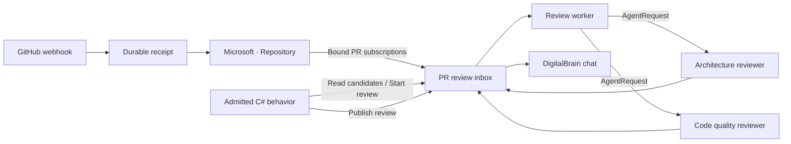

# GitHub PR reviews in DigitalBrain

The Microsoft module now contains `IRepository : IAgent`, native read-only GitHub MCP tools,
and a durable PR review inbox. Your admitted C# controls the CI requirements, reviewer prompts
and final text. The worker runs two actual `Agent` neurons concurrently after checking current CI.



## Configure a repository

The AppHost calls `WithConfiguredGitHubRepositories(builder.Configuration)`. An empty section
keeps GitHub disabled and does not affect Aspire, Gmail or Salesforce.

Create a GitHub App installed on the chosen repository. Its repository permissions need read
access to **Contents, Pull requests, Checks and Commit statuses**, plus GitHub's metadata access.
The application requests an installation token scoped to that one numeric repository and read
permissions. It does not accept a browser login or a broad personal token as unattended authority.

Add the following metadata to local AppHost configuration (replace every placeholder):

```json
{
  "DigitalBrain": {
    "Microsoft": {
      "GitHub": {
        "Repositories": {
          "personal": {
            "Owner": "<DigitalBrain owner>",
            "Principal": "<signed-in DigitalBrain principal GUID>",
            "AppId": "<GitHub App numeric ID>",
            "InstallationId": "<installation numeric ID>",
            "RepositoryId": "<repository numeric ID>",
            "RepoOwner": "<GitHub account or organization>",
            "RepoName": "<repository name>"
          }
        }
      }
    }
  }
}
```

Supply secrets through the AppHost's secret configuration or Aspire parameter UI:

- `Parameters:github-personal-app-private-key`: the App's PEM private key.
- `Parameters:github-personal-webhook-secret`: the webhook HMAC secret, at least 16 characters.

These parameters reach the kernel only. They are not projected into the scripting process,
Flutter, neuron signals or graph metadata. Do not check their values into the repository.

The default provider endpoints are `https://api.github.com/` and
`https://api.githubcopilot.com/mcp/`. Optional `ApiHost` and `McpEndpoint` must be explicit HTTPS
endpoints. A remote MCP deployment must support the installation token and the admitted native
tool schemas. Connection errors remain failures; they never broaden access.

Expose only this exact kernel route through HTTPS:

```text
/integrations/github/personal/webhook
```

Set that URL and the same secret on the GitHub App. Select pull-request, check-run, check-suite,
status and repository lifecycle events. Installation removal/suspension and repository access
removal revoke the binding. For several repositories on the same App, the App's single webhook
URL needs a relay that dispatches each delivery to its configured repository route; this code
does not create that external relay or a public tunnel.

The route verifies HMAC over the exact bytes, validates installation/repository IDs and persists
the receipt before returning 202. Delivery IDs deduplicate retries; changed content with the same
ID returns 409. Unknown or invalid signed events do not become model instructions. The SDK
acceptance deadline is five seconds and its body limit is 1 MiB. Slow/unavailable storage returns
503; oversized requests return 413. GitHub does not automatically redeliver failed webhook
requests, so inspect its delivery log and redeliver when appropriate. Periodic repository
reconciliation repairs missed current PR/CI observations.

## Start your behavior from chat

Ask Ino, for example:

> Every time a new PR opens in my configured personal repository, run my custom review.
> Wait for these required checks: [exact names and expected GitHub App IDs]. Then run
> architecture and code-quality reviewers in parallel and post the combined result here.

Ino can call `read_behavior_example("github-pr-review")`, customize the supported
[C# example](examples/github-pr-review.csx), and save it with `admit_behavior`.
The template automatically uses the current conversation's principal-qualified identity.
Ino still needs the configured binding ID and your exact CI policy. `admit_behavior` means saved;
check its subsequent Running status or compilation diagnostics to verify that it started.

The host supplies `Behavior.Name`, `Behavior.Revision` (a GUID) and `Behavior.SourceHash`.
`GitHubReviewNames.InstanceName` gives the one durable inbox per binding/named behavior.
`EnablePullRequestReview` validates that admitted revision and creates real Bound subscriptions
to PR-opened, updated, closed, check-change and access-revocation signals. The script reads durable
candidates; it does not treat a bounded journal as the workflow queue.

The default begins with PRs created after the first enable of that behavior revision. Restarting
the host preserves that boundary and pending work. Replacing the script creates a new revision
and a new observation boundary; it fences the previous revision's runs.

`GitHubReviewPolicy.ChecksSucceeded` requires a nonempty check set. Specify `Kind: "status"`
for a commit status and `Kind: "check"` for a check run. Pin expected App IDs for check names
where producer identity matters. The example accepts only `success`; `neutral` or `skipped`
need an explicit policy change. Pending, missing, red, draft or incomplete evidence never
starts models. Current test-merge checks are used when GitHub associates checks with that
verified head/base merge commit; otherwise the head's evidence is used.

Both reviewers receive the same bounded patch, head/base/CI SHAs and evidence hash, have separate
agent histories, and have no shell or write tools. Missing/truncated/binary patches that cannot
establish complete evidence fail closed. The worker rechecks access, PR revision and CI around
execution and publication. New commits, closure, cancellation, replacement or revocation fence
late results. A missing role can retry without repeating its completed sibling.

The script posts completed results through `PublishPullRequestReview`. Publication is queued,
and `ReadReviewResults().Published` confirms its durable chat acknowledgement. Failure summaries
use separate stable `PublishNote` IDs. Neither path posts a GitHub comment, review or approval.

## Stop and inspect

Ask Ino to remove the named behavior, or send `DisablePullRequestReview` to its inbox. The
inbox disables immediately when it observes removal/replacement and removes its Bound edges
through reconciliation. Explicit disable is admitted immediately; edge cleanup retries if a
source is busy. A host shutdown alone preserves the workflow. The shared webhook stays available
to other subscribers. As elsewhere in DigitalBrain, a later direct send can create a Learned
edge; unsubscribe does not create a permanent deny rule.

The graph shows Repository, PR review, Review worker, Architecture review and Code quality review
inside Microsoft. Inspect their signals and `ReadReviewResults` for pending, running, completed,
failed, cancelled, superseded and publication status. Aspire receives `DigitalBrain.GitHub`
webhook admission/persistence/dispatch spans, snapshot spans, and review spans tagged with
run and commit identities, alongside existing neuron/model/tool telemetry. A validated W3C
parent context survives delayed receipt dispatch without carrying baggage. Sensitive AI content continues to
follow the application's existing telemetry opt-in; credentials are never included in those tags.

Bounded operational limits are explicit: 32 bindings, 100 open PRs in a full reconciliation,
1,000 check/status items per SHA, 128 KiB review evidence, 32 KiB per reviewer response,
128 candidates/runs per inbox, 4,096 retained webhook receipts and 10,000 publication tombstones
per chat. Capacity failures retain pending work instead of silently declaring success. A new
named inbox/conversation is required at its ledger capacity; automatic archival is not included.

External reads and model computation can repeat after a crash. Durable run identity, generation
fences, retained role results and publication IDs prevent those retries becoming duplicate
logical reviews or duplicate chat messages. Live GitHub setup must still be verified against
the selected installation and reachable webhook URL.

References: [GitHub webhook validation](https://docs.github.com/en/webhooks/using-webhooks/validating-webhook-deliveries),
[failed deliveries](https://docs.github.com/en/webhooks/using-webhooks/handling-failed-webhook-deliveries),
[required status checks](https://docs.github.com/en/pull-requests/how-tos/merge-and-close-pull-requests/troubleshooting-required-status-checks),
[GitHub MCP authentication policies](https://github.com/github/github-mcp-server/blob/main/docs/policies-and-governance.md).
