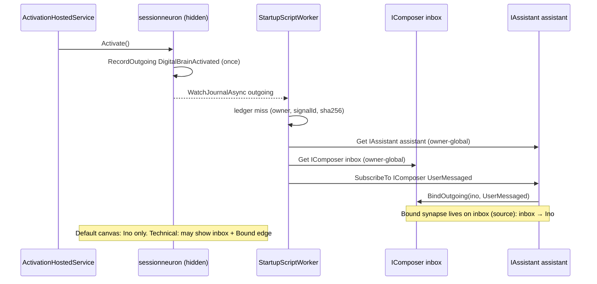
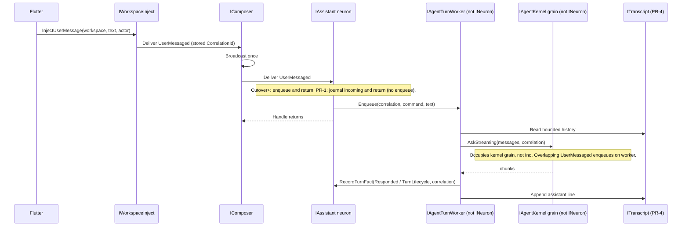
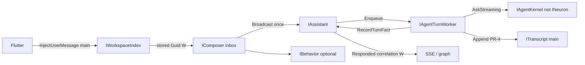

# Self-programmable boot and workspaces

| Field | Value |
|---|---|
| Status | Approved |
| Author | TBD |
| Date | 2026-09-05 |
| Type | Approval plan (architecture + incremental PRs) |
| Code | Implementation in progress (PR-1) |
| Prior art | `docs/ARCHITECTURE.md`, `CONTEXT.md`, `docs/JOURNALS.md`, `docs/programmable-behaviors-implementation.md`. The files `docs/plans/2026-09-05-neuron-synapse-unification.md` and this plan were not present in-tree at first writing. |

**Production invariant:** one LLM attempt per owner submit. `start.cs` must not `SubscribeTo` `UserMessaged` while `Chat` still `Broadcast`s it.

---

## Overview

DigitalBrain is already a durable neuron graph: typed `IHandle<T>`, source-owned synapses, broadcast-once journals, out-of-silo C# behaviors, and entities (Chart, Surface, Memory) that the UI mounts. What still fights that model is **boot composition**. `BrainGraphProjection` seeds `IChat` + Ino + the owner session so `/chats/{name}/brain` has something to draw. `Chat` is a mini-app: `SendMessage` → turn queue → `ChatTurnWorker` → `IAgentKernel.AskStreaming` on the **same grain** as `IAssistant`. `IAssistant` cannot receive `UserMessaged`. `start.cs` is a no-op string run by `StartupScriptWorker` (not an `IBehavior`). Flutter windowing is an offline playground.

The change: **`start.cs` (StartupScriptWorker only) is the OS of this brain**. That script writes the Bound synapse **inbox → Ino** for `UserMessaged`. The UI never composes the graph. It injects typed facts (`UserMessaged`) into one owner-global composer and mounts entities (Transcript, Surface, Chart, Memory). A workspace is a **view** (stored `CorrelationId` + bounded transcript + surface scenes) over the **same** Ino and the same durable behaviors — not a new assistant neuron.

`IAgentKernel` is extracted off Ino’s neuron grain so overlapping `UserMessaged` can enqueue instead of blocking behind the stream. `start.cs` Subscribe lands in the **same production switch** that stops Chat bind/broadcast — never earlier.

---

## Background & Motivation

### Current boot path (verified)

`start.cs` is **`StartupScriptWorker` only**. It is never saved as an `IBehavior`, never claimed by `BehaviorExecutionWorker`, and its hash ledger is not a behavior revision.

1. Aspire `AddDigitalBrainClient(..., activateOnStart: true)` registers `DigitalBrainActivationHostedService` (`src/Aspire/DigitalBrain.Aspire/DigitalBrainClientHostingExtensions.cs`).
2. `StartAsync` → `IDigitalBrain.ActivateAsync` → `BrainNeuron.Activate` (`src/Kernel/DigitalBrain/Neuron/BrainNeuron.cs`).
3. First activation journals `DigitalBrainActivated` on the owner root (`GrainTypeName = "sessionneuron"`, instance `"session"`) and publishes that delivery on the activation `BroadcastChannel`. Subsequent `Activate` calls no-op via `_activationPublished`.
4. Scripting host (`src/Kernel/DigitalBrain.Scripting/Program.cs`) connects with `activateOnStart: false`, watches owner-root **outgoing** for `DigitalBrainActivated` (`DigitalBrainActivationSource`), then runs `scripts/start.cs` through `CSharpStartupScriptRunner`.
5. Ledger key is `(owner, activationSignalId, scriptSha256)` (`FileStartupExecutionLedger`). Composition commands are not replayed for the same triple. A **changed** `start.cs` (new hash) will run again against the historical activation if the scripting host re-reads the journal — so `start.cs` must be idempotent (`SubscribeTo` / `Bind` already is).
6. `start.cs` today:

```csharp
return $"DigitalBrain owner '{Brain.Owner.Value}' startup behavior completed.";
```

That is not an OS. Nothing is wired. The return string’s word “behavior” is leftover naming, not `IBehavior`.

### What the graph plants instead

`BrainGraphProjection.ReadAsync` (`src/Kernel/DigitalBrain.Silo/BrainGraphProjection.cs`) **seeds** participants before walking synapses:

```csharp
var chat = NeuronId.For<IChat>(source.Owner, PrincipalScoped.InstanceName(actor.PrincipalId, chatName));
var ownerRoot = IBrainNeuron.ForOwner(source.Owner);
var participants = new HashSet<NeuronId>
{
    chat,
    new("assistant", source.Owner, "assistant"),
    ownerRoot,
};
// plus Discover(behavior) for every saved IBehavior
```

Then it BFS-walks outgoing synapses, journals, and `AgentActivity` delegations.

**`isInfrastructure` today (code):** `chat-turn-worker` | `sessionneuron` | `behaviors` | `execution` only (`BrainGraphProjection` node construction). `surface-boot` and `uirenderer` are **not** flagged; they appear only if discovered. Flutter `studioCanvas` (`graph_home_screen.dart`) hides `isInfrastructure` and `role == library`, and hides `chat` unless it already has a synapse to a non-assistant, non-infra node. Tests: `src/Modules/UI/Flutter/shell/test/behavior_studio_test.dart`.

The debugger **creates** the conversation citizen (`IChat` grain identity is touched by the seed `ReadActiveExecutionAsync(chat)`) in order to draw `/chats/{name}/brain`. That is the opposite of “graph is a debugger, not a seed list.”

Walk rules that matter later: Bound synapses live on the **source**. Discover-from-`Subscribe` journal entries runs only when `privateNeuron` is true. Shared (non-partitioned) neurons require `delivery.Principal == principal` in `VisibleDelivery`, so a `Subscribe` recorded with `Principal is null` (startup script, no actor) is invisible on Ino.

### What chat does today (the orchestrator to unwind)

`IChat` (`src/Modules/UI/DigitalBrain.Modules.UI.Contracts/Chat/IChat.cs`) handles `SendMessage`, `CancelTurn`, `ReadTranscriptRequest`, turn snapshots, execution focus, `CompleteUserAction`, notes, ui cards.

On activate, `Chat.OnNeuronActivatedAsync` **binds** a Bound synapse from this chat to a principal-partitioned `IUserMessages` named `"default"` (`BindOutgoing(inbox, nameof(UserMessaged))`). `EnqueueTurnAsync` then:

1. `RememberOwnerTurnAsync` appends the owner turn to a durable `_transcript` list (64 turns) and `BroadcastAsync(new UserMessaged(...), ConversationCorrelation)`.
2. Enqueues a `DurableTurnRecord` and starts `ChatTurnWorker.RunAsync`.
3. Worker loads `IChatKernel.LoadTranscript` / `LoadActiveExecution`, builds MEAI messages, and calls `IAgentKernel.AskStreaming` on `NeuronId.For<IAssistant>(owner, "assistant")` (`ChatTurnWorker.DefaultResponder`).
4. Chat journals `Responded` / `TurnLifecycle` on **its** outgoing feed. The worker returns `ChatTurnResult`; it does not `RecordOutgoing` on Ino. HTTP SSE (`ChatTurnStream`, `OwnerSessionJournal.WatchChatOutgoingAsync`) watches Chat.

`IAssistant : IAgent : IHandle<AgentRequest>` only (`src/Modules/AI/Contracts/IAssistant.cs`). `Agent : Neuron, IAgent, IAgentKernel` (`Agent.cs`). `NeuronConcurrency.RequireSerializedTurns` forbids `[Reentrant]` / `[MayInterleave]`. `AskStreaming` therefore holds **Ino’s** activation for the whole LLM + tool loop. That is fine today because **Chat** enqueues on a different grain. It is not fine once Ino `IHandle`s `UserMessaged` on that same grain.

`IUserMessages` (`Alias("usermessages")`) already `IHandle<UserMessaged>` and rebroadcasts (`UserMessagesNeuron`). Chat is the wrong **source**.

`DigitalBrainClientTransport.GetReference` principal-scopes **every** neuron when `_claim` or `_connectionActor` is set, except `IBehaviors`. `IAssistant` is not excepted. MCP `GraphTools.Instance` always `PrincipalPartition.InstanceName(Operator, name)` for `kind: usermessages`.

`NeuronReference.SendAsync` / `INeuronGrain.SendFrom` take `(receiver, signal)` only. `SignalDelivery.Create` does `correlation ?? cause?.CorrelationId ?? CorrelationId.New()`. Session inject today would mint a **new** Guid per POST. Chat stamps correlation only because it `BroadcastAsync(..., ConversationCorrelation)` on itself.

### Windowing / surface today

- `ISurface : IEntity<SurfaceState>` with `Open(SurfaceScene, cap)`. Default instance `"desk"`. Comments: Chart/Surface have **no** `[ClientEntryPoint]`; `Read()` is `IEntity<TState>`; writes are same-silo.
- `IChart : IEntity<ChartState>` with `Render` / `Append` (EventId de-dupe).
- `SurfaceBoot` (grain `surface-boot`) listens to the activation channel and `Send`s `OpenSurface` to `IUIRenderer` — another planted boot path, not `start.cs`.
- Flutter `windowing_screen.dart`: “Offline windowing playground — drag, resize, minimize, tidy. **No C# / edge.**”

### Pain

The owner cannot program “what calls what” from first activation. Studio’s default canvas is a lie held up by seed + `IChat`. New conversation = new chat grain that re-binds inbox and re-runs a turn machine, instead of a new correlation + empty transcript on the same Ino.

---

## Goals & Non-Goals

### Goals

- On first `DigitalBrainActivated`, **after Chat is no longer the `UserMessaged` source**, `start.cs` writes the Bound synapse **inbox → Ino** (`UserMessaged`) using ordinary `SubscribeTo`. That synapse is durable. Restart does not replay composition. `start.cs` is `StartupScriptWorker` only — never an `IBehavior`.
- After boot, the **default canvas** shows Ino (and later, owner-wired non-infra neurons). Session, composer, turn worker, behaviors index, execution, surface-boot, uirenderer are not default-canvas citizens. Technical canvas may show composer and the Bound edge.
- UI injects `UserMessaged` into one owner-global composer/inbox, stamping the **stored workspace `CorrelationId`**. UI mounts entities. UI does not `BindOutgoing`, `SubscribeTo`, or seed neurons “so the graph looks right.”
- `IAssistant` `IHandle<UserMessaged>`. Handle accepts and journals (Deliver already journals incoming) and, **only after the Chat cutover**, enqueues the hidden worker. It never awaits the LLM. `IAgentKernel` is a **non-`INeuron`** grain so overlapping submits enqueue, not block.
- Workspace = stored `CorrelationId` + `ITranscript` entity + `ISurface` scenes on a **shared desk** with workspace-prefixed scene keys. Same Ino, same behaviors. New ChatGPT-like conversation = new workspace, not a new assistant.
- Message-chart dashboard: a behavior subscribed to inbox `UserMessaged` appends `IChart` and `ISurface.Open(...)`. Flutter windowing **reads** those entities, filtered by current workspace.
- Incremental, independently reviewable PRs with tests in the same PR. Do not start from leftover behaviors-kernel deletion (6b).

### Non-goals

- A second English runtime, JSON capability bus, or generated Orleans types per script.
- Making journals the chat history (512 entries / 512 KB — `JournalWindow`).
- Deleting `IBehavior` / scripting host / `BehaviorExecutionWorker`.
- Multi-Ino. One `IAssistant` instance `"assistant"` per owner.
- Redesigning OAuth / specialist continuation policy. Those stay; their *attachment point* moves off `IChat` in the cutover PR, and specialist tests move in that same PR.
- Replacing BroadcastChannel activation fan-out in this plan (SurfaceBoot peel is later).
- Changing journal broadcast-once semantics (already implemented in `SignalSender.BroadcastAsync`).
- Renaming `NeuronReference.PublishAsync` in the Chat cutover (separate follow-on).

---

## Honest inventory

### Already shipped (keep)

| Piece | Where | Status |
|---|---|---|
| Broadcast journals **once**, then delivers along source synapses | `SignalSender.BroadcastAsync` | Empty audience still journals so SSE/debugger see the fact; no N outgoing copies |
| `Publish` on `IDigitalBrain` during a behavior run = that behavior’s broadcast | `IDigitalBrain.PublishAsync` | Throws outside a claimed execution |
| `IHandle<T>` is receive capability; synapse is who receives T from **this** source | `NeuronReferenceExtensions.SendAsync`, `SubscribeToAsync` | Compile-time gate; Ino **cannot** subscribe to `UserMessaged` until it `IHandle`s it |
| `ConversationId` on chat broadcasts | `Chat.ConversationCorrelation` | Activity **groups** by `CorrelationId`; it does **not** filter by `chatName` |
| `IUserMessages` + bind-on-chat-activate | `Chat.OnNeuronActivatedAsync` | Works, but Chat is the wrong source |
| MCP graph tools | `GraphTools.cs` | `kind: usermessages` is principal-prefixed today |
| Behaviors: draft/activate, out-of-silo handlers, durable subscribe | `BehaviorNeuron`, `BehaviorExecutionWorker` | Composition is not replayed on handler edit |
| Entities: Chart, Surface, Memory, Image, … | `IEntity<TState>.Read()`, ui HTTP | UI already mounts ui state |
| Session as client membrane | `IBrainNeuron` grain type `sessionneuron` | `isInfrastructure` + `studioCanvas` hide it |
| `IAgentKernel.AskStreaming` | **on the Assistant neuron** | In-silo stream; owners/scripts use `IAgent` + `RequestAsync` |

### Still fighting the model (this plan)

| Piece | Fight |
|---|---|
| Graph seed of chat + assistant + ownerRoot | Debugger activates `IChat` to have a root id |
| Walk rules skip inbox→Ino Bound | Source-owned edge; assistant is not private; startup `Subscribe` has null principal |
| `IChat` mini-app | Turn queue + transcript list + `AskStreaming` + user-action resume live on a canvas-shaped neuron |
| `Agent : IAgentKernel` | Streaming occupies Ino’s serialized turn |
| `IAssistant` cannot `IHandle<UserMessaged>` | Ino is only reachable by private RPC; AI.Contracts does not reference UI contracts |
| `start.cs` no-op | OS is empty; wiring is planted by Chat activate + projection |
| `GetReference` scopes IComposer/IAssistant | start.cs, HTTP, behaviors, MCP would hit three grains |
| No inject primitive with stored correlation | `Send` mints a new Guid; no name→Guid index |
| `NeuronReference.PublishAsync` = `SendAsync` | Misnomer; **not** part of the Chat cutover |
| Windowing offline | `windowing_screen.dart` does not `Read()` `ISurface` / `IChart` |
| `SurfaceBoot` plants Home | Second activation listener besides `start.cs` |
| Chat-owned `_transcript` | Duplicate of what should be an entity |
| Principal-partitioned `IUserMessages` `"default"` | Abandoned; not migrated |

---

## Proposed Design

### 1. Boot: `start.cs` is the OS (`StartupScriptWorker` only)

Keep the existing activation pipe. Change the payload of `start.cs` **in the Chat cutover PR, not before**.

```csharp
var ino = Brain.Get<IAssistant>("assistant");
var inbox = Brain.Get<IComposer>("inbox");
await ino.SubscribeToAsync<IComposer, UserMessaged>(inbox.Id);
return $"Wired Ino ← inbox for owner '{Brain.Owner.Value}'.";
```

`CSharpStartupScriptRunner` already references `typeof(IChart).Assembly` (UI contracts, same assembly as today’s `IUserMessages`) and imports `DigitalBrain.UI` and `DigitalBrain.Chat`. `IComposer` next to `IUserMessages` needs **no new runner reference**. The required API sugar is two-arg `SubscribeToAsync` on `NeuronReference<IAssistant>` (three-arg exists; C# will not infer `TSelf`).

**Idempotency:** `Subscribe` → target `HandleAsync(Subscribe)` → `BindOutgoing` on the source (`Neuron.cs`). Re-running after a `start.cs` hash change is a no-op bind. Do not put `Get<IChat>` or graph-seed logic in the script.

**What boot does *not* do:** create workspaces, open Home (until SurfaceBoot is peeled), subscribe behaviors, activate chat, or enqueue LLM work.



This sequence is **cutover-only**. Until then `start.cs` stays a no-op so Chat’s broadcast cannot dual-fire Ino.

### 2. Naming: `IComposer`, instance `"inbox"`, grain type `usermessages`

**Decision: product name is `IComposer`. DigitalBrain identity is `[GrainType]`, not Orleans `[Alias]`.**

`NeuronId.For<T>` → `GrainTypeNames.Of` (`src/Kernel/DigitalBrain.Contracts/Identity/GrainTypeNames.cs`) reads a public const `GrainTypeName` on the contract (same pattern as `IBrainNeuron`), else **`[GrainType]`** (class-only; invalid on interfaces), else strips a leading `I`. It does **not** read `[Alias]`. `UserMessagesNeuron` is `[GrainType("usermessages")]`. Without `IComposer.GrainTypeName = "usermessages"`, `Brain.Get<IComposer>("inbox")` addresses **`composer:{owner}/inbox`**, a different empty grain.

```csharp
[Alias("usermessages")] // Orleans serializer/grain contract only
public interface IComposer : INeuron, IHandle<UserMessaged>
{
    const string DefaultInstanceName = "inbox";
    const string GrainTypeName = "usermessages"; // DigitalBrain NeuronId.For / GrainTypeNames.Of
}

// No [Alias], no [GrainType]. I-strip still yields "usermessages".
[Obsolete("Use IComposer.")]
public interface IUserMessages : IComposer;
```

**Exact id:** `NeuronId.For<IComposer>(owner, "inbox")` **must** be `new NeuronId("usermessages", owner, "inbox")` (`Type == "usermessages"`, `ToString()` `usermessages:{owner.Value}/inbox`). Same as `UserMessagesNeuron.Id` for that owner/name. PR-1 test asserts this; PR-2 id-equality uses `NeuronId.For<IComposer>`, not a hand-built `"composer"` string.

`UserMessagesNeuron` implements **`IComposer`** (`[GrainType("usermessages")]` on the class, matching the interface). MCP kind map: `usermessages` | `composer` → `brain.Get<IComposer>("inbox")` **without** `PrincipalPartition.InstanceName`.

**IHandle list (composer):**

| Signal | Why |
|---|---|
| `Subscribe` / `Unsubscribe` | `INeuron` — how Ino (and behaviors) write Bound edges on this source |
| `UserMessaged` | The only owner-typed injection. Handle **broadcasts** the same payload so subscribers fire |

**IHandle list (Ino / `IAssistant`):**

| Signal | Why |
|---|---|
| `Subscribe` / `Unsubscribe` | `INeuron` |
| `AgentRequest` | `IAgent` — scripts and specialists still `RequestAsync` |
| `UserMessaged` | **New.** Conversational fact from inbox |

Composer `HandleAsync(UserMessaged)` stays the current `UserMessagesNeuron` body: require a delivery, `BroadcastAsync(signal, cause)` so correlation rides the envelope. **Actor equality** (`signal.Actor?.PrincipalId == VerifiedActor.Current?.PrincipalId` when an HTTP actor is present) is added at cutover, with a test for mismatched `Actor`. Until cutover, Chat’s rebroadcast still flows through this Handle.

**One inbox per owner**, instance `"inbox"`. Chat’s principal-partitioned `"default"` is abandoned (not migrated).

### 3. Owner-global `Get` allowlist

`DigitalBrainClientTransport.GetReference` today unscopes only `IBehaviors`. **Allowlist owner-global (do not `ScopeName`):**

- `IBehaviors` (existing)
- `IComposer` (and obsolete `IUserMessages` if the type still exists)
- `IAssistant`

`GetEntity` stays principal-scoped when an actor/claim is present (transcript, surface, workspace index, charts).

MCP `GraphTools.Resolve`:

- `usermessages` / `composer` → `brain.Get<IComposer>("inbox")` **not** `Instance(name)`
- `assistant` → `brain.Get<IAssistant>("assistant")` **not** prefixed
- `chat` / `behavior` / `xaccount` keep `Instance(name)` until Chat dies

HTTP inject uses `brain.Get<IComposer>("inbox")` with the connection actor set — the allowlist is what keeps it owner-global.

**Simulation test (PR-2):** `start.cs` bind target id == HTTP send target id == behavior `Get<IComposer>("inbox").Id` (all `usermessages:inbox` for that owner). Same assertion for `IAssistant` `"assistant"`.

### 4. UI injection and workspace `CorrelationId`

Flutter / HTTP never call `BindOutgoing`.

**Inject primitive** (kernel helper, used by `POST /owner/commands` after cutover and by tests as soon as PR-2):

```csharp
public interface IWorkspaceInject
{
    Task<CommandId> InjectUserMessage(
        string workspaceName,
        string text,
        ActorContext actor,
        CancellationToken cancellationToken = default);
}
```

Algorithm:

1. Require `actor == HttpActor.Current` (HTTP). Refuse mismatched `Actor`.
2. `EnsureWorkspace(workspaceName)` on principal-scoped `IWorkspaceIndex`: if missing, **refuse** (unknown workspace). Exception: first-time `"main"` may be created with a new durable `Guid` so existing Flutter `chatName: main` keeps working.
3. Load stored `CorrelationId` for that name (never `CorrelationId.New()` per POST).
4. Build `UserMessaged(commandId, Chat: default, text, actor)` — `Chat` field unused; envelope correlation is authoritative.
5. `Deliver` to owner-global inbox a `SignalDelivery.Create(..., correlation: storedGuid)` from the session membrane (or `IBrainNeuron.Send` extended to accept `CorrelationId`). Composer `BroadcastAsync(signal, cause)` reuses `cause.CorrelationId`.

`INeuronGrain.SendFrom` does not take correlation today. **Do not** use plain `SendAsync(signal)` for inject — it mints a new Guid. Add an internal `Send(receiver, signal, CorrelationId)` on `IBrainNeuron` / session helper used only by `IWorkspaceInject`. Scripts keep typed `SendAsync` without correlation (new Guid or cause).

**`IWorkspaceIndex`** (entity, principal-scoped, **lands in PR-2**, before graph filter and before `ITranscript`):

```csharp
[Alias("ui.workspace-index")]
public interface IWorkspaceIndex : IEntity<WorkspaceIndexState>
{
    Task Ensure(string name, string title);
    Task<WorkspaceRecord?> Find(string name);
    Task<WorkspaceRecord?> FindByCorrelation(string correlationId);
}

public sealed record WorkspaceRecord(
    string Name,
    string CorrelationId,
    string Title,
    DateTimeOffset UpdatedAt);
```

`ITranscript` (PR-4) is keyed by **workspace name** (same principal-scoped entity name). Handle/worker looks up `FindByCorrelation(CurrentDelivery.CorrelationId)` then `GetEntity<ITranscript>(record.Name)`. Until PR-4, Chat’s durable list remains the UI store.

Graph `/chats/{chatName}/brain` (PR-2): `Find(chatName)` → stored workspace Guid. **Do not treat empty `CorrelationId` as topology** — `CorrelationId` ctor throws on `Guid.Empty`, and `SignalDelivery.Create` does `correlation ?? cause?.CorrelationId ?? CorrelationId.New()`, so `Subscribe`/binds carry a **random** Guid, not empty.

Activity include rule:

- **Always include** topology signal types: `Subscribe`, `Unsubscribe` (any correlation).
- **Workspace-scoped types** — `UserMessaged`, `Responded`, `TurnLifecycle`, `AgentActivity` — include only when `delivery.CorrelationId` **equals** the index Guid for `{chatName}`.
- Drop other workspaces’ scoped activity. If the name is unknown: Ino topology (synapses + Subscribe/Unsubscribe) and **no** scoped activity dump. Cap remains `MaxActivity = 64` **after** that filter.

### 5. Ino `Handle(UserMessaged)` and LLM offload

**Key Decision:** extract `IAgentKernel` onto a **non-`INeuron`** grain. Ino remains the `UserMessaged` handler (owner-visible). Streaming must not take Ino’s serialized turn.

Rejected mix: `Assistant : IAgentKernel` (today) + `IHandle<UserMessaged>` on that grain.



**PR-1 Handle (mandatory, no “or”):** accept + incoming journal (Deliver already did) + **return**. Tests: directed `composer.SendAsync(UserMessaged)` (or inject helper once PR-2 exists) → Ino incoming contains the signal; **no** `AskStreaming`; **no** `ChatTurnWorker.RunAsync`; **no** `start.cs` Subscribe. Product HTTP still `IChat.SendMessage`.

**Cutover `UserMessaged` Handle:** enqueue on `IAgentTurnWorker` and **return**. Never `Ask`, `AskStreaming`, or `AskDurablyAsync`.

**`IAgentKernel` extract (cutover PR, stacked commit before HTTP flip) — contract, not an “or”:**

1. **Grain identity:** `[GrainType("agent-kernel")]` (or `GrainId.Create("agent-kernel", ...)`). **Not** `assistant`. `ChatTurnWorker.DefaultResponder` and tests use `GrainId.Create("agent-kernel", $"{owner.Value}/assistant")` (or an `IAgentKernel.For(OwnerId)` helper). **Forbidden:** `GetGrain<IAgentKernel>(NeuronId.For<IAssistant>(owner, "assistant").ToGrainId())` — that GrainId type is `assistant` and still activates Ino.
2. **Kernel holds** `IChatClient` and the `Ask` / `AskStreaming` loop (token stream + tool iterations). It is **not** `Neuron` / `INeuron` and has no synapses.
3. **Tool / delegation / observation loop lives on the kernel grain’s stream, but every graph effect is a short RPC to Ino:** `PrepareTools`, existing `SendAsync`/`RequestAsync` to specialists (`TurnRequests` today requires `Agent` as source — keep that on Ino), `RecordTurnFact` for `AgentActivity`. A non-neuron kernel must not `Send` as if it were Ino. Durable `AskDurablyAsync` / `_completedRequests` **stays on Ino** (short RPC to read/write); no silent dictionary migration.
4. **`UserMessaged` Handle never awaits the kernel.** Conversational path: Handle → `IAgentTurnWorker.Enqueue` → worker calls kernel `AskStreaming`. Overlapping `UserMessaged` while a stream is in flight **enqueues** on the worker; Ino Handle returns.
5. **`AgentRequest` Handle does await kernel `Ask` then `ReplyAsync`.** Directed `RequestAsync` must complete in `HandleAsync`. That occupies Ino for specialist/script asks only. It is an **accepted exception**, not an escape hatch for chat. Do not write “or replies after kernel Ask” as if `UserMessaged` could wait.

`Agent` **stops implementing** `IAgentKernel`. Review gate: overlapping `UserMessaged` during **AskStreaming** enqueues; a test must submit a second `UserMessaged` while a stream is in flight and see Handle return plus queue depth ≥ 1.

**`IAgentTurnWorker` (not `INeuron`, not seeded, not discovered):**

- Evolved from `ChatTurnWorker` but **not** `ForChat` / not `IChatKernel.LoadTranscript` after cutover.
- Keyed by `(owner, correlationId)`.
- Owns: turn queue, cancel, `WaitingForUser`, `CompleteUserAction`.
- **In-silo surface HTTP talks to after peel:**

| Verb | Grain | Notes |
|---|---|---|
| Inject `UserMessaged` | `IWorkspaceInject` → `IComposer` | Correlation stamped |
| Cancel turn | `IAgentTurnWorker.Cancel` | Not `IChat.Handle(CancelTurn)` |
| Complete user action / login resume | `IAgentTurnWorker.CompleteUserAction` | `AgentTurnContext` carries workspace name + `CorrelationId`, **not** `IChat` id. `SpecialistContinuationTests` move in this PR |
| Record `Responded` / `TurnLifecycle` / screened `AgentActivity` | `IAssistantTurn.RecordTurnFact` on **Ino** | Short serialized turn; worker calls this after kernel chunks / lifecycle. SSE watches Ino outgoing |
| SSE live tokens | Watch Ino outgoing + inbox outgoing, filter correlation | Do **not** ship HTTP inject without `Responded` already appearing on Ino outgoing |

`IChatTurnWorker.RunAsync` **cannot** be used “without Chat” in PR-1. It loads `IChatKernel`, `SetActiveExecution`, `AgentTurnContext.Chat`. Do not pretend otherwise.

**Latency:** Ino Handle stays milliseconds (journal + enqueue). LLM remains `NeuronCallTimeouts.LongRunning` on the kernel grain.

### 6. Conversational signals vs AI.Contracts

`DigitalBrain.Modules.AI.Contracts.csproj` references only `DigitalBrain.Contracts`. UI.Contracts already references Product.Contracts. Product.Contracts must not reference UI.Contracts (cycle).

**PR-1 moves only `UserMessaged`.** Keep `[Alias("chat.user-messaged")]` and `[Id(0..3)]` field layout (`CommandId`, `NeuronId Chat`, `string Text`, `ActorContext? Actor`). A changed Alias orphans journals.

| Type | Stays | Why |
|---|---|---|
| `UserMessaged` | **Move** to `DigitalBrain.Product.Contracts` | Only type `IAssistant : IHandle<>` needs. `CommandId` / `NeuronId` / `ActorContext` already Product/Abstractions |
| `Responded` | **UI.Contracts** | References `UiCardOffer` (`DigitalBrain.UI`). Cannot enter Product without a cycle |
| `TurnLifecycle` | **UI.Contracts** | `ChatTurnStatus`, `TurnId`, `NeuronId Chat` are Chat/UI types |
| `UiCardOffer`, `ChatTurnStatus` | **UI.Contracts** | Ui / turn machine |

`IAssistantTurn.RecordTurnFact(Signal fact, CorrelationId correlation)` takes Abstractions `Signal`. The **worker** (UI module) constructs `Responded` / `TurnLifecycle`; Ino’s grain implementation `RecordOutgoingAsync(fact, correlation)` without AI.Contracts referencing UI. If `Responded` must become product-level later, split the card payload out first — not in this series.

Rejected: `IAssistantConversation` in the UI module — `SubscribeToAsync` on `NeuronReference<IAssistant>` requires `IAssistant : IHandle<UserMessaged>` on the contract scripts compile against. Rejected: AI.Contracts → UI.Contracts. Rejected: moving `Responded`/`TurnLifecycle` in PR-1.

### 7. Graph is a debugger

Seed set (owner 2026-09-06):

- **Never seed** `IChat`, Ino, or session as canvas citizens. Opening Studio does **not** `ReadActiveExecutionAsync(chat)`.
- **Peek (hidden infra):** `IComposer` `"inbox"` and the owner session. Walk Bound targets from the inbox even when source/target are not principal-private. Session outgoing `DigitalBrainActivated` (null principal) is visible activity; Flutter default canvas keeps that event when the session node is hidden.
- **Discover:** saved `IBehavior` ids (library until enabled/invoked), then BFS from peeked inbox/session and those behaviors.
- **Ino appears only after composition** (inbox Bound edge, typically `start.cs` at cutover or a test bind). Empty inbox → empty default canvas.
- **Replacement for “Running”:** Ino outgoing `AgentActivity` once Ino is discovered. Execution grains remain discoverable from that delegation; no chat-keyed read.

**Exact `isInfrastructure` types after PR-2:**

| Grain type | Today | After |
|---|---|---|
| `chat-turn-worker` | yes | yes |
| `sessionneuron` | yes | yes |
| `behaviors` | yes | yes |
| `execution` | yes | yes |
| `usermessages` (composer) | no | **yes** |
| `surface-boot` | no | **yes** |
| `uirenderer` | no | **yes** |
| `assistant` | no | no (default canvas) |
| `chat` | no | n/a (not seeded; if leftover, treat as infra until deleted) |

`RootId` = `assistant:assistant` (logical; the node is absent until composition).

**Default canvas (`studioCanvas`, technical false):** non-infra, non-library nodes (Ino once bound; enabled behaviors). Empty after a clean boot. **Hiding composer means the Bound inbox→Ino edge is not on the default canvas**. Technical canvas shows composer, session, leftover chat, and those edges. Do not invent a presentation-only fake edge.

PR-2 tests must update `behavior_studio_test.dart` node id lists (today expects `assistant:assistant` on default canvas from a fixture that still includes `chat:main` and `sessionneuron:session`) **and** C# `BrainGraphProjectionTests`.

### 8. Workspace = view, not a new Ino

| Part | Type | Notes |
|---|---|---|
| Topic | stored `CorrelationId` on the delivery envelope | Index maps name ↔ Guid |
| Transcript | `ITranscript : IEntity<TranscriptState>` (PR-4) | Bounded UI store; **not** a neuron; **not** the traffic journal |
| Surface | existing `ISurface` **shared `"desk"`** | Scene keys **include workspace name**: `{kind}:{workspace}:{local}` e.g. `chart:main:my-messages`. Windowing filters scenes by current workspace prefix |
| Ino | same `IAssistant` `"assistant"` | Behaviors subscribe to inbox, not to a chat grain |

New conversation: `IWorkspaceIndex.Ensure` new name + new Guid; empty `ITranscript`; **`start.cs` is not replayed.**

`ITranscript` (PR-4):

```csharp
[Alias("ui.transcript")]
public interface ITranscript : IEntity<TranscriptState>
{
    const int DefaultCap = 500;
    Task Append(TranscriptEntry entry, int cap);
}
```

Journals stay the debugger. Flutter history after PR-4 = `Read()` the entity; live tokens SSE from Ino outgoing. No entity journals.

**Subscribe is first-class per workspace (owner 2026-09-05).** A Bound synapse is `(source, signalType, correlation)`. `Subscribe`/`Unsubscribe` carry an optional `CorrelationId` (`null` = every workspace). Broadcast delivers to synapses whose correlation is `null` **or** equals the envelope Guid. `start.cs` uses `SubscribeToAsync<IComposer, UserMessaged>(inbox.Id, workspace)` for Ino on `"main"`; a dashboard that should see every topic omits the Guid. New conversation: `Ensure` + subscribe the behaviors that should hear that topic (Ino for chat; plotter only if the owner asked). Not a C# `if` inside a global handler.

### 9. Dashboard + windowing

Owner-programmed behavior (not planted by projection):

```csharp
var workspace = "main"; // or from CurrentDelivery / index
var chart = Brain.GetEntity<IChart>($"{workspace}-my-messages");
await chart.Render(new ChartState("Messages I sent", "line", Array.Empty<ChartPoint>()));
await Brain.GetEntity<ISurface>("desk").Open(
    new SurfaceScene($"chart:{workspace}:my-messages", "Messages I sent"),
    cap: 8);
```

Flutter `WindowingScreen` drops `PanelManager.seedDemoPanels()`. It `Read()`s `ISurface` `"desk"` via `GET /ui/surfaces/{name}`, keeps scenes whose key contains `:{currentWorkspace}:`, mounts `chart:*` via `onReadChart`. Drag/resize/minimize stay client chrome.

Windowing does **not** depend on `ITranscript`. Ui surface GET can follow PR-2 in parallel with transcript work.

### 10. What happens to `IChat`

| Phase | `IChat` role |
|---|---|
| PR-1 | Unchanged product orchestrator. Ino Handle is no-op. `start.cs` still no-op |
| PR-2 | Still product path. Graph no longer seeds/activates it |
| PR-3 cutover | HTTP/SSE leave Chat. Bind/broadcast removed. `start.cs` Subscribe. Worker + kernel extracted. `IChat` may remain a dead grain until deleted |
| PR-4 | Copy-forward `_transcript` → `ITranscript("main")` if non-empty; then drop Chat lists |

MCP `ChatTools` `RequestAsync(SendMessage)` switch to `IWorkspaceInject` at cutover.

---

## Worked examples

### 1. Fresh boot — only Ino on the default canvas

See §1 sequence (**after cutover**).

- Neurons: `sessionneuron:session` (infra), `assistant:assistant` (canvas), `usermessages:inbox` (infra, discovered via Ino incoming Subscribe), `surface-boot:default` if still channel-subscribed (infra).
- Synapse: inbox → Ino, `UserMessaged`, Bound.
- Default canvas: **Ino only**. Technical: Ino + inbox + Bound edge (+ session if the walk discovers it; session is not seeded).
- No `IChat` activated by the projection.

### 2. Owner types a message (after cutover)



Graph `/chats/main/brain` shows correlations **only** for Guid W plus topology events.

### 3. Dashboard — message chart + windowing

1. Behavior `SubscribeTo<IComposer, UserMessaged>(inbox.Id)` with **no** correlation (every workspace), `Open(SurfaceScene("chart:main:my-messages", ...))`.
2. Default canvas: Ino + enabled behavior (inbox edge **technical-only**).
3. Windowing `Read()` desk, keep `chart:main:*` for workspace `main`.

### 4. New workspace / topic

`Ensure("taxes")` → new Guid, empty transcript. Subscribe Ino (and any asked behaviors) with that correlation; `start.cs` is not replayed. Inject stamps the new Guid. Desk scenes for `taxes` start empty; `main` scenes remain but windowing filters them out.

---

## API / Interface Changes

### `IAssistant`

```csharp
[Alias("DigitalBrain.AI.IAssistant")]
public interface IAssistant : IAgent, IHandle<UserMessaged>;
```

Requires `UserMessaged` on Product.Contracts (see §6).

### In-silo turn surface (cutover)

```csharp
public interface IAssistantTurn : IGrainWithStringKey
{
    Task RecordTurnFact(Signal fact, CorrelationId correlation, CancellationToken cancellationToken = default);
}

public interface IAgentTurnWorker : IGrainWithStringKey
{
    Task Enqueue(CorrelationId correlation, CommandId command, string text, ActorContext actor, CancellationToken cancellationToken = default);
    Task Cancel(CommandId command, TurnId turn, ActorContext actor, CancellationToken cancellationToken = default);
    Task CompleteUserAction(AgentTurnContext context, string actionId, bool accepted, CancellationToken cancellationToken = default);
}
```

`IAssistantTurn` is implemented by the Assistant **neuron** (short turns). `fact` is Abstractions `Signal` so the UI worker can pass `Responded` without AI.Contracts referencing UI. `IAgentTurnWorker` and `IAgentKernel` (`agent-kernel`) are **not** neurons.

### Subscribe sugar

```csharp
public static Task SubscribeToAsync<TSource, TSignal>(
    this NeuronReference<IAssistant> ino,
    NeuronId source,
    CancellationToken cancellationToken = default)
    where TSource : INeuron
    where TSignal : Signal
    => NeuronReferenceExtensions.SubscribeToAsync<IAssistant, TSource, TSignal>(ino, source, cancellationToken);
```

### HTTP

| Today | After cutover |
|---|---|
| `POST /owner/commands` `chat.send` → `IChat.RequestAsync(SendMessage)` | `IWorkspaceInject.InjectUserMessage` |
| `GET /chats/{chatName}/events` watches `IChat` outgoing | Inbox + **Ino** outgoing, filter stored correlation for `{chatName}` |
| `GET /chats/{chatName}/brain` seeds `IChat` | Seed Ino; discover inbox; filter activity by index Guid |
| no surface ui read | `GET /ui/surfaces/{name}` → `ISurface.Read()` (windowing PR) |
| `GET /ui/charts/{chartName}` | Unchanged |

`NeuronReference.PublishAsync` stays Send until a **follow-on contracts PR** after cutover. `IDigitalBrain.PublishAsync` remains behavior-only Broadcast.

---

## Data Model Changes

| Store | Change | Migration |
|---|---|---|
| Inbox synapses | Bound `UserMessaged` → Ino written by `start.cs` **at cutover** | Idempotent bind. Chat’s old chat→principal-`default` binds abandoned |
| `IWorkspaceIndex` | New entity, principal-scoped | PR-2; Ensure `"main"` on first inject/graph read |
| `ITranscript` | New entity, principal-scoped, name = workspace name | PR-4; copy-forward Chat `_transcript` for `"main"` if non-empty |
| `IAgentKernel` grain | New non-neuron grain | Cutover extract; ChatTurnWorker retarget before HTTP flip |
| `IAgentTurnWorker` | New non-neuron grain | Cutover; not `ForChat` |
| Grain type `usermessages` | Keep; instance `"inbox"` | Do not dual-write `"default"` |
| `NeuronReference.PublishAsync` | Unchanged in this series | Follow-on |

No Orleans schema codegen per script.

---

## Alternatives Considered

### A. Keep `IChat` as the inbox (reject)

Keeps the mini-app on the canvas and a new chat grain per conversation.

### B. New Ino per conversation (reject)

Breaks durable behaviors and “same Ino.”

### C. Ino `Handle` awaits `AskStreaming` on the neuron turn (reject)

Freezes Ino for the whole LLM + tool loop.

### C2. Hidden worker is the `UserMessaged` handler; Ino stays `IHandle<AgentRequest>` only (reject)

Would avoid extracting `IAgentKernel`, but the owner-visible contract would not be `IAssistant : IHandle<UserMessaged>`, and `start.cs` `ino.SubscribeToAsync<IComposer, UserMessaged>` would not compile. **Chosen instead: extract `IAgentKernel` off Ino; Ino handles `UserMessaged`.**

### D. Core chat loop as an `IBehavior` (reject)

OS would depend on draft/activate and the scripting host for the first token.

### E. Keep the name `IUserMessages` (reject for product language; cheap for MCP)

Owner language is composer/inbox. Grain type/alias stays `usermessages`. Obsolete `IUserMessages` without a second `[Alias]`.

### F. Seed the graph from `start.cs` by activating chat (reject)

### G. `start.cs` Subscribe in PR-1 while Chat still broadcasts (reject)

Dual LLM attempts. Subscribe only in the Chat cutover.

### H. PR-1 calls `ChatTurnWorker.RunAsync` without Chat (reject)

Worker is a `Neuron` keyed by chat name and loads `IChatKernel`.

### I. AI.Contracts → UI.Contracts for `UserMessaged` (reject)

Move signals to Product.Contracts.

### J. Shared desk vs `GetEntity<ISurface>(workspaceName)` (shared desk chosen)

Scene keys include workspace name; windowing filters. Avoids N surface entities for chrome that is one desk.

---

## Security & Privacy Considerations

| Threat | Severity | Mitigation |
|---|---|---|
| UI/HTTP `BindOutgoing` | High | HTTP only `IWorkspaceInject` / entity GET. Graph `SetSubscriptionAsync` still rebuilds scope and checks `IHandle` |
| Cross-principal inject into owner-global inbox | High | Inject helper: `Actor` must equal `HttpActor.Current`. Cutover: composer Handle refuses mismatched `Actor` when `VerifiedActor` is present (test). Index/transcript/surface/chart names stay `ScopeName` under HTTP (`MapUiEntities` pattern) |
| Wrong grain (`{principal}.inbox`) | High | GetReference allowlist + MCP must not prefix inbox/assistant. Simulation id equality test |
| LLM offload as a hidden graph backdoor | Medium | Kernel and worker are not `INeuron`; no synapses; correlation required; `AgentActivity` / `Responded` recorded on **Ino** |
| Transcript leakage | Medium | Ui HTTP `IEntity.Read()` + principal-scoped entity names. Graph `Summarize(UserMessaged)` is character count only. There is no `[ClientEntryPoint]` attribute in this tree |
| Startup script as RCE | Existing | Host-shipped `start.cs`, same `ScriptOptions` allowlist. Owner programs `IBehavior`s, not the OS file |

Session neuron remains the authenticated client membrane. Never a default-canvas citizen.

---

## Observability

- **Logs:** `StartupScriptWorker` success/fail with owner, activation signal id, script sha256. Prefer the `Subscribe` journal on Ino incoming over a custom “wired” log.
- **Metrics:** `UserMessaged` tallies on composer outgoing; Ino `AgentActivity` started/completed/failed; worker queue depth (optional).
- **Alerts:** after cutover, boot smoke **must** assert Bound synapse `usermessages:inbox --UserMessaged--> assistant:assistant`. Today a no-op `start.cs` “succeeds” and hides a missing scripting host.
- **Graph:** filter by workspace Guid then cap 64. Do not project kernel/worker grain ids.

---

## Rollout Plan

1. **No additive `start.cs` Subscribe.** Product path stays Chat until the cutover PR. PR-1 Handle cannot enqueue.
2. Each PR green on CI (simulation + touched E2E + Flutter if UI).
3. Cutover PR is one reviewable PR with **stacked commits**: (a) extract `IAgentKernel`, ChatTurnWorker retarget; (b) extract `IAgentTurnWorker` + `RecordTurnFact` while Chat still calls the worker; (c) flip HTTP/SSE, remove Chat bind/broadcast, `start.cs` Subscribe, Ino Handle enqueues, specialist tests retarget. Revert the whole PR on failure.
4. `ITranscript` copy-forward is forward-only; unused entities are harmless on rollback.
5. Operator: ship new `start.cs` **with** the cutover silo. Ledger: new hash runs on scripting-host restart against historical `DigitalBrainActivated`.

---

## Risks

| Risk | Severity | Mitigation |
|---|---|---|
| Dual `UserMessaged` → two LLM attempts | Critical | `start.cs` Subscribe and Ino enqueue only in cutover commit (c), same PR as Chat bind/broadcast removal |
| `AskStreaming` on Ino turn / Handle blocked by stream | Critical | Extract `IAgentKernel` off `Neuron`; gate: overlapping `UserMessaged` enqueues |
| `Get` / MCP prefix `inbox` | Critical | Allowlist + MCP resolve + id-equality test |
| Inject mints a new Guid | High | `IWorkspaceInject` only; refuse unknown workspaces except Ensure `"main"` |
| Graph cannot see inbox→Ino | High | Discover from Ino incoming Subscribe even when not private |
| HTTP inject without `Responded` on Ino | High | Cutover does not flip HTTP before `RecordTurnFact` |
| `IChatTurnWorker` used in PR-1 | High | Forbidden |
| Duplicate `[Alias("usermessages")]` | Medium | Alias only on `IComposer` |
| `IComposer` without `GrainTypeName = "usermessages"` | Critical | `NeuronId.For` would be type `composer`; PR-1 asserts `.Type == "usermessages"` |
| Awaiting kernel Ask on `UserMessaged` Handle | Critical | Forbidden; only `AgentRequest` Handle awaits `Ask` |
| Empty `CorrelationId` as topology marker | Medium | Filter by signal type; `CorrelationId` rejects empty Guid |
| Login continuation still uses `AgentTurnContext.Chat` | Medium | Same PR as cutover |
| Abandoned `usermessages:{principal}/default` | Low | Document; do not migrate |

---

## Key Decisions

1. **`start.cs` is the OS and is `StartupScriptWorker` only** — never an `IBehavior`. Graph projection and Chat activation must not plant conversational wiring. SurfaceBoot Home-open stays until a follow-on after windowing.
2. **`IComposer` is the UI injection neuron.** Put **`const GrainTypeName = "usermessages"`** on `IComposer` (what `GrainTypeNames.Of` / `NeuronId.For` honor; Orleans `[GrainType]` is class-only) **and** `[Alias("usermessages")]` for Orleans. Exact id: `NeuronId.For<IComposer>(owner, "inbox").Type == "usermessages"`. Instance `"inbox"`; **one per owner**. `IUserMessages` is obsolete **without** a duplicate Alias or GrainType. Do not rely on `[Alias]` for DigitalBrain identity.
3. **`IAssistant : IAgent, IHandle<UserMessaged>`.** Move **only** `UserMessaged` to `DigitalBrain.Product.Contracts` (keep Alias `chat.user-messaged` and field ids). `Responded` / `TurnLifecycle` / `UiCardOffer` stay in UI.Contracts. AI.Contracts references Product.Contracts, not UI.Contracts. `RecordTurnFact` takes `Signal`.
4. **Extract `IAgentKernel` to grain type `agent-kernel` (not `assistant`, not `INeuron`).** Conversational `UserMessaged` Handle **never awaits** Ask/AskStreaming; it only enqueues `IAgentTurnWorker`. The tool/delegation loop runs inside kernel `AskStreaming`, with **short RPCs to Ino** for PrepareTools, Send/Request, and `RecordTurnFact`. `AgentRequest` Handle **does** await kernel `Ask` then `ReplyAsync` (directed RPC exception). Overlapping `UserMessaged` during AskStreaming **enqueues**. Durable `_completedRequests` stays on Ino.
5. **PR-1 Handle is accept + journal + return.** No enqueue, no `ChatTurnWorker`, no `start.cs` Subscribe.
6. **`start.cs` Subscribe happens in the same production switch that cuts Chat bind/broadcast and HTTP.** One LLM attempt per owner submit.
7. **`GetReference` allowlists `IComposer` and `IAssistant` as owner-global** (with `IBehaviors`). MCP must not principal-prefix `inbox` / `assistant`. Test: `NeuronId.For<IComposer>(owner,"inbox").Type == "usermessages"` and that id == HTTP send id == behavior `Get` id.
8. **`IWorkspaceInject` stamps the stored workspace Guid.** `IWorkspaceIndex` lands with unscoped Get and graph filter (PR-2), before `ITranscript`. Unknown workspace refused; `"main"` may be Ensure’d. Graph activity: always include `Subscribe`/`Unsubscribe`; filter `UserMessaged`/`Responded`/`TurnLifecycle`/`AgentActivity` by that Guid. **Never** use empty `CorrelationId` as a topology marker (`CorrelationId` rejects `Guid.Empty`; deliveries mint a Guid).
9. **Graph seed = Ino only.** Discover inbox from Ino incoming `Subscribe` even when not private; composer is observed infrastructure. Default canvas will **not** show the Bound edge. Replace `ReadActiveExecutionAsync(chat)` with Ino `AgentActivity` status. Exact infra list: existing four plus `usermessages`, `surface-boot`, `uirenderer`. Flutter `behavior_studio_test.dart` updates in the same PR.
10. **Transcript is an entity** (`ITranscript`), ~500 entries, keyed by workspace name, after cutover. Journals stay 512/512KB.
11. **Workspace = stored correlation + transcript + shared `"desk"` with `{kind}:{workspace}:{local}` scene keys.** Windowing filters by current workspace. Same Ino. New conversation does not replay `start.cs`.
12. **HTTP `/chats/{name}` stays** as the workspace alias for one release.
13. **`NeuronReference.PublishAsync` rename is a follow-on**, not the Chat cutover.
14. **Do not start from behaviors-kernel deletion.**

---

## PR Plan

Independently reviewable. Tests in the **same** PR. Production dual-path is forbidden.

### PR-1 — Contracts + Ino Handle no-op

- **Title:** `IComposer` + `IAssistant : IHandle<UserMessaged>` (accept and journal only)
- **Files / components:**
  - Move **only** `UserMessaged` to `DigitalBrain.Product.Contracts`; keep `[Alias("chat.user-messaged")]` and `[Id]` layout. Leave `Responded` / `TurnLifecycle` in UI.Contracts
  - `IAssistant.cs`; `Assistant.HandleAsync(UserMessaged)` returns after argument checks (incoming already journaled)
  - `IComposer` in UI contracts: **`const GrainTypeName = "usermessages"`** and `[Alias("usermessages")]`; grain implements `IComposer`; obsolete `IUserMessages` without Alias/GrainType
  - `NeuronReference<IAssistant>.SubscribeToAsync<TSource, TSignal>` sugar (used by tests; `start.cs` **unchanged no-op**)
  - Tests: `NeuronId.For<IComposer>(owner, "inbox").Type == "usermessages"` and equals `UserMessagesNeuron` id; directed composer `SendAsync(UserMessaged)` (test host may `SubscribeTo` Ino **in the test**, not via `start.cs`) → Ino incoming; Handle did not call `IChatClient` / `AskStreaming` / `ChatTurnWorker`; `CSharpStartupScriptRunnerTests` still run the **no-op** script; compile a snippet of the future `start.cs` against runner options in a test that does **not** execute Subscribe against a live Chat-wired host
- **Depends on:** nothing
- **Description:** Product HTTP still `IChat`. **Forbidden:** `start.cs` Subscribe, enqueue, `RunAsync`.

### PR-2 — Owner-global Get, workspace index, Ino-only graph with discovery

- **Title:** Unscoped inbox/Ino + correlation inject helper + graph observes Ino
- **Files / components:**
  - `DigitalBrainClientTransport.GetReference` allowlist
  - `GraphTools.Resolve` for `composer`/`usermessages`/`assistant` without `Instance()`
  - `IWorkspaceIndex` + `IWorkspaceInject` (Deliver with stored Guid). HTTP **not** flipped yet; tests call the helper
  - **First-class workspace Subscribe:** `Subscribe`/`Unsubscribe` optional `CorrelationId`; `Synapse` stores it; `SignalRouter.BroadcastRecipientsFor` matches envelope correlation or `null` (any). `SubscribeToAsync(..., CorrelationId?)`. Tests: Ino subscribed to `"main"` does not receive `"review"`; a `null` subscription receives both.
  - `BrainGraphProjection`: **do not seed** chat/Ino/session; peek inbox+session as infra; walk inbox Bound targets even when not private; leftover `chat` is infra; drop `ReadActiveExecutionAsync(chat)`; `RootId` = assistant (logical); workspace activity filter stays with inject/index when that lands
  - Tests: `NeuronId.For<IComposer>(owner,"inbox").Type == "usermessages"` and that id == inject target == behavior Get; unknown workspace → topology (`Subscribe`/`Unsubscribe`) without foreign `UserMessaged`/`AgentActivity`; `BrainGraphProjectionTests`; Flutter `behavior_studio_test.dart` (and any `studioCanvas` fixtures)
- **Depends on:** PR-1 (Ino can `IHandle` so a test may bind; production `start.cs` still no-op)
- **Description:** Default canvas is empty until composition (inbox Bound → Ino, or an enabled behavior). Technical canvas shows inbox/session. Production `start.cs` still no-op Subscribe until cutover.

### PR-3 — Extract streaming + cut Chat + `start.cs` Subscribe (one switch)

- **Title:** One LLM path: kernel off Ino, inject to inbox, OS wiring
- **Stacked commits (one PR):**
  1. Extract `IAgentKernel` to grain type **`agent-kernel`** (not `assistant`); `Agent` stops implementing it; `DefaultResponder` uses `GrainId.Create("agent-kernel", ...)` never `IAssistant.ToGrainId()`. Kernel owns Ask/AskStreaming + tool loop; each tool/delegation/observation is a short RPC to Ino. `UserMessaged` Handle still no-op (no enqueue yet). `AgentRequest` Handle awaits kernel `Ask` then `ReplyAsync`. Test: Chat `SendMessage` still one stream on `agent-kernel`; probe `UserMessaged` Handle during stream returns (Ino not blocked by streaming).
  2. Extract `IAgentTurnWorker`; `RecordTurnFact` on Ino; Chat product path **calls the worker** (still one LLM). `AgentTurnContext` gains workspace/correlation; specialist tests compile against the new context **in this PR**.
  3. Flip: `MapOwnerCommands` / `ChatTurnStream` / `OwnerSessionJournal` / MCP `ChatTools` → `IWorkspaceInject` + SSE on Ino+inbox; remove `Chat.BindOutgoing` and `Broadcast UserMessaged`; Ino `UserMessaged` Handle **enqueues and returns** (never awaits kernel); `start.cs` Subscribe; boot smoke asserts Bound synapse `usermessages:…/inbox`. Test: one `AskStreaming` per submit; overlapping submit enqueues; mismatched Actor rejected.
- **Depends on:** PR-1, PR-2
- **Description:** Atomic for the dual-fire invariant. **Out of this PR:** `PublishAsync` rename, `ITranscript`, windowing.

### PR-4 — `ITranscript` + copy-forward

- **Title:** Transcript entity is the UI store
- **Files / components:** `ITranscript`, entity, ui read if Flutter history should not parse journals; copy-forward Chat list for `"main"`; Flutter history `Read()`; tests: new workspace empty transcript, synapse count unchanged, `start.cs` not replayed
- **Depends on:** PR-3
- **Description:** Worker Append on enqueue/Responded.

### PR-5 — Windowing reads `ISurface` / `IChart` (parallel with PR-4)

- **Title:** Windowing mounts live Surface scenes
- **Files / components:** `windowing_screen.dart`; `MapUiEntities` + `HttpSurfacePaths` surface GET; scene filter `{kind}:{workspace}:`; `workspace_test.dart`
- **Depends on:** PR-2 (index + ui pattern). **Does not depend on** PR-4
- **Description:** Client chrome stays Flutter-only.

### Follow-on (not this series)

- `NeuronReference.PublishAsync` = source Broadcast; list every call site
- SurfaceBoot Home-open → `start.cs` after windowing
- HTTP `/chats` → `/workspaces`
- Behaviors kernel deletion (6b)
- Entity watch/SSE

---

## Open Questions

1. **SurfaceBoot Home-open** — **Resolved (owner 2026-09-05):** move into `start.cs` as a **follow-on after PR-5**, not in this series. Leave the activation-channel neuron until windowing reads `ISurface`.
2. **Subscribe-per-workspace** — **Resolved (owner 2026-09-05):** first-class synapse `(source, signal, correlation)` in this series (PR-2 with inject/index). `null` correlation = all workspaces.
3. **Multi-principal owner brains** — **Resolved (owner 2026-09-05):** not in this series. One owner-global inbox.

---

## References

- `CONTEXT.md` — neuron / signal / synapse / journal / entity; `IHandle` vs synapse; no second runtime
- `docs/ARCHITECTURE.md` (2026-09-05) — core loop still documents `Get<IChat>().RequestAsync(SendMessage)` (this plan supersedes that loop)
- `docs/JOURNALS.md` — 512/512KB; entities are snapshots; sessionneuron is the owner hub
- `docs/programmable-behaviors-implementation.md`
- `src/Kernel/DigitalBrain/Neuron/BrainNeuron.cs` — `Activate` / `DigitalBrainActivated`
- `src/Kernel/DigitalBrain/Neuron/NeuronConcurrency.cs` — serialized turns
- `src/Kernel/DigitalBrain.Scripting/scripts/start.cs` — no-op OS (`StartupScriptWorker`, not `IBehavior`)
- `src/Kernel/DigitalBrain.Sdk/Client/DigitalBrainClientTransport.cs` — `GetReference` scoping
- `src/Kernel/DigitalBrain.Silo/BrainGraphProjection.cs` — seed + walk + `isInfrastructure`
- `src/Modules/UI/DigitalBrain.Modules.UI/Chat/Chat.cs` — bind-on-activate, `Broadcast UserMessaged`
- `src/Modules/UI/DigitalBrain.Modules.UI/Chat/ChatTurnWorker.cs` — `IChatKernel` + `AskStreaming`
- `src/Modules/AI/AI/Agent.cs` — `IAgent` + `IAgentKernel` on one grain
- `src/Modules/AI/Contracts/DigitalBrain.Modules.AI.Contracts.csproj` — refs only `DigitalBrain.Contracts`
- `src/Kernel/DigitalBrain.Mcp/GraphTools.cs` — `Instance(name)` prefix
- `src/Modules/UI/Flutter/shell/lib/chat/graph_home_screen.dart` — `studioCanvas`
- `src/Modules/UI/Flutter/shell/test/behavior_studio_test.dart`
- `src/Modules/UI/Flutter/shell/lib/windowing/windowing_screen.dart`
- `src/Kernel/DigitalBrain/Neuron/SignalSender.cs` — broadcast-once
- `src/Product/DigitalBrain.Product.Contracts/` — destination for conversational signals

---

## Revision Summary

Addressed review 2026-09-05 (issues 1–17): no dual-fire in PR-1; extract `IAgentKernel` off Ino; owner-global Get allowlist; `IWorkspaceInject` + index in PR-2; graph discovers inbox from Ino incoming Subscribe; PR reorder; Product.Contracts for `UserMessaged`; single `[Alias("usermessages")]`; `RecordTurnFact` / worker HTTP table; shared desk scene keys; exact `isInfrastructure` list.

**Second pass (GrainType / Responded cycle / kernel await / correlation filter):**

- `IComposer.GrainTypeName == "usermessages"`; `NeuronId.For<IComposer>(owner,"inbox").Type == "usermessages"` (Alias is not DigitalBrain identity). `GrainTypeNames.Of` reads that const (Orleans `[GrainType]` cannot be on interfaces).
- Move only `UserMessaged` (keep `chat.user-messaged`); `Responded`/`TurnLifecycle` stay in UI.Contracts (`UiCardOffer` cycle).
- Kernel grain type `agent-kernel`, never `IAssistant.ToGrainId()`. `UserMessaged` Handle never awaits Ask/AskStreaming; tool loop on kernel with short RPCs to Ino. `AgentRequest` Handle awaits `Ask` then `ReplyAsync`.
- Graph filter by signal type, not empty `CorrelationId`.
