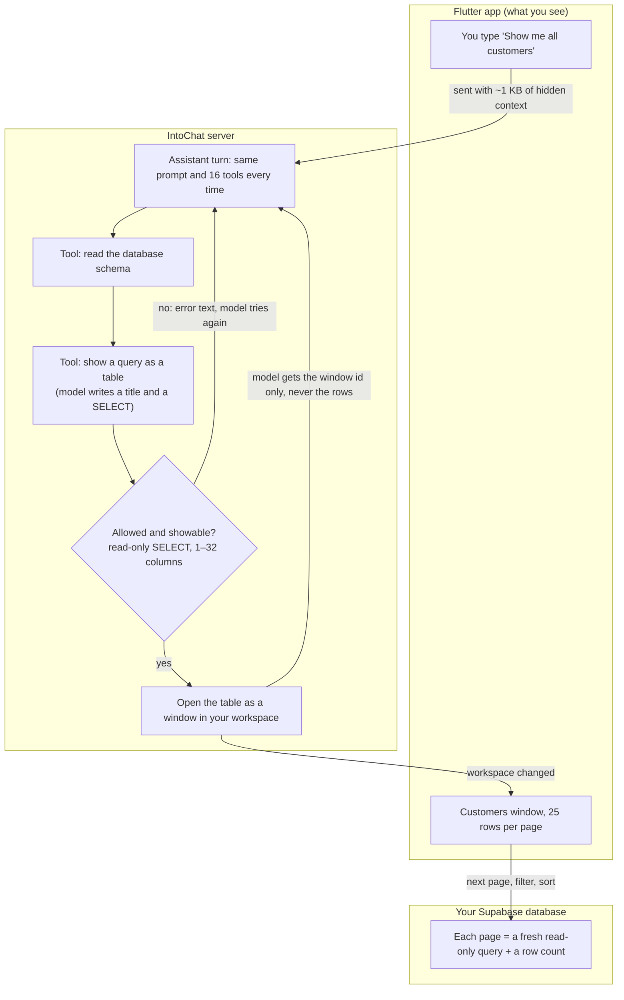
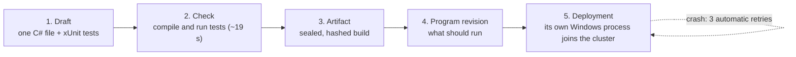

# IntoChat — how it works today

This is a plain-language snapshot of how the product actually behaves. It is not a design. It
exists because the product is hard to understand, and a plan can't fix what nobody can describe.

**Evidence.** A reference written `(ev A1)` points to finding A1 in a research note. "A-missed"
means the "Missed (from verifier)" section of note A. "Correction" means the reviewer's
correction under that finding.

| Letter | Note | Letter | Note |
|---|---|---|---|
| A | [Current flow](research/2026-09-23-A-current-flow.md) | E | [Modules, discovery, memory](research/2026-09-23-E-modules-discovery-memory.md) |
| B | [Behaviors](research/2026-09-23-B-behaviors.md) | F | [Existing docs and strategy](research/2026-09-23-F-existing-docs-strategy.md) |
| C | [SDK, types and kernel](research/2026-09-23-C-sdk-types-kernel.md) | K | [Typed data](research/2026-09-23-K-typed-data-agent-os.md) |
| D | [Trace noise](research/2026-09-23-D-trace-noise.md) | J | [Compute](research/2026-09-23-J-compute-currency.md) |

## 1. The product in one paragraph

A person opens the Flutter workspace: a chat panel next to windows. They type a request, and one
assistant answers. It always has the same 16 tools. Two of them read Supabase. The other 14
write, compile, deploy and supervise C# programs ("behaviors"). If the request is about data,
the assistant opens a live table window. If it is about anything else, including "draw me a
form", the assistant has to write, compile, test and deploy a C# program.

Several things are absent entirely:

- **Users.** There is one built-in "owner".
- **Money.** There are no prices, no billing and no cost tracking. LLM and hosting spend happens,
  but it is not attributed to anything.
- **An app store.**
- **Discovery.** The assistant cannot find anything it wasn't hard-wired to know.

(ev A1, A3, A17, B6, J1)

## 2. What runs where

| Piece | What it is | Where it runs |
|---|---|---|
| Aspire AppHost | Starts and wires everything. Modules are chosen at compile time with `WithModule<T>()`. | developer machine |
| IntoChat | One .NET process: the HTTP/SSE API for the client, plus an Orleans silo hosting every module. It also serves the Orleans dashboard. | started by the AppHost |
| Flutter shell | The workspace client (chat + windows). It talks HTTP/SSE to IntoChat and keeps its own copy of projects and chats in local storage. | web and Windows desktop |
| Behavior workers | One Windows process per behavior run. Each joins the silo as a full Orleans client. | host machine |
| Azurite | Grain-state blobs, the reminders table, and an unused journal container | container |
| Qdrant | Memory module vector store (no data volume, no consumers) | container |
| ClickHouse | Database seeded with "leads" | container |
| Ollama | Local default model (Gemma 4) | container |
| `.digitalbrain/workspace` | Code drafts, behavior programs, logs, behavior catalog | host disk |
| External services | Supabase (customer data), cloud LLMs and embeddings, Whisper, Tavily search, Salesforce hosted MCP, GitHub App | internet |

**What the AppHost starts, and whether the assistant can use it** (ev A3, A12, E4):

| Module | For | Assistant can use it? |
|---|---|---|
| AI | Models, embeddings, voice, web search | Models: yes. Voice and web search: registered but not offered. |
| Supabase | Your business data | Yes, 2 tools |
| Coding + Behavior (+ Roslyn, DotNet) | Write, check and run C# behaviors | Yes, 14 tools. Roslyn and DotNet have none. |
| Flutter | The UI kit behind the desktop app | — |
| Memory (Qdrant) | Vector notes | No consumer |
| ClickHouse | Analytics over seeded "leads" | No tool |
| Salesforce | CRM through a hosted MCP | No. The MCP endpoint is only configured; the MCP-to-assistant bridge is never registered. |
| Gmail | Email | No. It also discards its tokens after sign-in, yet reports "connected". |
| GitHub, Aspire, Time | Repositories, AppHost, timers | No tools |
| `TestTwitterModule` + `ElonBitcoin` | Demo | Demo only |

Generated C# behaviors can call any of these modules, because drafts compile against every
module's contracts. That is the only path to them. (ev E4 correction)

## 3. What actually works

| Works | Why it is good | Capability | Evidence |
|---|---|---|---|
| "Show me all customers" → live table window | A read-only SQL view, paged on the server, kept in the workspace. An end-to-end test covers it with a scripted model. | C09 | ev A1 |
| Database safety | Every statement runs in a `READ ONLY` transaction with 15 s statement and 3 s lock timeouts. The regex guard is only the first layer. | C09 | ev A1 correction |
| Files and Image Editor local apps | Composed on the server from Surface/Layout/Collection/ImageCanvas neurons (`AppSurfaceComposer`). This is the seed for declarative UI. | C02 | ev A-missed, E13 |
| Behavior pipeline internals | Sealed, content-addressed artifacts; versions with rollback; desired vs actual state; bounded logs. | C11 | ev B17 |
| Operator secrets | LLM keys, GitHub App keys and connection strings are Aspire secret parameters. Module config rejects secret-looking keys. | C04 | ev C13 |
| Typed module configuration | 11 modules declare `[ModuleConfiguration]` contracts, the nearest thing to an app manifest today. | C10 | ev E2 correction |

## 4. "Show me all customers", step by step

*Code names:* `AgentTurnRunner` · `supabase_schema` · `show_supabase_query_table` ·
`SupabaseQueryGuard` + `LIMIT 0` describe · `QueryWindowOperation` · `IWorkspace.Open` (up to 8
retries) · `GET /workspaces/{id}/tables/{tableId}`.

**What each step is for, and what happens to it in the plan:**

| Step today | Why it exists | Verdict | Where |
|---|---|---|---|
| Client appends ~1 KB of hidden context to the message: specialist, artifact JSON, behavior id, and instructions naming tools that don't exist | Carries UI selection to the model | **delete.** Send structured fields; never store them as user text. | C01, Phase 0 |
| Same 16 tools and a ~1,300-char prompt every turn | Nothing selects tools | **change.** At most 8 tools per intent; no behavior tools by default. | C01 |
| `supabase_schema` reads `information_schema` directly | Gives the model table and column names | **keep**, behind the live-table source | C09 |
| `QueryWindowOperation` records the call by fingerprint, then `CreateFromQueryOnce` | A retried call reuses one window | **keep** the idempotency; fold it into one live-table open | C09 |
| Regex guard | Fast first filter | **keep** as a filter only | — |
| `READ ONLY` transaction with 15 s / 3 s timeouts | The real safety model | **keep**, and make it the pattern for every connector | C09 |
| `LIMIT 0` describe, 1–32 columns, types collapsed to text/number/date/boolean | Learns columns without reading rows; keeps the window renderable | **keep**; type columns through the catalog; errors name the limits | C05, C09 |
| Error text back to the model, which retries | Self-correction | **keep**, bounded; retries are shown on the receipt | C03, C07 |
| `IWorkspace.Open` with up to 8 optimistic retries | Concurrent window edits | **keep** (internal) | — |
| Model gets only a window id | Keeps rows away from the model | **change.** Schema, row count and a handle; read and refine tools bound to the window | C09, D6 |
| Each page runs a fresh query plus `count(*)` | Live data, server paging | **keep** | C09 |
| A failed last attempt drops the turn; token usage is discarded | Bugs | **fix** | C01, C07, Phase 0 |

**What the user can't see** (ev A10, A16, A11 correction):

- **The assistant never sees the data it shows.** It can't answer "how many are in London?" and
  can't filter the table it opened. Every follow-up opens a new window, and windows pile up.
- **Streaming isn't real.** Text arrives only after each complete model call, and raw tool JSON
  is sent to the client.
- **Failures lose the turn.** If the last table attempt fails, the run ends in an error and the
  turn is dropped from history.
- **Token usage is dropped.** The coordinator ignores the event that carries it.
- **The specialist picker is cosmetic.** "Salesforce Admin", "Lead Researcher" and "Automation
  Builder" only add role-play text to the message. The server uses the same prompt and tools for
  all of them.

## 5. What a "behavior" is today

A behavior is a small C# program that the assistant, or a developer, writes to make IntoChat do
something new. Getting one running takes five hand-offs, each with its own id (ev B7).

- The assistant drives this with 14 tools and has to track six ids: draft revision, check,
  artifact, program revision, deployment revision and generation. (ev B7, B12)
- **What is good:** sealed builds, versions and rollback, bounded logs. (ev B17)
- **What hurts:**
  - It is the *only* way to show any UI.
  - Checks accept the model's own tautological tests.
  - The worker process can reach every neuron in the cluster.
  - There is no delete, and it runs only on Windows.
  - Failures retry automatically, repeating their side effects.
  - End users see xUnit tests and Orleans logs in the Behaviors manager.
  
  (ev B3, B8, B13, B15, B16)
- It is also exposed four ways (tools, an MCP server, 15 REST routes, `/author`) and hosted two
  ways (in-process and out-of-process). (ev A14)

## 6. Why "draw me a card with name, surname and date of birth" failed

This was confirmed from the live draft and the worker logs of behavior `person-card-form`
(ev B1–B6, D11).

1. **No UI tool exists.** The request became the nine-step pipeline: read contracts → read
   draft → save draft (source + xUnit tests) → compile and test in a contained Windows process →
   poll the check → describe → deploy → read → logs.
2. **The contract hides the rules.** The model sees `Task Configure(String label, String kind)`.
   The allowed kinds (`text`, `number`, `password`, `suggest`) are a private list inside
   `TextFieldNeuron`, so the model guessed the HTML-style `"date"`.
3. **"Validated" meant "compiles, and the model's own test passes."** The test asserted a
   constant defined inside the test file. No real neurons run during checks.
4. **Deploy ran a separate process that crashed four times:** 1 run + 3 automatic retries with
   1/2/4 s backoff. The status says "Behavior control channel closed". The real
   `ArgumentOutOfRangeException` names neither the bad value nor the allowed values, and it sits
   among Orleans start-up log lines.
5. **Even a valid kind would have shown nothing.**
   - The card had no children.
   - The neuron names (`name`, `surname`) are global, not per workspace.
   - No window was opened, and behaviors are never told the workspace scope.
   - The shell renders only the Files and Image Editor surfaces.
   - There is no date input anywhere: the Calendar widget is display-only.

The same weak typing affects passwords. A `password` field value is:

- stored in plain text in grain state;
- broadcast in the `TextFieldChanged` signal;
- readable through an unscoped `GET /ui/textfields/{name}`.

The Flutter renderer masks only `kind == "secret"`, which the server rejects, so passwords render
in clear text. (ev A9, B4, K2)

## 7. The clutter, grouped

| Group | What | Size / evidence |
|---|---|---|
| Dead server code | 15 files (14 `Compile Remove` entries) that no longer compile, including 26 route registrations | ev A5, C23 |
| Dead client paths | All 6 "New work" menu items hit missing routes. Also dead: Living programs (`/programs`, 1,999 lines), artifact editors (641), table import (260), brain graph (251). The voice button calls a missing `/agent/transcribe`, although the backend is still provisioned. | ~3,150 lines of Dart (ev A20) |
| Agent hosts | Two conversation hosts wrap one turn loop: `/agent` (coordinator + `IConversation`, used) and `AgentNeuron` (only via `/author`, which has no client caller and leaks a grain per call). A third, `ConversationalAgent`, is dead; its prompt names ~45 tools that mostly don't exist. | ev A2 |
| Four table mechanisms | UI-kit `ITable`, `ISupabaseTable`, `IClickHouseTable`, `QueryWindowOperation`, with near-duplicate compilers, policies, guards and type maps | ev A4 |
| Behaviors, many ways | 4 exposures, 2 hosting modes, 2 listening APIs, 6 identities; a duplicate `ProcessRunner` (111 identical lines) | ev A14, B7, B11 |
| Installed, no chat tool | ClickHouse, Memory/Qdrant, Salesforce hosted MCP, Gmail, GitHub, Roslyn, DotNet, Aspire (empty contracts project). The Kernel MCP server is never hosted and would fail if started. | §2 tables; ev A12, E4, E11 |
| Demo code in the product | `TestTwitterModule` + `ElonBitcoin` run in the product AppHost. The `InboxBanner` polls `/ui/inbox` plus five demo widgets named `e2e`. | ev A12, D3 |
| UI kit vs renderer | 29 UI neuron types and ~66 HTTP routes, but app windows render only 9 kinds | ev A19 |
| Persistence models | Grain storage (binary serializer, one opaque blob per grain), local-disk JSON, Qdrant, the reminders table, in-memory state. Orleans Journaling is a hard startup dependency but unused. | ev A15, C3, C5 |
| Stale documents | `CONTEXT.md` describes Synapse, Journal, Entity, `IHandle<T>`, `SubscribeTo`, "Ino" and `IAspire`, none of which exist, and links to deleted docs. The public handbook describes the pre-09-19 architecture. Spec status lines contradict the code. CI and deploy workflows point at the old Flutter folder. | ev A6, F13–F17, E12 |
| Leftovers | An orphaned `digitalbrain.capabilities` guard in Memory; a Reqnroll `.gitignore` rule; the Files app exposing the host's Downloads folder by default | ev H18, A12 |
| Name collisions | Surface ×3, Behavior ×6, Table ×4, Program ×3, App ×3, Workspace ×3. `WorkspaceNeuron.Receipts` means idempotency records, not receipts. The typo `intocaht` is persisted in a storage key. | ev A7, A-missed, C20 |

About 3,150 lines of Dart, 15 C# files, `ConversationalAgent`, the demo modules and the stale
glossary can be deleted now. The second conversation host goes once chat moves onto
`AgentNeuron`.

## 8. Why the Aspire traces are unreadable

The dashboard was measured on 2026-09-22 between 22:52:56 and 22:56:05 UTC, just after startup.
In that window it held 797 traces and 4,874 spans for exactly one user request. Spans stopped
reaching the dashboard after that window; the cause is unconfirmed (ev D1).

| Source | Share of spans |
|---|---|
| `InboxBanner`: `/ui/inbox` plus 5 demo `e2e` widgets, polled every 2 s | 52.2 % |
| Behavior Manager polling list + detail every 4 s | 18.2 % |
| Workspace-open burst (27 conversation reads, 19 node reads) | 12.5 % |
| **The one user request, "draw me a card…"** (365 spans, 280 of them the code-check tool's 250 ms poll loop) | **7.5 %** |
| Observer notifications appearing as separate root traces | 6.0 % |
| `/chats/main/brain/events` 404 retried every 2 s (the endpoint is never mapped) | 1.7 % (10 % of trace rows) |

Across all of these, **every Orleans grain call produces 4 spans instead of 2**. Distributed
tracing is enabled twice: once by Aspire's Orleans integration and once by an explicit
`AddActivityPropagation()`. That alone is ~40 % of all spans (ev D6).

With nobody using the app and the Behavior Manager closed, it still emits ~800 spans/min
(extrapolated from an 80 s window). The 10,000-trace limit therefore evicts a real request in
about 47 minutes. Logs are worse: ASP.NET Information logs from polling fill the 10,000-log limit
in ~13 minutes (ev D7 correction, D8). A "Show me all customers" turn should need about 15–25
spans (ev D17).

What is **missing** matters as much as the noise:

- **Agent turns emit no GenAI spans:** no model, token counts, tool spans or cost. The turn
  runner builds its model client outside the shared, instrumented pipeline (ev D9).
- **No SQL spans.** Npgsql tracing is not enabled.
- **No MCP spans.** The MCP SDK emits them, but its source is not subscribed (ev D12 correction).
- **The behavior worker exports no telemetry and inherits no trace context.** The date failure
  therefore appears as 70+ disconnected root traces (ev D11).
- **Commit `739c6c385` turned on full prompt and tool capture in dev**, so that traces would
  show the conversation. Because the agent path is uninstrumented, it records content only at the
  few instrumented call sites (such as the startup warmup) and in GenAI logs. The conversation it
  was meant to show still doesn't appear. Once the agent is instrumented, the same flag would put
  dates of birth, passwords and customer rows into traces (ev D9, D19).

## 9. The concepts a newcomer must learn today

There are about 20 real concepts, plus about 9 that are documented or shown in the UI but don't
exist (ev A7).

- **Real:** Module · Neuron · Signal · `IDigitalBrain` · Workspace · Window (two incompatible
  shapes) · UI-kit neuron (29 types) · Local app · Conversation · Agent · Tool (three
  registration paths) · Code draft · Check/Artifact · Behavior program · Behavior · Behavior
  description · Specialist (UI only) · Memory (unused) · Inbox · LLM marker (~20).
- **Phantom:** Synapse · Journal · Entity · Script · Living program · Workspace artifact · Live
  brain · Chat neuron · Specialist agents.

The kernel itself is small and good. It is about 2,000 lines:

- `Neuron`, an Orleans grain with live observers;
- `Neuron<TState>`;
- `Signal`;
- `IDigitalBrain.Get/SubscribeAsync`;
- `IModule`.

The confusion comes from everything layered around it.

## 10. Baseline measures

| Measure | Today | Evidence |
|---|---|---|
| Users | 1 (the owner), single Basic-auth "owner", off by default | ev A17, C15 |
| Where it runs | Local Aspire only. A deploy workflow exists but points at moved paths. | ev E12 |
| Clients | Flutter web and Windows desktop | repo `shell/web`, `shell/windows` |
| J1 "Show me all customers" pass rate on a live model | Not measured (scripted-model E2E only) | ev A1, F9 |
| J2 "draw a card with date of birth" | 0 of 1 (failed on `"date"`) | ev B1 |
| Tokens and cost per intent | Not recorded | ev A17, J1 |
| Spans per intent | 365 (the date-card request); J1 not measured | ev D2 |
| Idle spans per minute | ~800 (Behavior Manager closed) | ev D7 correction |
| Intents with a receipt | 0 % | — |
| Plaintext credential fields | 3 or more (TextField password; Salesforce access and refresh tokens) | ev K2, C12 |
| Accepted intents per week (north star) | Not measurable | — |
| Commercial baseline | No price list, terms, privacy notice or data-processing agreement; provider spend not measured | ev J1, F3 |

## 11. What this means for the plan

The high-level plan ([highlevel.md](highlevel.md)) uses this snapshot as its baseline:

1. **Delete and consolidate before building.** One agent runtime, one table mechanism, one
   behavior surface, one persistence story. Remove dead UI and demos. Rewrite the glossary.
2. **The date failure needs five fixes:**
   1. typed values in contracts, so `"date"` is either valid or a compile-time error;
   2. errors that name the rejected value and the allowed ones;
   3. a real date input on both server and renderer;
   4. a declarative form tool, which removes the compile-and-deploy detour;
   5. a path from any composed form into the workspace.
3. **The marketplace and Compute depend on missing foundations.** Real identity, a secrets vault,
   an isolation boundary for third-party code, and a durable usage record must come first.
