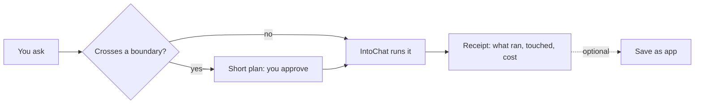
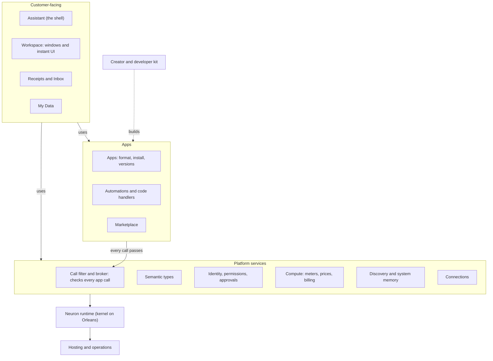
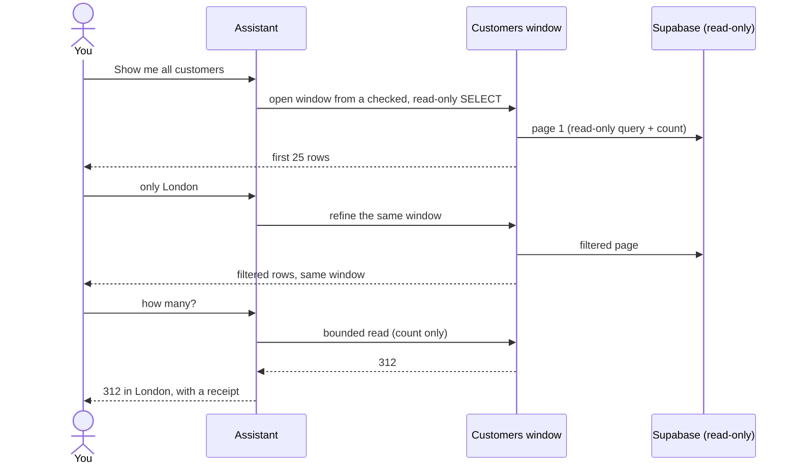

# IntoChat — high-level product definition

> **Read this first (5 minutes)**
> - **What IntoChat is.** An assistant that turns plain requests into live windows and reusable
>   apps, on an app platform (the "OS") with a marketplace and a pay-per-use unit, Compute.
> - **Where it is today.** One journey works ("Show me all customers"). Any UI request goes
>   through a C# compile-and-deploy pipeline, which is why the date-of-birth card failed. There
>   are no accounts, prices, app format or discovery. See [current-state.md](current-state.md).
> - **The plan.** Six phases, each shipping customer journeys:
>   - Phase 0 (2 weeks): delete dead code and clean the traces.
>   - Phase 1 (8 weeks): make "show me" and "draw me" work safely.
>   - Phase 2: apps, discovery and metering.
>   - Phase 3: billing.
>   - Phase 4: invited developers.
>   - Phase 5: creators and sandboxed code.
> - **Your ideas, answered:** [§3](#3-your-questions-answered).
> - **What I need from you:** decisions D1–D6 in [§12](#12-decisions).

**Contents:**
[1 Vision](#1-vision-and-press-release) · [2 One page](#2-intochat-on-one-page) ·
[3 Your questions](#3-your-questions-answered) · [4 OS model](#4-the-os-model) ·
[5 Who](#5-who-it-is-for) · [6 Outcomes](#6-outcomes-and-north-star) ·
[7 Principles](#7-principles-and-non-goals) · [8 Capability map](#8-capability-map) ·
[9 Capabilities](#9-capabilities) · [10 Journeys](#10-key-journeys) · [11 Phases](#11-phases) ·
[12 Decisions](#12-decisions) · [13 Assumptions](#13-assumptions-to-test) ·
[14 Risks](#14-risks) · [15 FAQ](#15-faq) · [16 Glossary](#16-glossary) ·
[17 Planning](#17-how-planning-works-from-here)

**How to read the references**

- **Product IDs.** `C01–C17` are capabilities; `J1`, `J2a`, `J2b` and `J3–J6` journeys; `O1–O5`
  outcomes; `D1–D17` product decisions; `T1–T11` technical decisions; and `AS1–AS9`
  assumptions.
- **Evidence** is written `(ev A8)` and points to a research note. The `ev` prefix keeps it from
  being read as a product ID.

  | ev | Note | ev | Note |
  |---|---|---|---|
  | A | [Current flow](research/2026-09-23-A-current-flow.md) | G | [IAW prototype](research/2026-09-23-G-iaw-prototype.md) |
  | B | [Behaviors](research/2026-09-23-B-behaviors.md) | H | [Projects survey and BDD](research/2026-09-23-H-projects-survey-bdd.md) |
  | C | [SDK, types and kernel](research/2026-09-23-C-sdk-types-kernel.md) | I | [Marketplace and app format](research/2026-09-23-I-marketplace-app-format.md) |
  | D | [Trace noise](research/2026-09-23-D-trace-noise.md) | J | [Compute](research/2026-09-23-J-compute-currency.md) (legal points not yet reviewed by counsel) |
  | E | [Modules, discovery, memory](research/2026-09-23-E-modules-discovery-memory.md) | K | [Typed data and agent OS](research/2026-09-23-K-typed-data-agent-os.md) |
  | F | [Existing docs and strategy](research/2026-09-23-F-existing-docs-strategy.md) | L | [Planning practices](research/2026-09-23-L-planning-practices.md) |

- **Maturity:** 🔴 Missing (nothing usable) · 🟡 Partial (one path works, or only in a limited
  form) · 🟢 Usable (works end to end for one owner on one host) · ✅ Solid (works for many
  users).
- **Horizon:** `now` = Phase 0–1 · `next` = Phase 2–3 · `later` = Phase 4–5.
- **proposed** marks anything the owner has not ratified yet.

---

## 1. Vision and press release

**Vision (2028).** IntoChat is the operating system where people get work done by asking. An
assistant finds, installs and runs the right app from a marketplace built by developers and by
regular users. Every app declares what it does, what data it touches and what it costs in
Compute. Every run ends with a receipt.

**Business goals:**
- weekly accepted intents per workspace (the north star);
- the share of intents served by apps not made by IntoChat;
- the number of paying publishers;
- contribution margin per workspace.

*The press release below is written as if the plan through Phase 3 had shipped, in Amazon's
"working backwards" format. It fixes the target before the work starts. Almost none of it works
today; for today, see [current-state.md](current-state.md).*

> **IntoChat: ask for it, see it, keep it**
>
> *Operations teams get live answers and working tools from their own business data in seconds,
> keep them as apps without writing code, and see exactly what every request touched and cost.*
>
> People who run a business spread their work across a dozen tools. Today's assistants can
> reach that data, and some can even draw small apps. But what they make stays inside one chat
> and is gone next week, and nobody can say afterwards exactly which data a request touched or
> what it cost.
>
> **In IntoChat you ask in plain words.**
> - "Show me all customers" opens a live table you can refine by asking again: "only London",
>   "how many?".
> - "Give me a card with name, surname and date of birth" opens a working form with a date
>   picker, instantly.
> - When a request would spend above your budget, use a new app, touch a new kind of personal
>   data, or reach outside your workspace, IntoChat first shows a short plan and asks.
> - Every request ends with a receipt: what ran, what it touched, what it cost.
>
> Anything useful can be kept with **Save as app**, and it runs the same way next time. Your
> own details and passwords live in **My Data**: apps read them only with a permission you can
> revoke, and the AI never sees a password. You pay only for what runs, in **Compute** (100
> Compute = $1, always shown in dollars), within limits you set. If a run fails because of an
> IntoChat error, you aren't charged for the failed steps.
>
> *"I stopped explaining the same report every Monday. I asked once, saved it, and now it runs.
> The receipt shows me exactly what it cost."* (the design-partner quote we want to earn)
>
> **Getting started:** create a workspace, connect your database, ask.
>
> **What comes next:** developers and other users publish apps to the IntoChat marketplace, and
> the assistant proposes the right one when you need it.

## 2. IntoChat on one page

**Five core nouns.** [§16](#16-glossary) adds Window, Automation, Grant, Receipt, Inbox,
Marketplace and Listing.

- **Workspace**: where results live, as windows.
- **Assistant**: who does the work.
- **Apps**: reusable tools, including automations.
- **My Data**: your own details and secrets.
- **Compute**: what work costs.

**One loop for every request:**



A *boundary* is any of these: money above your standing budget, a new app, a new kind of
personal data, or an effect outside the workspace.

**Three promises:**

1. Nothing new, and nothing above your budget, happens without your OK.
2. Your secrets never reach the AI.
3. You don't pay when IntoChat fails. The failure policy is Principle 8.

Words like neuron, signal, grain, module and behavior are **developer vocabulary**. They never
appear in the customer product.

## 3. Your questions, answered

| You asked | Verdict | In short |
|---|---|---|
| "It's not clear how 'Show me all customers' works" | **answered** | [current-state §4](current-state.md#4-show-me-all-customers-step-by-step) walks the flow and says, step by step, what to keep, change or delete. Phase 0 makes it one readable trace; J1 is the target. |
| "A lot of trash" | **Phase 0** | ~3,150 lines of dead Dart, 15 dead C# files, a dead agent, demo modules and a stale glossary go first. Every item has an owner in the [trash register](#trash-register). |
| "Behaviors might be simplified" | **adopt** | Behaviors leave the default assistant turn. UI becomes declarative (C02), automations become trigger → typed action (C11), and the C# pipeline stays as a developer tier with 3–4 tools (C11, D3). |
| "Draw me a card …" failed on `"date"` | **root cause found; 5 fixes** | Allowed kinds were hidden inside the implementation, so the model guessed. See [current-state §6](current-state.md#6-why-draw-me-a-card-with-name-surname-and-date-of-birth-failed). Fixed in Phase 1 by typed kinds (C05) and an instant form tool (C02). J2a is the test. |
| "Too much trash in Aspire traces" | **Phase 0** | One trace per request, idle silence enforced in CI, GenAI spans with tokens and cost, and the double Orleans tracing removed (C03). |
| An OS with a marketplace for developers **and** regular people | **adopt, in rings** | This is the vision and the architecture (§4). Supply grows in order: first-party apps → your own saved apps → invited developers (P4) → regular people publishing no-code apps (P5a) → sandboxed code (P5b). |
| LeadGenerator "from the marketplace" | **adopt, staged** | It ships in Phase 2 as a first-party app through the *same* manifest, consent and install path a marketplace app uses. Third-party trust machinery only arrives in Phase 4 (D15). |
| SDK data types: store and reuse my date of birth, a password | **adopt** | A semantic type catalog (C05). My Data plus `SecretRef` for your own facts and secrets (C04). Business data stays with its app (D6). |
| `Text : ValueNeuron<string>` as a `DurableGrain` | **typed values yes; a grain per value no** | Values become typed fields of entity neurons. See the detail below and D4. |
| Grain vs durable grain; can a neuron be durable? | **declared tiers** | Stateless, snapshot, and an opt-in journaled tier (`DurableGrain`) opened only for a measured need. See the table below. |
| IAW's UI neuron (Telegram) | **adopt the ideas** | IAW had no UI neuron; details below. We keep a closed component vocabulary with fallbacks, an explicit UI tool, and typed event handlers. |
| IAW's vector DB of all agents | **adopt the pattern, fix its failures** | It was never Qdrant. Details below. |
| A vector index of neurons and namespaces, plus "memory of neurons" | **adopt** | Restore the 2026-08-01 design on the Memory module's Qdrant: a system catalog, workspace instances ("memory of neurons") and user memories, with namespaced aliases (C08, D12). |
| Compute: pay per use, per-model token prices, apps charge after approval | **adopt, staged** | Usage capture (P0) → shadow prices (P1) → durable metering (P2) → billing (P3) → app charges and payouts (P4). See D7–D9. |
| Per-neuron tariffs, e.g. a filesystem charging for blob storage | **adopt as declared meters** | Meters are declared in manifests (id, unit, aggregation), priced in a versioned price book, and measured by the platform. Storage is sampled daily as `storage.gb_month`: shown in shadow in P2, billed in P3 (C07). |
| App format: NuGet-like modules? | **manifest first** | The *manifest is the app*. Only code that IntoChat hosts ships as a signed `.nupkg`, and it runs out of process (C10, D5). |
| How does an app tell what it does? Neuron interface? | **yes, generated from it** | Typed operations are generated from the neuron interface (`[Alias]`, `[ReadOnly]`, `[Description]`). `app.json` adds descriptions for people and for the model, plus example prompts, and discovery indexes them (C08, C10). |
| Each feature covered by a BDD/Reqnroll test, found by vector search | **adopt, staged** | Plain Given/When/Then scenarios and example prompts in every manifest *now*. They feed the listing, the index and evals. Executable certification on fakes becomes the publish gate in P4 (D11). |
| Signed C# packs installed into the running cluster ([projects survey](../../../Projects/docs/projects-survey-comparison.md), Projects `CONTINUATION.md`) | **reject for third-party code; reuse the tested parts** | Details below. |
| "Act as EM and PM: highlevel first, then epics" | **this document** | Capabilities §8–9, phases §11, decisions §12, assumptions §13. The epics layout in §17 starts after D1–D6 are ratified. |

**Detail: your `ValueNeuron` idea and durable grains.**

- `Text`, `Date`, `Email`, `Money`, `Person`, `File` and `Secret` become **semantic types**
  (C05). They are stored as *fields of entity neurons*: the My Data vault, an app's state, or a
  form's Form neuron.
- A grain per value would cost one activation, one directory entry and one blob per value. It
  also causes N+1 reads and loses atomic multi-field saves. The UI kit already shows this: a
  three-field card costs 4 activations, 4 blobs and 4 HTTP reads (ev C17).
- In the SDK the owner's `Text` becomes `PlainText` (proposed), so it doesn't collide with the
  UI kit's `text` grain type (ev C16).
- A value gets its own neuron only when it needs its own identity, permissions, billing or
  observers, for example a shared counter or an externally billed resource. Secrets are
  encrypted *fields* of the owner's vault neuron.

| Tier | Orleans base | Stores | For | Today |
|---|---|---|---|---|
| stateless | `Grain` (via `Neuron`) | nothing | provider facades: the 17 LLM grains, Supabase | in use |
| snapshot | `Grain` + `IPersistentState<T>` (via `Neuron<TState>`) | the whole state as one blob per write | widgets, connection records, the My Data vault, Form neurons | in use, 42 places |
| journaled (opt-in) | `DurableGrain` (Orleans Journaling, **alpha**) | each change appended to a log | a measured need only, e.g. vault audit or conversation history | wired but unused; the plan unwires it now (T9) |

*Can every neuron be durable?* Technically yes, but not by default:

- Stateless facades would pay a storage round-trip on every activation.
- Journaling is alpha, its API is already renamed on main, and it throws without registered JSON
  type metadata (ev C5–C7).
- IAW's "every agent is a `DurableGrain`" silently ran on volatile storage in production
  (ev G14).

Your `ValueNeuron : DurableGrain` is the journaled tier. "Journaled" here means Orleans
Journaling, not the retired DigitalBrain "Journal" concept.

**Detail: what IAW actually had** (ev G1–G19).

- **UI.** There was no UI neuron. A Telegram-side formatter inferred buttons from the model's
  text, first by regex and then through an LLM reformatter. Only options, suggestions and media
  were ever rendered; Card, Form and Progress parts were never built. Clicks went back to the
  model as the text "I choose: X".
  - *Keep:* a closed, renderer-independent vocabulary; an explicit UI tool that beats inference.
  - *Drop:* inference, and clicks sent back as text.
- **Agent registry ("vector DB").** It was an in-memory grain, never Qdrant. It indexed whole
  agents (name, description, capabilities, routing examples declared on the C# interface) but
  not tools. It ranked by 0.6 × cosine + 0.4 × keyword and injected the top 5 agents into every
  prompt. After 15 idle minutes it rebuilt without embeddings and silently became keyword-only.
  - *Keep:* interface-as-manifest, routing examples, and a shortlist followed by an LLM choice.
  - *Fix:* durable collections, re-embedding on content change, a visible degraded state, and
    indexing apps, operations and agents (C08).
- **Approvals.** Scopes were once / this thread / always, decided by an LLM judge. Gating
  applied only to grain keys that parsed as a Telegram id.
  - *Keep:* the scopes and natural-language policy editing.
  - *Replace:* the judge, with platform enforcement at the neuron boundary (C06).
- **Memory.** An automatic context provider with provenance ("On {date} you said…"), but it
  embedded raw chat, passwords included.
  - *Keep:* the shape.
  - *Store:* typed facts only (C08), never secrets (C04).

**Detail: the Projects survey's signed-pack model.** The survey and `CONTINUATION.md` (invariant
3) recommend this chain: signed typed-C# pack → install into the running cluster → Roslyn
compile → collectible ALC → register as a grain. That runs publisher code inside the silo, and
.NET has no in-process security boundary (ev I7).

What the plan does instead:

- Third-party and assistant-written code runs **out of process**, behind the platform call filter
  and broker (C12). Apps cannot add grain types (D5).
- First-party modules keep code-first `WithModule` composition and ship through host deploys.
  This drops "kernel updates through the marketplace".

What we reuse from the survey:

- signed packs (final's Ed25519, old digitalbrain's ECDSA + licence);
- verify-before-activate (v3's `GateNeuron`);
- final's 16 Reqnroll distribution scenarios, as the template for certification tests (C13).

## 4. The OS model

IntoChat is an operating system for work that an assistant does for someone. "OS" is the
architecture and the pitch to people who build on the platform. Customers hear the five core
nouns (D13). It means the runtime for the assistant and apps inside IntoChat, not a replacement
for Windows or macOS.



The OS analogy for each capability is in the §8 table.

**Where the metaphor breaks, and what each break forces:**

1. **The main user of this OS is the assistant, acting for a person.** Every app must be
   readable by the model (typed contract, description for the model, example prompts) before it
   is readable by people.
2. **The LLM is untrusted user space, never kernel.** It proposes; the platform decides. No
   security or spending rule lives in prompt text.
3. **Installs are proposed mid-task, not browsed.** A consent sheet replaces admin screens.
4. **A real OS never bills per system call.** We meter only dimensions a person understands:
   model tokens, storage, app functions.
5. **A real OS trusts installed code.** We never run third-party or assistant-written code in the
   core.
6. **Real operating systems shipped a shell and first-party apps years before a store.** We
   follow the same order.

## 5. Who it is for

| Group | Side | Job story | Anxieties | v1 |
|---|---|---|---|---|
| **Business operator**: a technical founder or ops lead at a 5–50-person company whose operational data is in Postgres/Supabase (Phase 1), or a RevOps lead on Salesforce (Phase 2). The owner is user #1, then 3 design partners. | consumer | When I need to know or do something with my business data, I want to ask in plain words and get a live view I can refine, so I can act today without learning each tool. | Will it change or leak my data? Can I trust the numbers? What will it cost? What did it just do? | **primary** |
| **Self-creator**: the same operator, making tools for their own workspace | producer | When the assistant produced something useful, I want to keep it as an app or automation that works the same way next time, so I never have to explain it again. | Will it break silently? Do I have to code? Who else can see it? | **primary** |
| **Budget owner** at a design partner | operator | When my team runs paid tasks, I want limits per workspace and app, with alerts and monthly statements, so there is never a surprise invoice. | Runaway automations, unapproved apps | secondary |
| **The assistant** (the marketplace's real shopper) | consumer | When a person states an intent, I want the few capabilities that fit, with typed inputs, allowed values and a known cost, so I finish on the first try without guessing literals like `"date"`. | Tool overload (selection degrades past 30–50 tools); contracts that fail only at runtime | design persona |
| **Platform operator** (the owner running IntoChat) | operator | When a request fails or costs too much, I want one receipt or trace that shows the whole intent in product terms, so I find the cause in minutes. | Trace noise, personal data in telemetry, negative margin, churn | internal |
| **Invited developer / small ISV**, e.g. a BackgroundRemover API | producer | When I have a capability people need, I want to wrap it once in a typed contract with meters and have the assistant suggest it at the right moment, so I earn from usage without building auth, billing or distribution. | Fair ranking, take rate, breaking changes, opaque review | later (P4) |
| **Public creator**: a non-programmer who shares or sells apps | producer | When an app I built by describing it works well, I want to share or sell it in one step. | Data exposure, support burden, identity checks for payouts | later (P5a) |
| **Private individual** (consumer) | consumer | When a form needs my date of birth or a password, I want to give it once and decide who may use it. | Plaintext storage, the AI seeing my password | later (B2B only until P5, D16) |

**Why business operators first (proposed, D1).**

- Your anchor journeys ("Show me all customers", LeadGenerator, Salesforce) are business jobs
  with a budget owner.
- Business customers accept invoices, per-use pricing and spend limits. They also keep consumer
  law, app-store rules and payout regimes out of scope until the platform is ready.
- Hypothesis: operators who save apps become the first creators, and their saved apps seed the
  catalog that regular people will later browse.
- Spreadsheet-only businesses are outside v1, because the Excel module was removed in
  `4bd2ac027`.
- **Switch condition:** if, by the end of Phase 2, fewer than 2 of 3 design partners use
  IntoChat weekly while prosumer journeys (images, My Data) show stronger pull, re-decide D1.

## 6. Outcomes and north star

**North star: weekly accepted intents per active workspace.**

An intent is *accepted* when all four of these hold for its intent id:

1. It ended successfully with no platform, tool-contract or timeout error.
2. The user did not retry, regenerate or correct it within 5 minutes.
3. The result was kept: the window stayed open ≥ 60 s, or was saved, pinned or refined, and a
   chat answer got no thumbs-down.
4. Actual Compute stayed ≤ the approved limit.

An *active workspace* has at least 1 accepted intent in the week. This maps onto the August
strategy scorecard ("regularly delegated processes", "success without correction").

- **Measuring it.** It is computed from durable receipts plus content-free product events
  (`kept`, `repaired`, `rated`, `saved`, `installed`) in the same store (C03), never from
  traces.
- **Baseline:** the owner's workspace, for the 2 weeks after Phase 0.
- **Targets (proposed):**
  - ≥ 60 % of intents accepted by the end of Phase 1;
  - ≥ 10 accepted intents per active workspace per week, across ≥ 3 design-partner workspaces,
    by the end of Phase 3.
- **Companion ratios:**
  - share of accepted intents served by capabilities the assistant *discovered*;
  - contribution margin per workspace-month;
  - revenue per active workspace-month;
  - later, the share served by apps not made by IntoChat.

| # | Outcome | Leading indicators (proposed targets) |
|---|---|---|
| O1 | **Understandable**: anyone can tell what happened in any request | 100 % of intents have a receipt (from Phase 1). ≤ 25 spans for "Show me all customers" and ≤ 45 for any authoring intent (the date-card request produced 365). Idle shell < 20 spans/min (~800 today). Narration test: 3 of 3 newcomers explain "Show me all customers" correctly from current-state §4 plus one trace (Phase 0), or plus one receipt (Phase 1 onward). |
| O2 | **First-try success** on core journeys | Live-model golden prompts for each named journey pass ≥ 18/20, nightly. 0 runtime type or kind errors after save. ≥ 90 % of "show me / draw me" requests served declaratively, with no compile step. |
| O3 | **Safe by default** | Canary-secret test: a seeded secret appears 0 times *in plaintext* in grain state, signals, HTTP reads, traces, logs, vectors or tool results. 0 plaintext credential fields. 100 % of paid or side-effect calls pass a platform-enforced approval. |
| O4 | **No surprise bills; healthy economics** | Actual ≤ approved limit in 100 % of intents. Recurring meters never exceed a monthly limit by more than one day's accrual. Estimate within ±30 % for 80 % of intents. 0 Compute charged for steps classed as platform fault or provider outage. Shadow statements within 1 % of provider usage. Contribution margin per workspace-month ≥ the D8 target. |
| O5 | **Reuse, then liquidity** | Saved or installed apps re-run within 14 days. Acceptance rate of the assistant's app suggestions. Later: listed apps with a paying workspace other than the author's. |

## 7. Principles and non-goals

**Principles** (the tie-breakers for every later decision):

1. **One loop for every request:** Ask → Plan → Approve → Run → Receipt. Plan and approval
   appear only at a boundary. The receipt always appears. One *intent id* keys the receipt, the
   trace, the approval and the statement line.
2. **Show only what works, and keep one of each.** Nothing appears without a working path. One
   agent runtime, one live-table contract, one tool registry, one manifest, one enforcement
   point, one glossary, one product document. Every epic names what it deletes.
3. **Declarative first, code last.** What a non-programmer asks for becomes a validated
   definition that renders instantly. C# is the developer tier. An unsupported kind gets a
   declared fallback, never a failed deployment.
4. **Types are the contract.** Every value has a semantic type from one catalog. Tool schemas,
   the compiler, the renderer, storage, manifests and permissions all read it. Every error names
   the allowed values.
5. **Secrets and personal data travel by reference.** The model never sees a secret. Secrets
   never enter chat, signals, traces, vectors or logs. Personal data flows only under visible,
   revocable grants, and a denied value looks the same as a missing one.
6. **The platform enforces; the model proposes.** Permissions, approvals and limits are checked
   at the neuron boundary, against a caller identity stamped by a trusted edge. A rule that lives
   only in a prompt is a bug.
7. **The assistant is the first user of every app.** Every capability is machine-readable before
   it has a listing for people. Discovery precision is a release gate.
8. **Honest Compute.** Compute is pegged to money and always shown in dollars. There is an
   estimate before and an actual after. Nothing is charged above an approved limit. The platform
   meters usage; apps never self-report it. Billing comes from a durable ledger, never from
   telemetry. **Failure policy:**
   - *Platform fault*: not charged.
   - *Provider outage*: not charged; the cost is absorbed and tracked.
   - *Model retry inside a run that succeeds*: charged, capped, and shown on the receipt.
   - *User cancellation, revoked grant, or limit reached*: completed steps are charged.
   - *Third-party app fault*: not charged, and not paid to the developer.
9. **One door for all apps.** First-party capabilities carry the same manifest, consent and
   meters as third-party ones. Code the assistant writes stays private to its author until it is
   frozen and published through review.
10. **Decisions stay decided.** A ratified decision changes only through a superseding ADR. It
    can't be reopened for 14 days; that is a decision freeze, not a work freeze. At most 2 epics
    are in progress at once.
11. **Reachable by everyone we target.**
    - v1 clients: Flutter web and Windows desktop.
    - Language: English.
    - Prices: USD, net of tax.
    - Accessibility: every window and consent sheet meets WCAG 2.2 AA.

**Not in v1 (through Phase 4):**

- **Hosting and clients.** No self-hosted or on-prem installs. No iOS or Android clients: if one
  ships, Apple guidelines 3.1.3 and 4.7 govern how Compute and apps can be used in it.
- **Enterprise and consumers.** No SSO, SCIM or enterprise admin. No consumer accounts (D16).
- **Data and inputs.** No spreadsheet or CSV sources. No voice input, unless D14 rewires it.
- **Money.** No prices in currencies other than USD. No floating or tradable currency: Compute
  can't be transferred between customers or exchanged for cash, except refunds the law or our
  terms require.
- **Effects.** No writes to connected systems except through preview → confirm. No outreach
  sending from LeadGenerator.
- **UI.** No generated Flutter, Dart or HTML.
- **Code.** No third-party or assistant-written implementation code in the silo. Apps can't add
  grain types.
- **Storage.** No `ValueNeuron` per field.
- **Decisions.** No LLM-judged security or spending decisions.
- **Data use.** No resale or delivery of LinkedIn-derived data.
- **Rebuilds.** No rebuilding Living programs, Live brain, diagram artifacts or CSV import unless
  a named journey needs them.

Sequencing rules (for example, "marketplace only after first-party journeys pass on live models")
are phase entry criteria in §11.

## 8. Capability map

| # | Key | Capability | OS analogy | Today | Phases |
|---|---|---|---|---|---|
| C01 | `assistant` | Assistant | Shell / command line | 🟡 Partial | P0–1 |
| C02 | `workspace-ui` | Workspace, windows and instant UI | Window manager + GUI toolkit | 🟡 Partial | P0–1 |
| C03 | `receipts` | Receipts, activity and traces | Activity Monitor + event log | 🔴 Missing | P0–1 |
| C04 | `my-data` | My Data: your own facts and secrets | Home folder + keychain | 🔴 Missing | P1–2 |
| C05 | `types` | Semantic data types | File types / ABI | 🔴 Missing | P1 |
| C06 | `identity-consent` | Identity, permissions and approvals | Accounts + credentials + permission prompts | 🔴 Missing | P1–3 |
| C07 | `compute` | Compute: meters, prices, billing | Resource accounting + bill | 🔴 Missing | P0–4 |
| C08 | `discovery` | Discovery and system memory | Spotlight + package index | 🔴 Missing | P2 |
| C09 | `connections` | Connections, live data and web research | Drivers + mounted drives | 🟡 Partial (Supabase usable) | P1–2 |
| C10 | `apps` | Apps: format, install, versions | Bundles + package manager | 🔴 Missing | P2, P5a |
| C11 | `automations` | Automations and code handlers | cron + daemons | 🟡 Partial (developer-grade, on by default for everyone) | P2 |
| C12 | `isolation` | Call filter, broker and sandbox | Syscall gate + sandbox | 🔴 Missing | P2–5 |
| C13 | `marketplace` | Marketplace: listings, trust, payouts | App Store + notarization | 🔴 Missing | P4–5 |
| C14 | `runtime` | Neuron runtime and durability | Kernel | 🟢 Usable (one owner, one host) | P0–2 |
| C15 | `dev-kit` | Creator and developer kit, and the decision record | SDK, docs, release process | 🟡 Partial | P0–2 |
| C16 | `inbox` | Inbox and notifications | Notification centre | 🔴 Missing | P2 |
| C17 | `operations` | Hosting, operations and support | Installer, backup, service desk | 🔴 Missing | P2 |

**Sixteen of seventeen capabilities are Missing (11) or Partial (5).** Only the runtime is Usable,
and only for one owner on one host. That is the honest shape of "we miss a lot". It also
explains the order:

1. The customer-facing capabilities C01–C03 fail today on problems that are cheap to fix.
2. The data and trust foundations C04–C07 come next.
3. The ecosystem C10–C13 can't start until those foundations exist.

## 9. Capabilities

Each capability shows what it is, today's state, and a target checklist: ⬜ missing · 🟡 partly
there · ✅ exists, keep. Targets name *candidate* mechanisms from the research (Stripe,
`AgentNeuron`, `ILiveTable`…). These are proposals for each epic's ADR, not decisions.

### C01 Assistant · `assistant` · 🟡 Partial · P0–1

**What it is.** How people operate IntoChat. You say what you want; the assistant plans, uses
apps to do the work, and reports back with a receipt. It is also the first user of every app, so
it needs the right few capabilities for each request, has to show its plan before crossing a
boundary, and must never lose a turn.

**Today.**
- One path works, verified only with a scripted model.
- Every turn gets the same 16 tools (14 of them C# behavior tools) and a hard-coded prompt.
- Two conversation hosts wrap one turn loop, plus a dead legacy agent.
- Nothing streams, token usage is dropped, and a failed run drops the turn.
- The client appends ~1 KB of hidden context to every message.
- The specialist picker is cosmetic.
- "Approval" is a sentence in the prompt plus a host flag that worker code can bypass.

(ev A2, A3, A11, A16, B-missed)

**Target.**
- ⬜ One runtime: `AgentNeuron` per conversation, with streaming, bounded history (last N turns
  plus a summary) and usage recorded.
- ⬜ Tools selected per intent, at most 8 (exact catalog in P1, discovery in P2).
- ⬜ A plan card whenever a request crosses a boundary.
- ⬜ Two-channel tool results: a *model channel* (summary, counts, handle) and a *UI channel*
  (real values in trusted widgets), following D6.
- ⬜ Failures explained in plain words and kept in history. Structured context replaces the
  hidden suffix.
- ⬜ Specialists become indexed agent definitions, or disappear.
- ⬜ A nightly live-model golden-prompt suite.
- ⬜ Every rule that lives only in a prompt is enforced by the platform, or deleted.

**Deletes:** `ConversationalAgent`, `/author`, the coordinator + `IConversation` host, the hidden
suffix, the cosmetic picker.

### C02 Workspace, windows and instant UI · `workspace-ui` · 🟡 Partial · P0–1

**What it is.** Results appear as live windows you can see, refine and reuse. Ask for a form or
card and it appears in seconds, built from platform components, with the right input for each
type. Showing UI never requires compiling code.

**Today.**
- Live tables work.
- "Draw a card" became a 9-step C# deploy. It failed on `"date"`, and it would have been
  invisible even if it had worked.
- 29 UI kinds exist, but only 9 can render.
- A window is either a table or a surface, never both.
- ~3,150 lines of Dart sit behind dead menu items and routes.
- A demo banner polls every 2 s.
- The client keeps a second copy of the server's state.
- Windows have no first-run, empty or error states.

(ev A5, A8, A19, A20, B5, D3)

**Target.**
- ⬜ A declarative `show_form` / `show_view` tool, validated against the type and component
  catalogs. It is stored as **one Form neuron per window** holding the typed field list, draft
  values and an atomic submit (T7). `AppSurfaceComposer` only opens and lays out the window.
- ⬜ Date and masked-secret inputs, with server and renderer kinds in parity. A Secret field holds
  a `SecretRef`, never a value.
- 🟡 A renderer registry covering every catalog kind, with declared fallbacks (9 of 29 today).
- ⬜ One window reference: "this window shows neuron X".
- ⬜ Events routed to typed handlers on the owning neuron, never back to the model as text.
- ⬜ SSE push instead of polling. The server is the single source of truth for workspaces and
  chats.
- ⬜ First run: a new workspace opens the assistant with starter prompts that match the connected
  sources. Every window has loading, empty, permission-denied, expired-connection and failed
  states.

**Deletes:** the 6 dead "New work" items, `/programs`, the artifact editors, table import, the
brain graph, the `InboxBanner` demo polling, the duplicated client store, and UI kinds that can't
render (or their routes).

### C03 Receipts, activity and traces · `receipts` · 🔴 Missing · P0–1

**What it is.** Every request ends with a **receipt**: what the assistant did, which apps ran,
which data they touched (by type), what it cost against the estimate, and what is still running.
Receipts are durable product records. Traces are for engineers.

**Today.**
- The one real request was 0.13 % of traces.
- The idle floor is ~800 spans/min.
- ~40 % of all spans are duplicates caused by double Orleans tracing.
- There are no GenAI spans and no token data on the agent path.
- The date failure is split across 70+ root traces.
- Logs are evicted after ~13 minutes.
- SQL and MCP calls are invisible.

(ev D2–D12)

**Target.**
- ⬜ **Receipt** = a durable record per intent id. It is written when the intent ends, from the
  run log, tool and app calls, and meter events, and stored with the conversation. It carries
  the north-star fields (first try, retries, repairs, kept, approved vs actual Compute,
  discovered vs hard-wired). It is never derived from traces, which are sampled and evicted.
- ⬜ Content-free product events (`kept`, `repaired`, `rated`, `saved`, `installed`) in the same
  store.
- ⬜ Receipt UI.
- ⬜ One trace per intent: `invoke_agent` → `chat` / `execute_tool` → neuron → db, about 15–45
  spans carrying `intochat.*` attributes.
- ⬜ Trace hygiene:
  - a single Orleans propagation registration;
  - no spans from polling;
  - framework logs at Warning;
  - Npgsql and MCP trace sources on;
  - trace context passed into child processes.
- ⬜ GenAI spans on every LLM call site. The agent is routed through the shared chat pipeline.
- ⬜ Sensitive-content capture as D14 defines it.
- ⬜ Tail sampling through an OTel Collector in hosted deployments (C17).
- ⬜ CI checks for idle silence (< 20 spans/min) and the trace budget.

### C04 My Data: your own facts and secrets · `my-data` · 🔴 Missing · P1–2

**What it is.** Your own details (date of birth, addresses) and credentials (passwords, API keys,
OAuth connections) live in one place you can see, export and erase. Apps get them only through
grants. Secrets are used by reference: the AI never sees them, and they never land in logs or
traces. **Business data** (form entries, customer rows) is *not* My Data. It belongs to the
workspace and the app that holds it (D6).

**Today.**
- A `password` field is stored in plain text, broadcast in a signal, readable through an unscoped
  `GET`, and shown unmasked.
- Salesforce tokens are plaintext in grain state. Gmail discards its tokens but reports
  "connected".
- `ProtectedPayloadReference` has nothing behind it.
- Operator secrets are handled well, as Aspire secret parameters.

(ev A9, C12, C13, K2–K5)

**Target.**
- ⬜ A vault neuron per owner, with typed fields (`me.birthDate`, `me.email.work`) and an access
  audit trail. In P1 it is keyed by the single owner id. In P2 it is re-keyed to the account
  through a tested migration (T1).
- ⬜ `SecretRef`: write-only, with a masked input, entered out of band (never typed into chat).
  It is resolved only inside the neuron that makes the outbound call. It never appears in read
  results, signals, traces, logs, vectors or journals.
- ⬜ A token vault that absorbs the OAuth tokens modules hold today (Salesforce, Gmail).
- ⬜ Envelope encryption (T4):
  - a per-owner data key, and a per-credential key;
  - both wrapped by Key Vault (hosted) or DPAPI (local);
  - erasure = deleting the owner's data key (crypto-shredding);
  - everything else relies on storage-service encryption.
- ⬜ Redaction by sensitivity class in logs and traces. Never indexed.
- ⬜ Export and erasure.
- ⬜ A **My Data** app that lists every value and every grant, with revoke.
- ✅ Operator secrets as Aspire secret parameters.

### C05 Semantic data types · `types` · 🔴 Missing · P1

**What it is.** Every value has a type from one small catalog. The type says:
- how to validate it;
- which input to show;
- how sensitive it is;
- whether the AI may see it;
- whether it may be indexed.

The assistant's tool schemas, the renderer, storage, manifests and permissions all read the same
catalog. So `"date"` is either a valid type or it is rejected before anything runs.

**Today.**
- Values are strings; the UI contracts carry 140+ string fields.
- Allowed kinds are private sets inside grains.
- There are three copies of a 4-value table type map.
- The model learns contracts from reflection signatures truncated at 24 KB.

(ev B2, B10, C8, K1)

**Target.**
- ⬜ A catalog of about 22 types. Each entry has:
  - a primitive and JSON Schema validation;
  - a sensitivity class (`Public`, `Personal`, `SpecialCategory`, `Financial`, `Credential`);
  - LLM exposure (value, masked or reference-only);
  - input and display widgets;
  - a redactor;
  - an *indexable* flag.
  
  **v0:** PlainText, LongText, Number, Date, DateTime, Boolean, Choice, Email, Url, Secret,
  Reference. **v1 adds:** Phone, Money (with currency), File, Image, Person, PostalAddress,
  Location, Duration, Percent, MultiChoice.
- ⬜ Published as JSON Schema with `x-intochat-*` extensions.
  - The flat primitive subset (PlainText, Number, Boolean, Date, DateTime, Email, Url, Choice,
    MultiChoice) maps one-to-one onto MCP form elicitation.
  - Composite types need IntoChat's own renderer.
  - A Secret is never collected by a form. It uses MCP URL mode or IntoChat's out-of-band entry.
- ⬜ **For developers.** `DigitalBrain.Contracts` ships the catalog as C# value types (`Date`,
  `Email`, `Money`, `Url`, `SecretRef`, `PlainText`…) with validation built in.
  - Contracts take enums (`FieldKind.Date`), never free strings.
  - A neuron's state holds `Date BirthDate`, never `string`.
- ⬜ **Closed for primitives, open for composition.** Apps declare records made of catalog types,
  e.g. `Lead { Company: PlainText, Website: Url, Email: Email, City: PostalAddress }`. Those
  records flow into the manifest, the tool schemas and the consent sheet. A new primitive needs
  an ADR.
- ⬜ Tool schemas are generated from the catalog. Errors name the rejected value and the allowed
  ones.
- ⬜ Type ids double as permission scopes: `person.birthDate` is both a type and a grant scope.
- ⬜ One table-type mapping instead of three, plus a C#↔Flutter parity test.

### C06 Identity, permissions and approvals · `identity-consent` · 🔴 Missing · P1–3

**What it is.** Every action is done by someone: a user, the assistant acting for a user, or an
app. The platform checks what that someone may touch and spend. It asks the person *once*, *for
this chat* or *always*, and enforces the answer, instead of relying on a sentence in a prompt.

**Today.**
- One optional Basic-auth "owner", off by default. Workspace hashes are predictable.
- ~65 unscoped `/ui` routes, one of which returns password values.
- Integrations are global singletons.
- Grain calls carry no caller identity, and behavior workers hold full Orleans gateway access.
- Identity has regressed since the August cookie-and-roles model.

(ev A17, B-missed, C15, F11, J4)

**Target.**
- ⬜ **P1.** Every neuron that holds user or workspace data is keyed under the workspace scope,
  and the unscoped `/ui` value routes are gone. Integration connections stay global until the
  token vault; this is an accepted exception.
- ⬜ **P2. Accounts and login.**
  - Members have two roles, owner and member.
  - Workspaces are private by default and shareable with members.
  - Only owners set limits and approve installs.
- ⬜ **P2. Caller context (T2).**
  - It is stamped only at trusted edges: authenticated HTTP, the app proxy, the scheduler.
  - It is re-stamped, never inherited, when a call enters or leaves an app. The proxy narrows the
    grants to that app's own.
  - Any process holding an Orleans gateway connection is trusted platform code. LLM-authored code
    never holds one in the product profile.
- ⬜ **One enforcement component**, a platform call filter built in increments:
  - P2: principals and grants.
  - P3: allowances and limits.
  - P4: an HTTP gateway for remote apps (C12).
  
  No other approval path is built.
- ⬜ **Grants**, keyed by (app, semantic type, mode): once / this chat / always, with one-click
  revoke. A denied value looks like an empty one.
- ⬜ **Three approval levels**, enforced outside the model:
  - a standing budget;
  - install consent with a monthly limit;
  - a per-operation allowance.
  
  Pending approvals survive restarts. Re-consent is required when an app's permissions or prices
  grow.
- ⬜ An audit log.

### C07 Compute: meters, prices, billing · `compute` · 🔴 Missing · P0–4

**What it is.** You pay only for what runs, in Compute: 100 Compute = $1, net of tax, always
shown in dollars. Costly work shows an estimate first, runs under a limit you approved, and the
receipt shows the actual cost. IntoChat's own failures are not charged (Principle 8).

**Today.**
- The shell shows "Compute —".
- The agent's model client sits outside the shared pipeline, so its usage is dropped.
- Only 3 token counters exist.
- There are no prices, no ledger and no cost tracking.
- The lifecycle exists only in the customer design, in its Compute section.

(ev A17, D9, D20, J1–J4)

**Target, in stages:**
1. ⬜ **Usage capture (P0).** The agent is routed through the shared chat pipeline. A metering
   decorator captures input, cached, reasoning and output tokens per intent.
2. ⬜ **Shadow cost (P1).** Price book v0 is a data file, priced per concrete model. Local models
   are priced at 0 and labelled "local". Receipts show a "preview price, not charged". Only the
   owner and design partners see it until D8 is ratified.
3. ⬜ **Durable metering (P2, T5).** Idempotent meter events, keyed by (intent id, meter id,
   step), come from four sources:
   - the chat-client decorator;
   - an embedding decorator;
   - the platform call filter, for first-party functions;
   - a daily storage sampler, for `storage.gb_month` as a daily-peak average.
   
   Events are reconciled to provider usage. Each event records its cost basis. A **cost ledger**
   records unbilled platform costs (screening calls, discovery embeddings, absorbed failures,
   hosting). It is kept separate from the price book, and contribution margin is computed from
   both.
4. ⬜ **Billing (P3, D7).**
   - Business customers are invoiced monthly in arrears, in USD, with tax on the invoice and
     reverse charge where it applies.
   - Spend limits are enforced by the platform, with a ledger per T3.
   - Limits are set per account, workspace, app and run, with alerts at 75/90/100 % and a
     distinct hard-stop error.
   - Recurring meters (storage, standing automations) accrue without an intent and appear on the
     monthly statement. When a limit is hit, stored data stays readable and exportable for a
     grace period (proposed 30 days).
5. ⬜ **Prepaid Compute and top-ups.** These come only when self-serve sign-up opens (P5a),
   after a D7 revisit. They need Stripe's written confirmation under its restricted-business
   policy, and a minimum top-up that keeps fixed card fees under 5 %.
6. ⬜ **Earnings ledger and payouts (P4, C13).**

**Who sets prices.** IntoChat prices first-party meters. A publisher proposes prices for its
app's meters, and IntoChat reviews and locks them per version. Any increase triggers re-consent.

### C08 Discovery and system memory · `discovery` · 🔴 Missing · P2

**What it is.** The assistant, and you, can find any capability and anything in the workspace by
meaning ("my customers table", "last week's leads"), then load only the details needed. This is
the marketplace's filter and your "memory of neurons". Personal values and secrets are never
indexed.

**Today.**
- `code_contracts` reflects over host DLLs, returns bare signatures and truncates at 24 KB. It
  even lists the demo fakes.
- A Qdrant capability index was built on 2026-08-01, replaced on 2026-08-10 after a 10 s stall
  and retry storms, and deleted on 2026-08-20.
- Memory has no consumers and no data volume, and `Remember` embeds inside the grain call.

(ev E5–E8, H4)

**Target.**
- ⬜ A **catalog built from manifests** is the truth. Vector plus keyword search returns ids
  only.
- ⬜ **Built on the Memory module's Qdrant**, with a separate durable collection per purpose, a
  data volume, the embedding model recorded per collection, and embeddings computed off the grain
  call:
  - *System capabilities*: apps, operations, agents and types.
  - *Workspace instances*, the **memory of neurons**: every neuron created in a workspace is
    registered, seeded from the workspace windows.
  - *User memories*: preferences and work facts of `Public` type, with provenance. A memory may
    reference a My Data field id, but never contains its value.
- ⬜ Namespaced aliases (`intochat.files`, `com.acme.leadgen`). Results are filtered by namespace
  and install scope.
- ⬜ A `find_capability` tool. Vector search enters the turn only when the candidate tool set
  would exceed 8. Workspace-instance search ships regardless of catalog size.
- ⬜ Background, idempotent rebuilds, with a keyword fallback and a visible "degraded" state.
  Discovery never blocks a turn.
- ⬜ **Gate:** a golden set of ≥ 60 prompts (direct, indirect, negative) against ≥ 50 operations,
  including ≥ 20 distractor manifests. Top-5 recall ≥ 0.9 and negative precision ≥ 0.9.
- ⬜ An unmet-intent board: searches that find nothing become visible demand for developers.

**Deletes:** the orphaned `digitalbrain.capabilities` guard, unless this capability restores it.

### C09 Connections, live data and web research · `connections` · 🟡 Partial · P1–2

**What it is.** A business's work lives in other systems. IntoChat connects once and reads
safely: read-only by default, with a preview before any write. It shows live, paged views that
the assistant can also read and refine. Connection status is always honest.

**Today.**
- Supabase is usable: read-only transactions, server-side paging.
- The assistant never sees rows and can't refine a view.
- Four table mechanisms overlap.
- ClickHouse, Gmail and GitHub have no assistant tools.
- Salesforce's hosted MCP is only configured: the MCP-to-assistant bridge has no production
  caller.
- Web search, browse and company lookup are registered but never offered.
- Modules are reachable only indirectly, through generated behaviors.

(ev A1, A3, A4, A10, A12, E4)

**Target.**
- ⬜ One live-table contract with pluggable sources and one guard, policy and compiler. The
  read-only transaction model becomes the pattern for every connector.
- ⬜ Read and refine tools bound to the window. Bounded answers in chat follow D6.
- ⬜ A self-serve **Connect** flow:
  - pick a source;
  - paste a connection string, or sign in with OAuth (stored as a `SecretRef`);
  - test with a read-only probe;
  - see its status (connected / expired / failing);
  - disconnect.
- ⬜ Connections stored as token-vault references.
- ⬜ **Web research** (search, browse, company lookup) as connections with meters
  (`search.request`).
- ⬜ The MCP bridge registered, with allowlist entries, so hosted MCP servers become discoverable
  operations. Tools for every connector kept in the product profile.
- ⬜ A generic preview → confirm for writes, generalized from Salesforce
  `PrepareWrite`/`ConfirmWrite`.
- ⬜ A connector is in the product profile only if chat can reach it.

**Deletes:** three of the four table mechanisms (the epic names them).

### C10 Apps: format, install, versions · `apps` · 🔴 Missing · P2, P5a

**What it is.** An app is something named and versioned that you open from Applications: a view
or form, the data it keeps, and optional automations, plus what it needs and what it costs.
Anyone can make one by describing it or with **Save as app**. Built-in apps, your apps and
marketplace apps share one format, so the assistant, consent and Compute treat them all the same.

**Today.**
- Modules are chosen when the AppHost compiles and are identified by CLR type name. They have no
  version, publisher or permissions.
- Files, Image Editor and Behaviors are hard-coded in the shell.
- Docs describe three incompatible "app" concepts.
- A marketplace screen and a pack model existed and were **removed on 2026-07-08** (`3354733d3`).
- Seeds to reuse: 11 typed configuration contracts, the revision and rollback machinery, and 142
  `[Alias]` / 100 `[ReadOnly]` markers.

(ev E1, E2, E13, F8, I1, I4)

**Target.**
- ⬜ One `app.json` manifest:
  - identity, SemVer, publisher and kind;
  - a description for people and a description for the model;
  - typed operations and a UI entry;
  - permissions and data classes;
  - meters;
  - example prompts and scenarios.
- ⬜ **Kinds** (D5):

  | Kind | Who makes it | What ships | Isolation |
  |---|---|---|---|
  | `declarative` (default) | anyone, including through the assistant | a signed JSON definition composing installed capabilities, UI, automations and prompts | no code: the platform runs it |
  | `remote` | developers | manifest plus a publisher-hosted MCP endpoint | the network; every call goes through the broker gateway |
  | `process` | developers | a signed `.nupkg` (`IntoChatApp` package type, embedded `intochat/app.json`) | a per-app sandboxed process behind the broker |

- ⬜ Operations are generated from the neuron interface, so declarations can't drift from the
  code. Apps expose operations through a platform proxy neuron and never add grain types.
- ⬜ First-party modules keep `WithModule` and carry a generated manifest.
- ⬜ Definition and instance are separate. Install and uninstall happen per workspace, without a
  restart.
- ⬜ Versions are immutable and can be rolled back. Uninstall states which data is kept.
- ⬜ The Applications launcher is driven by manifests.

### C11 Automations and code handlers · `automations` · 🟡 Partial · P2

**What it is.** Work that runs while you're not watching, such as "every morning add new leads to
my table". Automations run on a schedule, an event or on demand, each with a budget, visible run
history and a safe failure policy. Developers can still write C# handlers.

**Today.** The pipeline is developer-grade, but it is on by default for everyone.
- Every assistant turn carries the 14 behavior tools, and "draw me a card" goes through them.
- Draft → check (~19 s) → sealed artifact → supervised process → rollback all work, with 173
  tests.
- There are 6 identities to track.
- Checks accept tautological tests written by the model.
- Automatic 3× retries repeat side effects.
- The only error shown is "control channel closed".
- It runs only on Windows, with host privileges and full gateway access, and has no delete.
- The Behaviors manager shows xUnit and Orleans logs to end users.
- Timer schedules live in memory; `ReminderNeuron` is durable.

(ev B3–B16, C3 correction)

**Target.**
- ⬜ Declarative trigger → typed action, validated against contracts before activation, with a
  budget per automation.
- ⬜ **Durable jobs on Orleans reminders** through the existing `ReminderNeuron` (T8). Each run is
  a Job record with an idempotency key (automation id, scheduled time), a Compute budget and a
  failure policy. Paid or side-effect steps are never retried automatically. Timer's in-memory
  schedule is deleted.
- ⬜ Run history in receipts. Results and failures go to the Inbox (C16).
- ⬜ **The developer tier:**
  - 3–4 coarse tools;
  - revisions and ids managed by the server;
  - contract-level checks against a test brain;
  - tests that never reference the behavior are rejected;
  - the first exception is shown in the status;
  - quiet worker logs;
  - delete and uninstall;
  - the Behaviors console behind developer mode.
- ⬜ From P2, workers never hold an Orleans gateway in the product profile. They go through the
  broker path (T2) or run only in the developer profile.

**Deletes:** the in-process behavior host, `/author`, the duplicate MCP exposure, the duplicate
`ProcessRunner`, and UI polling (use the existing signals).

### C12 Call filter, broker and sandbox · `isolation` · 🔴 Missing · P2–5

**What it is.** Apps written by other people, and code the assistant writes, reach only what
their manifest declares and the user granted, within resource and network limits. This is what
lets you install BackgroundRemover without handing it the keys to everything.

**Today.**
- Behavior workers get full Orleans gateways, and `Get` passes any id straight through.
- The Windows job object only kills the process when the job closes.
- .NET has no in-process sandbox, and `AssemblyLoadContext` is not a security boundary.

(ev B13, I2, I7, I8)

**Target.**
- ⬜ **One component** (the C06 call filter): grants (P2) → allowances (P3) → an HTTP gateway for
  `remote` apps with egress rules per data class (P4). It records the platform's own meters.
- ⬜ Then `process` apps (P5b): a per-app container with CPU, memory and process limits, no
  Orleans gateway, and network denied by default. Wasm comes later.
- ⬜ The host loads only contracts assemblies, after signature and banned-API checks.
- ⬜ Banned-API analyzers for code apps, and a penetration test before P5b.

### C13 Marketplace: listings, trust, payouts · `marketplace` · 🔴 Missing · P4–5

**What it is.** Where supply meets demand, for people browsing and for the assistant searching. A
listing shows:
- what the app does (examples, with evidence that they pass);
- what data it needs;
- what it costs;
- who stands behind it.

Review effort scales with risk, a bad app can be switched off everywhere, and publishers get
paid.

**Today.**
- There is no publisher identity, signing, listing or review. 50 projects are packable, but none
  has ever been published.
- The 09-22 programmable-behaviors spec excludes a package marketplace "without promising" one.
- A marketplace screen was built and removed on 2026-07-08.
- Seven or more earlier attempts never tested install → dispatch end to end.

(ev F7, E15, H1, I13, J12)

**Target.**
- ⬜ A catalog service separate from the package feed. Listings are generated from manifests.
- ⬜ Publishing opens in rings: first-party → invited `remote` (P4) → creators' `declarative`
  (P5a) → sandboxed `process` (P5b).
- ⬜ **Trust pipeline:**
  - namespace proof;
  - signatures in require mode;
  - scans;
  - a sandbox run of scenarios on fakes;
  - a diff of declared vs used permissions and meters;
  - golden-prompt precision;
  - human review only for risky data classes.
  
  New apps get a Beta label.
- ⬜ **Governance:**
  - a kill switch that acts in under 15 minutes, with a statement of reasons to the publisher;
  - a listing policy and takedowns;
  - reviews only from workspaces that ran the app;
  - "Report this app";
  - a developer agreement and an acceptable-use policy;
  - neutral ranking by accepted intents, with published ranking parameters and disclosure of how
    first-party apps are treated (counsel to confirm the EU P2B and DSA scope).
- ⬜ **Merchant of record (D9).** IntoChat sells every app charge:
  - it collects tax on the full price;
  - it handles disputes, refunds and chargebacks;
  - it buys from developers under a supplier agreement;
  - it screens against sanctions lists.
  
  In the EU an app marketplace is presumed to be the supplier anyway (Reg. 282/2011 Art. 9a,
  counsel to confirm).
- ⬜ **Earnings ledger:**
  - recorded in fiat, never as Compute;
  - a holding period ≥ the card dispute window (proposed 120 days);
  - verified identity, a supported country and tax forms;
  - a threshold and claw-back;
  - refunds as new entries.
  
  Creators who can't be onboarded publish free apps only.

### C14 Neuron runtime and durability · `runtime` · 🟢 Usable (one owner, one host) · P0–2

**What it is.** The small engine underneath: neurons on Orleans, live signals and persisted
state. Customers never see it, but every promise depends on it: what you saved survives, a charge
is never taken twice, and a job keeps running after you close its window.

**Today.**
- The kernel is ~2,000 lines and sound, with `IPersistentState` in 42 places.
- Drafts, programs, logs and the behavior catalog live on local disk. Qdrant has no volume.
- Orleans Journaling is a hard startup dependency but unused.
- `Neuron<TState>` keeps mutated state after a failed write.
- Signals are at-most-once. In-silo subscribers miss signals from other silos.
- Pending logins live in process memory.
- The SDK is pinned to a .NET 11 RC.

(ev A15, C1–C7, C21, C-missed, E15, E19)

**Target.**
- ✅ Stateless and snapshot tiers (the table in §3).
- ⬜ A declared tier per neuron, through the SDK base classes.
- ⬜ Orleans Journaling unwired from the product host (P0). A journaled tier comes back only
  through a superseding ADR with a measured need and spike criteria (T9).
- ⬜ A failed persistence write rolls back or deactivates the neuron.
- ⬜ Append-heavy state stays bounded:
  - `AgentNeuron` history is capped;
  - receipts are stored one row per intent, outside the workspace blob;
  - `WorkspaceNeuron.Receipts` is renamed `OperationLog`.
- ⬜ One persistence model in cluster storage, with no local-disk JSON.
- ⬜ A stored-state migration policy (T1).
- ⬜ One silo per deployment until cross-silo signal delivery and login handoff work (T6).
- ⬜ Product and developer AppHost profiles.
- ⬜ The first .NET 11 GA release before any money moves (T11).

### C15 Creator and developer kit, and the decision record · `dev-kit` · 🟡 Partial · P0–2

**What it is.** What lets non-programmers create by describing and saving, lets developers ship
apps that work the first time, and lets one owner plus AI agents build without churn.

**Today.**
- The kernel is clean, and the 3-package test harness exists.
- `CONTEXT.md` and the public handbook describe deleted concepts.
- 8 specs and 19 dated plans (plus 2 ledgers) were written in 4 days. Status lives in prose, and
  plan checkboxes are never ticked.
- There is no ADR folder, and the CI Flutter paths are stale.
- Since 2026-09-01: 413 commits, +271k/−174k lines, and 63 markdown files deleted since
  2026-09-10 UTC.

(ev A6, C2, F13–F18, L20)

**Target.**
- ⬜ `CONTEXT.md` rewritten from the code, plus a customer glossary (§16).
- ⬜ An ADR register covering every ratified decision and every reversal.
- ⬜ This document plus `epics/`, with one status field per item (§17).
- ⬜ A manifest generator, app templates, the scenario format and a golden-prompt eval tool.
- ⬜ A TestCluster harness with fakes, and architecture-guard tests for manifest completeness.
- ⬜ One Definition of Done, a docs lint, and fixed CI paths.
- ✅ The 3-package test harness.

### C16 Inbox and notifications · `inbox` · 🔴 Missing · P2

**What it is.** Where work that happened while you were away reaches you:
- an automation result is ready, or a run failed;
- an approval is waiting;
- a connection expired;
- a limit reached 75/90/100 %;
- an app was switched off.

**Today.** `IInbox` is a volatile list of the last 50 strings, fed by the ElonBitcoin demo. The
`InboxBanner` is demo polling. (ev C3 correction, D3)

**Target.**
- ⬜ Structured items: id, kind, source (intent, app, window), actions, and read/resolved state.
- ⬜ Producers: automations, Compute alerts, approvals, connections, the kill switch.
- ⬜ Repeats grouped, with a deep link to the window or receipt.
- ⬜ Pushed over SSE, plus an email digest for approvals waiting more than 1 h.

### C17 Hosting, operations and support · `operations` · 🔴 Missing · P2

**What it is.** What makes a hosted deployment for a design partner safe to run: provisioning,
upgrades, backups, monitoring and support.

**Today.**
- Local Aspire only. A deploy workflow exists but points at moved paths.
- The SDK is an RC, and Qdrant has no volume.
- There are no backups, no SLO and no support channel.

(ev E7, E12, E15)

**Target.**
- ⬜ One-command provisioning of a partner deployment from the product profile, as Linux
  containers with managed identity and keys in Key Vault.
- ⬜ Versioned upgrades, with state migrations and rollback.
- ⬜ Nightly backups of grain storage, the ledger and the vector collections, with a quarterly
  restore drill (RPO 24 h, RTO 4 h).
- ⬜ An SLO of 99.5 % monthly for `/agent` and window reads, with alerts on the per-intent error
  rate.
- ⬜ Telemetry exported to a persistent backend through an OTel Collector.
- ⬜ The Windows developer-tier executor disabled in hosted deployments.
- ⬜ An incident runbook, a support channel, and an in-app "Report a problem" that attaches the
  intent id.
- ⬜ Workspace and account deletion that also purges vectors and backups.

## 10. Key journeys

These are the walking skeletons. Each is a thin end-to-end path that pulls in only the platform it
needs. The acceptance examples use customer language, and prices are illustrative.

**J1 — "Show me all customers"** · Phase 1
```gherkin
Given a workspace connected to my Supabase database
When I ask "Show me all customers"
Then a live Customers window opens, paged on the server
When I say "only London"
Then the same window is refined, not a new one
When I ask "how many?"
Then the assistant answers "312 in London" from a count, without reading the rows (D6)
And the receipt says "Supabase customers, read-only · 2 model calls · 0.4 Compute ($0.004), preview price, not charged"
```



*Needs:* C01, C09 read and refine, C03 receipt, C07 shadow cost (all P1), D6. Compare it with
today's flow in [current-state §4](current-state.md#4-show-me-all-customers-step-by-step).

**J2a — "Draw a card with name, surname and date of birth"** · Phase 1
```gherkin
When I ask for a card with name, surname and date of birth
Then a form window appears within 10 seconds with a date picker, and nothing is compiled
When I fill it in and press Save
Then the entry is stored in the card's own data as PlainText, PlainText and Date (sensitivity: Personal)
And the assistant sees the field types and a handle, not the values (D6)
When I add a password field
Then the input is masked, the card shows "•••• set", and the assistant sees only a handle
```
If a kind is unsupported, a declared fallback is used and explained in one line. It never ends in
a failed deployment.
*Needs:* C05 v0, C02 Form neuron, C04 `SecretRef`, C06 workspace scoping (all P1).

**J2b — "Remember my date of birth"** · Phase 1
```gherkin
When I say "remember my date of birth" and enter it in the secure field
Then it is stored in My Data as me.birthDate and listed in the My Data app
And no app can read it until I grant access (grants arrive in Phase 2)
```
*Needs:* C04 vault v0 (P1).

**J3 — Find leads with LeadGenerator** · Phase 2
```gherkin
When I ask "Find new dental clinics in Berlin"
Then the assistant proposes LeadGenerator, a first-party app
And a consent sheet shows its examples, the data types it uses, its permissions and an estimated Compute cost (shadow, not charged)
When I approve
Then a Leads window opens with company-level fields only (name, address, website, phone, category)
And a receipt follows
When I say "do this every morning"
Then an automation runs daily, each result lands in my Inbox, and side-effect steps are never retried automatically
```
LeadGenerator v1 is made of web search and company lookup (C09), a Leads live table held in the
app's own data, and a daily automation. It never uses LinkedIn-derived data, and it does not send
outreach in v1 (D15).
*Needs:* C10, C08, C06 accounts + grants + consent sheet, C09 web research, C11 durable jobs, C16
(all P2); C07 shadow estimate (P1); counsel review (D15).

**J4 — A paid capability under an allowance** · Phase 3
```gherkin
When I ask "Remove the background from these 3 product photos"
Then a plan card says the app sees only these 3 images, estimates 12 Compute ($0.12) with a maximum of 20
And offers "Allow once" or "Always, up to 100 a month"
When I allow once
Then new versions appear and the originals are kept
And the receipt shows 9 Compute actually charged, with the one failed image not charged
```
The first paid capability is whichever one the design partners use every week: paid company
enrichment in LeadGenerator, or BackgroundRemover in the Image Editor (§10a).
*Needs:* C06 allowances, C07 billing (P3); C10 (P2).

**J5 — Save as app, and the first grant** · Phase 2
```gherkin
Given the personal-details card and a customers view in my workspace
When I say "Save this as an app called Customer intake"
Then "Customer intake" appears in Applications, versioned, and survives a restart
When Customer intake first needs my own date of birth
Then IntoChat asks "Allow Customer intake to read date of birth? Once / Always"
And the grant appears in My Data with Revoke
```
*Needs:* C10, C06 grants (P2); C04 (P1).

**J6 — An invited developer publishes** · Phase 4
```gherkin
Given a developer with a proven namespace
When they submit a remote app with a manifest, meters, examples and scenarios
Then the pipeline certifies it on fakes and lists it as Beta
When a user's request matches it
Then the assistant proposes it with install consent, runs it through the broker gateway, and issues a receipt
And the developer's earnings accrue net of the take rate
```
*Needs:* C12 gateway, C13, C07 earnings (all P4).

### 10a. First-party apps

| App | Job | Kind | Ships |
|---|---|---|---|
| Customer tables (J1) | See and refine business data | declarative over the live table | P1 |
| Forms (J2a) | Capture typed entries | declarative (Form neuron) | P1 |
| My Data | See and control your own facts, secrets and grants | first-party module | P1 |
| Files | Keep documents; cloud storage metered as `storage.gb_month` when hosted | module + generated manifest | P2 |
| Image Editor | Edit images; BackgroundRemover as a paid operation | module + generated manifest | P2 (paid in P3 if chosen) |
| LeadGenerator (J3) | Find companies to contact | declarative | P2 |
| Notes, Tables app, Drive | — | not planned (D1) | — |

## 11. Phases

| Phase | Goal | Journeys | Appetite | At the end you can… |
|---|---|---|---|---|
| **0 Clear the desk** | Delete dead code and demos; one trace per request | J1 (narration) | 2 wks | read one clean trace for "Show me all customers" |
| **1 Ask, see, keep, safely** | Typed values, instant forms, My Data, receipts with shadow cost | J1, J2a, J2b | 8 wks | get the date-of-birth card in ≤ 10 s and refine a table by asking |
| **2 Make it yours** | Apps, Save as app, discovery, accounts, metering, hosting | J3, J5 | 12 wks | save a result as an app, install LeadGenerator, and run on a hosted deployment |
| **3 Pay as you go** | Allowances, limits, invoices, the first paid capability | J4 | 8 wks | pay for real work within limits you approved |
| **4 Invited developers** | Broker gateway, remote apps, certification, payouts | J6 | 10 wks | use an app a third party published |
| **5a Creators publish** | Non-programmers publish declarative apps | — | 6 wks | publish a saved app |
| **5b Sandboxed code apps** | Developers ship `process` apps | — | later | run third-party code safely |

**Capacity assumption.** One owner reviews at most 2 epics at a time, and AI agents do the
implementation. Appetites are measured in *owner-review weeks*: when one runs out, cut scope
rather than extend. Candidate epics are listed in priority order, and whatever doesn't fit moves
to the next phase. The total appetite through Phase 4 is 40 weeks.

**Why this order.**

| Phase | Your pain it addresses | Outcomes | Cost of delaying it |
|---|---|---|---|
| 0 | "a lot of trash", trace trash, "not clear how it works" | O1 | Every later phase builds on dead code and unreadable traces. |
| 1 | the customers flow, the date card, trusting it with a DOB or password | O1–O3 | The two broken journeys stay broken, and no partner can be trusted with data. |
| 2 | "keep it", discovery, LeadGenerator, tariffs | O4–O5 | No reuse, no supply for any marketplace, no metering to price from. |
| 3 | pay as you go | O4 | No revenue and no proof that anyone pays. |
| 4–5 | a marketplace for developers and regular people | O5 | No third-party supply. |

### Phase 0 — Clear the desk

**Appetite** 2 weeks · **Journeys** J1 (narration) · **Capabilities** C01 C02 C03 C07 C14 C15

**Epics:**
- *Clear the desk*: deletions, a lean profile, telemetry hygiene, usage capture.
- *Tell the truth*: glossary, ADR register, docs, CI paths.

**Exit criteria:**
- Everything in the trash register marked Phase 0 is deleted or fixed, with net lines reported.
- A lean **product** AppHost profile (only modules with a user path) and a **developer** profile.
  Demos move to a test host.
- Orleans Journaling is unwired from the product host (T9).
- Tracing: one Orleans propagation registration, and framework logs at Warning. The idle shell
  stays under 20 spans/min, as a CI check.
- The agent's model client goes through the shared chat pipeline. GenAI spans are emitted, and
  token usage (all classes) is captured per intent by the metering decorator. Nothing new is
  added to the coordinator that Phase 1 deletes.
- Sensitive capture follows D14 and lands no later than the agent instrumentation.
- Behavior tools are available only in developer mode. Outside it, a request for UI or
  automation gets a one-line "not supported yet", naming the phase. The owner keeps developer
  mode until J2a and C11 ship.
- `WorkspaceNeuron.Receipts` is renamed `OperationLog`.
- `CONTEXT.md` describes only concepts that exist. The ADR register lists the ratified 09-19..22
  decisions. README, `continuation.md` and the public handbook carry a "superseded" banner or are
  rewritten.
- Narration test passed for J1, using current-state §4 plus one trace.

**Owner track:**
- Ratify D1–D6.
- 10 problem interviews with target operators.
- 3–5 design partners sign a letter of intent that names their data source.
- Record the commercial baseline (provider spend).

### Phase 1 — Ask, see, keep, safely

**Appetite** 8 weeks · **Journeys** J1, J2a, J2b · **Capabilities** C01 C02 C03 C04 C05 C06 C07
C09 · single-owner deployment, plus supervised partner sessions

**Epics:**
- *Ask & see (J1)*:
  - one assistant runtime;
  - at most 8 tools per intent;
  - streaming;
  - live-table read and refine under D6;
  - durable receipts with shadow cost (price book v0, intent-id propagation).
- *Draw & keep safely (J2)*:
  - semantic types v0, with enums and generated schemas;
  - the Form neuron and instant UI;
  - date and secret inputs with parity;
  - `SecretRef` and My Data v0 with envelope encryption;
  - workspace scoping, with the unscoped `/ui` routes removed;
  - the canary-secret test.

**Exit criteria:**
- `AgentNeuron` is the only runtime.
- The J2a p50 is ≤ 10 s, with 0 compile steps.
- The parity test and the canary-secret test are green.
- Every intent has a durable receipt with a shadow price.
- `AgentNeuron` history is bounded.
- Live-model golden prompts for J1 and J2a pass ≥ 18/20.
- ≥ 2 design partners have run J1 on their own data in supervised sessions, under signed pilot
  terms and a data-processing agreement.

**Owner track, *Data-protection readiness*:** before any partner connects production data:
- pilot terms (a fixed monthly pilot fee plus metered usage, invoiced, with a monthly shadow
  statement);
- a privacy notice;
- a data-processing agreement;
- a sub-processor list (LLM providers, hosting) with its transfer mechanism;
- a retention rule for chats, receipts and traces.

### Phase 2 — Make it yours

**Appetite** 12 weeks · **Journeys** J3, J5 · **Capabilities** C04 C06 C07 C08 C09 C10 C11 C12 C14
C15 C16 C17

**Epics**, in priority order: the first two run in parallel, the third follows.
- *Durable foundations* (enabler):
  - durable metering and the storage sampler (T5);
  - the token vault, MCP bridge and Connect flow;
  - persistence off local disk, and the migration policy (T1);
  - a hosted deployment with operations (C17);
  - .NET 11 GA (T11).
- *Make it yours (J5)*:
  - `app.json` v1 (declarative) and Save as app;
  - per-workspace install and uninstall;
  - generated manifests for first-party modules;
  - customer automations on durable jobs (T8);
  - Inbox v1.
- *Find & install (J3)*:
  - accounts, principals and caller context (T2);
  - grants and the consent sheet;
  - the call filter;
  - discovery (C08);
  - web-research connections;
  - LeadGenerator.

**Exit criteria:**
- Apps install and uninstall per workspace without a restart.
- Every first-party module in the product profile carries a generated manifest.
- Accounts and login exist, the single-owner vault has been migrated, and a cross-workspace
  access test is denied.
- A behavior worker in the product profile can't open an Orleans gateway connection, and a
  principal set by a non-edge caller is rejected.
- The discovery gate (C08) passes, and discovery still works with embeddings down.
- Metering reconciles within 1 % of provider usage, and a storage meter reports in shadow.
- A scheduled automation survives a restart and never runs a paid step twice.
- One hosted deployment passes a restore drill.
- A design partner goes from invitation to a first accepted J1 in ≤ 15 minutes, without operator
  help.
- ≥ 3 design partners each keep ≥ 1 saved app or automation that re-runs weekly.

**Owner track:**
- Counsel engaged on Compute terms and merchant of record by week 2.
- D16 decided: the selling entity and markets.
- A Stripe account, with written confirmation under its restricted-business policy.
- A LeadGenerator source review (D15).

### Phase 3 — Pay as you go

**Appetite** 8 weeks · **Journeys** J4 · **Capabilities** C03 C06 C07 C10 C11 C12

**Epics:**
- *Spend limits & billing*:
  - allowances at three levels, in the call filter;
  - limits and alerts;
  - the ledger (T3);
  - monthly statements and invoices;
  - the failure policy;
  - the recurring-meter grace period.
- *First paid capability*: the one the partners use weekly.

**Owner track, *Commercial readiness*:** the pricing page, terms, counsel sign-off, and a tax
adviser's view on VAT.

**Exit criteria:**
- A chaos test finds 0 double charges.
- Actual ≤ limit in 100 % of intents.
- 0 paid calls go through without an allowance under a prompt-injection suite.
- Each design partner has paid ≥ 2 monthly invoices at published prices, and ≥ 2 of 3 renew.
- Contribution margin per workspace-month meets the D8 target.
- ≥ 8 willingness-to-pay interviews are recorded.
- Files in cloud storage appear as a storage line on the statement.

### Phase 4 — Invited developers

**Appetite** 10 weeks · **Journeys** J6 · **Capabilities** C07 C08 C10 C12 C13 C15

**Entry criteria:**
- ≥ 15 active paying workspaces.
- The take rate is decided (D9).
- Counsel has checked third-party charges and the P2B/DSA scope.

**Epics:**
- *Broker gateway & remote apps*;
- *Publisher program & certification*;
- *Earnings & payouts* (including the merchant-of-record obligations).

**Exit criteria:**
- The broker handles 100 % of third-party calls.
- The declared-vs-observed diff of permissions and meters is 0.
- Certification evidence is attached to every listing.
- Payouts are tested end to end.
- A kill-switch drill takes effect in under 15 minutes.
- ≥ 5 invited apps are used weekly by workspaces other than their authors'.

### Phase 5a — Creators publish · Phase 5b — Sandboxed code apps

- **5a** (6 weeks). Non-programmers publish saved `declarative` apps. The gate is identity, the
  call filter, certification on fakes, the kill switch and re-consent; no sandbox is needed,
  because these apps carry no code. This phase also revisits self-serve sign-up, prepaid Compute
  (D7) and consumer terms (D16).
- **5b** (later). Developers ship signed `process` apps, gated by a penetration test of the
  cross-platform sandbox.

### Trash register

| Clutter (current-state §7) | Disposition | Phase · epic |
|---|---|---|
| 15 compile-excluded files; `ConversationalAgent`; the Kernel MCP server; the empty Aspire Contracts project | delete | 0 · Clear the desk |
| Dead "New work" items, `/programs`, artifact editors, table import, brain graph (~3,150 lines of Dart) | delete | 0 · Clear the desk |
| Voice button → missing route | rewire or delete (D14) | 0 |
| `TestTwitterModule`, `ElonBitcoin`, `InboxBanner` polling | move to a test host, or delete | 0 |
| Double Orleans tracing; polling spans; Information-level framework logs; the unmapped brain-events retry | fix | 0 · Clear the desk |
| CI and deploy paths pointing at `src/Modules/Flutter` | fix | 0 · Tell the truth |
| `CONTEXT.md`, README, `continuation.md`, spec status lines, the public handbook | rewrite, or archive with a "superseded" banner | 0 · Tell the truth |
| Orphaned `digitalbrain.capabilities` guard; the Reqnroll `.gitignore` rule; the duplicate `ProcessRunner` | delete (or restore the guard with C08) | 0 |
| Files exposing host Downloads by default | off by default | 0 |
| Orleans Journaling wiring | unwire (T9) | 0 |
| Name collisions (Surface, Behavior, Table, Program, App, Workspace, Receipt); the `intocaht` storage key | rename per D13 | 0 glossary; renames in the owning epics |
| The `/agent` coordinator host and `/author` (with its grain leak) | replace with `AgentNeuron` | 1 · Ask & see |
| Four table mechanisms | keep one live table | 1 · Ask & see |
| 20 UI kinds that can't render; ~65 unscoped `/ui` routes | renderer registry or delete; drop the unscoped routes | 1 · Draw & keep safely |
| Behavior MCP endpoint, 15 REST routes, two listening APIs, the in-process host | one behavior service contract, one hosting mode | 2 · Make it yours |
| Local-disk JSON stores | move to cluster storage | 2 · Durable foundations |

## 12. Decisions

Every decision below is **proposed**. A ratified decision becomes an ADR in `decisions/`.

**Prior decisions cited:**
- 09-19: [framework simplification](../superpowers/specs/2026-09-19-framework-simplification-design.md)
- 09-20: [code-first composition and agent data](../superpowers/specs/2026-09-20-code-first-composition-and-agent-data-design.md)
- 09-21: [local Files and Image Editor](../intochat-local-apps-design.md)
- 09-22: [programmable behaviors](../superpowers/specs/2026-09-22-programmable-behaviors-design.md),
  [behaviors UI](../superpowers/specs/2026-09-22-behaviors-ui-design.md) and
  [Roslyn/DotNet split](../superpowers/specs/2026-09-22-coding-roslyn-dotnet-split-design.md)
- The five-app release: the [customer product design](../intochat-customer-product-design.md)
- The August strategy: `E:\intochat\startup-strategy.html`

### Decide first: D1–D6

**D1 — Primary customer and first release**
- **Recommendation:**
  - Business operators who are also their own app creators.
  - ICP for Phases 1–2: technical founders and ops leads whose data is in Postgres/Supabase.
    RevOps on Salesforce joins from Phase 2.
  - The owner is user #1, then 3 design partners.
  - The OS and marketplace remain the vision, reached in rings.
  - The rationale and the switch condition are in §5.
- **Options:**
  - (a) the recommendation;
  - (b) prosumer files and images (the five-app release);
  - (c) developers first, marketplace-first;
  - (d) the Salesforce RevOps wedge right away (the August strategy).
- **If you pick (c):** Phases 3–4 would run before identity, broker or ledger exist, and the
  store opens empty.
- **Reverses:**
  - narrows the proposed five-app release;
  - replaces the August Salesforce-first wedge with Supabase first;
  - keeps the ratified 09-20 first scenario and the 09-21 local apps.
- **Your call:** ☐ accept ☐ change

**D2 — Deployment and tenancy**
- **Recommendation:**
  - Hosted, with one dedicated single-silo deployment per design partner (Phase 2).
  - Workspace scoping in Phase 1; accounts in Phase 2.
  - A shared multi-tenant cluster only when public publishing opens and the two-silo test
    passes (T6).
  - Invited remote apps are listed once, centrally, and installed into each deployment.
- **Options:**
  - (a) the recommendation;
  - (b) a local-first, single-owner desktop until Phase 3;
  - (c) a multi-tenant cloud now.
- **If you pick (b):** no design partners before Phase 3. Identity, metering and operations
  slip, and all learning comes from the owner alone.
- **Reverses:** ends the single-owner Basic-auth "dev stand" assumption (09-20). Restores the
  August identity model, which was dropped without a recorded decision.
- **Your call:** ☐ accept ☐ change

**D3 — How "show me / draw me" UI is produced**
- **Recommendation:**
  - Declarative by default, with one Form neuron per window (T7).
  - Behavior tools leave the default turn and become developer mode.
  - The C# pipeline stays as the code-handler tier.
- **Options:**
  - (a) the recommendation;
  - (b) keep C# behaviors as the default, adding enums and a test brain;
  - (c) both, behind a router.
- **If you pick (b):** `"date"` becomes a compile error, but every card still costs a ~19 s check,
  a deploy and a worker process. The J2a ≤ 10 s target is dropped.
- **Reverses:**
  - narrows the 09-22 programmable-behaviors default path;
  - moves the 09-22 Behaviors manager (`ae8b55a94`) behind developer mode;
  - replaces the automatic 3× retry with a policy that never retries paid or side-effect steps.
- **Your call:** ☐ accept ☐ change

**D4 — How values are stored (your `ValueNeuron` idea)**
- **Recommendation:**
  - Typed values as fields of entity neurons: the vault, app state, Form neurons.
  - Declared stateless and snapshot tiers.
  - Unwire Orleans Journaling now; it is an unused hard dependency.
  - A journaled tier opens only through a superseding ADR, when a measured need appears. It
    first needs a spike that compares Orleans Journaling (alpha, behind an adapter), EventSourcing
    `JournaledGrain` + `CustomStorage` (GA) and plain table rows (T9).
- **Options:**
  - (a) the recommendation;
  - (b) `ValueNeuron<T> : DurableGrain` per value;
  - (c) every neuron journaled.
- **If you pick (b):** one activation, directory entry and blob per value. N+1 reads, no atomic
  multi-field save, and dependence on an alpha package whose API is already renamed.
- **Reverses:** nothing now. The 09-19 decision stays in force: modules use `IPersistentState`
  directly, and the `DurableGrain`-based Neuron stays deleted. A future journaled tier would
  partially reverse it through an ADR. It would not revive the deleted DigitalBrain signal
  journals.
- **Your call:** ☐ accept ☐ change

**D5 — What an app is, and who may publish**
- **Recommendation:**
  - Manifest first (`app.json`), with the kinds `declarative`, `remote` and `process`.
  - NuGet only for code IntoChat hosts. Apps never add grain types.
  - Publishing rings: first-party → invited remote (P4) → creators' declarative apps (P5a) →
    sandboxed process apps (P5b).
  - Assistant-written code stays private to its author until it is frozen and reviewed.
- **Options:**
  - (a) the recommendation;
  - (b) signed C# packs embodied in the running silo (the Projects survey);
  - (c) single-file behavior artifacts only;
  - (d) open publishing of code apps from launch.
- **If you pick (b):** third-party code runs inside the silo with full trust (ev I7).
- **Reverses:**
  - goes beyond the 09-22 Stage-2 scope, which excluded a marketplace "without promising";
  - partially reverses 09-19 "explicit composition over ModuleManifest": first-party modules keep
    `WithModule` and add a generated manifest;
  - changes the 09-22 coding-split rule "deployed behaviors do not register agent tools".
- **Your call:** ☐ accept ☐ change

**D6 — Where data lives, and what the assistant may read**
- **Recommendation:**
  - My Data holds only the owner's own facts and secrets.
  - Business data (form entries, table rows, leads) belongs to the workspace and the app that
    holds it, under workspace scope and app grants. Personal and SpecialCategory columns get the
    same redaction and never-index rules.
  - By default the assistant sees schema, row counts and aggregates.
  - It sees row values only for `Public`-type columns, or under a per-connection grant.
  - It never sees Credential values.
  - Every row read is counted on the receipt.
- **Options:**
  - (a) the recommendation;
  - (b) the assistant reads rows freely: better answers, but more exposure and token cost;
  - (c) the assistant never reads data, as today.
- **Reverses:** none.
- **Your call:** ☐ accept ☐ change

### Then ratify in a batch: D7–D17

| # | Decision | Recommendation (proposed) | Reverses |
|---|---|---|---|
| D7 | Compute model | 100 Compute = $1, USD, net of tax. **Phase 3:** business customers are invoiced monthly in arrears, under platform-enforced spend limits. The shape follows Anthropic's CCU, which is billed in arrears with no balance. A **prepaid wallet** comes only when self-serve sign-up opens (P5a). Compute can't be transferred between customers; within one customer it is shared across workspaces and members under limits. It can't be exchanged for cash, except refunds the law or our terms require. | — |
| D8 | Pricing and margin | Set prices from a **contribution-margin target** per workspace-month (proposed 50–60 %) *after* absorbed failures, payment and tax fees, and hosting, not from a fixed markup. Mechanisms, chosen from Phase 1–2 shadow data and paid pilots: (A) a per-model markup on tokens; (B) a per-accepted-intent platform meter; (C) a workspace plan with included Compute plus pay-as-you-go overage. A 20 % markup over list price is only a floor for pass-through. Platform overhead (screening, embeddings, index rebuilds) is never billed separately and shows on receipts as "included". | — |
| D9 | Take rate and merchant of record | IntoChat is merchant of record. It always keeps a fee that covers those costs (estimate 5–8 %). During the invited beta any platform fee on top is waived. After the beta: 15 % in total, or 0 % on a developer's first $X of sales and 15 % above (the Shopify pattern), decided by Phase 4 entry. Platform meters that an app causes (tokens, storage) are billed at the price book and never shared. | — |
| D10 | Approvals | Three levels (standing budget, install limit, per-operation allowance), scoped once / this chat / always, enforced by the platform call filter | — |
| D11 | Role of BDD | Plain-text scenarios and golden prompts in manifests now. Executable certification on deterministic fakes becomes the publish gate in P4. Scenarios that depend on an LLM are scored evals, never gates. The user approves scenario text before code is generated. | Partially reverses the 09-17 `.feature` deletion |
| D12 | Discovery | Restore the manifest-driven catalog plus vector index on the Memory module's Qdrant, in separate collections | Reverses the 08-20 removal and the 08-10 rule "Qdrant is for owner memories only" |
| D13 | Vocabulary and the OS framing | Customer nouns in the product; engine words only in developer mode. "Operating system" is the architecture and the pitch to builders, not the customer message. IntoChat is the product; DigitalBrain is the SDK and runtime. Retire Ino, Jarvis, Lumen, Living program and Synapse from external use. | Replaces the 09-12 `CONTEXT.md` |
| D14 | Cleanup scope and dev defaults | The trash register. Rewire voice only if you want it. **Keep the goal of `739c6c385` and remove the leak:** content capture stays on for the local owner's dev runs, and is off in hosted deployments and for any other principal. From Phase 1, Personal and Credential values are redacted even in dev. | Modifies `739c6c385` |
| D15 | LeadGenerator | A first-party declarative app in P2, only after counsel reviews its sources and use: API terms, the GDPR Art. 14 notice, and outreach law such as Germany's UWG §7. It returns company-level fields only, sends no outreach in v1, and never delivers LinkedIn-derived fields. Firmledger (the separate TypeScript lead-finding project, ev F22) is the first invited `remote` candidate for P4, after the same review. | — |
| D16 | Selling entity, markets, customer type | You name the contracting entity and its country. Proposed launch markets: EU, UK and US business customers, sole traders included. **B2B only until P5.** This decides Stripe availability and payout regions, VAT/OSS and US sales-tax registration, the payments regime, and whether consumer law applies. Ratify before any Phase 3 epic starts. | — |
| D17 | Planning governance | This document plus `epics/` with IDs and one status field; an ADR register; a 14-day *decision* freeze; WIP ≤ 2; specs and plans become linked execution artifacts | — |

### Technical decisions (ADRs, ratified in a batch)

| # | Decision | Recommendation (proposed) |
|---|---|---|
| T1 | Stored-state migration | A clean break (new storage container) is allowed until the first design partner is onboarded, recorded in an ADR. After that, every change to a persisted type or grain key ships with a versioned migration and a restore-tested backup. Serialized members change only by adding or removing `[Id]`s, never by changing a type. |
| T2 | Caller context and gateway access | Caller context is stamped only at trusted edges and re-stamped at app boundaries. Any gateway holder is trusted platform code. From P2, LLM-authored code never holds a gateway connection in the product profile. There is one enforcement component, built in increments. |
| T3 | Ledger store | A single-writer wallet neuron per customer over an append-only ledger table in a relational database (e.g. PostgreSQL through the Aspire integration). The idempotency key (intent id, meter id, step) is a unique constraint. No Journaling and no Orleans transactions on the charge path. |
| T4 | Vault encryption | Envelope encryption with per-owner and per-credential keys, wrapped by Key Vault or DPAPI. Crypto-shredding for erasure. No global encrypting serializer. |
| T5 | Metering sources | Chat-client decorator, embedding decorator, call filter, storage sampler. A cost ledger kept separate from the price book. |
| T6 | Topology | One silo per deployment until cross-silo signal delivery and out-of-process login handoff are proven by a two-silo test |
| T7 | Forms | One Form neuron per window (typed fields, draft, atomic submit). `AppSurfaceComposer` only for window layout. No per-field UI-kit neurons. |
| T8 | Durable jobs | Orleans reminders through `ReminderNeuron`. A Job record with idempotency key (automation id, scheduled time). The in-memory Timer schedule is deleted. |
| T9 | Orleans Journaling | Unwire now. Reopen only for a measured need, after a spike with pass criteria: activation with registered JSON metadata; an adapter that absorbs the upstream rename; replay time measured at 10k entries; crypto-shreddable personal values. |
| T10 | Payment providers | Stripe Checkout and Stripe Tax for invoices and later top-ups; Stripe Connect for payouts. Pending written confirmation under Stripe's restricted-business policy and the D16 regions. |
| T11 | Prerelease dependencies | The product host, the SDK pin and the behavior compiler move to the first .NET 11 GA release before any money moves (P2 exit). No prerelease package stays in the product profile unless it sits behind an adapter covered by an ADR. |

## 13. Assumptions to test

| # | Assumption | Cheapest test | Pass signal | Decide by |
|---|---|---|---|---|
| A1 | Operators will let an assistant query production business data | 10 problem interviews, plus a concierge J1 on a partner's read-only role | ≥ 5 of 10 agree to connect | end of Phase 0 |
| A2 | People want to keep results as apps rather than ask again | Count repeated identical intents; a "fake door" Save-as-app button in P1 | ≥ 30 % of repeats click Save | end of Phase 1 |
| A3 | Declarative forms and views cover ≥ 90 % of show/draw requests | Label 50 real requests against catalog v0 | ≥ 45 of 50 expressible | before the Draw & keep safely epic |
| A4 | Discovery reaches top-5 recall ≥ 0.9 without slowing a turn | A 2-day spike on 60 golden prompts over first-party manifests | recall ≥ 0.9, p95 < 300 ms | before the Find & install epic |
| A5 | Business operators accept per-use pricing with monthly invoices | Show 5 partners two price pages: plan plus overage, and pure per-use | ≥ 3 accept one of them | before Phase 3 |
| A6 | The D8 margin target is reachable | Shadow statements against full cost, hosting included | Margin ≥ target | end of Phase 2 |
| A7 | Invited developers will wrap an API for usage revenue | 5 developer interviews, plus 1 concierge-wrapped remote app | ≥ 2 commit to a Beta | before Phase 4 |
| A8 | Live models pass the golden journeys | A nightly live-model J1 run | ≥ 18 of 20 | end of Phase 0 |
| A9 | Enough reachable operators keep data in Postgres/Supabase | Sourcing 3–5 design-partner letters of intent | ≥ 3 letters | end of Phase 0 |

Each epic's "Assumptions" section links to these IDs.

## 14. Risks

**The three most likely reasons this fails:**

1. **Platform before product, and breadth against a team of one.** OS, types, vault, discovery,
   marketplace, currency and sandbox add up to a platform company's roadmap. There have been 413
   commits since 2026-09-01, and nobody yet delegates real work every week.
   *Mitigation:*
   - journey-gated phases, with WIP ≤ 2 and appetites;
   - the owner as user #1, then design partners from Phase 1;
   - no third-party work before Phase 4.
2. **One trust incident ends adoption:** a leaked password, a surprise bill, or third-party code
   misbehaving. Today's defaults make this a live risk.
   *Mitigation:*
   - the canary-secret test from Phase 1;
   - allowances enforced outside the model;
   - no third-party code before the broker;
   - shadow prices before real prices.
3. **Churn and re-litigation.** Seen already:
   - the capability index was built and deleted twice;
   - BDD was added and deleted about five times;
   - a marketplace path was removed on 2026-07-08;
   - docs were deleted on 09-11 and 09-17.
   
   *Mitigation:* the ADR register, the decision freeze, this document as the single narrative,
   and one status field per item.

**Other risks:**

- **Cold start.** Developers won't come without users, and users won't browse an empty store.
  → Supply from first-party manifests and Save as app; an unmet-intent board.
- **Live-model gap.** No automated end-to-end suite runs against a live model: J1 is proven only
  with a scripted model, and the one manual behavior check needed repair prompts. → Nightly
  live-model golden journeys.
- **Unit economics.** Check the arithmetic. A +20 % markup, with ~10 % of intents failing for
  free and ~5 % lost to payment and tax fees, leaves about 3 % contribution *before* hosting,
  which is why D8 targets margin rather than markup. Unbounded history, 16 tool schemas per turn
  and hidden screening calls add cost. → Clutter treated as cost of goods in Phase 0; a cost
  ledger from Phase 2; paid pilots.
- **Regulatory exposure (not yet assessed by counsel; research J was not skeptic-reviewed).**
  Treat each point as a question for counsel:
  - *Payments law.* Postpaid invoicing to business customers (D7) avoids most stored-value
    questions. A later prepaid balance would need counsel to decide between EU payment-services
    law and the limited-network exclusion (notification above €1M in 12 months, PSD2 Art. 37(2)).
    PSD2 is being replaced by PSD3 and the Payment Services Regulation (provisional agreement
    reported for November 2025, narrower exclusion, expected to apply around end-2027).
  - *VAT.* The VAT treatment of Compute is undecided: single-purpose voucher, multi-purpose
    voucher, or plain usage billing. A German Federal Fiscal Court ruling of 25 June 2025
    reportedly treated country-bound prepaid digital codes as single-purpose. A tax adviser
    decides before Phase 3.
  - *Other jurisdictions.* The UK (PSRs 2017) and US state money-transmission rules need their own
    check.
  - *Data protection.* GDPR data-processing duties start as soon as partners connect data
    (Phase 1).
- **Fraud.**
  - Free-grant farming → one grant per verified business or payment method.
  - Card testing → rate limits, risk scoring, 3-D Secure.
  - New accounts → a low starting spend ceiling.
  - Stolen-card laundering through a developer's own app → a payout hold ≥ the dispute window,
    and review when accounts share a payment method, device or IP.
  - Apps over-reporting usage → platform-observed meters only.
  - Prompt-injected paid calls → allowances.
  - New developers → velocity limits.
- **Marketplace platform rules** (Phase 4; counsel to confirm the scope):
  - EU P2B: developer terms with notice of changes, statements of reasons, published ranking
    parameters, disclosure of how first-party apps are treated;
  - DSA notice-and-action for listings.
- **Prerelease foundations.** Orleans Journaling is alpha, the .NET 11 SDK is an RC, and the
  executor is Windows-only. → T9, T11, and hosted deployments without the Windows executor.
- **Distribution competition.** ChatGPT Apps, M365 Copilot, Agentforce and Claude. → Win on trust
  (receipts, My Data, limits) and on live workspace views, not on app count.
- **LeadGenerator legal exposure.** Source terms, GDPR notices and outreach law. → D15.

## 15. FAQ

**For customers**

- *Is my password safe?* The assistant never sees it. It is stored encrypted in My Data and used
  only by reference, inside the one step that needs it. It never appears in chat, logs or
  traces.
- *What will this cost?* Everything shows Compute in dollars (100 Compute = $1, plus tax).
  Anything above your standing budget shows an estimate and a maximum first. Failed steps caused
  by IntoChat aren't charged, and the receipt shows what was charged and why.
- *What is an app?* A named, versioned tool in your Applications: a view or form, the data it
  keeps, and optional automations. You make one by asking and saving, or you install one.
- *What can an app see?* Only what its listing declares and what you granted: once, for this
  chat, or always. You can revoke any grant in My Data.
- *How do I get help?* In-app "Report a problem" attaches the request's id, and there is a
  support channel for design partners (C17).
- *Is there a free tier?* Design partners start on pilot terms. Public pricing, including any
  included Compute, is decided from shadow data (D8).
- *Can I take my data and apps with me?* Yes. You can export My Data, workspaces and app
  definitions. Deletion also purges indexes and backups.

**Internal**

- *Why not marketplace first?* It would have no identity, isolation or ledger to run on
  (ev A17, B13, J4), and the store would be empty. The rings build supply before anyone is asked
  to browse.
- *Why not load NuGet modules into the silo?* .NET has no in-process security boundary (ev I7).
  Only contracts load into the host; code runs out of process.
- *Why peg Compute to money?* So that a price is always a price. Anthropic's CCU ($0.01, billed in
  arrears, with no balance) and GitHub AI Credits ($0.01, a monthly allotment included in a plan)
  both peg a unit to money. Neither is a prepaid, non-expiring wallet, which is why D7 starts with
  postpaid invoicing (ev J5).
- *Why would an operator choose IntoChat over ChatGPT or Claude with connectors, or over Retool
  and Airtable AI?* Live views that stay in a workspace, receipts and limits on every request, and
  My Data grants. *Evidence still needed:* the A1 interviews, and a side-by-side J1 run on ChatGPT
  with a Supabase MCP.
- *How big is the first market?* Unknown. A9 tests reachability. Market sizing is an owner task
  for Phase 0.
- *What does it cost to build and run?* Build: 40 owner-review weeks through Phase 4 (§11). Run:
  measured from Phase 0 (the commercial baseline) and tracked in the cost ledger (C07).
- *What if Orleans Journaling changes again?* It is unwired. Any future use sits behind an
  adapter, and money never uses it.
- *How do we stop rewriting this plan?* ADRs, the decision freeze, WIP limits and one status
  field (§17).

## 16. Glossary

**Customer vocabulary.** Only these words appear in the product:

- **Workspace**: a place for one body of work.
- **Window**: a live result in a workspace.
- **Assistant**: who does the work.
- **App**: a named, versioned tool, including **Automations** that run on a schedule, an event
  or on demand.
- **My Data**: your own details, secrets and connections.
- **Grant**: a permission you gave an app.
- **Compute**: the unit you pay in (100 = $1, plus tax).
- **Receipt**: what one request did and cost.
- **Inbox**: what happened while you were away.
- **Marketplace / Listing**: where apps are found and described.

**Developer vocabulary.** `CONTEXT.md` will hold these once it is rewritten.

- **Grain**: Orleans' unit of state and work, addressed by a key. Every neuron is a grain.
- **Durable grain** (`DurableGrain`): an Orleans Journaling grain that appends every change to a
  log. It is alpha and unused, and it would be the opt-in "journaled" tier (T9).
- **Neuron**: an Orleans grain with live signals. Its state tier is stateless, snapshot or
  journaled.
- **Signal**: a typed, live, at-most-once message.
- **Module**: a compile-time package of neurons plus configuration, added with
  `WithModule<T>()`.
- **Behavior** (today): a C# program that is drafted, checked, sealed and run as its own process.
  It becomes the developer "code handler" tier.
- **Operation**: a typed neuron method exposed to apps and the assistant.
- **Semantic type**: a catalog entry (primitive, validation, sensitivity, widget, LLM exposure,
  indexable).
- **`SecretRef`**: a write-only handle to a secret, resolved only at the effect boundary.
- **Manifest** (`app.json`).
- **App kind**: `declarative`, `remote` or `process`.
- **Meter**: a billable dimension with an id, a unit and an aggregation.
- **Price book**: versioned rates per meter.
- **Cost ledger**: IntoChat's own costs per workspace.
- **Allowance**: a single-use or standing spend permission.
- **Call filter / broker**: the one enforcement point for calls; the broker adds the gateway for
  remote apps.
- **Principal / caller context**: who is acting, stamped at trusted edges.
- **Intent id**: the key shared by the receipt, trace, approval and statement line.
- **State tier**: stateless, snapshot or journaled.

**Planning terms:**

- **Appetite**: the time we agree to spend. When it runs out, cut scope; don't extend.
- **Golden prompts**: fixed real requests run against a live model; their pass rate is a gate.
- **Shadow cost**: Compute that is calculated and shown, but not charged.
- **Canary-secret test**: plant a fake secret and prove it never appears in plaintext anywhere.
- **Narration test**: a newcomer explains a request correctly from the docs plus one trace or
  receipt.
- **Rings**: publishing opens to one group at a time.
- **Merchant of record**: the seller on every charge, responsible for tax, refunds and disputes.
- **Take rate**: IntoChat's share of developer sales.
- **ADR / MADR**: a one-page record of one decision, in the MADR template.
- **EARS**: a requirement template: "When <trigger>, the system shall <response>".
- **DoR / DoD**: Definition of Ready / Done.
- **Tail sampling**: choosing which traces to keep after they finish.
- **WSJF**: cost of delay divided by job size.

**Retired from external use:** Synapse · Journal (the old DigitalBrain concept) · Entity · Ino
· Jarvis · Lumen · Living program · Specialist (until backed by real agent definitions).

## 17. How planning works from here

```
docs/product/
  highlevel.md            ← this document (the single product narrative)
  current-state.md        ← baseline snapshot
  research/               ← evidence (dated, immutable)
  decisions/              ← ADRs: 0001-title.md (MADR); numbers never reused; superseded kept
  epics/
    README.md             ← conventions, status enum, ID counters, DoR / DoD, index
    _templates/           ← epic.md, feature.md, work-item.md
    EP-001-<slug>/
      README.md           ← the epic
      FT-001-<slug>/
        README.md         ← the feature
        WI-0001-<slug>.md ← a work item
```

- **Work items** are single files. A work item becomes a `WI-0001-<slug>/` folder only when it
  needs attachments, such as evidence, screenshots or trace exports.
- **IDs** are global and never reused: `EP-NNN`, `FT-NNN`, `WI-NNNN`. Re-parenting keeps the ID.
- **Frontmatter:**
  - `id`, `type`, `title`, `status`, `parent`;
  - `value-area` (business or enabler), `horizon`;
  - `capability: [C-keys]`, `outcome: [O1..O5]`, `journey: [J1..J6]`;
  - `appetite` and `wsjf: {value, time-criticality, risk-opportunity, size}` (epics);
  - `links` (depends-on, ADRs, specs, plans, code, tests, PRs).
- **Status** lives in exactly one field: `proposed | analyzing | ready | in-progress | done |
  deferred | rejected | replaced`.
- **Templates:**
  - *Epic:* hypothesis, outcome and journey, scope and non-goals, appetite, MVP, NFRs in EARS
    form, assumptions (A-IDs), deletes.
  - *Feature:* job story, benefit hypothesis, a guide-level explanation written as if shipped,
    Gherkin acceptance criteria.
  - *Work item:* acceptance criteria, tasks, evidence of done.
- **Detail by horizon.** Only `now` epics get features and work items. `next` epics get features
  only; `later` epics get a hypothesis only.
- **Definition of Done:**
  - *Work item:*
    - `aspire` build and run healthy;
    - tests green at high severity, including the Aspire integration tests;
    - code review done;
    - deletions listed;
    - persisted-state migration named (T1);
    - status and evidence links updated.
    
    Documentation-only items need review and a docs-lint pass.
  - *Feature adds:* the trace budget and the canary-secret test are green, once those gates exist.
    They are built in Phases 0 and 1.
  - *Epic or phase adds:* the live-model golden journeys meet their nightly threshold. A failure
    opens a bug; it doesn't reopen closed work items.
- **Lint.**
  - Every epic names ≥ 1 outcome and ≥ 1 journey, or is an enabler that names the journey it
    unblocks.
  - A `done` work item links tests or PRs.
  - No `[NEEDS CLARIFICATION` remains in anything that is `ready`.
- **WIP and freeze.** At most 2 epics are `in-progress`. A ratified decision can't be reopened for
  14 days. `docs/superpowers/specs|plans` stay as execution artifacts linked from work items and
  are never the status of record.

**Next steps**

1. The owner ratifies D1–D6, then D7–D17 and T1–T11 in batches.
2. Write one ADR per ratified decision, plus one per ratified 09-19..22 decision, so the register
   is complete.
3. Create `epics/README.md` and the templates. Write the Phase 0 and Phase 1 epics in full, and
   the Phase 2 epics with features only.

## Change log

| Version | Date | Change |
|---|---|---|
| 0.1 | 2026-09-23 | First draft from 12 research streams and a 4-strategist panel with a judge synthesis. |
| 0.2 | 2026-09-23 | Applied a 6-lens review (143 findings). Accuracy fixes. Your questions moved to §3. Added C16 Inbox and C17 Operations. J2 split into a form and My Data. Dependencies fixed (grants in P2, accounts in P2). Epics merged to fit WIP ≤ 2. Decisions now show options. Technical ADRs, assumptions register, failure policy, postpaid B2B billing and hedged legal points added. |
