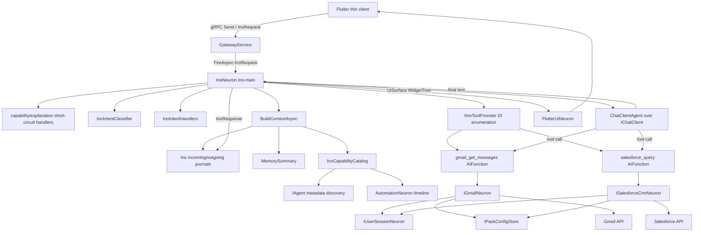
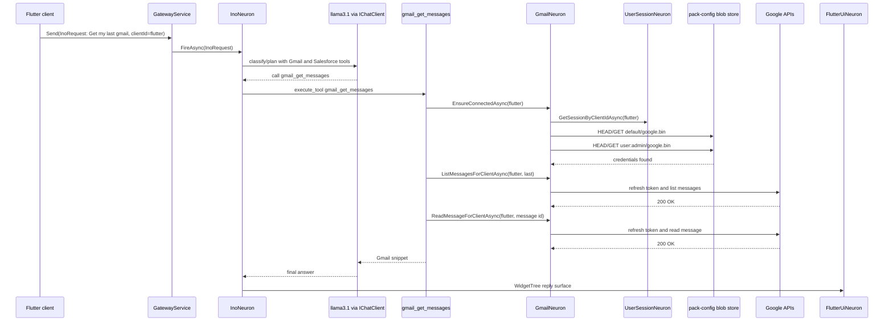

# Ino Trace, Architecture, And Rearchitecture Plan

Date: 2026-07-09

## Scope

This note records the trace investigation for `10ec0f3015d864990c089d13479771e7`, the current Ino runtime shape, the immediate groundedness fix applied from that trace, and the rearchitecture plan for making Ino a real personal assistant neuron inside DigitalBrain instead of a large chat handler with ad hoc tool wiring.

Context7 could not be used because the configured quota was exhausted. Official Microsoft Learn docs were used instead:

- https://learn.microsoft.com/dotnet/ai/microsoft-extensions-ai
- https://learn.microsoft.com/dotnet/ai/ichatclient
- https://learn.microsoft.com/agent-framework/overview/
- https://learn.microsoft.com/agent-framework/workflows/
- https://learn.microsoft.com/agent-framework/agents/tools/function-tools

## Trace Result

The trace does not show a missing Google auth prompt bug. It shows the opposite: Gmail was connected and the Gmail API call succeeded.

Evidence from the Aspire OTEL spans:

- The request was `Get my last gmail` from client id `flutter`.
- `execute_tool gmail_get_messages` was the only executed tool.
- `IGmailNeuron/EnsureConnectedAsync` ran and resolved the user session for `flutter`.
- Blob storage returned `200 OK` or `206` for both `pack-config/default/google.bin` and `pack-config/user%3Aadmin/google.bin`.
- There were no `google-oauth-pending.bin` writes in this trace.
- OAuth token refresh succeeded: `POST https://oauth2.googleapis.com/token` returned `200 OK`.
- Gmail calls succeeded: list and read calls to `https://gmail.googleapis.com/gmail/v1/users/me/messages...` returned `200 OK`.
- Salesforce was not executed. `salesforce_query` appeared in the tool definitions/context, but there was no `execute_tool salesforce_query` span.
- The trace-level error marker is explained by an optional `HEAD pack-config/system/llm.bin` returning `404 Not Found`, not by Gmail or Salesforce auth.

Conclusion:

- Google did not ask for login because `EnsureConnectedAsync` found a user-scoped Google credential and Gmail succeeded.
- Salesforce did not ask for login because the prompt was Gmail-only and the model selected only the Gmail tool.
- The user-facing problem in this trace is answer grounding: the tool returned a thin Gmail snippet and the final model inferred a human-sounding statement from it.

The exact final tool result available to the model was:

```text
Gmail: ID:19f47dc49faacb7b - Senior Software Engineer - Microsoft ...
```

The model answered:

```text
Based on the result, it appears that your last Gmail message was from a Senior Software Engineer at Microsoft...
```

That is not a labeled `From:` field. It is an inference from an unlabeled snippet.

## Immediate Fix Applied

The immediate patch is intentionally small:

- `GmailInoToolProvider` now returns labeled message facts: `MessageId:<id>; Snippet:<snippet>` instead of `ID:<id> - <snippet>`.
- Ino's tool-synthesis system message now explicitly says not to infer sender, subject, date, or account status from unlabeled snippets.
- Tests cover both the tool output shape and the grounding instruction.

This reduces the specific trace failure, but it is not the full architecture fix. The long-term fix is typed connector results plus deterministic response rendering for simple fact retrieval.

## Current Architecture

### Runtime Flow



### Trace Sequence



## Current Code Review

Findings:

- `InoNeuron` has too many responsibilities. It currently owns capability answers, explanations, intent classification, context assembly, memory summarization, model selection, tool provider enumeration, agent execution, response journaling, and UI delivery.
- Tool results are text-first. Auth gates return user-facing strings, Gmail returns text snippets, Salesforce returns text rows. That keeps the UI side effect real, but leaves final answers dependent on the model interpreting string notes correctly.
- The system already has trust labels in `InoContextPacket`, but the final model prompt still mixes user input, model-generated summaries, journals, capabilities, and current tool results as text. The trace shows stale memory/context around prior profile/Gmail conversation leaking into the prompt.
- `ResolveGlobalLlmClientAsync` is checked before `ResolveToolCapableChatClientAsync`. If a runtime LLM setting points to a model without native tools, the generic path can still try to use tools with that client.
- Comments in `InoNeuron` claim "proper Microsoft.Extensions.AI / Agent Framework usage" and "Context7 research", but the actual runtime remains a custom monolithic grain around `ChatClientAgent`. These comments should be removed or rewritten after the split.
- `AuthRequiredAIFunction` is useful as a guard, but it collapses a typed state transition into plain text. Ino should receive a typed `NeedsAuth` result and render deterministic auth feedback without asking the LLM to paraphrase it.
- Ino can discover `IAgent` metadata, but only Gmail/Salesforce are exposed as actual tools. Discovery, invocation, and permissioning are not yet one architecture.
- Memory summary generation uses the same chat path and can turn prior model inferences into future context. This should be isolated and trust-tagged as `ModelInference`, not allowed to compete with verified tool facts.

## Microsoft Docs Alignment

Microsoft.Extensions.AI should be treated as the provider-neutral model abstraction and middleware pipeline:

- Register provider clients behind `IChatClient`.
- Pass tools through `ChatOptions.Tools`.
- Prefer `ChatClientBuilder` middleware such as function invocation, telemetry, logging, and caching at registration time.
- Preserve multi-turn state by passing message history or provider conversation ids deliberately.

Microsoft Agent Framework should be used for agent/workflow orchestration, not as a label on custom chat code:

- Use agents for open-ended assistant behavior with tools.
- Use workflows for deterministic multi-step processes, checkpointing, human approval, and multi-agent handoffs.
- Keep simple deterministic operations as functions. The docs explicitly push away from using an agent when a function is enough.
- Function tools should be generated from real methods with explicit names/descriptions and typed parameters.

Practical implication for DigitalBrain:

- Keep Orleans neurons as the durable, distributed runtime.
- Put the conversational assistant loop behind a dedicated Ino agent runtime service using MEAI correctly.
- Put deterministic self-evolution, connector auth, automation creation, and multi-step connector flows into workflows or explicit Orleans command handlers.

## Target Architecture

```mermaid
flowchart TD
    InoNeuron[InoNeuron session grain] --> Runtime[IInoRuntime]
    InoNeuron --> Surface[IInoSurfaceEmitter]
    InoNeuron --> Journal[IInoJournalStore]

    Runtime --> Awareness[IBrainAwarenessService]
    Runtime --> Context[IInoContextBuilder]
    Runtime --> Agent[IInoAgentRunner]
    Runtime --> Responses[IResponseComposer]
    Runtime --> Memory[ITrustAwareMemoryService]

    Awareness --> CapabilityGraph[Capability graph: neurons, tools, automations, connectors]
    Awareness --> ConnectionState[IConnectionStateService]
    Awareness --> RecentEvents[Recent DigitalBrain events]

    Agent --> ChatPipeline[IChatClient pipeline]
    ChatPipeline --> FunctionInvocation[UseFunctionInvocation / tool middleware]
    ChatPipeline --> Telemetry[OpenTelemetry/logging]

    Agent --> ToolRegistry[IInoToolRegistry]
    ToolRegistry --> ConnectorTools[Connector tools: Gmail, Salesforce]
    ToolRegistry --> BrainTools[Brain tools: discover, explain, propose automation]
    ToolRegistry --> ApprovalTools[Approval-gated mutation tools]

    ConnectorTools --> TypedResults[ToolResult: Success | NeedsAuth | Denied | Failed]
    BrainTools --> TypedResults
    ApprovalTools --> TypedResults
    TypedResults --> Responses
    Responses --> Surface
```

Target responsibilities:

- `InoNeuron`: durable per-assistant/session grain. Receives synapses, records lineage, delegates orchestration, emits final surfaces.
- `IInoRuntime`: one request pipeline. No Orleans persistence logic inside it.
- `IBrainAwarenessService`: current capabilities, connector states, automations, visible neurons, recent health, and relevant history.
- `IInoToolRegistry`: builds tool definitions from registered connectors and DigitalBrain control tools.
- `IConnectionStateService`: one source of truth for Google/Salesforce auth state and pending auth challenges.
- `IInoAgentRunner`: MEAI/Agent Framework adapter with registered middleware and telemetry.
- `IResponseComposer`: deterministic rendering for simple connector facts and typed auth failures; LLM synthesis only when useful.
- `ITrustAwareMemoryService`: separates verified tool facts, journal facts, user claims, and model inferences.

## Execution Plan

Done in this pass:

- Committed and pushed the prior auth/model-registry work: `dde1d30 Fix Ino auth scope and model registry`.
- Re-derived trace `10ec0f3015d864990c089d13479771e7` from Aspire OTEL.
- Confirmed the trace is not a missing Google/Salesforce login flow. Gmail was connected; Salesforce was not invoked.
- Patched the trace-derived answer-grounding issue with labeled Gmail tool output and an explicit no-field-inference prompt rule.
- Added focused regression tests and ran the Google/Ino test subsets.

Phase 1: split without behavioral rewrites.

- Extract `InoContextBuilder` from `BuildContextAsync` and `InoContextPacketBuilder` use.
- Extract `InoConversationHistoryService` from `LoadConversationHistory` and memory compaction.
- Extract `InoToolRegistry` from DI enumeration of `IInoToolProvider`.
- Extract `InoAgentRunner` from `ChatClientAgent` construction and run options.
- Extract `InoSurfaceEmitter` from repeated WidgetTree surface delivery.
- Keep public synapses and Orleans grain contracts unchanged.

Phase 2: typed tool/auth results.

- Replace text-only auth failures with a typed result shape:

```text
ToolResult.Success(provider, payload, evidence)
ToolResult.NeedsAuth(provider, clientId, surfaceId, message)
ToolResult.Denied(provider, reason)
ToolResult.Failed(provider, error, retryable)
```

- Make Google/Salesforce auth prompts deterministic UI outcomes, not LLM-paraphrased strings.
- Add trace-derived tests:
  - Gmail connected does not request Google auth.
  - Gmail disconnected requests Google auth.
  - Salesforce request disconnected requests Salesforce auth.
  - Gmail-only request never requests Salesforce auth.
  - Connected Gmail answer presents labeled fields or quoted snippet only.

Phase 3: MEAI cleanup.

- Build tool-capable chat clients with `ChatClientBuilder` middleware at registration.
- Ensure generic tool paths never prefer a non-tool-capable global model over a tool-capable registered model.
- Remove stale Agent Framework comments until the runtime actually uses the framework boundary.
- Centralize model selection policy: fast/balanced/reasoning plus "requires tools" as a first-class constraint.

Phase 4: brain-aware Ino.

- Add read-only brain tools:
  - list available neurons and capabilities
  - explain a recent action by correlation id
  - list connector states
  - list active automations and pending proposals
  - inspect recent DigitalBrain events
- Add proposal-only mutation tools:
  - propose automation
  - propose new neuron
  - propose synapse wiring
  - propose connector setup
- Keep actual mutations behind `SelfEvolutionProposal` and explicit approval.

Phase 5: Agent Framework/workflows.

- Model Ino as an open-ended assistant agent only after the runtime boundaries above exist.
- Use workflows for self-evolution proposals, connector onboarding, multi-step CRM/email tasks, and approval/checkpoint flows.
- Keep one-step connector reads/writes as plain tools/functions.

Phase 6: trash removal.

- Remove comments that mention Context7 or Agent Framework as if the current code already implements the target architecture.
- Delete duplicated `FlattenText` helpers in tests when shared helpers are available.
- Remove old "special path deleted" comments after the split creates clear test names.
- Replace broad catch blocks that silently hide context-builder failures with logged, trust-tagged omissions.
- Move remaining model and provider wiring notes into docs or type-level names instead of long inline comments.

## Acceptance Criteria

- `InoNeuron` is a thin grain and no longer owns the entire assistant runtime.
- Gmail/Salesforce auth state is deterministic, typed, and tested independent of model wording.
- Tool calls return structured facts; final text is not allowed to invent fields.
- Ino can describe DigitalBrain's live capabilities and connector states from the system, not from stale memory.
- Ino can propose new automations/neuron/synapse changes but cannot apply them without approval.
- Tool-capable model selection is enforced by code and tests.
- The long-standing Salesforce chat identity regression remains green as part of the same identity-resolution path.
