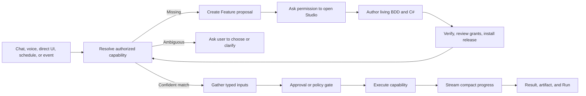

# DigitalBrain Capability OS — Product and Flutter UX Design

Date: 2026-07-14

Status: approved section-by-section; assembled for final document review

Complements: `2026-07-13-digitalbrain-programmable-features-design-v3.md`

## 1. Product decision

DigitalBrain is a capability operating system. It lets a person ask for work through Chat or voice, discover what the system can honestly do, execute trusted capabilities, and teach the system a missing capability without changing hardcoded product code.

The product has two complementary surfaces:

- **Chat and voice** are the universal interaction surface for requesting work.
- **Feature Studio** is the controlled programming surface for creating or modifying capabilities that DigitalBrain does not yet have.

Installed Features join built-in and Connector-provided capabilities in one searchable catalog. Chat can discover and invoke all three. The user does not need to remember which subsystem owns an ability.

This design rejects a chatbot with hidden tools, a separate low-code workflow product, and a static Flutter client with hardcoded feature screens. The system must expose capability identity, authority, progress, and outcomes while keeping implementation details available only when useful.

## 2. Product promise

The user should be able to say or type an outcome such as:

> Research Acme Corporation and create a text file with the findings.

DigitalBrain then does one of three honest things:

1. resolves an authorized capability, gathers missing inputs, obtains any required approval, and executes it;
2. presents a small set of genuinely ambiguous capability matches and asks the user to choose;
3. explains that the capability is missing, creates a Feature proposal, and asks permission to open Studio.

DigitalBrain never pretends an unsupported request is executable, silently creates or installs code, or hides which capability and authority produced an effect.

## 3. User-facing product model

| Object | User meaning |
|---|---|
| Capability | Something DigitalBrain can currently do. |
| Connector | A connection that supplies data access or operations. |
| Feature | A user-visible, programmable capability with living behavior documentation. |
| Proposal | A draft change requiring review before it becomes active. |
| Trigger Binding | An explicit rule that invokes a Feature from a schedule or Connector event. |
| Run | The traceable execution record for one invocation. |
| Memory Item | Trusted reusable knowledge governed independently from conversation history. |

These are the only primary product concepts. Orleans grains, vectors, embeddings, handlers, release load contexts, and capability dispatch envelopes remain implementation concepts.

## 4. Capability discovery and system self-awareness

DigitalBrain maintains one capability index containing:

- built-in platform capabilities;
- capabilities supplied by healthy, authorized Connectors;
- active releases of installed Features.

Each indexed capability contains stable identity, version, natural-language purpose, examples, typed inputs and outputs, required grants, Connector dependencies, risk classification, current availability, and the owning Feature or Integration.

Resolution is hybrid rather than model-only:

1. structured filters remove unavailable, unauthorized, incompatible, or unhealthy candidates;
2. exact identifiers and aliases handle deterministic matches;
3. vector and semantic retrieval find capabilities from natural-language intent;
4. a bounded model step may rank the remaining candidates and map supplied values to typed inputs;
5. confidence and ambiguity thresholds decide whether to execute, clarify, or propose a Feature.

The model does not invent the capability catalog and cannot bypass authorization. Vector search improves discovery; it is not the source of truth for permissions or availability.

Capability retrieval is distinct from trusted Memory retrieval. Capability search answers “what can DigitalBrain do?” Memory answers “what approved context may this work use?” Conversation history is neither.

## 5. End-to-end operating model

### 5.1 Ask and execute

Chat or voice receives an outcome request. Resolution produces a visible but quiet capability chip. DigitalBrain asks only for missing typed inputs, renders consequential approvals inline, executes through the retained authority rail, shows progress, and returns the result and artifacts with a link to the complete Run.

### 5.2 Create a missing capability

When no safe match exists, Chat creates a Feature proposal containing the understood goal, expected inputs and outputs, suggested Connectors, and initial scenarios. It asks permission before opening Studio. The original request remains attached to the proposal, so successful installation returns the user to the unfinished task instead of ending at “Feature created.”

### 5.3 Invoke an installed Feature

One installed Feature may be invoked through:

- Chat or voice;
- its direct generated UI;
- an explicitly configured schedule;
- an explicitly configured Connector event.

All routes resolve to the same Feature release and create the same Run model. Trigger bindings are configuration, not hidden code, and can be inspected, paused, or removed independently.

### 5.4 Modify a Feature

Modification creates a draft from an active immutable release. Studio shows behavior and source diffs, verifies every scenario, and requires review of changed grants and trigger implications. Installation activates a new release for future work. Previous compatible releases remain available for rollback.

### 5.5 Promote trusted Memory

Chat may suggest a Memory Item but cannot silently create one. The user approves its text, provenance, scope, and retention. Later Runs disclose when the item was used. Conflicts are shown for resolution rather than silently merged.

## 6. Flutter information architecture

The Flutter app uses a persistent left rail and one focused canvas. Each area owns the full workspace rather than nesting several competing dashboards.

| Area | Primary responsibility |
|---|---|
| Home | Operational Today view for decisions, active work, outcomes, and upcoming triggers. |
| Chat | Universal text and voice interaction, capability discovery, execution, and results. |
| Features | Capability catalog, Feature details, Studio, releases, and trigger bindings. |
| Connectors | Connection health, permissions, supplied capabilities, and dependencies. |
| Runs | Unified execution journal across every invocation route. |
| Memory | Trusted reusable knowledge and its governance. |

“INO” may remain an internal implementation name but is not a separate user-facing navigation area.

## 7. Global command and conversation layer

A compact text and voice command remains available throughout Home, Features, Connectors, Runs, and Memory. It operates in the current workspace context.

Submitting a command expands an anchored conversation and progress layer instead of immediately navigating away. The layer can:

- show the resolved capability;
- gather one or more missing inputs;
- request approval;
- stream steps and outcomes;
- present artifacts and recovery actions.

Simple work completes within the layer. Multi-step or conversation-heavy work can expand into full Chat without losing the originating page, selected object, conversation, or Run context. Full Chat owns its own composer, so the global command is hidden there.

Studio is the exception: its assistant is contextual and remains beside the living document. Studio conversation changes the draft currently visible in the canvas; it is not a second unrelated chat session.

## 8. Screen behavior

### 8.1 Home — operational Today

Home is exception-first and ordered by actionability:

1. **Needs attention** — approvals, failed Runs, blocked work, unhealthy dependencies.
2. **Active now** — current work with compact live progress.
3. **Completed today** — outcomes and generated artifacts, not raw event logs.
4. **Upcoming** — scheduled work and active event bindings.
5. **Suggestions** — relevant Features, missing capabilities, or Connector remediation.

Routine historical activity belongs in Runs. Home is not a customizable analytics dashboard or an infinite assistant feed.

### 8.2 Chat

Text and voice share one composer. Each request shows a subtle capability chip by default; details expand for ambiguity, permission decisions, or failures. Missing typed inputs appear as inline forms. Consequential effects appear as approval cards. Live progress expands during execution and collapses into a result card containing outputs, artifacts, and the complete Run link.

Unsupported requests produce Feature proposals. Chat history remains separate from trusted Memory.

### 8.3 Features and Studio

Features opens as a searchable catalog of installed, draft, and proposed capabilities. Cards show purpose, health, active release, trigger summary, required Connectors, and recent Runs.

Studio is a workbench with:

- the directly editable living BDD document in the main canvas;
- a contextual assistant beside it;
- an advanced technical drawer exposing the single C# implementation file, interfaces, diagnostics, and diffs;
- scenario-to-test verification status;
- separate trigger binding configuration;
- release, grant, installation, and rollback controls.

Drafts save continuously. **Verify** and **Install release** remain explicit actions. Installation includes an exact review of source digest, grants, Connector selections, and trigger bindings.

The living document uses plain English behavior as executable documentation. Under it, the C# script operates only approved DigitalBrain and Integration interfaces exposed through the Orleans-backed capability boundary.

### 8.4 Connectors

Connectors are organized by health and capability rather than vendor category. Cards show connection health, granted permissions, and recent activity. Details show supplied capabilities, dependent Features, and dependent trigger bindings.

Setup guides authentication and runs a capability test. Permission changes explain downstream impact before confirmation. Failures offer reconnect, inspect affected Runs, or pause dependent bindings. Connector pages do not become workflow builders.

### 8.5 Runs

Runs is one execution journal for Chat, direct UI, schedules, and Connector events. The default emphasizes running, blocked, and failed work.

A Run exposes initiating trigger, matched capability, inputs, approvals, plain-language progress, outputs, artifacts, errors, and correlation data. Technical traces are available on demand. Recovery actions include retry, modify inputs, open the Feature, inspect the Connector, or pause the binding.

Every Run is addressable and reproducible, but retrying a consequential operation requires fresh approval unless an explicit policy still authorizes the exact operation shape.

### 8.6 Memory

Memory contains only approved facts, preferences, policies, and reusable context. Each item shows provenance, owner, confidence, scope, retention, and last use.

Users may add an item directly or approve a Chat suggestion. They can edit, expire, export, or delete it. Conflicts require resolution. New items default to the narrowest useful Feature or workspace scope and require explicit promotion to broader scopes. A usage trail identifies the Runs that consumed an item.

## 9. Dynamic and server-driven Flutter behavior

Flutter owns the stable shell, navigation, accessibility, responsive layout, trusted approval patterns, progress patterns, and core object views. The backend supplies dynamic capability metadata and safe surface descriptions for Feature-specific forms and results.

This boundary prevents two failure modes:

- every new Feature requiring a Flutter release;
- untrusted Feature code controlling global navigation, approval language, or security-critical UI.

Feature-defined UI is constrained to typed inputs, readable outputs, artifacts, status, and safe interaction components. The platform owns effect approvals, grants, release installation, Connector authentication, and Memory governance.

The existing runtime shell and server-driven `SurfaceView` path should converge on this model rather than growing a second hardcoded feature UI. The Flutter redesign is therefore a shell and design-system evolution around dynamic capabilities, not a replacement for dynamic rendering.

## 10. Trust and failure rules

1. Capability honesty: only currently available and authorized capabilities may appear executable.
2. No silent creation: Feature drafting, Studio entry, verification, and installation are distinct visible steps.
3. Explicit effects: consequential operations require approval or visible governing policy.
4. Immutable releases: installed code is content-addressed, reviewable, and rollback-capable.
5. Complete traceability: every invocation route creates a Run.
6. Visible triggers: schedules and event bindings are inspectable and pausable.
7. Memory boundary: conversation history never silently becomes trusted Memory.
8. Ambiguity is surfaced: uncertain resolution asks instead of choosing silently.
9. Recoverable failure: failure views explain what stopped, what was affected, and the available safe next actions.
10. Progressive disclosure: implementation detail is available without dominating routine use.

## 11. Product scope

### Included

- operational Home;
- Chat with text and push-to-talk voice input;
- hybrid capability discovery using exact, structured, semantic, and vector retrieval;
- Feature catalog and conversational Studio;
- living BDD plus one inspectable C# implementation file;
- direct UI, Chat/voice, schedule, and Connector-event invocation;
- Connectors, Runs, and governed Memory;
- one shared effect and approval rail;
- compact contextual conversation and progress layer.

### Excluded

- a separate user-facing INO area;
- visual node workflow builders;
- agent personas as a primary product concept;
- autonomous Feature installation;
- a Feature marketplace;
- customizable dashboard construction;
- raw vector, Orleans, or grain administration UI;
- automatic conversation-to-Memory ingestion;
- full-duplex continuous voice mode;
- a separate automations product.

## 12. Acceptance criteria

The product and Flutter redesign are successful when:

1. a user can request an installed Feature from Chat without knowing its name;
2. capability resolution never bypasses availability, grants, or risk checks;
3. an unsupported company-research request can become a proposal, be authored and verified in Studio, installed, indexed, and then complete the original request;
4. the same Feature can be invoked through Chat, direct UI, schedule, or Connector event and always creates the same Run model;
5. adding or updating a Feature does not require a Flutter release;
6. the global command completes simple work in context and expands complex work into Chat without losing context;
7. every consequential effect, installed release, trigger binding, and trusted Memory Item has explicit user-visible authority;
8. Home lets a user understand what needs attention, what is active, what completed, and what will run next without opening a raw activity log;
9. technical detail remains inspectable from Studio and Runs without becoming the default product language;
10. the Flutter shell and server-driven Feature surfaces feel like one coherent application rather than separate chat, workflow, and administration products.

## 13. Relationship to the backend architecture

The programmable-features v3 architecture remains authoritative for Integration packaging, FeatureBuilder, immutable releases, FeatureHost, Orleans ownership, grants, durable processing, and the retained effect rail.

This document adds the product contract those mechanisms must serve:

- the capability catalog is the bridge between runtime architecture and user intent;
- Feature proposals and releases are surfaced through one controlled Studio flow;
- Trigger Bindings and Runs make dynamic execution operationally understandable;
- trusted Memory is governed separately from Chat and capability retrieval;
- Flutter supplies a stable trusted shell while rendering Feature-specific inputs and outcomes dynamically.

Implementation planning must preserve both documents. Where terminology differs, the user-facing vocabulary in this document applies to Flutter and product copy; the runtime vocabulary in v3 applies inside the backend.
