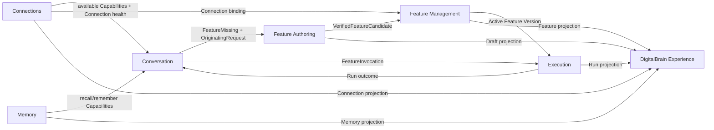

# DigitalBrain Ubiquitous Language and Domain Boundaries

**Status:** Approved product-language refinement for the DigitalBrain redesign.

**Purpose:** Give product, Flutter, backend, tests, logs, and documentation one precise language. The same term must mean the same thing everywhere. User-facing copy may use a friendlier label, but it must map to exactly one domain concept.

## Domain Story

A person gives DigitalBrain a **Request** in **Chat**.

DigitalBrain resolves the Request to an available **Feature**. If the Feature exists, DigitalBrain starts a **Run** and shows it in **Activity**. If no Feature can safely fulfill the Request, DigitalBrain creates a **Feature Draft** linked to the **Originating Request**.

In **Feature Studio**, the person defines the Feature's **Behavior**, reviews **Suggested Changes**, inspects **Code & Changes**, and runs **Verification**. Successful Verification produces an immutable **Feature Version**. Before installation, the person completes an **Access Review** covering the exact **Capabilities**, **Connections**, constraints, and **Automations** required by that Version. DigitalBrain then installs the Version and returns to the Originating Request. The person explicitly chooses **Run now**.

Every execution is a durable Run. A Run records its origin, Feature Version, authority, progress, outcome, and safe failure. Runs appear to the person as Activity.

## Language Rules

1. One term represents one concept. Do not use synonyms inside code for variety.
2. A user-facing label can differ from a backend term only through an explicit mapping in this document.
3. Commands use intent-revealing verbs. Avoid generic `Update`, `Set`, `Handle`, or `Process` when the actual intent is known.
4. Queries never mutate domain state.
5. Transport DTOs, domain models, persistence models, and Flutter view models are separate types when their responsibilities differ.
6. Existing serialized aliases and public routes remain compatible during renames.
7. Domain events describe facts that already happened. Commands request change.
8. DDD does not require event sourcing, generic repositories, one project per context, or wrappers around stable platform APIs.

## Ubiquitous Language

| Term | Precise meaning | Not this | Primary code name | Flutter language |
|---|---|---|---|---|
| DigitalBrain | The product experienced by the person. | An operating system, assistant persona, or workspace container. | Application composition | DigitalBrain |
| Owner Scope | The hard authorization and persistence boundary for one DigitalBrain owner. | A visible Workspace unless multi-workspace behavior is actually implemented. | `BrainOwnerId` | Normally invisible; “your DigitalBrain” when needed |
| Actor | The authenticated person or service acting inside an Owner Scope. | The owner, a Feature, or a Connector. | `ActorId` | Account/person language only when necessary |
| Conversation | An ordered exchange that gives Requests their context. | The whole application or an execution log. | `ConversationIdentity`, `ConversationState` | Chat |
| Request | One user expression asking DigitalBrain for an outcome. | A gRPC request, HTTP request, Feature input, or assistant message. | `UserRequest` or existing conversation command type | Request |
| Originating Request | The Request that caused a Feature Draft to be created. It remains attached until the work is completed or abandoned. | A copied prompt with no Conversation identity. | `OriginatingRequest` value object | Original request |
| Capability | One executable primitive supplied by the platform, a Connector, or an installed Feature. | A Feature, screen, permission, or marketing claim. | `CapabilityDescriptor` | Usually hidden; “ability” only in explanatory copy |
| Capability Resolution | Selecting zero, one, or several safe candidate Capabilities for a Request. | Parameter extraction or execution. | `CapabilityResolution` | Invisible; shown through clear Chat outcomes |
| Feature | A named, user-meaningful ability DigitalBrain can install and invoke. | A Capability primitive, UI component, experiment flag, or proposal. | `Feature` | Feature |
| Feature Draft | Mutable authoring state for a Feature before a Version is installed. | A separate permanent Proposal product. | `FeatureDraft` | Draft |
| Behavior | The human-readable contract describing what a Feature should do. | Source code or a generic description. | `FeatureBehavior` | Behavior |
| Scenario | One concrete example in a Feature's Behavior with preconditions, action, and expected outcome. | A test result or Run. | `FeatureScenario` | Scenario |
| Suggested Change | A proposed replacement or patch to the current Feature Draft. It never applies itself. | A chat reply, direct mutation, or source diff without a base revision. | `FeatureDraftPatch` | Suggested changes |
| Source Snapshot | The complete bounded set of source files for one Feature Draft revision. | A repository checkout, mutable directory, or installed artifact. | `FeatureSourceSnapshot` | Code |
| Draft Revision | Monotonic concurrency token for a Feature Draft. | Feature Version or Run attempt. | `FeatureDraftRevision` or `long Revision` | Save/conflict state; number only under details |
| Verification | Building one Source Snapshot and executing its Behavior scenarios under bounded conditions. | Installation, approval, or a superficial syntax check. | `FeatureVerification` | Test results / Run tests |
| Verified Candidate | The exact immutable build output produced by successful Verification and awaiting Access Review. | An installed Version or mutable draft. | `VerifiedFeatureCandidate` | Version ready to install |
| Feature Version | Immutable executable Feature artifact identified by an exact digest. | Draft Revision, application release, or mutable source. | `FeatureReleaseMetadata`, `ReleaseDigest` | Version; exact digest under technical details |
| Installation | Owner-scoped binding of a Feature identity to its active Version, access, Connections, and Automations. | The Feature itself or a build artifact. | `FeatureInstallation` | Installed Feature |
| Connector | A provider adapter or integration type capable of creating Connections and supplying Capabilities. | An owner's authenticated account. | `IConnector`, connector descriptor | Provider name only where useful |
| Connection | One owner's configured and authorized instance of a Connector. | Connector type, OAuth token, or raw credential. | `ProviderConnectionId`, connection projection | Connection |
| Access Requirement | A Capability, Connection, and constraint required by a Feature Version. | Granted authority. | `FeatureGrantSpec` before approval | Requested access |
| Grant | Durable authority allowing one exact Feature Version to call one Capability through an optional Connection under constraints. | Role, OAuth token, blanket permission, or UI checkbox. | `FeatureGrantSnapshot` | Access; exact grant under technical details |
| Access Review | The user's review and decision over the complete exact Access Requirement set for one Verified Candidate. | Installation itself or generic confirmation. | Application command around approval/grant lifecycle | Review access |
| Automation | A schedule or event subscription that invokes a Feature. It belongs to that Feature. | A top-level automation product or background Run. | `FeatureAutomation`, schedule/event binding | Automation |
| Invocation | A request to start one Feature using explicit input and origin. | The running execution or its result. | `FeatureInvocation` | Usually expressed as Run now/use Feature |
| Run | One durable execution of one Feature Version caused by one Invocation. | Conversation, Feature, automation definition, or feed event. | `FeatureRunSnapshot` | Activity item; Run under technical details |
| Run Origin | How the Run began: Chat, Direct, Schedule, or Event. | Capability origin. | `FeatureRunOrigin` | Started from… |
| Run Attempt | One fenced execution attempt inside a Run. | A separate Run or user retry. | Existing lease/attempt fields | Attempt under technical details |
| Outcome | The completed safe result or safe failure of a Run. | A transient progress update. | Run completion/result projection | Result |
| Activity | User-facing projection of Runs and decisions needing attention. | Raw logs, audit stream, or infinite assistant feed. | Activity query/read model | Activity |
| Effect | A proposed observable external change such as sending email or updating Salesforce. | Query, Memory read, or internal progress. | `FeatureIntentKind.ExternalEffect`, effect plan | Action requiring approval |
| Effect Approval | Exact user decision allowing one signed immutable Effect. | Feature Access Review or blanket future permission. | Existing approval/effect contracts | Approve action |
| Memory Item | Governed retained knowledge with source, authority, revision, and lifecycle. | Conversation history, model context window, or cache entry. | Memory fact/snapshot contracts | Memory item |
| Home Summary | Exception-first projection of decisions, active work, outcomes, failures, and upcoming Automations. | Analytics dashboard or raw Activity list. | `HomeSummary` | Home |

## Bounded Contexts

### Conversation

**Purpose:** Preserve conversational context, accept Requests, and present resolution/execution outcomes.

**Aggregate:** `Conversation`.

**Owns:** Conversation identity, turns, Requests, approval prompts, operation state, and the link to an Originating Request.

**Does not own:** Feature authoring, Feature installation, Connection credentials, Run execution, or Memory governance.

**Commands:**

- `SubmitRequest`
- `ChooseCapability`
- `ResumeOriginatingRequest`
- `DecideEffectApproval`

**Events:**

- `RequestSubmitted`
- `CapabilityMatched`
- `FeatureMissing`
- `OriginatingRequestResumed`

### Feature Authoring

**Purpose:** Turn a missing or changing ability into a verified immutable candidate.

**Aggregate:** `FeatureDraft`.

**Entities/value objects:** `FeatureBehavior`, `FeatureScenario`, `FeatureSourceSnapshot`, `FeatureDraftRevision`, `FeatureDraftPatch`, `FeatureVerification`, `VerifiedFeatureCandidate`.

**Commands:**

- `CreateFeatureDraft`
- `ReviseFeatureBehavior`
- `ReviseFeatureSource`
- `SuggestFeatureChange`
- `AcceptSuggestedChange`
- `RejectSuggestedChange`
- `VerifyFeatureDraft`
- `AbandonFeatureDraft`

**Events:**

- `FeatureDraftCreated`
- `FeatureDraftRevised`
- `SuggestedChangeAccepted`
- `FeatureDraftVerified`
- `FeatureVerificationFailed`

**Invariants:**

- Every Draft belongs to one Owner Scope and one Originating Request.
- Every revision change is optimistic and idempotent.
- Suggested Changes reference an exact base Draft Revision.
- Any accepted Behavior or Source change invalidates prior Verification.
- A Verified Candidate references the exact Source Snapshot digest it verified.

### Feature Management

**Purpose:** Govern installed Features, immutable Versions, Access, Connections, Automations, pause/resume, update, and rollback.

**Aggregates:** Owner-scoped Feature catalog (`FeatureHubGrain` persistence boundary) and `FeatureInstallation`.

**Commands:**

- `ReviewFeatureAccess`
- `InstallFeatureVersion`
- `PauseFeature`
- `ResumeFeature`
- `RollbackFeatureVersion`
- `BindFeatureConnection`
- `CreateFeatureAutomation`
- `ChangeFeatureAutomation`
- `RemoveFeatureAutomation`

**Events:**

- `FeatureVersionInstalled`
- `FeaturePaused`
- `FeatureResumed`
- `FeatureVersionRolledBack`
- `FeatureAutomationCreated`

**Invariants:**

- Versions are immutable.
- Access Review, Grants, Connection bindings, and Installation reference one exact Version digest.
- Only an approved Verified Candidate can become active.
- The previous Version remains identifiable for rollback.
- Pause, revocation, and Connection loss affect the next Capability operation.

### Execution

**Purpose:** Invoke installed Features and project durable Runs consistently across all origins.

**Aggregate:** Existing `FeatureInstallation` execution state; `Run` is its stable domain projection.

**Commands:**

- `StartFeatureRun`
- `ClaimRunAttempt`
- `CommitRunOutcome`
- `ApproveRunEffect`
- `RetryParkedRun`

**Events:**

- `FeatureRunStarted`
- `FeatureRunWaitingForApproval`
- `FeatureRunCompleted`
- `FeatureRunFailed`
- `FeatureRunParked`

**Invariants:**

- Every Run binds one Feature Version and one Run Origin.
- Chat, Direct, Schedule, and Event use the same Run identity and projection.
- Fenced attempts cannot commit after losing their lease.
- External Effects require exact signed approval before application.
- Historical Runs never change Version identity after Feature update or rollback.

### Connections

**Purpose:** Manage provider integration types and owner-authorized instances without exposing credentials.

**Aggregate:** `Connection`.

**Commands:**

- `CreateConnection`
- `CompleteConnectionAuthorization`
- `TestConnection`
- `ReconnectConnection`
- `RevokeConnection`

**Events:**

- `ConnectionCreated`
- `ConnectionAuthorized`
- `ConnectionHealthChanged`
- `ConnectionRevoked`

**Invariants:**

- Credentials remain inside the integration boundary.
- Flutter receives health, labels, permissions, dependencies, and actions, never tokens or secrets.
- A revoked or unhealthy Connection cannot satisfy Capability availability.

### Memory

**Purpose:** Govern retained knowledge independently of conversation history and model context.

**Aggregate:** `MemoryItem` or the existing owner-scoped Memory persistence boundary.

**Commands:**

- `RememberMemoryItem`
- `CorrectMemoryItem`
- `ForgetMemoryItem`
- `ExportMemory`

**Events:**

- `MemoryItemRemembered`
- `MemoryItemCorrected`
- `MemoryItemForgotten`

**Invariants:**

- Memory mutations are owner-scoped and revision/ETag protected.
- Source and authority remain inspectable.
- Forget removes the governed item from subsequent recall.

### DigitalBrain Experience

**Purpose:** Compose trusted Flutter navigation and read models without becoming a domain owner.

**Owns:** DigitalBrain shell, routes, presentation state, view models, accessibility, responsive layout, and user-facing terminology.

**Does not own:** Domain authority, persistence, source verification, execution, Connection credentials, or effect application.

Home, Features, Connections, Activity, and Memory are projections from the bounded contexts above. Chat and Feature Studio send explicit commands through typed application services.

## Context Map

Dependencies cross contexts through contracts, commands, and projections. Flutter does not reach directly into grain state. Feature Authoring does not mutate Feature Management except through installation commands. Execution does not grant itself authority.

## Layering and Code Placement

### Domain

Contains domain types, invariants, and pure transitions. Domain code does not depend on gRPC, Flutter, HTTP, Azure SDKs, provider SDKs, or UI copy.

Current homes include:

- `DigitalBrain.Kernel.Contracts`
- `DigitalBrain.Kernel/Features`
- `DigitalBrain.Kernel/Capabilities`
- existing Memory and Conversation domain transitions

### Application

Coordinates domain operations and authorization context. Application services use intent-specific names:

- `FeatureAuthoringService`
- `FeatureSuggestionService`
- `DigitalBrainQueryService`
- `FeatureCapabilityInvoker`

Application services do not contain Flutter layout logic or provider credentials.

### Infrastructure

Implements persistence, process isolation, provider integration, release publication, gRPC transport, and Aspire composition:

- Orleans grains/storage
- FeatureBuilder
- FeatureHost
- Connector implementations
- blob/table/Redis clients
- `DigitalBrainUiEndpoints`

### Presentation

Flutter maps transport DTOs into presentation models and uses the user-facing language in this document. Backend surfaces render only Feature-specific content inside the trusted DigitalBrain shell.

## Command and Query Naming

Use intent-specific commands:

- `ReviseFeatureBehavior`, not `UpdateDraft`
- `AcceptSuggestedChange`, not `ApplyPatch`
- `VerifyFeatureDraft`, not `ProcessBuild`
- `InstallFeatureVersion`, not `UpdateFeature`
- `ResumeOriginatingRequest`, not `Continue`
- `StartFeatureRun`, not `Execute`
- `CorrectMemoryItem`, not `SetMemory`
- `RevokeConnection`, not `DeleteConnector`

Use object-specific queries:

- `GetFeatureDraft`
- `ListFeatures`
- `GetFeature`
- `ListConnections`
- `GetConnection`
- `ListActivity`
- `GetRun`
- `ListMemoryItems`
- `GetMemoryItem`
- `GetHomeSummary`

## Compatibility and Migration Rules

- Replace the domain name `FeatureDraftProposal` with `FeatureDraft`. Preserve the existing Orleans alias during migration.
- Keep `/features/proposals/:proposalId` as a compatibility route until stored Chat links expire or migrate. Flutter labels the object Draft, not Proposal.
- Keep `FeatureLifecycleRail` only as a legacy internal adapter if changing it would create unrelated risk. New application code uses responsibility-specific service names.
- Keep existing serialized field IDs and add new fields with new IDs.
- Keep `InoConversation*` internal types behind translation where immediate renaming would break persistence; Flutter and new public contracts use Conversation and Chat.
- Do not add a visible Workspace concept until the domain supports multiple user-selectable workspaces with real isolation and navigation behavior.

## Tests as Domain Examples

Domain tests use the ubiquitous language in names and assertions:

- `Revising_behavior_invalidates_the_verified_candidate`
- `A_suggested_change_cannot_target_an_old_draft_revision`
- `Installing_a_version_requires_its_exact_reviewed_access`
- `A_revoked_connection_is_unavailable_to_the_next_run`
- `Chat_and_schedule_runs_share_the_same_activity_projection`
- `Returning_from_studio_resumes_the_originating_request`

Avoid test names built only from method names or transport details when the behavior is a domain rule.

## Non-Goals

- No event-sourcing rewrite.
- No generic `IRepository<T>` abstraction over Orleans grains.
- No one-project-per-bounded-context mandate.
- No public microservice split merely to mirror context boundaries.
- No user-visible technical vocabulary when plain product language is more accurate.
- No renaming campaign disconnected from the implementation path.
