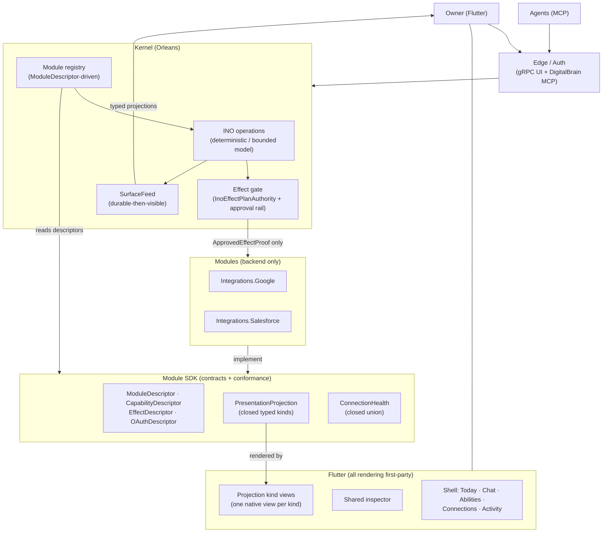
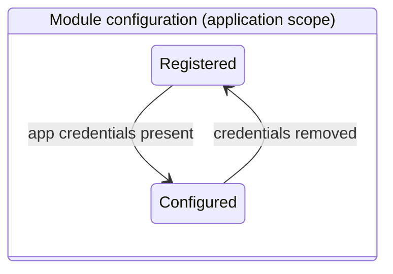
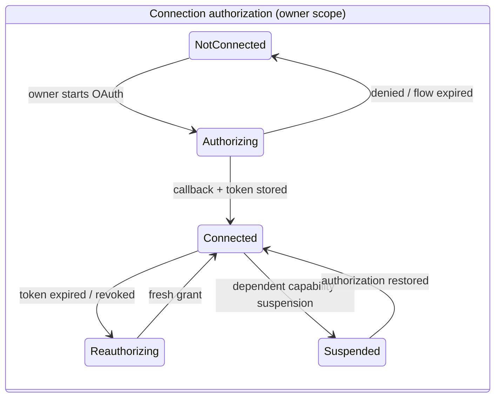
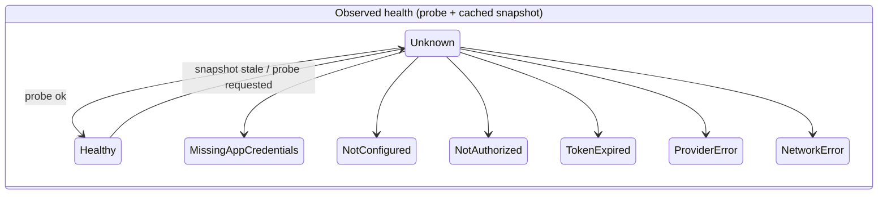

# DigitalBrain — Attention-First Workspace and Module SDK

**Status:** approved design
**Date:** 2026-07-16
**Supersedes:** the product-surface portions of prior UI plans; complements `EVERYTHING-IS-A-NEURON.md` (the ontology remains the engineering foundation this design renders).

## 1. Product thesis

DigitalBrain is one brain you share with your agents. It works for you, it never touches the outside world without your sign-off, and it can always account for itself.

The Neuron ontology is **felt, not taught**: no user-facing "Neuron" vocabulary. Its user-visible payoff is that every object — a chat, a run, an approval, a connection, an ability — is uniformly addressable, linkable, and explainable, with provenance, dependencies, and governance always one hop away through one shared inspector.

Users learn five plain concepts:

| User concept | Experience | Underlying ontology |
|---|---|---|
| Work | What the brain is doing or has done | Operation/Run Neurons |
| Approvals | Outside changes waiting for a yes | Effect + Decision Neurons |
| Abilities | What the brain can do (installed modules and authored features, one catalog) | Feature/Module Neurons |
| Connections | What the brain can reach, with health and permissions | Connection Neurons |
| The explanation | Any object answers what/why/depends-on/may-do | Shared inspector over describe/read + Synapses |

Three actors share one brain: the owner (reviews, approves, commands), agents (enter through MCP, address the same objects), and module developers (extend abilities through the SDK, arriving via the human-approval rail like every other mutation).

## 2. Primary user journeys

1. **Morning review.** Open Today: two approvals pending, one run failed, Salesforce token expiring. Approve, retry, and reauthorize without leaving context. Empty state: "Nothing needs you."
2. **Command.** Ask the brain to do something (composer, anywhere). It works, proposes an effect, the owner approves, the verified outcome lands in Activity with full provenance.
3. **Gain an ability.** Install from the catalog → grant prompts explaining why each permission is needed → connection authorization → healthy; dependent abilities light up.
4. **Diagnose.** A connection degrades; the typed health state names exactly what broke and offers the one matching fix action.
5. **Extend.** A developer ships a module against the SDK; it appears in the catalog only after rail approval. An owner authors a feature in Studio; it arrives through the same rail.

## 3. Information architecture

Persistent shell with four zones on every screen:

```text
┌──────┬──────────────────────────────┬─────────────┐
│ Nav  │      Working surface         │  Inspector  │
│      │                              │ (contextual)│
│      ├──────────────────────────────┴─────────────┤
│      │  Composer (command / chat, summonable)     │
└──────┴────────────────────────────────────────────┘
```

Five destinations:

1. **Today** (home) — attention inbox ordered: pending approvals, failing/running work, connection problems. Badge count on the nav item.
2. **Chat** — full conversation destination; also summonable as an overlay everywhere (Cmd/Ctrl+K).
3. **Abilities** — merged catalog of installed modules and Studio features. Studio is a deep route (`/abilities/:id/studio`), not a destination.
4. **Connections** — module connection roster rendered from typed projections.
5. **Activity** — the complete audit trail. Today shows what needs attention; Activity shows everything.

**Routes are Neuron addresses.** `/activity/:runId`, `/connections/google-primary`, `/abilities/inbox-triage` — the router resolves address → projection; navigation is addressing.

**Shared inspector** — the felt-unification mechanism. Selecting any object opens the same panel with four fixed sections:

- **Status** — the object's typed state
- **Caused by / Led to** — provenance links, each a navigable address
- **Depends on** — connections and grants, health inline
- **Actions** — revision-bound actions from the object's ActionSet

**Responsive:** desktop = all four zones; tablet = inspector as overlay sheet; compact = bottom bar with Today as root tab, inspector as full-screen push. Full keyboard traversal, Cmd+K composer, `g`-prefixed navigation chords.

## 4. Architecture diagram



Retained execution path is unchanged: `Client → Edge/Auth → INO operation → deterministic function or bounded model workflow → effect gate → connector adapter`.

## 5. Module architecture

### 5.1 Package and dependency boundaries

```text
modules/DigitalBrain.Modules.Sdk               contracts, closed unions, conformance tests
integrations/DigitalBrain.Integrations.Google  implements SDK; backend only
integrations/DigitalBrain.Integrations.Salesforce
app/packages/module_views_google/              optional first-party Flutter views, keyed by module id
app/packages/module_views_salesforce/
```

Dependency rules:

- Integration packages depend on the SDK and provider client libraries. Never on Flutter, MCP, or the kernel runtime.
- The kernel depends on the SDK to read descriptors and enforce scope/health/effect rules. Never on a concrete integration (only `DigitalBrain.RuntimeHost` composes concretes).
- Flutter depends on typed projections over the wire. Provider strings never appear in Flutter source; icons, names, and capabilities flow from descriptors.
- Third-party modules ship **declarative projections only**. No module ships executable UI. First-party specialized Flutter views may arrange and extend, but must render health, configuration, and capability data through the shared kind views.

### 5.2 The contract (spine; names final, shapes illustrative)

```csharp
ModuleDescriptor(ModuleId, Version, DisplayName, Icon, Publisher,
    ConfigurationSchema, SecretRequirement[], CapabilityDescriptor[],
    EffectDescriptor[], OAuthDescriptor?)
```

- **ConfigurationSchema + SecretRequirement** — declares each key and the scope that owns it. The SDK resolves configuration by merging application → owner scope; modules never choose the read scope themselves.
- **CapabilityDescriptor** — id, operation kind (read/mutate), GrantRequirement[] (each with a user-facing Reason), required connection. Replaces hardcoded grant allowlists.
- **EffectDescriptor** — each external mutation kind, payload schema, and preview projection. Handlers accept only `ApprovedEffectProof`; no overload takes raw provider arguments.
- **OAuthDescriptor** — authorization host allowlist patterns, callback path, scopes. Replaces hardcoded redirect allowlists.
- **ConnectionSnapshot / ConnectionHealth** — closed union: `Healthy | MissingAppCredentials | NotConfigured | NotAuthorized | TokenExpired | ProviderError(detail) | NetworkError(detail)`. Generic bool+string health is a conformance failure.
- **AuthorizationState** — durable owner-scope OAuth machine state (see §7).
- **ActivityProjection** — typed activity rows a module contributes to runs it participated in.
- **PresentationProjection** — one of the closed projection kinds below. This is the entire UI surface available to a third-party module.
- **Diagnostics** — probe classification is mandatory; probes distinguish missing credentials, invalid/expired tokens, provider failures, and network errors before reporting.

### 5.3 Closed projection kinds

`ConfigurationForm · ConnectionHealth · CapabilityList · GrantPrompt · ActivityEntry · EffectPreview · ActionSet`

Flutter owns one hand-written native view per kind. The renderer is a switch over a sealed union, versioned with the SDK. New expressive power requires an SDK version bump and a new first-party view — never a more powerful interpreter. There is deliberately no generic renderer.

### 5.4 Scope ownership (enforced by the SDK)

| Scope | Owns |
|---|---|
| Application | App OAuth client credentials, module registration, descriptors |
| Owner | Authorization state, refresh tokens, connection instances, grants, installed abilities |
| Actor | Private drafts, actor-scoped chats |
| Session | Transport identity, feed cursors — never product state |
| Operation | Command ids, idempotency keys, effect fences |

### 5.5 Google / Salesforce standard template

Both implement the identical contract; provider differences stay inside the module:

| Contract element | Google | Salesforce |
|---|---|---|
| SecretRequirement (application) | client_id, client_secret, redirect | client_id, client_secret, redirect |
| OAuthDescriptor | accounts.google.com, `/o/oauth2/v2/auth` | `*.salesforce.com` / `*.site.com`, `/services/oauth2/authorize` |
| Capabilities | gmail.read, gmail.send (mutate) | salesforce.read, salesforce.write (mutate) |
| Effects | gmail send | record update |
| Health probe | Gmail profile read, classified | ListAccounts(1), classified |
| Specialized views (first-party, optional) | Gmail-flavored activity rows | Record-enrichment preview |

The conformance suite ships with the SDK and runs for every module: descriptor validity, scope placement, health-union coverage, OAuth state machine, effect-proof enforcement, idempotency replay. Salesforce is implemented from Google's template to prove the template is real.

These SDK rules delete five current leak points: `OwnerConnectionCatalog` KnownProviders, the `UiGrpcService` grant allowlist, the `AuthorizationFlowStartProxy` redirect allowlist, workflow-runner display-name switches, and Flutter provider strings.

## 6. UI architecture

**One design system.** Material 3 substrate plus a slimmed first-party `digital_brain_ui` layer: theme, glass border treatment, glow, breakpoints, the projection kind views, and the shared inspector.

- RFW host and library, `ui_kit/`, and the widget-tree renderer are deleted; **Forui exits with them** (its only real consumer is `ui_kit`).
- `SurfaceView`'s sealed-payload switch remains the chat surface dispatcher; its payload set shrinks to Conversation, Native, and typed projection kinds.
- **State management standard:** `ChangeNotifier` + `InheritedNotifier` (the pattern that exists and works). `flutter_bloc`/`bloc_test` dependencies removed. Convention per destination: `*_controller.dart` (state) + `*_gateway.dart` (transport) + views ≤ ~300 lines.
- **Monolith decomposition:** `feature_studio_controller.dart` (2,068 lines) splits by intent (draft, verification, install, access-review); `ino_conversation_view.dart` separates conversation layout, connection-state chrome, and action submission; the two rendering engines in `rfw_runtime_host.dart` disappear.

### Design-system principles

**Calm instrument, living brain.** Keep the identity — near-black surfaces, Inter + JetBrains Mono, hairline borders, glass accents — and reverse the greyscale flattening:

- One brand accent (electric indigo): the brain's own liveness — running work, streaming responses, live health.
- Three status hues: amber = needs you, green = verified/healthy, existing orange = error.
- **Color is meaningful, never decorative.** A colored element always signals brain state.
- Motion follows the same rule: subtle pulse on live activity, typewriter on streaming, nothing ornamental; reduced-motion honored.
- Dark-first remains the identity. Light theme deferred (non-goal this phase).

### Accessibility (WCAG 2.2 AA)

Contrast-checked palette tokens; full keyboard traversal (inspector focus trap, composer shortcut, roving tab index in lists); semantic labels on all projection views; reduced-motion support; minimum 44px touch targets in compact layouts.

## 7. Connector lifecycle

Four orthogonal state machines, kernel-owned, identical for every module. Configuration, authorization, health, and suspension are deliberately separate states with separate vocabulary.







- **Configuration** (application scope): `MissingAppCredentials` is an operator problem, worded as such, never shown as the owner's fault.
- **Authorization** (owner scope): `Authorizing` is durable state with an expiry; abandoned flows self-clean. Grant prompts show each scope's Reason.
- **Health**: refreshed by on-demand probe plus cached snapshot in the roster. Each unhealthy state maps to exactly one fix action: `Connect`, `Reauthorize`, `Retry`, or none.
- **Suspension** (formalizes the e68e09c1 behavior): when authorization becomes unavailable mid-flight, dependent capabilities suspend rather than fail. Today shows one aggregate item ("Google needs reauthorization — 2 abilities paused"); reauthorizing resumes them.

**Install-to-healthy journey:** catalog → Install (rail-approved for third-party) → configuration check → Connect → grant consent with reasons → callback → probe → Connected/Healthy → dependent abilities light up. Every step is a projection state; the same flow renders in the roster, the inspector, and Today without bespoke screens.

## 8. Error and recovery model

### 8.1 Feed reliability repair

Invert the ordering in the gRPC feed loop (`UiGrpcService.WatchSurfaceFeed`, both event and reset/snapshot paths): **persist the delivery record, then write to the stream** (durable-then-visible). The failure mode flips from "client saw an event the server won't acknowledge" (user-visible, terminal) to "server recorded a delivery that never reached the client" (benign: the dedupe record merely permits a future ack; the reset path already replays).

### 8.2 Error taxonomy

Every edge failure carries one stable machine-readable code (gRPC trailing detail; MCP error data):

| Code | Meaning | Client behavior |
|---|---|---|
| `feed.not-delivered` | Ack raced delivery | Retry with backoff — never terminal |
| `feed.cursor-stale` | Cursor beyond retention | Reset + snapshot replay |
| `action.revision-stale` | Surface moved | Re-project, re-bind, offer retry |
| `action.replayed` | Duplicate command id | Treat as success; adopt original receipt |
| `grant.missing` | Capability not granted | Show grant prompt with reason |
| `connection.unhealthy` | Dependency down | Typed health + fix action; suspend, don't fail |
| `auth.expired` | Session/token expiry | Silent refresh, then re-auth flow |

The Flutter transport sorts every failure into retryable / re-project / needs-user / terminal. The local ack guard in `feed_state.dart` becomes a deferred-ack queue instead of a throw.

### 8.3 Continuity rules

- Drafts (composer text, Studio edits) live in controllers keyed by the target's address; they survive reconnects, scope epochs, and route changes. Composer drafts also persist locally.
- Accepted operations continue server-side under the work lease regardless of client connectivity; reconnect resumes the cursor and catches up.
- Connection loss is chrome (banner, paused indicators) — never content loss. No transient failure may destroy client state.
- Effects interrupted by provider timeout land in outcome-unknown, surfaced in Today as "needs verification" — never silently retried.

## 9. Cleanup: keep / delete / merge / migrate

| System | Disposition | Evidence |
|---|---|---|
| `rfw_host/palette/palette_primitives.dart` (766 ln) | Delete now | Zero importers in lib or test |
| `rfw_host/library/*` (~529 ln) | Delete now | Zero importers; superseded by monolith |
| Deps `graphic`, `flutter_earth_globe`, `lottie`, `markdraw`, `youtube_player_iframe` | Delete now | Never imported |
| `flutter_bloc`, `bloc_test`, `TelemetryBlocObserver` | Delete now | No Bloc/Cubit exists |
| `digital_brain_ui/adaptive/*` overlays | Delete now | No external consumers |
| `digitalbrain_rfw_library.dart` (2,650 ln) + RFW half of `rfw_runtime_host.dart` | Delete, gated | After native chat rendering ships |
| `ui_kit/` (~45 files) + `UiSurfaceTreeRenderer` | Delete with RFW | Consumed only by doomed renderers |
| Forui dependency + `FTheme` wrapper | Delete with ui_kit | ui_kit is its only real consumer |
| Runtime buses (`prompt_input_bus` etc.) | Migrate | Become plain controller state for native chat |
| `SurfaceView` dispatcher, `FeedController`, `RuntimeController`, session layer | Keep | The sturdy spine; payload set shrinks |
| Theme, glass/glow, Inter/JetBrains Mono | Keep + evolve | Identity retained; semantic chroma added |
| Feature pages (activity, connections, catalog, releases) | Merge/rework | Controllers/gateways survive; views re-rendered via kind views + inspector |
| Feature Studio (~4.7k ln across 3 files) | Migrate | Controller split by intent; UI reworked into Abilities deep route |
| Kernel/MCP hardcoded provider lists (5 leak points) | Migrate to SDK descriptors | §5.5 |
| `/versions/` route alias, `LegacyNewConversationBindingId` | Delete after migration sweep | Compat shims |

**Prioritized sequence:** (1) dead code + dead deps; (2) feed ordering + error taxonomy; (3) SDK extraction with Google/Salesforce conformance; (4) native chat rendering; (5) RFW/ui_kit/Forui cascade deletion; (6) shell/Today/inspector redesign on the cleaned base. Net expected: ~10–12k Dart lines and 6 package dependencies deleted before new UI lands.

## 10. Migration strategy

### 10.1 OAuth credentials: lazy reauthorization

Pre-v3 tokens are orphaned under scope keys the current resolvers never read; migration tooling was deliberately deleted (42b0f153). No data migration will be written. Any connection whose owner scope has no token presents as `NotAuthorized` with one-click Reauthorize; Today surfaces it. Guardrails:

1. The SDK token store key gains an explicit **ScopeVersion**, giving any future identity change a documented hook and making old keys enumerable.
2. An audit query lists orphaned pre-v3 entries so they can be verifiably purged rather than silently abandoned.

### 10.2 Backend: strangler extraction

SDK package lands first (contracts + conformance). Google implements it alongside the existing `IConnector` surface as an adapter over the same internals. Kernel catalog/grant/OAuth-allowlist code switches to reading SDK descriptors. Salesforce follows from Google's template. Then the leak points and old interface shims are deleted. Root `dotnet test` stays green at every step.

### 10.3 Flutter: server-driven payload switch

The kernel stops emitting RFW payloads per surface type, emitting conversation/projection payloads instead. `SurfaceView` renders both during the overlap. When no emitter produces RFW, the cascade deletion fires as one change. Shell/Today/inspector land afterward, destination by destination, goldens regenerated per step via the existing regeneration-safe verification flow.

### 10.4 Compatibility

`/versions/` alias and `LegacyNewConversationBindingId` survive until the migration test sweep proves nothing addresses them. Error codes are additive metadata; old clients degrade to current behavior during overlap.

## 11. Test strategy

- **SDK conformance suite** (centerpiece): descriptor validity, scope placement, closed health-union coverage, OAuth state machine, effect-proof enforcement, idempotency replay. Runs for every module; ships with the SDK.
- **Error-taxonomy tests** at the edge: a test enumerates the stable codes and fails on unmapped exceptions. Deterministic feed race test: ack-immediately-after-receive must succeed.
- **Flutter:** widget tests per projection kind view and for the inspector, fed by the same fixture projections the conformance suite emits (backend and client agree by construction). Goldens for shell/Today/inspector/connections at three breakpoints. `FeedController` retry/reset unit tests against the taxonomy.
- **Gates unchanged:** exact root `dotnet test --logger "console;verbosity=minimal"` with zero skips, plus the live MCP→Flutter proof after every phase.

## 12. Phased delivery milestones

Each milestone is independently shippable; feed repair, SDK extraction, credential handling, and the Flutter redesign are never combined into one change.

1. **Dead weight** — delete orphaned code and 7 dependencies; goldens still pass.
2. **Trustworthy edge** — feed ordering fix, error taxonomy, Flutter retry sorting.
3. **Module SDK** — contracts + conformance + Google, then Salesforce; leak points deleted; connection health truthful (fixes the Google scope and Salesforce diagnostics issues by construction).
4. **Native chat** — conversation rendering off RFW; buses become controller state.
5. **The cascade** — RFW, ui_kit, Forui deleted in one change.
6. **The workspace** — shell + Today + inspector + semantic chroma, destination by destination.
7. **Abilities merge** — catalog unification, Studio decomposition, lifecycle surfaces.

## 13. Non-goals

- Graph-canvas UI (relationships appear in the inspector, never as primary navigation)
- Light theme
- Third-party modules shipping executable UI
- Marketplace, billing, module distribution infrastructure
- Multi-owner collaboration
- OAuth token data migration
- Any new runtime, dispatcher, plugin framework, authorization system, or parallel UI protocol

## 14. Risks and unresolved decisions

1. **Inspector provenance depends on ontology progress.** Caused-by/led-to links need Synapse-backed queries; sequence Today/inspector work after Neuron addresses exist on projections.
2. **Chat off RFW is the riskiest UX surface.** Mitigated by server-driven side-by-side payload overlap and goldens per step.
3. **Descriptor-driven grant prompts change consent UX.** Requires a security review pass before milestone 3 ships.
4. **Open decision (implementation time):** whether projection kinds version independently or with the SDK as a unit.
