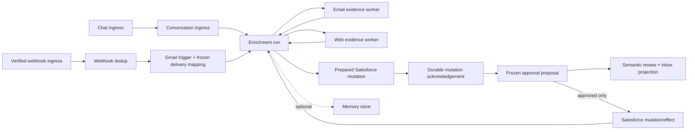

# First Account-Enrichment Vertical Slice

**Status:** Implemented and acceptance-tested — 2026-08-06  
**Scope:** the first durable V2 product flow; not a claim that live provider credentials or roles are complete.

## Outcome

A chat request or an already-verified Gmail webhook can start one account-enrichment run. The run obtains email and web evidence, prepares an exact Salesforce account-description mutation, and then creates a frozen whole-proposal approval. Salesforce is invoked only after that exact proposal is approved. The final product outcome is explicitly either confirmed or outcome-uncertain.

## Module boundaries

| Module | Owns | Does not own |
| --- | --- | --- |
| Conversation | Typed chat intent → targeted enrichment start | Gmail, Salesforce, approval state, rendering |
| Webhooks | Durable verified-delivery receipt, duplicate and conflict detection | Provider parsing, retry policy, or business action |
| Google | Gmail-specific durable delivery mapping, typed request reconciliation, and start acknowledgement | Generic webhook receipt/dedup, OAuth custody |
| Enrichment | Evidence choreography, exact mutation preparation, proposal semantics, final outcome | Provider credentials, renderer policy, approval decision authority |
| Salesforce | Durable prepared mutation, approved invocation, confirmed/uncertain provider effect | Self-approval or presentation |
| Approvals | Frozen whole proposal, expiry, decision audit, direct grant | UI layout or provider effect |
| Presentation | Renderer-neutral review surface/inbox projections | Mutation binding, authorization, renderer implementation |
| Memory | Optional typed evidence storage | Gating or modifying the prepared Salesforce mutation |

## Durable ordering and safety rules

1. Core marks every recorded synapse origin as either external ingress or internal behavior output, and preserves that authority through the journal, outbox, replay, and behavior context. An ingress-registered type is external-only; a behavior cannot emit it.
2. `ApprovalProposalSubmitted` is the external command for a complete proposal. `ApprovalProposalIngress` alone converts it into the internal `ApprovalProposed` fact, so an enrichment run can emit the fact without colliding with the public ingress boundary.
3. `AccountEnrichmentStarted` is directed to a run neuron. Only the Conversation or Gmail trigger neuron kind can start it.
4. Email and web workers are directed by run id and return typed evidence or a redacted unavailable fact. Missing required evidence produces a non-success outcome; it cannot create an approval.
5. The run asks its composer for a draft, creates `PreparedAccountDescriptionMutation`, records it at `SalesforceMutationNeuron`, and waits for `SalesforceMutationPrepared` before creating the proposal. This prevents a proposal from referring to a mutation that was not durably accepted.
6. The proposal freezes ordered evidence, review changes, expiry, action kind/id/fingerprint, and execution target. Its action id is the immutable enrichment run/mutation id.
7. `ApprovalGranted` is direct-only to the frozen Salesforce mutation target. A broadcast `ApprovalStatusChanged` is intentionally separate so presentation can resolve an inbox item without receiving the action binding. `ApprovalPending`, like the presentation surface, contains only review/deadline semantics; the executable binding stays inside Approval. Direct decision and deadline-control facts are accepted only from their matching external ingress adapters. A single verified decision that arrives before the independently delivered frozen proposal is retained durably and applied when that proposal arrives.
8. Salesforce effects return `SalesforceChangeConfirmed` or `SalesforceChangeOutcomeUncertain`. The run emits `AccountEnrichmentCompleted` only for confirmed effects.
9. Memory storage is emitted after preparation as a separate directed operation. `MemoryUnavailable` is visible but is neither awaited nor read by the run, so it cannot block or change the mutation/proposal.
10. A proposal deadline is scheduled with immutable `(proposalId, fingerprint)` identity. Scheduling is idempotent/reconciling, so replay cannot create a semantically different deadline.
11. Webhook deduplication is per subscription/run host state: a repeated delivery id and identical digest is a duplicate; the same id with a different digest is a conflict. Both remain auditable and neither starts a second run.

## Gmail delivery recovery contract

The generic Webhooks module deliberately knows only verified receipt and duplicate/conflict classification. Gmail owns provider-specific recovery:

1. On an accepted delivery, Gmail reads or reconciles the provider payload and durably freezes one typed enrichment request for that delivery identity. A terminally irrelevant payload is also made stable, rather than reinterpreted on each duplicate.
2. Gmail sends that frozen `AccountEnrichmentStarted` request once. Enrichment acknowledges durable acceptance with `AccountEnrichmentRunAccepted`; Gmail then marks the delivery acknowledged.
3. An ordinary duplicate observes the mapping and does nothing. It does not reread Gmail and does not start another run.
4. If Hosting records a `DeliveryFailed` for Gmail's directed start, a separate Google failure-observer behavior receives it and directs a verified internal failure fact to Gmail. Gmail marks the mapped start failed. A later duplicate may re-drive only that same frozen start; it cannot invent a new request or run id.

This is intentionally stronger than transport deduplication alone: an acknowledged receipt cannot silently lose its provider-specific business start when a delivery fails between receipt and durable Enrichment acceptance.

## Semantic Base UI Kit contract

`ApprovalReviewSurfaceRequested` carries only renderable review meaning:

- proposal id and fingerprint;
- title, summary, ordered evidence, changes, and expiry;
- an optional frozen opaque chat-context reference;
- fixed `Approve` and `Reject` decision slots;
- context-derived placement hints: `Chat` + `ContextDrawer` + `Inbox` for chat, `Inbox` only for webhook/no-context work.

It intentionally omits the approval action, execution target, Salesforce mutation body, account id, workspace scope, credentials, actor, and authorization. Evidence references are restricted to redacted HTTPS path references; query, fragment, credentials, loopback, IP-literal, and local references do not cross this boundary. The edge chooses a Base UI Kit layout at runtime. A future Edge action bridge will resolve an opaque ActionRef against the frozen proposal; it is not embedded in this product fact.

## Verification included in this slice

- Chat → frozen proposal → approval → exact confirmed Salesforce mutation.
- A duplicate Gmail webhook starts one run and produces one pending inbox item.
- A Memory provider exception is redacted and cannot block or alter the proposal.
- An enrichment run survives reactivation after preparation and still emits a confirmed outcome.
- Gmail duplicate/conflict recognition, frozen request recovery after a recorded start-delivery failure, and no duplicate run after acknowledgement survive reactivation.
- External proposal commands are translated into internal proposal facts; internal behavior cannot forge an external ingress or approval/deadline control fact.
- Deadline scheduling is exercised across journal failure and replay to prove one immutable logical deadline.
- Presentation rejects forged pending facts, emits fixed semantic decision slots, and resolves its inbox item only from the matching approval lifecycle.
- Chat-triggered reviews retain their opaque conversation context and render with chat/drawer/inbox placement, while webhook-triggered reviews are inbox-only.
- Pending and renderable review facts redact executable action bindings and unsafe evidence references.
- A verified approval decision delivered ahead of its proposal outbox is retained and then grants only that later frozen proposal.

## Deliberate next iteration boundaries

- Live Gmail, web-research, Salesforce, and connection/credential adapters remain Hosting/Connections work; normal tests use controlled providers.
- Access-owned opaque UI ActionRef validation and role/permission policy remain later work.
- Sales Insights uses the same Presentation semantic-surface pattern for typed chart/table results, without adding chart concerns to Core.
- Marketplace remains static trusted composition; runtime package activation and untrusted execution are not introduced by this slice.
- Webhook receipt retention is not silently bounded. A safe retention/expiry policy is provider-specific future work because arbitrary eviction would weaken duplicate and recovery guarantees.
- The current approval cutoff is monotonic at the Approval authority: a client treats a decision as accepted only after it observes its lifecycle outcome. A proposal-keyed Access/Edge admission endpoint (or durable closing barrier) is the next iteration if a pre-cutoff source publication must be reserved across independently delayed outboxes.
- A workspace-wide reconnectable pending-approvals aggregate remains the next Presentation slice. The current inbox facts are durable per-proposal transitions rather than a dashboard query model.
