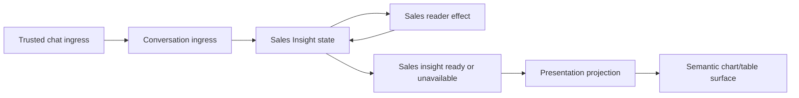

# Sales Insights Design

## Outcome

A typed chat request for closed-won sales over an explicit date range produces
an immutable sales insight and a renderer-neutral Base UI Kit surface. For a
last-week request the surface can show a daily bar chart and table in the
originating chat context. Core does not know about Salesforce, natural-language
parsing, chart libraries, or widgets.

## Why this is a new V2 slice

The V1 Salesforce read path accepts free-text intent and discards the structured
tool result before the chat receives it. Its Flutter chart is fixed demo data.
Neither is a safe data or UI contract to migrate. The V2 slice therefore starts
with typed data and uses the already-proven approval-review projection pattern:
immutable product result, opaque chat context, and a renderer-neutral surface.

## Ubiquitous language

| Term | Meaning |
| --- | --- |
| Sales query | One correlated request for closed-won revenue in an explicit half-open reporting range and one currency. |
| Sales revenue record | One provider-returned closed-won amount with an already-resolved reporting date and currency. |
| Sales insight | The immutable daily aggregation, total amount, deal count, and opaque context for a completed query. |
| Semantic surface | A renderable chart/table declaration. It contains no raw provider query, credential, workspace scope, executable action, or widget configuration. |

The chat/edge layer resolves phrases such as “last week” before it emits a
`SalesQuery`; the durable graph receives only `FromInclusive` and `ToExclusive`
calendar dates. The first measure is closed-won revenue only. A query has one
currency; V2 does not silently convert or combine currencies. A query is capped
at 366 calendar days and a reader result at 10,000 records before any daily
aggregation is materialized.

## Options considered

1. Let Conversation call Salesforce and return text. This repeats V1's lost-data
   design and gives no durable/replayable semantic surface.
2. Let the Salesforce adapter return a chart payload. This couples provider
   querying to a renderer and makes a second UI need reimplement business logic.
3. **Chosen:** Sales Insights owns query state and aggregation behind one narrow
   `ISalesRevenueReader` seam; Presentation projects a completed insight into a
   semantic chart/table surface. This keeps the caller interface small and
   puts provider and renderer variability at separate seams.

## Flow



1. `ChatSalesRequested` is external-only and can be published only by its
   trusted conversation source.
2. `ConversationIngressNeuron` derives the opaque chat-context reference from
   the source identity and directly starts the correlated Sales Insights neuron.
3. `SalesInsightNeuron` stores the first request and emits one directed reader
   operation. It accepts reader results only from its matching effect neuron.
4. `SalesInsightEffectNeuron` owns the single provider seam. It returns typed
   records or a redacted unavailable outcome; it never fabricates zeroes.
5. The state neuron validates record range/currency/value, makes every calendar
   day in the requested range explicit (including zero-value days), and emits a
   durable `SalesInsightReady` result exactly once.
6. `SalesInsightProjectionNeuron` validates Sales Insights origin and emits a
   chart/table semantic surface with `Chat` and `ContextDrawer` placement hints.

## Module interfaces

`DigitalBrain.Product.SalesInsights` exposes one provider seam:

```csharp
public interface ISalesRevenueReader
{
    Task<IReadOnlyList<SalesRevenueRecord>> ReadClosedWonAsync(
        SalesQuery query,
        CancellationToken cancellationToken);
}
```

The eventual Salesforce adapter implements this interface in Hosting
composition. It receives a workspace binding there; `SalesInsightNeuron` only
receives the narrow reader interface. The existing mutation-only
`ISalesforceGateway` remains unchanged.

`DigitalBrain.Product.Presentation` consumes `SalesInsightReady` and emits a
specific `SalesInsightSurfaceRequested`: query identity, explicit date range,
currency, immutable daily buckets, total/count, opaque context, semantic
`BarChart` and `Table` display hints, and placement hints. It has no actions,
provider rows, raw filter text, scope, credentials, or layout/pixel settings.

## Correctness and failure rules

- Query id is the Sales Insights neuron id. Repeated chat delivery cannot issue a
  second logical query or produce a second result.
- A reader exception becomes `SalesInsightUnavailable`; the visible unavailable
  surface is explicit and contains no exception text.
- A record outside the requested range, in a different currency, with a
  negative amount, beyond the result limit, or causing a decimal aggregate
  overflow is invalid provider data. It produces unavailable rather than a
  partial or misleading chart.
- The completed result is durable state. Reactivation or replay cannot replace
  it with a newer provider response.
- A chart point represents a calendar day and uses decimal money. The renderer
  owns locale formatting and accessible visual treatment.

## Focused verification

- A chat request for seven days produces seven ordered buckets, including zero
  days, plus the hand-checked total and deal count.
- The surface carries the originating opaque conversation reference and has no
  workspace, provider query, or executable action fields.
- A reader failure produces one redacted unavailable surface and never a chart
  of zeroes.
- Duplicate start/recovery preserves one frozen completed result.

## Explicitly out of scope

- Natural-language/LLM intent parsing and relative-date resolution.
- Live Salesforce credentials, SOQL generation, currency conversion, custom
  formulas, drill-down actions, and global dashboard aggregation.
- A chart library, Flutter/browser renderer, visual theme, or custom third-party
  UI host.
