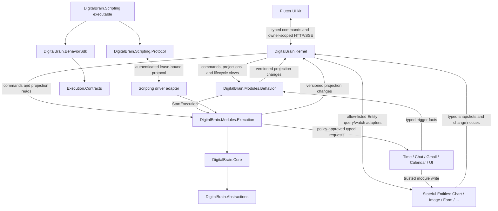
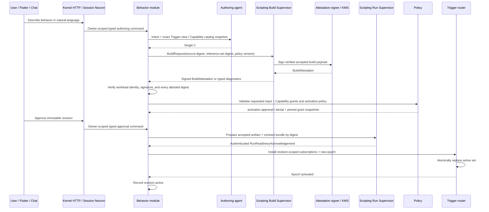
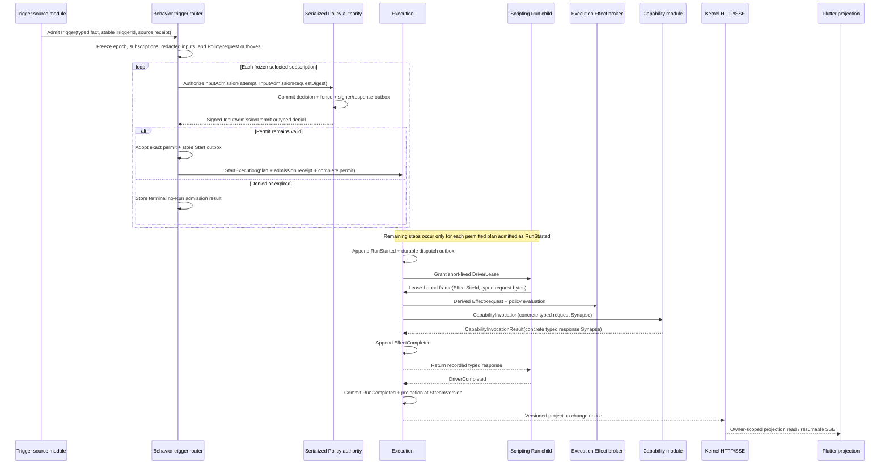

# Type-Safe Behavior Event Architecture

**Status:** Superseded by [2026-08-23-smart-prompt-execution-architecture-design.md](./2026-08-23-smart-prompt-execution-architecture-design.md)  
**Date:** 2026-08-22  
**Scope:** Durable behavior authoring and execution, typed events, policy and approvals, isolated single-file C# scripting, stateful Entities, and Flutter projections. Retained for history; do not implement from this draft.

## 1. Decision summary

DigitalBrain will implement user-authored Behaviors as immutable, generated single-file C# revisions executed outside the product Kernel. The architecture has four distinct layers:

1. `DigitalBrain.Abstractions` and `DigitalBrain.Core` remain the generic typed Synapse and durable Neuron runtime.
2. `DigitalBrain.Modules.Execution` becomes the reusable event-driven framework for durable Runs, driver leases, Effect replay, policy decisions, approvals, recovery, and projections.
3. `DigitalBrain.Modules.Behavior` owns natural-language-authored Behavior definitions, immutable revisions, trigger subscriptions, activation, and learning evidence.
4. `DigitalBrain.Scripting` is a separate executable project, following the project seam present on `master`. Its role-separated Build/Run Supervisors and isolated child jobs are the only subsystem allowed to compile or execute generated C#.

`DigitalBrain.Kernel` hosts authentication, HTTP/SSE, dependency injection, and module composition. It does not reference Roslyn, load generated assemblies, or reference the `DigitalBrain.Scripting` executable.

Existing `Entity<TState>` grains remain the normal addressable state holders for UI and other live resources. They are snapshot-backed plain Orleans grains—not Durable Neurons, Synapse endpoints, or event streams. A chart remains a `ChartEntity`; this design does not force it into the Run ledger.

The design adapts useful ideas from [IAW PR #35](https://github.com/InteractiveAgents/IAW/pull/35)—durable per-task history, deterministic routing, approvals, and UI notifications—without copying its string event kinds, dictionary payloads, duplicated observation logs, or incompletely connected routing path.

### 1.1 Planning boundary

This is an umbrella architecture, not one implementation batch. It ratifies the seams and invariants shared by all slices. After written-spec approval, the first implementation plan covers only the **Execution vertical slice** in section 25. Each later slice receives its own focused design review and implementation plan; there will be no single plan attempting to land Execution, Scripting, Behavior, Flutter, learning, and integrations together.

## 2. Context and evidence

The existing system already has stronger transport metadata than IAW's `TaskEvent` envelope:

- `SynapseDelivery` carries a typed `Synapse`, `SynapseId`, `CorrelationId`, `CausationId`, caller, per-neuron sequence, timestamp, and verified principal.
- Neurons execute serialized durable turns and record incoming and outgoing traffic.
- Module contracts use Orleans aliases and append-only serializer field IDs.
- Flutter already has golden wire-contract validation and cursor-based SSE surfaces.
- `Entity<TState>` is already a plain stateful grain with persisted latest state, direct `Read()`, no Synapse membrane, and no traffic journal; `ChartEntity` is the reference example.

The existing traffic journal is intentionally not an event store. [JOURNALS.md](../../JOURNALS.md) defines it as a bounded 512-entry/512-KB observation window whose older history can be replaced by a reset snapshot. It remains suitable for live observation, diagnostics, and SSE wakeups, but it cannot be the authoritative Run history.

`master` contains two useful precedents:

- `srcv2/Kernel/DigitalBrain.Scripting/DigitalBrain.Scripting.csproj` is a separate executable project. Its current implementation launches developer probe scripts; this design retains the process/project seam, not that implementation.
- `srcv2/Modules/Execution` models expected revisions, command receipts, execution attempts, approval epochs, prepared/dispatched/completed operations, and explicit uncertain outcomes. This design retains those semantics behind a smaller interface rather than restoring the whole implementation unchanged.

The current [ARCHITECTURE.md](../../ARCHITECTURE.md) describes Smart Prompts as prompt-plus-binding entities executed by a runner. This specification supersedes that Smart Prompt section: **Behavior** is now the canonical product term, and every Behavior Run uses the generic Execution module plus the external role-separated Scripting system.

## 3. Goals

- Convert natural-language intent into a reviewable, immutable single-file C# Behavior Revision.
- Admit only compiled, version-locked Trigger and Capability contracts.
- Record every Run transition, Effect request, policy decision, approval, result, and terminal outcome as typed durable facts.
- Resume safely after Kernel, silo, Scripting Supervisor/sandbox child, or client restarts.
- Prevent generated code from bypassing ownership, grants, policy, approval, or idempotency checks.
- Rebuild Flutter views from typed projections and resume live delivery from cursors.
- Preserve Entities as typed, live snapshots that Behaviors can create or update only through governed Capabilities.
- Make learning explicit: outcomes and corrections propose new revisions instead of mutating active code.
- Keep generic execution semantics reusable for long-running agents, integration work, and other future modules.

## 4. Non-goals

- Event-source every DigitalBrain Neuron or Entity.
- Treat the bounded traffic journal as authoritative Run history.
- Let an LLM route runtime events or decide authorization.
- Give generated code an Orleans client, `IDigitalBrain`, `IGrainFactory`, service provider, filesystem, network, process, reflection, package restore, or reusable credentials.
- Promise exactly-once behavior from third-party systems. DigitalBrain guarantees logical idempotency and explicit uncertainty, not impossible external guarantees.
- Allow a Behavior to modify DigitalBrain Core or activate its own replacement.
- Support arbitrary user-defined JSON event shapes in v1.
- Load generated code inside `DigitalBrain.Kernel` or a silo process.

## 5. Architectural principles

### 5.1 Commands request; Run Events state facts

A command asks an aggregate to transition. A Run Event records a transition that occurred. They are different closed type families. Normal command rejection returns a typed result; it does not append a fact that claims the transition occurred.

### 5.2 Type safety crosses every seam

- Runtime payloads are concrete C# records, not string event names or dictionaries.
- Persisted routing uses a generated `ContractId`, not a user-authored alias string.
- An Effect binds a permanent `CapabilityId`, request type, and response type at compile time.
- The Scripting protocol accepts only a known, versioned union of frames.
- Flutter models are generated from the same C# contracts and checked by a golden manifest.

Type safety is compile-time at generated-program and module-handler interfaces. Extensible persistence, outbox, and IPC seams necessarily carry heterogeneous `Synapse` values or bytes; there, a signed descriptor supplies `ContractId`, concrete runtime type, canonical digest, and allowed Capability pairing, and both sides validate all four before dispatch or deserialization. “Type safe” never means blindly trusting a base-class payload.

### 5.3 Generated code requests authority; it never owns authority

Compilation proves that code is structurally valid against an allowed contract set. It is not authorization. The trusted Execution Effect broker re-evaluates owner, active Run, pinned workload, driver lease, Capability/grant, target, request type, policy, deadline, and idempotency for every Effect.

### 5.4 Replay must be deterministic or stop

Each Effect identity is derived from the Run, a build-generated `EffectSiteId`, and that site's persisted occurrence ordinal. V1 permits only one in-flight Effect per Run, which makes issuance order deterministic across branches and loops. Replaying the same site and ordinal with the same program-call digest returns the recorded result. Replaying it with different program input is a non-deterministic replay fault; authority or target changes are policy changes, not code non-determinism. A dispatched Effect with no known result becomes `OutcomeUncertain` and pauses for reconciliation.

### 5.5 Projections are disposable

Flutter and operator views consume rebuildable projections. A projection is never consulted to authorize a transition or dispatch an Effect.

## 6. Project topology



### 6.1 Proposed projects

```text
src/
├── Kernel/
│   ├── DigitalBrain.Abstractions/                 existing generic contracts
│   ├── DigitalBrain.Core/                         existing durable Synapse runtime
│   ├── DigitalBrain.Kernel/                       product host; no Roslyn
│   ├── DigitalBrain.Scripting.Protocol/            contracts-only IPC protocol
│   └── DigitalBrain.Scripting/                     separate executable
├── Modules/
│   ├── Execution/
│   │   ├── Contracts/                             generic commands, events, projections, driver frames
│   │   ├── Governance.Abstractions/               public non-client grant lifecycle + Input admission ports
│   │   ├── Driver.Abstractions/                   public non-client driver SPI
│   │   ├── Capability.Abstractions/               public non-client typed endpoint SPI
│   │   ├── Execution/                             Run aggregate, history, broker, policy, recovery
│   │   └── ScriptingDriver/                       generic-driver ↔ Scripting protocol adapter
│   └── Behavior/
│       ├── Contracts/                             Behavior, revision, trigger, activation vocabulary
│       ├── Trigger.Abstractions/                  public non-client typed source SPI
│       ├── Behavior/                              registry, authoring lifecycle, subscriptions, learning
│       └── Sdk/                                   generated-program surface
└── Modules/*/Contracts/                           typed Trigger and Capability contracts
```

The physical `src/Kernel/DigitalBrain.Scripting` location matches `master`, but it is a sibling executable, not code inside `DigitalBrain.Kernel`. The following dependency rules are mandatory:

```text
DigitalBrain.Kernel -> Behavior + Execution + ScriptingDriver + Core
Behavior -> Behavior.Contracts + Execution.Contracts + Execution.Governance.Abstractions + Core
Execution -> Execution.Contracts + Core -> Abstractions
ScriptingDriver -> Execution.Driver.Abstractions + Execution.Contracts + Scripting.Protocol
DigitalBrain.Scripting -> Scripting.Protocol + BehaviorSdk + selected module Contracts
Behavior implementation -> Scripting.Protocol (build/readiness only)
opted-in source adapter -> Behavior.Trigger.Abstractions + module Contracts
capability module adapter -> Execution.Capability.Abstractions + own module Contracts

Forbidden:
DigitalBrain.Kernel -> DigitalBrain.Scripting
DigitalBrain.Scripting -> DigitalBrain.Kernel
Scripting.Protocol -> Roslyn / Kernel / Core / Orleans client / implementations
generated artifact -> DigitalBrain.Client / Orleans / module implementations
```

`DigitalBrain.Scripting.Protocol` contains only versioned build requests, attestations, artifact-acceptance and Run-readiness acknowledgements, run-lease envelopes, and Scripting transport frames. Execution owns a generic `IExecutionDriver` port and generic driver-frame model; the `ScriptingDriver` adapter references both sides and translates without letting Execution reference `Scripting.Protocol`. Behavior's build/readiness adapters may remain Scripting-specific. This prevents a cross-process interface from becoming an accidental dependency from the generic Run engine to one worker technology.

In development, AppHost may start the `DigitalBrain.Scripting` roles from one separate resource profile. In production, Build and Run Supervisors run as separate restricted workloads with disjoint identities and no provider or user secrets, and each launches only its matching ephemeral sandbox jobs. The Kernel deployment does not launch generated code and does not share its process, filesystem, or credential set with Scripting.

### 6.2 Why Execution is a module, not Core

Core owns facts that every DigitalBrain module needs: typed delivery, identity propagation, serialized turns, durable state, and observation. It also supplies one narrow protected delivery-admission hook with the full `SynapseDelivery`; its default behavior preserves today's dispatch. It lets a module enforce caller- and causation-aware ingress without teaching Core about Runs or Effects. Execution policies, driver leases, approvals, retries, Effect ledgers, and uncertain outcomes remain reusable product behavior, not universal Neuron mechanics.

Putting Execution in Core would enlarge Core's interface and force every module to understand workflow concepts. Putting it in Kernel would couple domain behavior to one host. A first-party Execution module provides reuse while preserving a narrow Core.

### 6.3 Entities remain the live state model

Entity state is **snapshot-persistent but not event-historical**. An Entity is a plain stateful grain with a persisted latest snapshot. It is not a `DurableGrain`, does not receive Synapses, has no traffic journal, and is never an Execution history. `ChartEntity`, `ImageEntity`, `SurfaceEntity`, forms, and future UI-kit components keep this shape. Domain timers remain Neurons because they receive typed commands and reminders.

| Entity concern | Architectural decision |
|---|---|
| Grain shape | Existing plain `Entity<TState>`/`IPersistentState`; never a `DurableGrain` or Neuron |
| Authority | Latest typed state + `EntityVersion` + `StateDigest` |
| Audit/history | None inside the Entity; the Run records the governed Effect and result |
| Generated Behavior write | Only through a typed Capability and verified `EntityRef<TState>` lineage |
| Trusted module write | Allowed through the same versioned mutation receipt and exact outbox primitive |
| Trigger publication | Explicit typed domain fact from the trusted writer's durable outbox, never polling/change-feed inference |
| Flutter read/live update | Owner-scoped Kernel query + registered Entity-change wakeup feed |

Generated code never resolves or writes an Entity directly. It requests a typed Capability—for example `RenderChartCapability`—and the trusted owning module writes the Entity. The Capability response contains `EntityRef<TState>` with the owner-scoped `EntityId` and state contract; a closed UI-card leaf such as `ChartCard` contains that reference. Raw `{kind, name}` pairs are not the new contract. Entity IDs for create-style Effects are derived from `EffectId` so a retry addresses the same logical Entity. Updating an Entity across Runs requires an admitted `EntityRef<TState>` or grant-scoped typed Entity key, never a free-form name.

`EntityRef<TState>` is typed data, not authority. Execution records an allowed-reference set from references explicitly admitted in the Trigger Input and references returned by prior recorded Effects. Generated request descriptors enumerate every embedded Entity reference; the Effect broker accepts it only when the exact owner-scoped ID and state contract occur in that lineage set, or when the Capability Grant contains a typed deterministic Entity-key rule that derives it. A forged/caller-constructed reference has no provenance and is rejected. Capability endpoints derive owner scope from the verified dispatch receipt and never trust an owner field inside the request.

Entities that admit governed mutations store one `EntityRecord<TState>` in one persistent write. It contains `EntityVersion`, current state, `StateDigest`, and idempotent mutation receipts uniquely keyed by `EntityMutationId`. A Behavior Capability derives that ID one-to-one from `EffectId`; a trusted in-module command derives it from its durable `CommandId`. Each receipt stores its `MutationDigest`, expected and resulting versions, resulting state digest/result, and the exact ordered publication envelopes produced by that mutation. The same mutation ID and digest returns its original receipt; the same ID with a changed digest conflicts; a different mutation with a stale version conflicts. State and receipt become visible together. Receipts are retained for at least the maximum admissible retry/replay/reconciliation window and are never silently evicted while a retry remains admissible. This bounded operational deduplication metadata is not an ordered Entity transition history.

`EntityRef<TState>` is stable identity only; it does not pretend to be a snapshot or silently imply a version. A successful mutating Capability returns a typed `EntityMutationResult<TState>(Ref, EntityVersion, StateDigest)`. A replace-style request carries `ExpectedEntityVersion` obtained from an admitted `EntitySnapshot`, a recorded read Capability, or a prior mutation result. Create-only and explicitly atomic domain operations—such as “append this point if command X is new”—may define different typed concurrency contracts, but no generated Behavior receives an ambient “read current, then write latest” primitive.

Flutter reads an Entity's current state through an explicitly allow-listed, owner-scoped Kernel query surface or client accessor. Exposure is not inferred merely because a contract implements `IEntity<TState>`. Writes remain behind module-owned Neurons or Capability adapters, and every trusted writer of a client-exposed Entity must use the same versioned mutation/receipt primitive and recoverable exact-publication outbox. A reference card stores the typed Entity reference, not a copied snapshot. If the Entity later changes, every mount sees the current state; the Run timeline still preserves what Effect created or updated it and the recorded result digest.

An Entity does not become a Trigger source by being watched or polled. Each publication envelope retained in its mutation receipt has a stable `FactId` derived from `(EntityMutationId, publication ordinal)`, exact concrete fact contract and payload, and canonical digest. The trusted writer's following atomic result/outbox commit also stores the source registration, immutable emission time, and `SourceEmissionId` that authenticate that `FactId` for Trigger admission. After obtaining the mutation receipt, the trusted writer—Capability endpoint, module Neuron, or compatibility adapter—commits its own command/invocation result plus those exact typed domain-fact outbox items before reporting success. A crash in the gap is safe even across a deployment: retry recovers the Entity's original receipt and then the writer's original result/outbox record, publishing stored envelopes rather than recomputing them under new code. Behaviors subscribe to those typed facts, not to Entity storage notifications.

Live Flutter refresh is a separate owner-scoped wakeup protocol, not Entity event sourcing. Every client-exposed Entity state contract has exactly one trusted `IEntityExposureRegistration<TState>` in host composition. That registration resolves its read adapter and a module-owned, owner-scoped `EntityChangeFeedNeuron`; every trusted writer able to mutate that Entity type routes its exact outbox notice to the same feed, so `EntityRef<TState>` never has to identify a mutation endpoint. The writer outbox sends `EntityChanged(EntityId, EntityVersion, StateDigest)` to that feed after a successful mutation. `EntityResumeToken` binds owner, feed Neuron, Entity ID, traffic-journal sequence, and last observed Entity version/digest. A mount registers the feed watch from the token before reading `EntitySnapshot<TState>`, buffers notices during that read, discards versions already reflected, and refetches only on a newer notice. On a bounded-journal reset it establishes a current feed cursor and repeats watch-before-read. The feed is only a recoverable typed wakeup source; the Entity snapshot remains the current-state authority and the Entity itself still receives no Synapses.

An explicitly declared projection may use an Entity as its materialized latest-state store, but it remains rebuildable from its authoritative domain facts; an Execution projection uses Run Events. Ordinary Entities are not assumed rebuildable. Snapshot persistence makes an Entity operationally persistent; it does not make that snapshot an audit log or source of truth for Run transitions.

No generic `EventSourcedNeuron<TState,TEvent>` base class is added in v1. Execution is the first real consumer; its event/history implementation remains internal until a second independent module proves that a Core seam would provide leverage.

## 7. Domain model

The canonical vocabulary is recorded in the repository root [CONTEXT.md](../../../CONTEXT.md). The central relationships are:

**Run** is the product/domain term shown to users. **Execution** is the generic module and aggregate implementation that durably realizes a Run. Exactly one `ExecutionId` identifies one Run; there is no second nested “Execution” lifecycle. A Behavior Revision is one kind of immutable Workload Revision, and Behavior translates its revision, Trigger admission, and grants into the generic Execution contracts.

```text
Behavior 1 ──* BehaviorRevision
Behavior 1 ──1 ActiveRevision (optional)
BehaviorRevision 1 ──* TriggerSubscription
BehaviorRevision 1 ──* InputGrant
BehaviorRevision 1 ──* CapabilityGrant
TriggerSubscription + Trigger 1 ──1 InputAdmission
InputAdmission 1 ──0..1 Run
Run 1 ──* RunEvent
Run 1 ──* Effect
Effect 1 ──* PolicyDecision (ordered re-evaluations)
Effect 0..1 ──1 Approval
Effect ──> Capability ──> Entity (optional current-state result)
RunEvent* ──> Projection
Correction / outcome ──> LearningEvidence ──> proposed BehaviorRevision
```

### 7.1 Identity types

The contracts use distinct serializable value types:

- `BehaviorId`
- `BehaviorRevisionId`
- `BehaviorLifecycleOperationId`
- `BehaviorLifecycleEpoch`
- `CommandId`
- `CommandAdmissionReceiptId`
- `ExecutionId`
- `ExecutionDriverId`
- `ExecutionAdmissionId`
- `InputAdmissionAttemptOrdinal`
- `InputAdmissionAttemptId`
- `InputAdmissionPermitId`
- `InputGrantId`
- `InputAdmissionRequestDigest`
- `InputProvenanceDigest`
- `TriggerId`
- `SubscriptionId`
- `EffectId`
- `CapabilityId`
- `CapabilityGrantId`
- `CapabilityAdmissionReceiptId`
- `ApprovalId`
- `DriverLeaseId`
- `DriverLeaseEpoch`
- `ContractId`
- `ReferenceSetDigest`
- `ManifestDigest`
- `ArtifactDigest`
- `ProgramCallDigest`
- `RequestDigest`
- `ResponseDigest`
- `StateDigest`
- `MutationDigest`
- `EntityMutationId`
- `FactId`
- `SourceEmissionId`
- `EntityId`
- `EntityVersion`
- `EntityResumeToken`
- `EffectSiteId`
- `DispatchAttemptOrdinal`
- `DispatchAttemptId`
- `PolicyDispatchPermitId`
- `PolicyFence`
- `SigningKeyId`
- `TrustEpoch`
- `AuthenticatedIngressReceiptId`
- `SubscriptionEpoch`
- `RunEventId`
- `StreamVersion`
- `ProjectionResumeToken`

Raw `Guid`, `string`, or `long` values do not cross public interfaces when one of these identities is intended.

## 8. Contract identity and schema evolution

Every routable contract has a generated descriptor:

```csharp
public interface IDigitalBrainContract<TSelf>
    where TSelf : IDigitalBrainContract<TSelf>
{
    static abstract ContractId Id { get; }
    static abstract int SchemaMajor { get; }
}
```

A source generator derives `ContractId` from the owning module identity, permanent contract alias, and schema major. Callers use `Contract<T>.Id`; they do not construct contract IDs from strings.

Each Capability also has a permanent generated `CapabilityId`, distinct from its request and response contracts. A `CapabilityDescriptor<TCapability,TRequest,TResponse>` binds that semantic operation to its exact request/response pair, target-endpoint kind, closed durability mode, and protocol major. A Capability Grant always names one `CapabilityId`; two operations that happen to reuse the same request shape never share authority accidentally.

Rules:

1. Orleans `[Id(n)]` values are append-only and never renumbered.
2. Compatible field additions retain the schema major and alias.
3. Semantic or shape-breaking changes create a new major and new leaf contract.
4. A Behavior Revision pins an immutable contract lock and `ReferenceSetDigest`: SDK assembly identity and content hash; every trusted module-contract assembly identity and content hash; generator and analyzer hashes; compiler version and options; target framework; and canonical schema manifest.
5. The content-addressed artifact, attestation, exact contract bundle/manifest, and trusted runtime descriptors are reference-pinned—not age-pinned—while any Behavior revision is `Activating`, `Active`, or `Disabling`; any Trigger first-admission record, outbox item, Run, approval, Effect, or reconciliation record references them; and for the complete configured replay/reconciliation/history tail afterward. Garbage collection requires all reference pins to be gone. Scripting builds and replays against that exact retained bundle.
6. Kernel never loads generated or untrusted contract assemblies. Runtime deserialization uses the trusted registered contract catalog; retained older trusted versions or explicit verified upcasters must exist before an old payload is admitted.
7. Historical Runs remain readable and replayable while their pinned bundle and trusted runtime descriptors are retained. A missing, corrupt, or untrusted bundle quarantines the Run rather than guessing.
8. Upcasters are explicit registered adapters. Unknown majors quarantine the affected Run.
9. Every signed attestation, ingress receipt, Input permit, Policy permit, and Execution receipt binds a typed `SigningKeyId`, `TrustEpoch`, and signing purpose. Normal key rotation moves a key to verify-only status; its public key and trust metadata remain resolvable through the maximum signed-proof validity plus clock-skew, pending-outbox, admission, replay, and recovery/reconciliation windows, and while any durable record still references it. Reference-aware garbage collection—not “current key only”—removes it. Emergency compromise is a separate monotonic trust-revocation transition: it blocks fresh admissions immediately and quarantines affected unresolved work for typed reconciliation. It never treats a possibly contacted Effect as absent or silently invalidates authoritative history.

### 8.1 Canonical digests

Orleans serialization is transport/persistence encoding, not a hashing contract. Every command, plan, manifest, Effect request, Capability response, Entity mutation, and receipt digest uses a versioned source-generated `CanonicalDigestCodec`. V1 uses deterministic CBOR with numeric serializer field IDs in ascending order, definite lengths, domain-separated type/contract identifiers, fixed binary forms for identities and timestamps, and shortest valid UTF-8 without culture-dependent normalization. Ordered lists preserve order; dictionaries and sets sort by canonical encoded key/value; duplicate canonical keys and invalid Unicode are rejected; floating-point NaN/infinity are rejected unless a contract defines an explicit canonical representation. Source and assembly digests hash exact bytes with an explicit media/type domain.

The codec ID and contract/schema major are included in every digest preimage. Generated encoders are golden-tested across processes and platforms; no reflection serializer or ambient culture participates. Changing canonical rules creates a new codec version and explicit migration, never a silent hash change. Generated code may iterate only declared ordered collections or an explicitly canonical sort; digest canonicalization alone does not make program control flow deterministic.

## 9. Deep module interfaces

### 9.1 Execution

Execution exposes one Synapse transition entry point and one read-only projection query. Its implementation hides Run history, reducers, receipts, outbox, driver dispatch, Effect state, policy, approval, retry, deadline, and recovery.

```csharp
[Alias("db.execution")]
public partial interface IExecution :
    INeuron,
    IHandle<ApplyExecution>
{
    Task<ExecutionProjection> Read();
}

[GenerateSerializer]
[Alias("db.execution.apply.v1")]
public sealed record ApplyExecution(
    [property: Id(0)] CommandId CommandId,
    [property: Id(1)] StreamVersion? ExpectedVersion,
    [property: Id(2)] ExecutionClientCommand Command,
    [property: Id(3)] CommandAdmissionReceipt Admission)
    : RequestSynapse<ApplyExecutionResult>;
```

`ApplyExecutionResult` is a closed response union. Its leaves include `ExecutionCommandAccepted(ExecutionProjection)`, `ExecutionExpectedVersionConflict`, `ExecutionCommandReceiptConflict`, `ExecutionCommandNotAllowed`, and command-specific typed rejections. The command receipt stores that exact union leaf, so an identical retry returns the original acceptance or rejection rather than reconstructing a bare projection.

`CommandAdmissionReceipt` is minted by the authenticated Session/Kernel command Neuron and binds a time-ordered `CommandAdmissionReceiptId`, owner, Session, purpose, `CommandId`, command-body digest (excluding the receipt), authenticated issued time, fixed `ReplayUntil`, and target. For the new Execution/Behavior routes, the command-ID generator is also migrated to the time-ordered form and the embedded times must agree; the server applies one maximum retry window and never renews either identity in place. Existing random-GUID command IDs remain opaque compatibility-route IDs—their bits are never reinterpreted as timestamps. A compatibility endpoint enters the new bounded protocol only by minting a new admitted command/receipt pair. Execution and Behavior reject an expired or cross-owner/target/body receipt before aggregate processing.

`ExecutionClientCommand` is a closed union whose v1 leaves are only:

- `CancelExecution`
- `RecordApproval`
- `ReconcileEffect`

`ApplyExecution` is delivered only through `SynapseDelivery`; there is no parallel direct-call mutation method that could bypass admission. Authenticated Kernel endpoints explicitly allow-list client command leaves before firing the Synapse. Trusted transitions are separate Synapse families and are not accepted by `ApplyExecution`: `StartExecution` from the Trigger router, `AcceptDriverFrame` from a registered Execution-driver ingress Neuron, and approval/lease/deadline expiry from the system reminder source. They are not mapped by a client endpoint.

`Read()` is side-effect-free and reached through an owner-scoped Kernel query; it is not an alternate command surface.

`ExecutionNeuron` overrides Core's full-envelope delivery-admission hook before normal exact-type dispatch. It enforces the following mechanically:

- client commands require the stored owner or an explicitly authorized operator;
- `StartExecution` requires the Trigger router's generic `ExecutionAdmissionReceipt`;
- driver ingress requires the registered driver-ingress Neuron plus the current lease and epoch;
- expiry transitions require the registered system reminder source and expected token;
- `CapabilityInvocationResult` requires the outstanding `DispatchAttemptId`, recorded target caller, expected `EffectId`/`CapabilityId`, and, for success, the expected concrete response `ContractId` and digest. A matching `CausationId`/outgoing `SynapseId` is additional transport evidence when available, not the sole durable correlation key.

Execution implements an exact `IHandle<CapabilityInvocationResult>` handler. `ExecutionNeuron` itself is the physical sender of `CapabilityInvocation`, so `ReplyAsync` returns to that same Run aggregate; the Effect broker is an in-turn component, not a relay grain. A preallocated durable `DispatchAttemptId` is echoed by invocation/result and bound into the dispatch receipt. An admitted result is reduced to `EffectCompleted`; any unmatched or mismatched result is rejected and quarantined with telemetry. This preserves today's exact-type `Neuron` dispatch—there is no unbound-response hook, catch-all event name, or map payload.

### 9.2 Behavior

Behavior owns revision and subscription lifecycle, not execution mechanics.

```csharp
[Alias("db.behavior")]
public partial interface IBehavior :
    INeuron,
    IHandle<ApplyBehavior>
{
    Task<BehaviorProjection> Read();
}

[GenerateSerializer]
[Alias("db.behavior.apply.v1")]
public sealed record ApplyBehavior(
    [property: Id(0)] CommandId CommandId,
    [property: Id(1)] StreamVersion? ExpectedVersion,
    [property: Id(2)] BehaviorCommand Command,
    [property: Id(3)] CommandAdmissionReceipt Admission)
    : RequestSynapse<ApplyBehaviorResult>;
```

`ApplyBehaviorResult` is likewise a closed union with `BehaviorCommandAccepted(BehaviorProjection)`, expected-version and receipt-conflict leaves, authorization rejection, and command-specific activation/revision outcomes. Behavior command receipts retain the exact result leaf.

`BehaviorCommand` is a closed union whose v1 leaves are:

- `ProposeRevision`
- `ApproveRevision`
- `ActivateRevision`
- `DisableBehavior`
- `RecordUserCorrection`

Build attestations enter through the registered Scripting-build ingress Neuron and Run-readiness acknowledgements through the distinct Scripting-run ingress Neuron, never through `ApplyBehavior`. Run outcomes and evaluator evidence arrive through separately admitted typed source Synapses. `BehaviorNeuron` uses the same full-envelope Core admission hook to verify service/source caller, owner, authenticated ingress receipt or signature where applicable, requested revision, and all attested digests before recording a trusted transition. A client can submit an attributed owner correction, but cannot self-attest a build/readiness transition or impersonate Run/evaluator evidence.

Starting a Run is internal to the typed Trigger router: it resolves an active subscription, creates a deterministic `ExecutionId`, and sends `StartExecution`. Clients can still request a manual Trigger through a typed UI command, but they cannot manufacture an arbitrary Run artifact or grant set.

### 9.3 Extension and internal seams

`IExecutionDriver` is a public, non-client extension SPI in `Execution.Driver.Abstractions`. It exposes only generic lease, cancellation, replay, and driver-frame types from `Execution.Contracts`. A fake driver and the external `ScriptingDriver` adapter can implement it from separate assemblies, but it has no HTTP, Flutter, `IDigitalBrain`, or arbitrary Orleans-client route. Trusted host composition is the only consumer.

`ICapabilityHandler<TCapability,TRequest,TResponse>` and its generated registration interface are public, non-client endpoint SPIs in `Execution.Capability.Abstractions`, which references only `Execution.Contracts`. A module adapter implements them alongside its own module Contracts and never references the Execution implementation. Host composition installs generated registrations; no client or generated Behavior can register a handler.

`Execution.Governance.Abstractions` contains two narrow public, non-client ports backed by Execution's internal serialized Policy authority. `IWorkloadGovernanceGateway` accepts a closed grant-lifecycle union for validating, installing, and revoking exact versioned Input- and Capability-grant snapshots; each leaf admits only its registered Behavior-lifecycle, owner Session, or system-policy caller. `IInputAdmissionGateway` carries only the closed `AuthorizeInputAdmission` request and signed decision contracts from `Execution.Contracts`; its full-envelope ingress admits only the registered Behavior router Neuron and verifies owner, target, attempt/request digest, and frozen-selection causation before forwarding. Trusted host composition supplies both destinations. Behavior can durably address these gateways but cannot implement the authority, choose an arbitrary Policy target, access Effect-dispatch internals, or expose either port directly to HTTP, Flutter, generated code, or source adapters. Effect-permit issuance remains private behind Execution's broker.

`ITriggerSourceRegistration<TFact,TView>` is the parallel public, non-client SPI in `Behavior.Trigger.Abstractions`. An opted-in source-module adapter implements or source-generates it against trusted module contracts; Behavior registers it only through host composition. It performs checked typed matching/redaction and exposes no route by which a client can register a source, mint a source receipt, or invoke the router.

`IEntityExposureRegistration<TState>` is an allow-list-only, non-client module SPI in `DigitalBrain.Abstractions`. Host composition binds one exposed state contract to its owner-scoped read adapter and stable Entity-change feed resolver. Registration is explicit; implementing `IEntity<TState>` alone never creates client visibility.

The following interfaces are internal to their owning module:

- `IExecutionCommitStore`: load and atomically commit contiguous Run Events, an optional command receipt, pending outbox items, and a derived aggregate snapshot at an expected `StreamVersion`.
- `IScriptingBuildGateway`: Behavior-owned build, attestation, and artifact-acceptance transport.
- `IScriptingRunReadinessGateway`: Behavior-owned request for the runtime role to fetch and verify one accepted artifact/bundle by digest.
- `IExecutionIngressAuthorizer`: caller, receipt, lease, epoch, reminder, and correlated-response admission.
- `IPolicyEvaluator`: pure evaluation of budgets, request shape, and policy rules before asking for authority.
- `IPolicyAuthority`: serialized owner/grant authority that orders revocation against idempotent, fenced Input-admission and Effect-dispatch permit issuance.
- `IEffectBroker`: validate and dispatch concrete request Synapses.
- `IProjectionReducer<TEvent,TProjection>`: pure, deterministic projection rebuild.

`IExecutionCommitStore.Commit(expectedVersion, events, commandReceipt, outboxItems, aggregateSnapshot)` is one atomic durable operation. There is no independent authoritative history write followed by an outbox write: a crash can reveal both or neither. Its production adapter uses the Execution grain's durable state and segmented storage; its test adapter is in-memory and deterministic. Persistence, transport, ingress, and policy ports each require a production adapter plus a deterministic test adapter; pure reducers are ordinary implementations tested directly.

### 9.4 Authenticated external ingress

An external transport adapter is not a Neuron and therefore cannot be trusted as `SynapseDelivery.Caller`. It never constructs or overwrites caller, principal, owner, target, correlation, or causation fields. After authenticating mTLS peer identity and protocol, a narrow host reifier resolves owner and subject from the stored build/readiness request or driver lease—not from peer payload—and mints a signed, short-lived, single-use `AuthenticatedIngressReceipt`. The receipt binds `AuthenticatedIngressReceiptId`, a closed ingress purpose, peer workload identity, protocol contract/major, owner, Behavior revision or Execution subject, exact target ingress Neuron, channel/session ID, nonce, sequence, driver lease/epoch when applicable, payload contract/digest, issue time, and expiry. The adapter submits the unchanged frame plus receipt to that system-only ingress port.

The `ScriptingBuildIngressNeuron` and `ScriptingRunIngressNeuron` accept only their exact purposes and targets and verify receipt signature/scope/expiry plus relevant protocol state. One atomic ingress commit stores receipt ID/payload digest and a deterministic downstream outbox item for the typed Behavior transition, Run-readiness transition, or generic Execution driver transition. Exact retry returns or re-drives that stored item; reuse of the receipt ID with another digest conflicts. The recoverable outbox then uses the ingress Neuron's normal `SendAsync` path, so a crash cannot consume a single-use receipt and lose its transition. A receipt replayed across owner, subject, target, purpose, protocol, lease, or payload is rejected. Downstream admission therefore sees a real, registered Neuron caller and a payload-bound proof of the external peer; it never sees a transport-supplied pseudo-caller. The build and Run peers, receipts, signing purposes, and ingress Neurons are distinct. A manual HTTP/Flutter request similarly enters through its registered Session or Kernel command Neuron rather than claiming an internal source identity.

## 10. Typed Run Event protocol

`RunEvent` is a closed record hierarchy. Its abstract base has only `private protected` constructors, so external assemblies cannot add leaves. Derived leaves are `sealed`, live in `Execution.Contracts`, have permanent versioned aliases, and contain only typed fields. The same closed-union rule applies to `ExecutionClientCommand`, `ApplyExecutionResult`, trusted transition Synapses, `BehaviorCommand`, `ApplyBehaviorResult`, Policy decisions/permits, and generic driver frames.

Representative v1 leaves:

```text
RunStarted
DriverLeaseGranted
DriverLeaseExpired
EffectRequested
EffectPreflightPermitted
EffectApprovalRequired
EffectPolicyDenied
EffectPolicyRevoked
EffectPolicyDeniedAfterApproval
ApprovalRecorded
ApprovalExpired
EffectPrepared
EffectDispatchAttemptPrepared
EffectDispatchAuthorized
EffectDispatchAuthorizationExpired
EffectDispatched
EffectCompleted
EffectFailed
EffectCancelled
EffectOutcomeUncertain
NonDeterministicReplayDetected
RunFailureRequested
RunCancellationRequested
RunTimeoutRequested
RunCompleted
RunFailed
RunCancelled
RunTimedOut
```

Every event is stored in an envelope:

```csharp
[GenerateSerializer]
[Alias("db.execution.run-event-envelope.v1")]
public sealed record RunEventEnvelope(
    [property: Id(0)] ExecutionId Execution,
    [property: Id(1)] RunEventId Id,
    [property: Id(2)] StreamVersion Version,
    [property: Id(3)] DateTimeOffset OccurredAt,
    [property: Id(4)] CorrelationId Correlation,
    [property: Id(5)] ExecutionCause Cause,
    [property: Id(6)] RunEvent Event,
    [property: Id(7)] DateTimeOffset LogicalTime);
```

`ExecutionCause` is a closed union rather than a Run-event-only pointer. Its leaves cover client command plus source `SynapseId`, admission receipt/source delivery, prior `RunEventId`, driver lease/frame sequence, reminder token, Policy-authority decision delivery plus `PolicyDispatchPermitId`/`PolicyFence`, Capability result delivery/`EffectId`, and reconciliation command. The envelope therefore preserves external provenance without collapsing unlike identifiers into strings.

`OccurredAt` is an observed wall-clock timestamp for audit/telemetry and is never behavior-visible. `LogicalTime` is authoritative Run state and cannot decrease: each reducer transition stores `max(previous LogicalTime, trusted candidate time)`. `RunStarted` uses the admitted Trigger time; immediate transitions retain the prior value; a typed wait outcome proposes its declared due time; other admitted outcomes may propose their trusted receipt time. Replay reveals each stored `LogicalTime` only when its event becomes visible at the replay cursor, so host clock rollback cannot move program time backward.

Ordering is total only within one Execution. The architecture does not invent a misleading global order across users, modules, or silos.

## 11. Authoring and activation flow



The authoring agent receives exact installed Capability descriptors, typed Trigger-source/view descriptors with field classifications, C# type names, contract versions, examples, and policy hints. This is DigitalBrain's **self-awareness**: a typed catalog of installed capabilities and current runtime state, not arbitrary reflection or unrestricted access to source and secrets.

A proposed revision contains:

- original natural-language intent as metadata;
- exactly one C# source file;
- source digest;
- generated Capability and Trigger manifest;
- locked contract descriptors and exact `ReferenceSetDigest`;
- generated `EffectSiteId` table and behavior-visible Trigger fields;
- requested versioned Input Grants, one immutable snapshot per Trigger view/classification/scope;
- requested Capability Grants;
- compiler/analyzer policy version;
- build diagnostics or signed build attestation;
- scenario/evaluation evidence;
- author and timestamps.

A build attestation is signed by the external attestation signer after the authenticated Build Supervisor submits a schema-bound acceptance request covering source digest, artifact digest, reference-set digest, pinned build-toolchain image digest, SDK/generator/analyzer hashes, compiler version and options, target framework, canonical contract manifest, generated Effect-site manifest, and requested Input- plus Capability-grant snapshots. The isolated build child and both Scripting supervisors never hold the private signing key. Behavior verifies the attestation and the Build Supervisor's authenticated ingress receipt against Kernel-pinned trust roots before recording it. The concrete signature algorithm may change; this signed payload and trust root may not be omitted.

A build failure is still an immutable revision record, but it has no executable artifact and cannot activate. Build success means the Build Supervisor accepted a content-addressed artifact and the external signer attested its exact payload; it does not prove that the runtime role can execute it. Activation is a recoverable idempotent state machine: build/acceptance verified → owner/policy approves the exact Input- and Capability-grant snapshots → Run Supervisor fetches and verifies artifact, bundle, attestation, and supported runtime → authenticated Run-readiness acknowledgement verified → subscription epoch installed → active. Each approved `InputGrantId` snapshot binds the source registration/version, behavior-visible `TView` contract and field/classification scope, owner/principal scope, revision, and policy version. Activation installs it beside its revision-scoped subscription; activation alone does not make it irrevocable, so runtime admission still obtains the current fenced permit. Each lifecycle intent has a new `BehaviorLifecycleOperationId` and monotonically increasing `BehaviorLifecycleEpoch`; install/remove commands and acknowledgements bind both plus their canonical command digest. The Trigger router stores the highest lifecycle epoch per Behavior: a lower epoch is stale, the same epoch/digest is idempotent, and the same epoch with changed digest conflicts. Each `SubscriptionId` is immutable and revision-scoped; the router replaces its active set and pinned Input-grant snapshots in one serialized durable turn and acknowledges lifecycle operation, lifecycle epoch, and resulting `SubscriptionEpoch`. Behavior reports `Activating`, not `Active`, until the acknowledgement matching its current operation and epoch is recorded. A stale acknowledgement is audited but cannot change current lifecycle state. Cache loss causes the Run Supervisor to fetch and re-verify immutable content by digest; a host-local cache or Build acknowledgement is never evidence of Run readiness.

Activation affects only Trigger admissions committed after the router swaps epochs. Existing Runs and already-admitted Triggers remain pinned to their original workload.

Disabling is the inverse recoverable saga, not a local Boolean flip. Behavior records `DisableRequested`, increments `BehaviorLifecycleEpoch`, and queues `RemoveBehaviorSubscriptions(BehaviorId, BehaviorLifecycleOperationId, BehaviorLifecycleEpoch)`. It does this even when an activation is in flight: the newer remove may arrive before or after the older install, but the router's lifecycle high-water mark makes any later lower-epoch install stale. A strictly higher lifecycle epoch is authority to apply the desired empty set against whatever subscription state the router currently holds; it does not carry a stale subscription compare-and-swap value. In one serialized durable turn, the router fences and removes that Behavior's active set, advances and returns the resulting `SubscriptionEpoch`, stores the idempotent request receipt, and acknowledges the disabled lifecycle operation/epoch. Behavior reports `Disabling` until that exact acknowledgement is recorded and only then reports `Disabled`; a delayed activation/readiness/router acknowledgement cannot revive it. After the remove commit no new Trigger can be admitted for the disabled Behavior; Runs already admitted remain pinned and continue unless a separate explicit owner or policy command cancels them. A retry returns the recorded acknowledgement, while reuse of a lifecycle epoch with a changed desired-set digest returns a typed conflict.

## 12. Trigger and Run flow

Required Trigger sources publish from their own durable domain state or outbox. They do not depend on observing the bounded traffic journal.

The router has one exact known ingress Synapse rather than a catch-all handler for arbitrary source types:

```csharp
[GenerateSerializer]
[Alias("db.behavior.admit-trigger.v1")]
public sealed record AdmitTrigger(
    [property: Id(0)] TriggerId Trigger,
    [property: Id(1)] ContractEnvelope SourceFact,
    [property: Id(2)] TriggerSourceReceipt Source)
    : Synapse;
```

Each source module registers a generated `ITriggerSourceRegistration<TFact,TView>` and emits `AdmitTrigger` from a module-owned source Neuron/outbox. `TriggerSourceReceipt` binds owner, source Neuron, a stable `SourceEmissionId`, optional domain `FactId`, concrete fact `ContractId`, canonical fact digest, immutable emission time, and `TriggerId`; the latter is deterministically derived from the registered source plus `SourceEmissionId` rather than accepted as random caller input. `SourceEmissionId` is a new admission-protocol identity, separate from existing domain `FactId` and `CommandId`: its authenticated encoding commits to the source registration, immutable emission time, and source-local durable publication identity. The source chooses and stores it in the same commit as its exact fact outbox, so retries cannot change its time or bytes. For an Entity-produced fact, that source-local identity includes the existing `(EntityMutationId, publication ordinal)` `FactId`; for a manual Trigger, the trusted Session command Neuron mints and stores the emission identity after command admission. Existing random-GUID command IDs therefore require no timestamp reinterpretation.

Each versioned source registration declares one fixed finite replay window, and the router computes `ReplayUntil = authenticated emission time + registered window`; a source-supplied deadline is ignored. Reissuing the same `SourceEmissionId` with another time, fact digest, or `TriggerId` fails receipt verification, so the identity cannot extend admissibility after router-record garbage collection. Full-envelope router admission rejects an expired source receipt before routing, then verifies the registered source caller/proof and consults a generated registry keyed by `ContractId`; the registry checks the concrete runtime `TFact`, evaluates typed subscriptions, and produces the declared redacted `TView`. There is no reflection dispatch, string event name, LLM route, or open generic `IHandle<T>` fallback. Facts caused by Entity mutations enter only through the registered trusted writer's exact typed-fact outbox described in section 6.3. A manual Trigger uses a distinct Session-bound source-receipt leaf and the same admission/deduplication path.

Execution remains Behavior-agnostic. The router translates a Behavior Revision into Execution-owned admission contracts:

```csharp
[GenerateSerializer]
[Alias("db.execution.plan-body.v1")]
public sealed record ExecutionPlanBody(
    [property: Id(0)] ExecutionId Execution,
    [property: Id(1)] ExecutionDriverDescriptor Driver,
    [property: Id(2)] WorkloadReference Workload,
    [property: Id(3)] ContractEnvelope Input,
    [property: Id(4)] RunAuthorizationContext Authorization,
    [property: Id(5)] ExecutionLimits Limits);

[GenerateSerializer]
[Alias("db.execution.admitted-plan.v1")]
public sealed record AdmittedExecutionPlan(
    [property: Id(0)] ExecutionPlanBody Body,
    [property: Id(1)] ExecutionAdmissionReceipt Admission);
```

`ExecutionDriverDescriptor` selects a registered typed driver such as the v1 Scripting driver. `WorkloadReference` is content-addressed by artifact, reference-set, and manifest digests. `ContractEnvelope` carries a registered `ContractId`, its concrete typed Synapse, and a digest; the runtime verifies that all three agree. `RunAuthorizationContext` immutably captures the owner, initiating or delegated principal, policy version, and generic grant snapshots. `ExecutionAdmissionReceipt` is the one generic admission proof: it identifies the trusted issuer and source delivery, carries the routing fence, and binds the canonical digest of `ExecutionPlanBody` without embedding Behavior contracts. Keeping the receipt outside the body avoids a circular digest. Behavior retains the mapping from its subscription and revision to this generic plan; Execution has no reference to `Behavior.Contracts`.

Trigger Input is a governed read, not free data merely because a subscription matched. Before a plan can leave the trusted router, the serialized Policy authority issues a complete signed `InputAdmissionPermit` from `Execution.Contracts`. `InputAdmissionRequestDigest` canonically covers the authorization purpose, owner/principal, `ExecutionId`, complete plan/workload digests, Input contract/digest/classification, `InputProvenanceDigest`, immutable `InputGrantId` snapshot, and fixed latest-admission deadline; proof issuance time, resulting fence, signature, and chosen expiry are excluded because they are authority outputs. Permit/denial idempotency is keyed by `(InputAdmissionAttemptId, InputAdmissionRequestDigest)`.

The permit binds `InputAdmissionPermitId`, `InputAdmissionAttemptId`, `InputAdmissionRequestDigest`, owner and principal, `ExecutionId`, exact workload artifact/reference-set/manifest digests, plan digest, Input `ContractId` and digest, `InputProvenanceDigest`, immutable `InputGrantId` snapshot, monotonic `PolicyFence`, signing purpose/key, issue time, and expiry. `InputProvenanceDigest` commits to the router's retained source receipt, `TriggerId`, revision-scoped subscription, and redacted view without exposing Behavior-specific fields to Execution. `ExecutionAdmissionReceipt` embeds that **complete signed permit**, not only its digest, and binds the same plan digest plus trusted router issuer, source delivery, and routing fence. `StartExecution` verifies both proofs and all duplicate bindings before `RunStarted`; only then may the Input be granted to a driver. The Policy authority sees typed classification, grant, scope, and canonical digests, not unredacted source bytes.



The Trigger router—not a source adapter or cache—selects active revisions inside its serialized turn. Before consulting the current active set it checks an owner-scoped **first-admission record** keyed by `TriggerId`. Its first durable commit stores the source receipt/fact digest and fixed `ReplayUntil`, router lifecycle/subscription epoch, and complete ordered set of selected revision-scoped `SubscriptionId`s. For every selection it stores the exact canonical redacted `ContractEnvelope`, `InputProvenanceDigest`, complete immutable `ExecutionPlanBody` plus its digest, deterministic `ExecutionId`, initial `InputAdmissionAttemptId`, `InputAdmissionRequestDigest`, and exact Policy-request outbox. A content-addressed blob reference is permitted instead of inline bytes only when the referenced bytes and contract descriptor are verified before the commit and reference-pinned through final admission/replay retention. This freezes both selection and bytes before any cross-grain Policy call; it does not yet disclose an Input or create a `StartExecution` outbox. Later turns may use only those retained bytes—never rerun a redactor, rebuild a plan under newer code, or depend on source redelivery. An empty/no-active selection finalizes in that commit.

Each Policy response is adopted in a later serialized router turn only when its attempt, plan, Input, provenance, owner, grant snapshot, fence, signature, purpose, and expiry match the pending frozen selection. That atomic adoption records the permit or typed denial and, only for a valid permit, the exact `ExecutionAdmissionReceipt` and deterministic `StartExecution` outbox. A denial finalizes that selection with no Run and no Input disclosure. A crash at any boundary resumes the same pending selection and request; it never consults a newer active revision. If a permit expires before `RunStarted`, the router may durably advance `InputAdmissionAttemptOrdinal` and request another permit only for the identical frozen plan while the source receipt remains admissible and authoritative Execution state proves that Run has not started. It cannot extend the source replay window or change the view, workload, grant, or `ExecutionId`. Revocation can therefore block the renewal. Once `RunStarted` commits, input admission is complete and no later retry or revision swap can create a second Run.

Exact Trigger redelivery returns the stored pending or final result even after activation swaps revisions; a newly active revision never processes an old fact merely because its physical delivery was delayed. Reusing `TriggerId` with a changed source receipt, source fact, or stored view digest returns `TriggerReceiptConflict` and emits no new outbox. The complete first-admission record and its Policy/admission references are retained through `ReplayUntil` plus configured clock-skew, permit, and outbox safety margins and are never silently evicted while the source delivery, Policy request, or Start outbox is admissible. Later source deliveries carry an expired proof and return `TriggerReplayExpired` rather than being evaluated under a new revision. A stale source receipt, unregistered source caller, mismatched concrete fact contract/digest, old router cache, denied/expired Input permit, or crash cannot manufacture an admission receipt or expose bytes to Scripting.

The logical `ExecutionId` is deterministic for `(SubscriptionId, TriggerId)`. Because `SubscriptionId` is revision-scoped, at-least-once delivery of the same admitted Trigger resolves to the same logical Run without conflating revisions. `StartExecution` verifies the trusted router caller, routing fence, plan/admission digests, complete signed Input permit, current proof expiry, and every owner/workload/Input/provenance/grant binding before committing `RunStarted`. An exact retry after `RunStarted` returns the existing admission; a different plan or proof for the same `ExecutionId` is an `ExecutionAdmissionConflict`.

## 13. Generated-program interface

Generated code references only `DigitalBrain.BehaviorSdk` and the selected, version-locked module contract assemblies.

```csharp
public sealed partial class ScheduleMentionedMeeting
    : Behavior<ChatMessageBehaviorInput>
{
    [EffectSite]
    private static partial EffectSite<
        CalendarDraftCapability,
        CreateCalendarDraft,
        CalendarDraftCreated> CreateCalendarDraftSite { get; }

    [EffectSite]
    private static partial EffectSite<
        PublishFactCapability<MeetingDraftReady>,
        PublishFact<MeetingDraftReady>,
        FactPublished> PublishMeetingDraftSite { get; }

    public override async ValueTask<BehaviorOutcome> HandleAsync(
        TriggerInput<ChatMessageBehaviorInput> trigger,
        IBehaviorContext context)
    {
        var draftResult = await context.Effects.RequestAsync(
            CreateCalendarDraftSite,
            new CreateCalendarDraft(trigger.Payload.Text));

        if (draftResult is not EffectSucceeded<CalendarDraftCreated>
            { Value: var draft })
        {
            return BehaviorOutcome.FromEffect(draftResult);
        }

        var publishResult = await context.Effects.RequestAsync(
            PublishMeetingDraftSite,
            new PublishFact<MeetingDraftReady>(
                new MeetingDraftReady(draft.EventId)));

        return publishResult is EffectSucceeded<FactPublished>
            ? BehaviorOutcome.Completed()
            : BehaviorOutcome.FromEffect(publishResult);
    }
}
```

An `[EffectSite]` partial property is a declaration, not runtime authority. The source generator implements it as a concrete `EffectSite<TCapability,TRequest,TResponse>` and binds an immutable `EffectSiteId` into the signed artifact manifest. The ID is deterministically derived from the canonical semantic member identity and pinned revision input, never a line number or caller-supplied runtime string. The one authored Behavior file remains the review surface; generated companions are compiler output. Generated code does not send a grant, target, response contract, ordinal, actor, or lease. Semantic analysis creates the site table and rejects a call whose types differ from its declared site.

`RequestAsync<TResponse>` returns a closed `EffectResult<TResponse>` family: `EffectSucceeded<TResponse>`, `EffectDenied<TResponse>`, `EffectApprovalExpired<TResponse>`, `EffectFailed<TResponse>`, `EffectOutcomeUncertain<TResponse>`, and `EffectCancelled<TResponse>`. The SDK analyzer requires generated code to return or exhaustively handle every non-success result. Approval waiting releases the child lease; after resolution a new attempt replays to the same call and receives the typed result. Expected policy, approval, provider, and uncertainty outcomes never rely on exceptions. Infrastructure corruption may still fail the driver attempt and is recorded by Execution.

`IBehaviorContext` exposes only:

- the granted `TriggerInput<TView>`;
- typed deterministic Effect requests;
- a logical clock;
- immutable declared resource limits.

It does not expose a dependency injection container, arbitrary Neuron lookup, raw HTTP, raw storage, credentials, environment variables, host paths, or subprocess APIs.

Cancellation is deliberately not exposed as a raw `CancellationToken`, observable flag, signal, or clock race. Execution records cancellation, revokes the driver lease, rejects new Effects, and terminates the child out of band. An Effect that can be safely cancelled receives a recorded `EffectCancelled<TResponse>` outcome; replay observes that same outcome rather than ambient timing. A future compensation feature must be a typed, recorded protocol, not a branch on process cancellation state.

`context.Clock.UtcNow` is deterministic Run time, not the Run child's wall clock. It equals the stored nondecreasing `LogicalTime` of the latest authoritative Run Event visible at the current replay step—`RunStarted` initially and the corresponding recorded outcome after an Effect or wait resumes. Replaying the same history therefore returns the same values. Wall-clock APIs are rejected by the analyzer; waiting for future time is a typed Execution wait Effect whose durable outcome advances visible logical time to at least its declared due time before code continues.

V1 exposes no mutable Behavior checkpoint. After a driver-attempt restart, the program starts at its entry point and consumes prior Effects through the global replay cursor. Execution may persist an internal derived aggregate snapshot to accelerate loading its own reducer, but that snapshot is not generated-program state and is never presented through the SDK. Adding resumable program continuations later requires a separate versioned continuation-site protocol; it cannot silently reinterpret these replay semantics.

The full source Trigger is not behavior-visible. A trusted Trigger adapter maps `TSourceFact` to a distinct, signed `TView` contract; a current fenced `InputAdmissionPermit` admits that exact view into one exact Execution before `TriggerInput<TView>.Payload` can reach generated code. The payload is the view, never the source fact. A module may reuse its source type only when its descriptor explicitly marks the entire type behavior-visible. The compiler allow-list and site manifest reject references to non-admitted source contracts. Contract locking proves shape, not permission to expose secrets or PII, and an activated subscription is not itself a perpetual read grant.

Output publication is syntactic use of a normal granted `PublishFactCapability<TFact>` Effect. `TFact` must be a pre-existing, signed module contract present in the contract lock, and the grant resolves its target router. V1 cannot define and publish a new Behavior-local event type. Compiling a type never grants authority to publish it.

## 14. Effect state machine and idempotency

An Effect uses the master Execution design's most important invariant: distinguish preparation, dispatch, completion, failure, and uncertainty. `EffectPreflightPermitted` records only a pure `IPolicyEvaluator` result and its rule/version evidence; it grants no dispatch authority and must not be confused with the later signed `PolicyDispatchPermit`.

The generated SDK's generic call is translated by the trusted Execution Effect broker into a serializable typed request. Generated code supplies no target Neuron; the trusted Capability Grant resolves it.

```csharp
[GenerateSerializer]
[Alias("db.execution.effect-request.v1")]
public sealed record EffectRequest(
    [property: Id(0)] EffectId Id,
    [property: Id(1)] EffectSiteId Site,
    [property: Id(2)] CapabilityId Capability,
    [property: Id(3)] int Occurrence,
    [property: Id(4)] CapabilityGrantId Grant,
    [property: Id(5)] NeuronId ResolvedTarget,
    [property: Id(6)] ContractId RequestContract,
    [property: Id(7)] Synapse Request,
    [property: Id(8)] ContractId ResponseContract,
    [property: Id(9)] ProgramCallDigest CallDigest,
    [property: Id(10)] RequestDigest DispatchDigest);
```

The restricted child frame contains only its declared `EffectSiteId` and typed request bytes. The trusted Run Supervisor binds the authenticated channel to an Execution lease, epoch, and frame sequence; the Execution Effect broker derives occurrence, `EffectId`, `CapabilityId`, grant, target, request contract, and response contract from the admitted Run, current lease, persisted site counter, and signed site table. The broker validates that the deserialized concrete `Request` runtime type matches `RequestContract`, that the site names the same Capability and contract pair, and that the current grant resolves the target. Identity or authority fields from a child are neither requested nor trusted.

Each driver lease also has a durable **replay cursor** over the Run's previously issued Effects in original issuance order. A new attempt starts at cursor zero. For each Effect request frame, Execution compares the site and `ProgramCallDigest`—site, occurrence, request contract, and canonical program-supplied request only—with the existing Effect at that cursor. A match reuses the historical Effect identity, authority snapshot, resolved target, dispatch digest, and recorded/pending outcome; current target resolution is not folded into code replay. Policy may still deny resuming a pending Effect under current revocation state. The match advances only the attempt cursor and does not increment a site counter. A mismatch records non-determinism. Only after the cursor reaches the end of issued history may the reducer resolve current authority and atomically allocate the next per-site occurrence, `EffectId`, and `EffectRequested`. A pending historical step cannot be skipped.

Dispatch uses one closed, known transport pair so the current exact-type Neuron dispatcher can handle every Capability response without module-specific catch-all code:

```csharp
[GenerateSerializer]
[Alias("db.execution.capability-invocation.v1")]
public sealed record CapabilityInvocation(
    [property: Id(0)] EffectId Effect,
    [property: Id(1)] DispatchAttemptId Attempt,
    [property: Id(2)] CapabilityId Capability,
    [property: Id(3)] ExecutionDispatchReceipt Authorization,
    [property: Id(4)] RequestDigest Digest,
    [property: Id(5)] ContractId RequestContract,
    [property: Id(6)] Synapse Request,
    [property: Id(7)] ContractId ResponseContract,
    [property: Id(8)] PolicyDispatchPermit PolicyPermit)
    : RequestSynapse<CapabilityInvocationResult>;

[GenerateSerializer]
[Alias("db.execution.capability-invocation-result.v1")]
public sealed record CapabilityInvocationResult(
    [property: Id(0)] EffectId Effect,
    [property: Id(1)] DispatchAttemptId Attempt,
    [property: Id(2)] CapabilityId Capability,
    [property: Id(3)] CapabilityInvocationOutcome Outcome)
    : Synapse;
```

`PolicyDispatchPermit` is the authority proof. It is an expiry-bounded, signed result of a serialized Policy-authority turn and binds `PolicyDispatchPermitId`, monotonic `PolicyFence`, owner, Effect, `CapabilityId`, immutable grant snapshot, request digest, resolved endpoint, `DispatchAttemptId`, and expiry. After receiving it, Execution mints an `ExecutionDispatchReceipt` in the atomic `EffectDispatchAuthorized` commit; that second proof binds the permit digest plus Execution, request/response contracts, local lease/epoch, target, and attempt. `CapabilityInvocation` carries the complete signed permit as well as the Execution receipt; a permit digest alone is never accepted as evidence. A narrow Execution signer and a distinct Policy signer hold Kernel-managed private keys; Capability endpoints receive only rotating verification keys.

Every endpoint uses Core's full-envelope admission hook. It first requires the registered Execution dispatcher, matching owner partition/target, cryptographically valid signatures and purposes, equal permit digest, and exact attempt/request/contract bindings. For a **new** admission both proofs must also be unexpired. Before handler entry the endpoint durably stores a `CapabilityInvocationAdmission` marker that binds those exact proofs, their verified-at time, durability mode, `(EffectId, RequestDigest)`, and `DispatchAttemptId`; creation is idempotent and a changed binding conflicts. Only a marker created while the proofs were current authorizes handler entry.

Recovery deliberately checks that exact marker/operation receipt before applying current-expiry rejection. If it exists, the registered Execution dispatcher may retrieve the stored result or invoke only the durability mode's typed recovery continuation with the original proof bytes even after their expiry. This continues work validly admitted before expiry; it cannot enter a fresh handler, change the request, target, attempt, mode, or grant, or widen authority. If no matching marker exists, expired proofs produce a durable pre-handler rejection and no recovery code or side effect runs. A pending marker returns a typed recovered result, pending/uncertain status, or mode-specific reconciliation outcome—never a guessed success. This receipt-first recovery path is retained for the endpoint receipt/reconciliation window and is not a general read API. A Session, client, generated program, unrelated Neuron, Scripting process, or Capability module cannot use it because the physical caller and every original binding are still verified.

`CapabilityInvocationOutcome` is a closed union with five leaves: `CapabilityAdmissionRejected(CapabilityAdmissionFailure)` proves no marker/handler entry; `CapabilityAdmitted(CapabilityAdmissionReceipt)` proves the exact durable marker while work remains pending; `CapabilityCompleted(ContractId, Synapse, ResponseDigest)` and `CapabilityFailed(CapabilityFailure)` are terminal; and `CapabilityOutcomeUncertain(UncertaintyReceipt)` requires reconciliation. `CapabilityAdmissionReceipt` binds `CapabilityAdmissionReceiptId`, endpoint, Effect/attempt/request, proof digests, durability mode, and verified-at time. Execution validates the expected endpoint caller and bindings before using `CapabilityAdmitted` to append `EffectDispatched`; it never releases that nonterminal transport outcome to generated code. Recovery resends the same invocation or follows its stored reminder and may receive another admitted receipt or a terminal outcome. The inner request and successful response remain concrete signed Synapse records and are checked against the typed Capability descriptor at both ends; the envelope is not an untyped JSON payload.

Each module exposes generated registrations from `Execution.Capability.Abstractions` that adapt the heterogeneous envelope to `ICapabilityHandler<TCapability,TRequest,TResponse>`. The generated registry is keyed by the permanent `CapabilityId` and exact contract descriptors, performs checked concrete casts, and invokes a compile-time typed handler. Reflection discovery, string switches, and dictionary payload dispatch are forbidden. The endpoint durably deduplicates the logical operation by `(EffectId, RequestDigest)` and its physical admissions by `DispatchAttemptId`, returning the exact stored result envelope. The same Effect and digest returns its stored typed result; a changed digest conflicts. Existing module Neurons need not become generic execution engines.

Every generated endpoint registration carries one closed `CapabilityDurabilityMode`: `ReadOnly`, `FrameworkAtomicLocal`, `EffectReceiptedDomain`, or `ExternalReconciled`. Each leaf requires a matching SPI shape and a recovery continuation from the durable admission marker. `FrameworkAtomicLocal` receives a framework-owned commit scope that writes supported local domain state, `(EffectId, RequestDigest)` receipt, typed result, and outbox together. `EffectReceiptedDomain` must call `ApplyOrRecoverAsync` on a typed domain primitive and return its durable Effect-bound receipt/exact result before the endpoint commits; Entity mutation is one instance. `ExternalReconciled` must implement `InvokeOrReconcileAsync` and may return only a proven completed result or `CapabilityOutcomeUncertain`; an idempotency-key or reconciliation descriptor is mandatory.

`ReadOnly` means side-effect-free, not automatically point-in-time. Its logical result linearizes only when the endpoint atomically stores the exact response receipt; no response may escape before that commit. A crash after the admission marker or an uncommitted read may rerun the read, because the earlier value was never authoritative or observable to Execution. Once the response receipt commits, every retry returns those exact bytes. A Capability promising a snapshot as of an earlier instant must instead use a versioned/receipted domain read that can recover the same snapshot; a remote read that can neither re-read under commit-linearized semantics nor recover exact bytes must use `ExternalReconciled` and return uncertainty. The generated descriptor states which read contract applies, and conformance tests inject crashes between marker, read, response commit, and reply.

The generated registry mechanically rejects a durability descriptor/interface mismatch or missing recovery method. Trusted module code still cannot be proven side-effect-free by the type system, so every non-read-only registration also requires fault-injection conformance tests and an audited descriptor. A handler that declares no supported mode is not registered. Logical exactly-once processing inside DigitalBrain is claimed only for framework-atomic or proven Effect-receipted operations; provider ambiguity remains explicit uncertainty.

```text
Requested
  └─> PolicyDenied ─> terminal typed denial result
  └─> ApprovalRequired ─> Waiting ─> Approved / Denied / Expired
  └─> PreflightPermitted ─> Prepared
        └─> DispatchAttemptPrepared
              ├─> PolicyDenied
              ├─> AuthorizationExpired ─> DispatchAttemptPrepared / Denied
              └─> DispatchAuthorized
                    ├─> OutcomeUncertain (contact/admission ambiguity)
                    └─> Dispatched
                          ├─> Completed
                          ├─> Failed
                          └─> OutcomeUncertain ─> manual/provider reconciliation
Requested / Waiting / Prepared / DispatchAttemptPrepared
  └─> Cancelled (only while absence of transport contact is proven)
DispatchAuthorized
  └─> Cancelled (only when dispatcher proves send never began)
```

Rules:

1. `EffectId` is derived from `ExecutionId`, build-generated `EffectSiteId`, and that site's persisted occurrence ordinal.
2. `ProgramCallDigest` covers only site, occurrence, request contract, and canonical program-supplied request. Stable `RequestDigest` additionally covers owner, Execution, Effect, Capability, immutable grant snapshot, resolved target, response contract, and canonical request for endpoint idempotency. It deliberately excludes mutable policy decisions/fences, `DispatchAttemptId`, proof issuance/expiry, and transport IDs. `PolicyDispatchPermit` binds the Policy fence/decision and attempt; `ExecutionDispatchReceipt` binds that permit to local lease/target/attempt state; `EffectDispatched` records transport IDs created during send. Renewing expired proofs for the same unchanged Effect therefore cannot create a new logical request.
3. `EffectRequested` is durable before policy evaluation or dispatch.
4. `EffectPrepared` and the Effect's target/request intent are written by one atomic Execution commit; no target has been contacted yet.
5. Before calling Policy, Execution increments a durable `DispatchAttemptOrdinal`, derives `DispatchAttemptId` from `(EffectId, ordinal)`, and commits `EffectDispatchAttemptPrepared` with the exact permit-request digest and pending Policy outbox intent. Recovery therefore knows the same attempt ID. The serialized Policy authority orders revocation against the idempotent request for that attempt. After a permit wins, Execution rechecks its own lease/deadline state and atomically commits `EffectDispatchAuthorized`, the permit, and its `ExecutionDispatchReceipt`. This event states that Execution durably adopted a valid external permit; it does not claim that I/O occurred. A crash after permit issuance but before adoption replays the durable request, obtains the same decision, and cannot contact the target first.
6. `ExecutionNeuron` sends the invocation itself. `EffectDispatched` means the target atomically stored its full-envelope `CapabilityInvocationAdmission` marker for handler entry, or a recovered durable endpoint receipt proves that admission; low-level transport contact alone is insufficient. The event records the durable `DispatchAttemptId` and outgoing `SynapseId`. A proven pre-handler rejection may record that transport ID in its rejection/expiry event without claiming dispatch. A crash between contact and known admission is recovered by retrying the same attempt: the endpoint verifies every original binding, then returns or recovers from the exact marker even if its proofs have since expired. If no marker exists, the endpoint can prove absence of handler entry; if the durability adapter cannot prove a result or absence after admission, it returns explicit uncertainty. Execution never invents a dispatch fact.
7. If a returned permit expires before local adoption, adopted proof expires before transport contact, or an exact receipt-first endpoint lookup proves that expired proofs created no admission marker, the broker appends `EffectDispatchAuthorizationExpired` from `DispatchAttemptPrepared` or `DispatchAuthorized` as appropriate. It then commits a newly prepared ordinal/attempt before requesting another Policy permit for the same Effect and stable request digest. It never extends an expired permit/receipt or uses it for fresh handler entry. If the marker exists or handler entry may instead have occurred, expiry is not proof of absence; the old attempt stays authoritative and its typed recovery/reconciliation path must produce a recorded result or uncertainty before any new attempt is considered.
8. Repeating a completed Effect returns its recorded typed response.
9. During replay, the next call must match the next historical `(EffectSiteId, occurrence, ProgramCallDigest)` in global issuance order. `DriverCompleted` is accepted only when the attempt replay cursor equals the full issued-Effect history length; early completion is a skipped-call `NonDeterministicReplayDetected` fault. A changed program-call digest or reordered site has the same result; a policy/grant/target change follows policy semantics instead.
10. A module that talks to an external provider receives `EffectId` as its idempotency key whenever that provider supports one.
11. If dispatch may have reached an external system but no result is known, the state becomes `OutcomeUncertain`. Automatic retry is forbidden until reconciliation proves safety.
12. V1 permits only one in-flight Effect per Run. Site counters are part of authoritative state, loops must enumerate deterministic inputs in canonical order, and branches must depend only on the Trigger Input, immutable declared limits, deterministic logical clock, or recorded Effect results. Concurrent Effect fan-out requires a later protocol revision with typed stable instance keys.
13. Every Capability endpoint satisfies the handler conformance invariant above, persists its valid-at-admission marker before handler entry, and persists or recovers its Effect-bound operation/domain receipt before reporting success. Delivery retries with the same Effect and digest return the original response; an expired exact retry may only follow the retained marker's recovery continuation. A mutation/provider call that cannot be proven completed or absent returns uncertainty rather than guessing.
14. Endpoint admission markers, operation receipts, and stored outcomes are retained for the active Run plus the maximum replay/reconciliation window and are never evicted while an invocation, response, or outbox remains unresolved. After that window, a replay is rejected as expired rather than re-executed without a receipt; an unresolved operation must have been explicitly archived into a still-addressable reconciliation record before compaction.

This is logical exactly-once processing inside DigitalBrain. It is not a claim of exactly-once external effects.

Terminal Run events have a hard aggregate invariant. `RunCompleted`, `RunFailed`, `RunCancelled`, and `RunTimedOut` cannot commit while **any Effect is nonterminal**—including requested/policy-evaluating, approval-waiting, prepared, dispatch-attempt-prepared, dispatch-authorized, dispatched without a durable outcome, recovering an endpoint receipt, or `OutcomeUncertain`. A fatal failure, cancel, or deadline first records `RunFailureRequested`, `RunCancellationRequested`, or `RunTimeoutRequested`, revokes the driver lease, and forbids new Effects. Every outstanding Effect for which absence of transport contact is proven transitions through typed `EffectCancelled`; an adopted authorization can cancel only if the dispatcher proves sending never began. A contacted or ambiguous Effect still requires its recorded outcome or explicit reconciliation. The Run remains failure/cancellation/timeout-pending until every Effect is terminal. A `DriverCompleted` frame is rejected while unresolved work exists, and handling `EffectOutcomeUncertain<T>` cannot convert uncertainty into any terminal Run event.

## 15. Policy and approval

The Execution Effect broker first invokes pure `IPolicyEvaluator` checks and validates each Effect against:

- current verified principal and Run owner;
- active Execution and current driver lease/epoch;
- pinned immutable generic workload, `ExecutionAdmissionReceipt`, and artifact/reference-set/manifest digests; Behavior-specific subscription/revision mapping is validated and retained by Behavior/router before admission, never imported into Execution;
- pinned generic authority snapshot, Capability Grant, and current revocation state;
- permanent `CapabilityId` matching the site, grant, endpoint registration, and dispatch receipt;
- exact target Neuron scope;
- exact request and expected response `ContractId`s;
- request digest, Effect site, and occurrence;
- every embedded Entity reference's admitted lineage or grant-scoped deterministic key rule;
- resource, rate, spend, and deadline budgets;
- feedback-loop depth and source restrictions.

Mutable authorization is not linearized by reading Policy state and then committing another grain. `IPolicyAuthority` is a serialized owner/grant authority whose durable state contains Input- and Capability-grant revocation, shared budget reservations, a monotonic `PolicyFence`, and idempotent permit/denial receipts. It accepts a closed typed request union. `AuthorizeInputAdmission(InputAdmissionAttemptId, InputAdmissionRequestDigest, exact typed authorization fields)` and `AuthorizeEffectDispatch(DispatchAttemptId, EffectId, RequestDigest, Capability grant snapshot, target, requested expiry)` are ordered in the same authority stream as their applicable revocations. The Input authority recomputes `InputAdmissionRequestDigest` from every supplied typed field and conflicts if any field changes for an existing attempt. Each authority turn atomically stores the canonical decision payload, incremented fence, any budget reservation, and pending signer/response outbox **before** a proof can escape. The external Policy signer signs only that stored payload; recovery re-drives the outbox and returns the same signed `InputAdmissionPermit`, `PolicyDispatchPermit`, or typed denial. Signing or returning before the authority commit is forbidden.

For either request family, the same typed attempt key and canonical request digest returns the original decision—even after its permit expires—while a changed digest or mismatched recomputed field conflicts; it is never re-evaluated under a new fence. Input decision receipts are keyed by `(InputAdmissionAttemptId, InputAdmissionRequestDigest)`; Effect decisions use their durable dispatch-attempt/permit-request binding. Decision receipts or compact tombstones are retained through proof expiry plus the corresponding Trigger/source replay, pending outbox, Run recovery, and reconciliation windows, and never evicted while that attempt can be retried. If revocation wins before the decision commit, no permit is issued. If the permit decision commits first, that one unexpired, attempt-bound permit remains usable even when a later revocation blocks subsequent attempts. No distributed transaction or stale evaluator read is treated as authority.

At Trigger admission, the router derives an immutable `RunAuthorizationContext` from the verified delivery and frozen selection and persists it with the owner, initiating or delegated principal, workload digests, policy version, Input grant snapshot, and Capability-grant snapshots. The router durably prepares an Input-admission attempt before asking Policy and adopts the returned proof before creating the Start outbox; Execution then verifies the complete signed proof and atomically commits `RunStarted` before the driver can receive `TriggerInput<TView>`. The Policy decision commit is the mutable Input-read authorization point; `RunStarted` is the local disclosure/admission point. A revocation committed first denies the read. A permit committed first can admit only that exact plan before expiry, and a revocation after `RunStarted` cannot make already disclosed bytes unseen or cancel the admitted Run; it blocks new Input-admission attempts only. Effect authorization separately evaluates the Run's Capability grants. Stopping an already admitted Run requires an explicit cancellation/policy transition, and blocking its future Effects requires the corresponding Capability-grant revocation. The separate `ExecutionAdmissionReceipt` binds the plan, permit, trusted issuer, and routing fence.

Driver transports have no `VerifiedActor`; trusted Execution ingress reconstructs actor context solely from this stored authorization after validating the registered driver identity and current driver lease. Every identity field offered by generated code or a child frame is ignored and rejected.

An approval is scoped to one stored Effect request. The UI receives an `ApprovalProjection` containing `ApprovalId`, explanation, exact Effect summary, expiry, and available decisions. Resolving it requires owner match, current expected stream version, and idempotent `CommandId`.

Approval does not widen the underlying Capability Grant. Granting an approval selects the same stored request and digest; it does not ask generated code to reconstruct the Effect. Static rules and local Execution state are re-evaluated before preparation and before requesting a permit. The Policy authority's serialized permit-or-revocation turn is the mutable-policy linearization point; the later `EffectDispatchAuthorized` commit is the local Run/lease linearization point that durably adopts that permit. A Policy denial after approval records `EffectPolicyRevoked` or `EffectPolicyDeniedAfterApproval` and prevents contact. A revocation ordered after permit issuance blocks future permits but cannot retroactively invalidate that still-unexpired, one-attempt permit. `EffectDispatched` separately records proven endpoint admission/handler entry. Neither later revocation nor proof expiry demonstrates that an operation whose handler may have started was cancelled; its result is completed or reconciled explicitly.

## 16. Durable history, Entities, traffic journals, and projections

The four state shapes remain distinct even when more than one uses the same storage provider:

| Concern | Owner | Purpose | Authority |
|---|---|---|---|
| Traffic journal | Every Neuron | Bounded observation, debugging, SSE wakeups | Not authoritative history |
| Execution history | One Execution | Complete typed Run Events and command receipts | Source of truth for Run lifecycle |
| Projection | Owning Behavior or Execution aggregate | Flutter/operator read model reduced in the same commit | Rebuildable cache |
| Entity snapshot | One `Entity<TState>` | Current typed state of an addressable resource such as a Chart | Authoritative current Entity state; not transition history |

The new owner-scoped Entity query returns `EntitySnapshot<TState>(EntityVersion, TState, StateDigest)`. Compatibility endpoints may continue returning only `TState`, but mutation and live-refresh protocols use the versioned snapshot and `EntityResumeToken` handshake from section 6.3. The internal `EntityRecord<TState>` additionally holds mutation receipts and exact retry publications; those are not exposed to generated code or Flutter.

`IExecutionCommitStore` appends at an expected `StreamVersion` and returns a contiguous version. One commit atomically persists all new Run Events, the command receipt when applicable, pending dispatch/outbox items, lease/frame/replay cursors, per-site occurrence counters, and the derived aggregate snapshot. The production adapter keeps one authoritative Execution head in a single durable-state write. A content-addressed immutable history segment is written and verified before that head references it; a crash may leave an unreachable segment for garbage collection, but can never expose a head whose events, receipt, and outbox disagree. The active segment may remain inline until sealed. Periodic projection snapshots are derived accelerators. The test adapter is in-memory and deterministic.

A command receipt stores `CommandId`, canonical command digest, processed-at stream version, resulting stream version, fixed `ReplayUntil`, and the original closed typed result. After caller/owner admission succeeds, every normal semantic result—including expected-version or command-specific rejection with no Run Event—is receipted in an atomic zero-or-more-event commit; an exact duplicate therefore cannot be re-evaluated against newer state. Pre-admission authentication/ownership rejection is not stored in the aggregate, preventing unauthorized receipt flooding. Repeating a receipted ID and digest returns its original result without reapplying the reducer. Reusing an ID with a different digest returns `CommandReceiptConflict` from the existing receipt and never overwrites it.

Command receipts live in a separately bounded, rate-limited idempotency ledger, not the workload-event budget. The Kernel admission route enforces per-owner issue rate and capacity before a new ID reaches the aggregate; the aggregate reserves capacity for approval, cancellation, and reconciliation commands. Receipts are never evicted before their fixed `ReplayUntil`; afterward the unextendable `CommandAdmissionReceipt` is expired, so any retry returns `CommandReplayExpired` rather than reapplying even when the full result receipt has been compacted. If active-window capacity is exhausted, new non-safety commands receive `CommandReceiptCapacityExceeded` before semantic processing and consume no receipt. This bounds unique failing commands without sacrificing terminal recovery headroom.

Runs have explicit maximum workload-event, Effect, output, duration, CPU, and memory budgets. The persisted history cap is larger than the workload-event budget by a deterministic protocol reserve that user/generated transitions cannot consume. Before admitting another Effect or driver step, the reducer proves enough reserve remains for the worst-case v1 safety tail: failure/cancel/timeout request, the single in-flight Effect's cancellation or uncertainty/reconciliation records, lease cleanup, and one terminal event. Safety/recovery events consume that reserve even after the workload budget is exhausted; an `OutcomeUncertain` Run retains reconciliation and terminal headroom for its full retention window. Complete histories are retained for the configured product retention period; archival can later move immutable segments without changing the aggregate interface.

The owning aggregate reduces its projection in the same authoritative commit and `Read()` returns the snapshot tagged with that committed `StreamVersion`. That commit also queues a typed `ProjectionChanged(subject, StreamVersion)` wakeup; its outbox recoverably emits the notice into the outgoing traffic journal. No external projector owns normal Run correctness; future analytics projections may independently consume committed events.

Traffic journals may notify clients that a projection changed, but a reconnect cannot safely perform an uncoordinated read followed by a watch. The server uses an opaque `ProjectionResumeToken` containing at least projection/stream version and traffic-journal sequence:

1. register the journal watch from the token sequence before reading;
2. read the current projection snapshot and its version while buffering watch signals;
3. send that snapshot and a new token, discarding buffered notifications whose advertised `StreamVersion` is already reflected by the snapshot;
4. refresh on each later change signal and emit only a newer projection/token;
5. on `ResetSnapshot`, establish a current journal cursor and perform the same watch-then-read handshake.

The journal is therefore only a wakeup channel. A reset causes a projection refresh, not data loss, and the two-cursor race cannot hide a committed projection update.

## 17. Scripting process and security boundary

### 17.1 Project responsibilities

`DigitalBrain.Scripting` is one separate project/executable, matching the existing `master` seam, but it supports distinct `build-supervisor`, `run-supervisor`, `build-child`, and `run-child` roles. It exposes authenticated build/acceptance, Run-readiness, and runtime transports. The in-Kernel Scripting-driver adapter implements Execution's generic `IExecutionDriver`; Execution itself does not reference this protocol.

The Build Supervisor owns:

- C# parsing and semantic analysis;
- the allow-listed reference resolver;
- analyzers and deterministic compiler configuration;
- structured build diagnostics;
- content-addressed artifact creation and verification;
- accepted-artifact writes and acceptance acknowledgement;
- schema-bound requests to the external attestation signer.

The Run Supervisor owns:

- read-only retrieval and verification of accepted artifacts;
- authenticated artifact/contract-bundle Run-readiness acknowledgement;
- isolated child-process lifecycle;
- driver-lease execution and runtime frames.

Neither role owns policy, grants, approvals, module credentials, Run history, Trigger routing, or Flutter state. The Run Supervisor cannot write accepted artifacts or request build signatures. The Build Supervisor cannot accept Run leases or runtime frames. The attestation private key remains in an external signer/KMS and is never mounted into either supervisor or either child.

The two supervisors authenticate to their separate Kernel gateways using different dedicated workload identities over mutually authenticated transport. Kernel pins those identities and the build-attestation verification key. `DigitalBrain.Scripting.Protocol` is the only shared wire assembly; it contains no Roslyn APIs, Orleans client, module implementation types, or authority-bearing service interfaces.

### 17.2 Role-separated supervisors with isolated children

The executable supplies all four modes, but production deploys the supervisors as separate workloads and identities:

1. For a build, the Build Supervisor launches a bounded child from a pinned toolchain image. That child receives source plus a read-only exact reference bundle and runs Roslyn, generators, and analyzers. It has no attestation key, mTLS credential, provider secret, or artifact-store write authority. It returns candidate artifact, diagnostics, and manifests. The Build Supervisor independently verifies request binding, toolchain image identity, every digest, and structural protocol, writes the accepted content-addressed artifact, and asks the external signer for a signature over the exact accepted payload.
2. For a Run, the Run Supervisor receives a short-lived Execution lease, verifies the signed artifact and bundle from its read-only store view, and launches a Run child. The child receives only that read-only mount, granted `TriggerInput<TView>`, deterministic replay records, limits, a controlled temp directory, and a one-Run channel.
3. A child cannot reach the cluster or Capability modules. Typed Effect requests travel to the Run Supervisor and then through the Scripting-driver adapter, authenticated Run ingress, and trusted Execution Effect broker.
4. Neither supervisor receives user or provider credentials. The Build Supervisor has only build-sandbox, artifact-write, and constrained signer-request rights; the Run Supervisor has only artifact-read, Run-sandbox, and short-lived lease/channel rights.

The child channel is an authority boundary, not just a serialization format. A same-host development child uses an ACL-protected named pipe or Unix socket bound to the launched restricted identity/PID. A production child uses a one-job workload certificate and mutually authenticated channel restricted by network policy to its supervisor. Both profiles add a fresh unguessable one-time nonce and mutual challenge. The responsible supervisor rejects a second connection, stale nonce, replayed frame, wrong process/workload identity, out-of-sequence frame, or frame after cancellation. A Run-child frame contains only its manifest-declared `EffectSiteId` and typed request bytes. The Run Supervisor—not the child—adds Execution identity, lease epoch and authoritative frame sequence; trusted Execution derives occurrence, Effect identity, Capability, grant, target, contract IDs, and actor context from durable state.

`AssemblyLoadContext` may be used for cleanup, but it is not considered a security boundary. Production uses one ephemeral rootless OCI sandbox job per build or Run, created from a pinned image/template by a narrow sandbox-launcher API—not a host Docker socket exposed to either supervisor. The job has no service-account token, outbound-deny network namespace/firewall except its authenticated supervisor channel, read-only root and input mounts, no inherited handles/environment/secrets, isolated bounded temporary storage, seccomp/AppArmor-or-equivalent policy, CPU/memory/PID/output limits, and kill-on-deadline supervision. The long-lived Build and Run Supervisors are separate restricted workloads with the disjoint rights above and no product/provider secrets. Kernel-to-supervisor traffic is internal mTLS; child-to-supervisor traffic follows the profile above.

### 17.3 Compiler restrictions

The build rejects or omits:

- `#r`, `#load`, package restore, and arbitrary metadata references;
- `System.IO`, `System.Net`, `System.Diagnostics.Process`, reflection, dynamic loading, P/Invoke, unsafe code, threading primitives, and environment access;
- `CancellationToken`, OS/process cancellation signals, and other ambient cancellation observation in generated source;
- entry points other than the required Behavior type;
- Trigger-input, Capability, request, response, or output types absent from the exact contract lock;
- undeclared nondeterministic APIs;
- source whose produced manifest differs from the requested Input- or Capability-grant snapshots.

Semantic analysis also emits the immutable site table `EffectSiteId -> {CapabilityId, grant requirement, resolved-target rule, request contract, response contract, output rule}`. The Build Supervisor verifies it before artifact acceptance; the Run Supervisor and Execution Effect broker verify its attested digest before accepting a frame.

Analyzer approval is defense in depth. Exact reference pinning, OS isolation, authenticated IPC, and the trusted Execution Effect broker remain authoritative.

## 18. Flutter and wire contracts

Flutter receives closed, generated Dart model families for:

- `BehaviorProjection`
- `BehaviorRevisionProjection`
- `ExecutionProjection`
- `RunTimelineItem`
- `EffectProjection`
- `ApprovalProjection`
- `BuildDiagnostic`
- typed `EntityRef<TState>`, `EntitySnapshot<TState>`, `EntityChanged`, `EntityResumeToken`, and closed reference-card leaves
- typed transport errors

A C# source generator emits a canonical wire manifest containing aliases, schema majors, discriminators, required fields, optional fields, and enum values. Dart generation consumes that manifest. The existing golden contract test fails when C# and Dart drift.

The Behavior workspace has five views:

1. Library: Behaviors, enabled state, active revision, last outcome.
2. Source: natural-language intent, generated C# and build diagnostics.
3. Revisions: immutable diff, evidence, separately labeled Input-view and Capability grants, activation status.
4. Runs: ordered typed timeline, Effect details, retries and uncertainty.
5. Approvals: pending owner actions with expiry and exact Effect scope.

Flutter commands use stable `CommandId`s and expected stream versions. Projection SSE and Entity-change frames carry their typed subject, version, and corresponding resume token; both use watch-before-read and treat the bounded feed only as a wakeup. A cursor reset requests a full projection or Entity snapshot refresh through the matching handshake. An unknown contract discriminator instead returns a typed `ClientContractIncompatible(requiredManifestVersion)` state and requires a compatible client upgrade; rereading the same payload cannot fix an old binary, and it never degrades into map-shaped dynamic data.

## 19. Self-awareness and learning

The system's self-awareness is explicit and inspectable:

- installed module and Capability catalog;
- exact Trigger/request/response types and schema versions;
- active Behaviors and revisions;
- current Runs, policy decisions, approvals, outcomes, and budgets;
- user preferences and corrections with provenance.

Learning is a governed revision loop:

```text
Run outcome / correction / validation
  -> LearningEvidence
  -> evaluator recommendation
  -> new natural-language intent or source diff
  -> proposed BehaviorRevision
  -> build + scenarios + policy review
  -> owner/policy activation
```

Learning never rewrites an active artifact, mutates Core, changes a grant, or bypasses activation policy. Low-risk auto-activation can be added later as an explicit policy over successfully built and evaluated revisions; it is not an implicit consequence of calling the system self-learning.

Every recommendation cites its Learning Evidence, source Runs, policy version, evaluator identity, and model metadata. This supports explainability without asking an LLM to reconstruct history from prose.

## 20. Error model

Expected failures are typed outcomes:

| Area | Typed outcomes |
|---|---|
| Authoring/build | `BuildRejected`, `AnalyzerDiagnostic`, `CompilationDiagnostic`, `ArtifactMismatch`, `BuildAttestationRejected` |
| Activation | `RevisionNotBuilt`, `ContractLockUnavailable`, `ArtifactNotAccepted`, `RunArtifactNotReady`, `SubscriptionEpochConflict`, `LifecycleEpochConflict`, `StaleLifecycleAcknowledgement`, `GrantDenied`, `ApprovalRequired` |
| Triggering | `NoActiveRevision`, `TriggerSourceRejected`, `TriggerContractRejected`, `TriggerReceiptConflict`, `TriggerReplayExpired`, `TriggerInputDenied`, `InputAdmissionPermitConflict`, `InputAdmissionPermitExpired`, `ExecutionAdmissionConflict` |
| Concurrency | `ExpectedVersionConflict`, `CommandReceiptConflict`, `CommandReplayExpired`, `CommandReceiptCapacityExceeded` |
| Driver | `DriverLeaseRejected`, `DriverLeaseExpired`, `DriverChannelRejected`, `DriverUnavailable`, `DriverInterrupted` |
| Effect | `EffectSiteRejected`, `CapabilityIdMismatch`, `CapabilityInvocationRejected`, `CapabilityGrantMissing`, `RequestContractMismatch`, `PolicyDenied`, `PolicyPermitConflict`, `PolicyPermitExpired`, `GrantRevoked`, `ApprovalExpired`, `DispatchAuthorizationExpired` |
| Entity | `EntityVersionConflict`, `EntityMutationConflict`, `EntityReferenceRejected` |
| Replay | `NonDeterministicReplay`, `CanonicalDigestMismatch`, `EffectOutcomeUncertain`, `ContractBundleUnavailable`, `HistoryCorrupt` |
| Budgets | `RunTimedOut`, `EffectBudgetExceeded`, `OutputBudgetExceeded`, `LoopDepthExceeded` |
| Client | `ClientContractIncompatible`, `ProjectionCursorReset` |

Exceptions are reserved for infrastructure failure or invariant corruption. An invalid Run transition, event gap, digest mismatch, or unknown contract major quarantines the Run and raises operator telemetry. The runtime never repairs authoritative history by guessing.

## 21. Delivery and recovery guarantees

- Physical messaging is at least once.
- A successfully admitted command with an unexpired admission proof and retained receipt is logically idempotent through the receipt committed with its zero-or-more Run Events and outbox items; an exact duplicate returns the stored typed result and a changed digest conflicts. Authentication/capacity failures before aggregate admission are transient and unreceipted, while a stale retry after fixed `ReplayUntil` returns `CommandReplayExpired` rather than reapplying.
- Trigger routing is logically idempotent through an owner-scoped first-admission record keyed by `TriggerId`: its first atomic commit freezes the revision-scoped selections and exact Input/Policy request intents, and each later atomic Policy-decision adoption can create only the matching deterministic `StartExecution` outbox. No cross-grain transaction is assumed.
- Run Events are contiguous and ordered per Execution only.
- Driver frames require the authenticated per-Run channel, current driver lease and epoch, next expected sequence, and a declared Effect site; the Run Supervisor supplies only the verified channel/lease binding and frame sequence, while trusted Execution derives every Effect authority field from durable state.
- A Run-child/driver-attempt restart replays the originally permitted Trigger Input from the admitted Run and consumes recorded prior Effects through the attempt's global replay cursor before any new occurrence is allocated.
- Kernel/silo restart recovers pending outbox items, lease expiry, approval expiry, and deadline reminders.
- Client restart uses the watch-then-read projection handshake and resumes SSE with a combined projection/journal token.
- Entity state remains a current typed snapshot; a Run records the typed Capability result and Entity reference/digest, not an invented Entity event history.
- External uncertainty is preserved until an explicit reconciliation command resolves it.

## 22. Testing strategy

### 22.1 Contract tests

- Source-generator tests for stable `ContractId`s and schema-major behavior.
- Source-generator tests for stable `CapabilityId`s and typed handler/site registry agreement.
- Capability-registry conformance tests rejecting mutating handlers without an atomic local receipt, recoverable Effect-bound domain primitive, or explicit uncertainty protocol.
- Reference-set and attestation tests proving any assembly, analyzer, compiler-option, toolchain image, manifest, Capability, or Effect-site change alters the verified digest.
- Cross-process/platform golden vectors for the canonical digest codec, including collection ordering and rejected ambiguous values.
- Serializer round trips for every command, Run Event, signed Input-admission decision/permit, generic driver frame, Scripting transport frame, and projection leaf.
- Golden C#-to-Dart manifest tests, including unknown discriminator behavior.
- Compile-time sample projects that prove allowed generated code builds and forbidden references do not.

### 22.2 Reducer and state-machine tests

- Pure event-to-projection tests for every Run Event.
- Property/state-machine tests that generate valid and invalid transition sequences.
- Expected-version and duplicate-command receipt tests.
- Command-ledger rate/capacity, safety-reserve, fixed-expiry, compaction, and expired-replay tests, including unlimited unique rejected-command attempts.
- Atomic commit tests proving events, receipts, counters, aggregate snapshots, and outbox items are all-or-nothing.
- Effect phase tests, especially no transition out of `OutcomeUncertain` without reconciliation.
- Replay-cursor tests that reject skipped/reordered sites and early `DriverCompleted`, and consume historical calls without allocating new occurrences.
- Limit-exhaustion property tests proving workload budgets cannot consume protocol reserve and every limit still permits a durable terminal or explicitly uncertain/reconcilable state.

### 22.3 Simulation tests

Use an in-memory commit store, fake generic Execution driver, fake pure policy evaluator, in-memory serialized Policy authority, test Policy/Execution signers and verifiers, and fake Capability adapters through the real public module interfaces. Cover:

- manual and scheduled Triggers;
- build/activation, disable acknowledgement/epoch fencing, and revision pinning;
- Build acceptance, Run-role readiness, activation-vs-disable lifecycle races/stale acknowledgements, router epoch fencing, and crash-safe Trigger admission;
- read-only and mutating Effects;
- both conformant mutating-handler atomicity patterns plus crash-after-domain-mutation recovery and non-idempotent-provider uncertainty;
- endpoint receipt-first recovery after proof expiry: an exact retained admission returns/recovers without fresh handler entry, while an expired invocation with no marker proves pre-handler rejection and a changed binding conflicts;
- an idempotent typed UI Capability that creates and updates the same Chart Entity reference;
- Entity version/mutation conflicts and crash-after-Entity-write replay through the Entity's atomic receipt;
- Entity watch-before-read, duplicate/newer `EntityChanged` notices, and bounded-feed reset recovery;
- approval requested, restart, resolution, and resume;
- Policy-permit idempotency/digest conflicts, monotonic fences, proof expiry, crash-before-adoption recovery, and revocation ordered before versus after permit issuance;
- normal Policy/Execution key rotation with old proof verification across restart/outbox recovery, reference-aware verification-key retention, and emergency-compromise quarantine without false absence claims;
- exact duplicate Trigger across revision swaps, changed-digest duplicate conflict, receipt retention/expired replay rejection, and duplicate driver frames;
- Input-admission attempt/digest conflicts, signed-permit binding and expiry, denial with zero Run/child Input, permit renewal against the same frozen selection, and Input-grant revocation ordered before versus after permit issuance and `RunStarted`;
- crash recovery before and after frozen-selection commit, Policy decision/signing, router permit adoption, Start outbox dispatch, and Execution admission—including no source redelivery and a deployed newer redactor—proving recovery uses the stored canonical Input/plan bytes, never reselects a revision, and never discloses an unpermitted Input;
- Run-child/driver crash and deterministic replay;
- non-deterministic replay detection;
- policy revocation before and after the serialized Policy-permit issuance point, including a crash before Execution adopts the permit;
- feedback-loop budget enforcement.

### 22.4 Crash matrix

Inject a crash or outage at each durable/I/O boundary:

1. source domain state plus exact fact/`SourceEmissionId` outbox committed, before Trigger delivery.
2. router frozen-selection record plus deterministic Input-Policy request outboxes committed, before a Policy call.
3. Policy authority Input decision/fence and signer/response outbox committed, before signing or proof delivery.
4. signed `InputAdmissionPermit` reached the router, before permit/denial adoption.
5. router permit adoption plus exact `StartExecution` outbox committed, before dispatch.
6. `StartExecution` may have reached Execution and `RunStarted` may have committed, before the router records delivery; recovery must query/retry the deterministic `ExecutionId` before renewing an expired permit.
7. atomic Execution commit completed, before its outbox dispatch.
8. Execution outbox transport attempt, before its delivery receipt is committed.
9. `EffectRequested` committed, before policy evaluation.
10. `EffectPrepared` committed, before a dispatch attempt is prepared.
11. `EffectDispatchAttemptPrepared` plus deterministic attempt/Policy-request outbox committed, before the Policy call.
12. the Policy authority committed Effect decision/fence/budget reservation and signer outbox, before signing or proof delivery.
13. the signed fenced `PolicyDispatchPermit` reached Execution, before Execution durably adopts it; retry must recover the same idempotent decision or let it expire unused.
14. `EffectDispatchAuthorized` plus attempt/permit/receipt committed, before transport contact.
15. transport may have contacted the endpoint and its valid-at-admission marker may have committed, before `EffectDispatched` is committed.
16. an outage lasts beyond proof expiry; exact retry must look up the retained marker first and recover/return only that admitted operation, while absence of a marker proves pre-handler expiry rejection.
17. a `ReadOnly` admission marker committed, before the read, after an uncommitted read, and after exact response-receipt commit but before reply; only the committed response is authoritative.
18. the endpoint operation/domain receipt and typed provider outcome committed, before its result reaches Execution.
19. `EffectCompleted` committed, before the recorded result reaches the current driver attempt.
20. approval persisted, before Flutter notification.
21. approval resolved, before final dispatch authorization.
22. `DriverCompleted` frame admitted, before the Run terminal event.
23. Entity state/mutation receipt committed, before the trusted writer commits its command/invocation result and exact stored typed-fact/`EntityChanged` outbox.
24. trusted-writer result/outbox committed, before its typed facts or Entity-change notice are physically emitted.

Every case must recover to a completed, failed, waiting, denied, or explicitly uncertain state without reselecting a Trigger revision, disclosing an unpermitted Input, creating a duplicate logical Run, or duplicating a logical Effect.

### 22.5 Scripting security tests

Attempt filesystem, network, process, reflection, P/Invoke, unsafe, environment, package restore, direct Orleans access, source-fact access outside the admitted Trigger Input, and assembly escape. Test both compile-time rejection and runtime sandbox denial in build and Run jobs. Attempt a wrong PID/workload identity, stolen or replayed nonce, second channel, stale lease epoch, duplicated/out-of-order frame, undeclared Effect site, forged actor, forged target, forged transport caller, forged authenticated-ingress receipt, and request-contract mismatch. Attempt Trigger admission with forged, expired, wrong-purpose, or cross-owner/workload/Input/provenance/attempt `InputAdmissionPermit`s, including a valid permit paired with another plan; require zero `RunStarted` and zero child Input. Fire a forged `CapabilityInvocation` from a Session and unrelated Neuron and require endpoint admission rejection. From the otherwise registered Execution caller, test forged or wrong-purpose Policy permits, forged Execution receipts, permit-digest substitution, and cross-attempt/request/owner/target proof mixing. An expired invocation with no exact marker must be rejected before handler entry; an expired invocation with an exact retained marker may only return or recover that recorded operation and must reject every altered byte. Test that build children and both supervisors lack the attestation private key; the Build Supervisor cannot accept Run frames; the Run Supervisor cannot write accepted artifacts or request signatures. Test read-only mounts, empty inherited environment/handles, outbound network denial, controlled temp storage, and CPU, memory, PID, output, Effect-count, and deadline limits.

### 22.6 End-to-end acceptance scenario

The first required E2E proves the complete architecture rather than isolated helpers:

1. A user describes a Behavior that reacts to a typed chat fact and creates a calendar draft.
2. The system generates and builds one C# file in `DigitalBrain.Scripting`.
3. Flutter shows source, diagnostics, manifest, grants, and activation approval.
4. Activation installs the typed subscription.
5. A chat fact is redacted to the declared Input view, receives a current fenced Input permit, and creates one Run and one driver lease; denying that permit in a companion path creates neither a Run nor child-visible bytes.
6. The calendar draft Effect pauses for approval.
7. Kernel and Scripting restart while waiting.
8. Flutter reconnects, reads the same pending approval, and resolves it.
9. The same stored Effect has one logical Capability application and one recorded typed result—even if the same authenticated attempt is delivered physically more than once—and the Run completes.
10. The timeline replays from durable history, and a Learning Evidence record proposes—but does not activate—a revision.

A companion E2E requests `RenderChartCapability`, verifies that retry resolves the same owner-scoped `ChartEntity`, renders its reference card in Flutter, and proves that the Run history and live Entity snapshot retain their distinct semantics.

## 23. Observability

OpenTelemetry spans and logs use typed metadata from envelopes rather than reparsing messages:

- Behavior, revision, Execution, Trigger, Effect site, Capability, grant, approval, and lease IDs;
- contract IDs and schema majors;
- correlation and causation IDs;
- stream version and driver-frame sequence;
- policy result and reason code;
- artifact and request digest prefixes;
- retries, replay hits, uncertainty, budgets, and terminal outcome.

Telemetry is not authoritative state. The explainability surface cites Run Event versions and projection references.

## 24. Migration and compatibility

### 24.1 What stays

- `Synapse`, `SynapseDelivery`, Neuron identity, verified actor propagation, serialized turns, and module contracts.
- Traffic journals as bounded observation feeds.
- The Flutter UI-kit/reference-card pattern and wire golden tests.
- The separate `DigitalBrain.Scripting` project seam from `master`.
- Plain snapshot-backed `Entity<TState>` grains and UI-kit reference cards.
- The semantic core of master Execution's command receipts, expected revisions, execution attempts, approvals, operation phases, and uncertain outcomes.
- PR #35's durable per-task view, deterministic routing intent, approval state, and typed rich UI direction.

### 24.2 What is replaced

- The current static Behavior preview and planned prompt-only SmartPrompt runner.
- String event names, string status values, dictionary payloads, and LLM runtime routing.
- Generated apps that connect directly to the cluster or call arbitrary Neurons.
- Kernel-side compilation or generated assembly loading.
- The one-Kernel-image deployment assumption for generated execution: production adds separately identified, role-restricted Scripting supervisor workloads plus ephemeral jobs while retaining one Flutter product.
- A second generic TaskLedger that duplicates existing traffic and fails to own execution.
- Raw UI reference-card `{Kind, Name, Caption}` authoring for new Behaviors; a versioned closed card union carries typed `EntityRef<TState>` values, with an explicit compatibility adapter for existing `KitCardOffer` records.
- Blind last-write-wins storage for Entities writable by Behaviors; those Entity types migrate to the versioned `EntityRecord<TState>` envelope before their Capability is enabled.

### 24.3 Compatibility rule

No existing chat, timer, memory, or UI contract is renamed merely to introduce this system. New Behavior and Execution contracts use their own permanent aliases. Existing raw cards are read through a compatibility adapter while producers move to a new versioned typed-card contract. Existing trusted in-module interfaces such as `IChart.Render` may remain, but before a client-exposed Entity enables the new live-refresh or Behavior Capability path their implementations must delegate to the versioned mutation primitive and exact registered-feed outbox. The capability-only rule is immediately mandatory for generated Behaviors and any external automation surface. Existing Behavior preview routes can evolve behind their current Flutter navigation entry.

## 25. Delivery slices

These are architectural slices, not the implementation plan:

1. **Execution vertical slice:** narrow Core delivery-admission hook, generic contracts including signed Input-admission verification, reducer, atomic commit store, receipts/outbox, and a fake generic driver that starts and completes one Effect-free Run through the real projection path using a test-issued permit.
2. **External Scripting slice:** contracts-only protocol project, Scripting-driver adapter, separate executable/workloads, isolated build and Run jobs, verified build attestation, distinct Run-readiness acknowledgement, authenticated lease/channel protocol, deterministic replay.
3. **Input-governance slice:** public non-client workload-governance/Input-admission ports, serialized Policy authority, Input-grant lifecycle/revocation, signing/verifying fenced permits, and frozen-plan admission tests.
4. **Behavior slice:** immutable revisions, Input- and Capability-grant review, activation, typed Trigger router/first-admission saga, manual Trigger, generated SDK, capability catalog.
5. **Governance/Effect slice:** Effect broker, permanent Capability registry, Effect-permit extension of the same serialized Policy authority, valid-at-admission endpoint receipts, two-proof dispatch, approval pause/resume, uncertainty and reconciliation.
6. **Flutter/Entity slice:** versioned Entity mutation envelope, typed references/cards, generated models, Behavior source/revision views, Run timeline, approval cards.
7. **Adaptive slice:** learning evidence, evaluator recommendations, proposed revisions, explainability citations.
8. **Integration slice:** schedules and typed domain-event subscriptions, then external providers.

Each slice ends in a real vertical acceptance test. Infrastructure-only ledger, router, or approval helpers are not considered delivered until the normal product path invokes them.

## 26. Rejected alternatives

### 26.1 Put compilation in `DigitalBrain.Kernel`

Rejected because it mixes an untrusted code lifecycle with the trusted product host, expands deployment authority, complicates restarts and resource limits, and makes generated assembly escape catastrophic.

### 26.2 Put Execution semantics in `DigitalBrain.Core`

Rejected because driver leases, approvals, Effects, retries, and Runs are not universal Neuron mechanics. A deep Execution module provides reuse without polluting Core's interface.

### 26.3 Let Behavior own a private run engine

Rejected for the production architecture because approval, retry, Effect, replay, and uncertainty semantics would become Behavior-specific and later be duplicated by long-running agents and integrations. It remains a valid throwaway prototype shape only.

### 26.4 Generate IAW-style cluster clients

Rejected because generated code can bypass tool middleware, policy, ownership, and approval by directly invoking typed interfaces. It also makes safe replay and unknown external outcomes difficult to enforce.

### 26.5 Port PR #35 unchanged

Rejected because its central `TaskEvent` uses strings, its router returns routing suggestions rather than owning execution, and its ledger/router/context pieces are not automatically connected through the normal runtime path. The design adopts the goals and concurrency lessons, not the concrete envelope.

### 26.6 Make generated Behaviors pure reducers only

Not selected for v1. Pure reducers maximize deterministic replay but make normal request/response workflows cumbersome. The chosen SDK gives generated code an async typed Effect interface while the trusted Execution Effect broker records and replays every result, retaining most reducer benefits with a natural authoring model.

## 27. Acceptance criteria for the architecture

The implementation derived from this specification is acceptable only when:

- `DigitalBrain.Kernel` has no Roslyn or `DigitalBrain.Scripting` project reference.
- `DigitalBrain.Modules.Execution` has no `DigitalBrain.Scripting.Protocol` or Behavior-contract reference; the Scripting-driver adapter owns that translation.
- `DigitalBrain.Scripting.Protocol` is contracts-only; production deploys role-separated Build and Run Supervisors plus ephemeral build/Run sandboxes under disjoint restricted identities with no provider secrets or attestation private key.
- Generated artifacts cannot obtain a cluster client or ambient credentials.
- Every runtime Trigger Input, command, Run Event, Effect, Capability, policy decision, approval, Entity reference, and projection is a versioned typed contract.
- Every Trigger Input is frozen to one revision-scoped selection, redacted by its registered typed adapter, and protected by a complete signed, current, attempt-bound `InputAdmissionPermit` that Execution verifies before `RunStarted`; a denied, expired, mismatched, or forged permit yields no Run and no child-visible bytes.
- Every fresh Capability handler admission requires the registered Execution caller, an unexpired fenced Policy permit, and matching owner/target/attempt-bound Execution receipt; an expired exact retry can only recover a retained valid-at-admission marker and can never create fresh handler entry. Revocation is linearized by the Policy authority's serialized permit-or-revoke turn rather than inferred from a cross-grain read or after contact.
- Normal product execution automatically records the authoritative Run history; no caller manually coordinates disconnected ledger/router helpers.
- A Run survives process restart, consumes recorded Effects in global issuance order, and allocates no duplicate occurrences during replay.
- A mutating Effect survives approval across restart and dispatches logically once.
- Non-deterministic replay and uncertain external outcomes stop safely and visibly.
- Flutter's model generator and golden tests cover every exposed union leaf.
- Chart and other Entities remain typed persisted current-state grains; generated code can affect them only through governed Capabilities, Entity state plus mutation receipt commit atomically, the endpoint result plus fact outbox commit recoverably afterward, and UI reference cards resolve owner-scoped Entity IDs.
- Learning creates a traceable proposed Behavior Revision and never silently changes active authority.

## 28. Open implementation choices

The implementation plan may choose these details without changing the architecture:

- the same-host development child-channel mechanism (ACL-protected named pipe, Unix-domain socket, or authenticated loopback), provided it enforces the stated peer identity, one-time nonce, single-connection, sequencing, and replay rules;
- the initial segmented durable-history storage adapter;
- the concrete signing algorithm and key-rotation mechanism for build attestations, while the pinned workload trust root and signed payload are fixed;
- the source-generator package layout;
- whether the restricted child runner uses a local OS sandbox or a container in development.

The following are not open: Scripting remains out of the Kernel process and uses role-separated restricted production supervisors; production build/Run children are ephemeral rootless OCI sandbox jobs with authenticated workload channels and outbound-deny policy; Kernel does not compile or load generated code; Execution is a reusable module; Entities remain plain current-state grains rather than Run event stores; runtime routing and authorization are deterministic and typed; external uncertainty is explicit.
