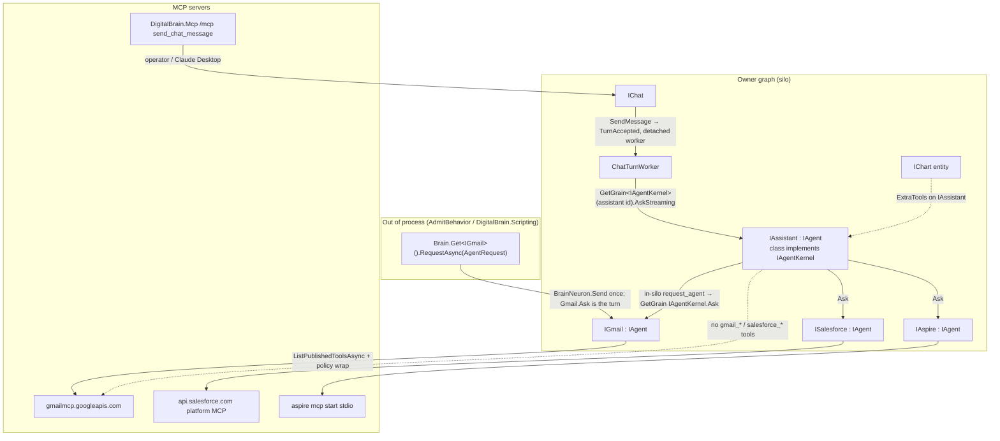
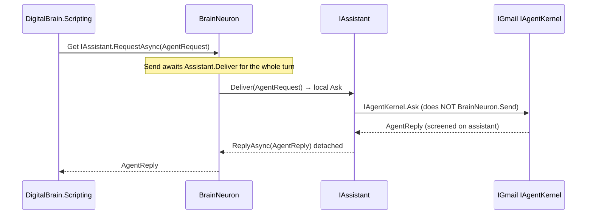
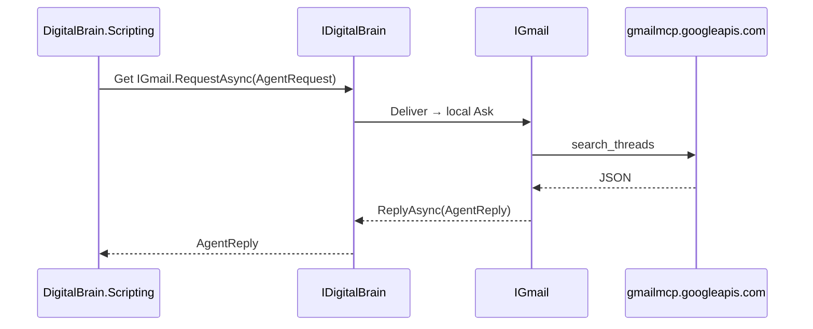
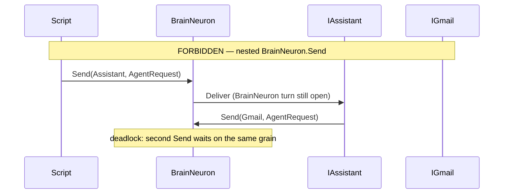

# MCP specialist agents on the DigitalBrain graph (Option A)

| Field | Value |
| --- | --- |
| **Title** | MCP specialist agents on the DigitalBrain graph (Option A) |
| **Author** | TBD |
| **Date** | 2026-09-04 |
| **Status** | Draft (revision 4 — OAuth list throw, no Sdk→AI, no static halt) |
| **Authority** | `CONTEXT.md` (naming), owner-ratified Option A (this document) |

---

## Overview

DigitalBrain programs a durable graph with typed C#. Chat today dumps every module’s tools onto one `IAssistant` model via `IAgentToolSource` clones (`GmailToolSource`, `SalesforceToolSource`, `KitToolSource`). Those clones re-declare MCP `tools/list` as hand-written `AIFunctionFactory` methods (`gmail_search_threads`, `salesforce_soql_query`, …) and sit next to JSON service facades (`IGmail.SearchJsonAsync`, `ISalesforce.QueryJsonAsync`). That is a second capability bus, and it is rejected.

**Option A:** every conversational specialist is the same kind of neuron. `IAgent : INeuron, IHandle<AgentRequest>` replies `AgentReply`. A single base class (`Agent`, already at `src/Modules/AI/AI/Agent.cs`) owns instructions, model, and an optional MCP session. Tools are **lazy-bound on first `Ask`** (never on activate): `ListPublishedToolsAsync`, wrap each live `McpClientTool` with policy, run one LLM turn with **only that server’s tools**. `IGmail`, `ISalesforce`, and `IAspire` are empty `IAgent` markers; the **class** also implements `IAgentKernel` (same split as `IChat` / `IChatKernel`). Scripts fire `Brain.Get<IGmail>().RequestAsync(new AgentRequest("mail from elon"))` after `RequestAsync` is constrained to `IHandle` like `SendAsync`.

`IAssistant` is this kind of neuron. **v1 graph tools are in-silo:** schema from an in-silo `ListPublishedToolsAsync` or a cached graph-tool list (`request_agent`, …); **invoke is `GrainFactory.GetGrain<IAgentKernel>(gmailId).Ask` on the assistant grain** so `AgentTurnContext` (login cards) is still on the turn. The assistant **must not** HTTP `tools/call` `/mcp/graph` — Orleans `RequestContext` does not ride HTTP, and Gmail login would regress. Nested `IDigitalBrain.RequestAsync` is still forbidden (deadlocks `BrainNeuron.Send`). Kit chart/image/excel stay `IAssistant.ExtraTools`. External HTTP `/mcp/graph` clients and owner-token protocol are **out of scope for v1**. Operator `/mcp` `send_chat_message` is unchanged.

IAW’s `AspireAgent` is cited only for **loading** tools from `ListToolsAsync`. Typed `RestartResourceAsync` / `ListResourcesAsync` wrappers are not copied. (IAW sources were not re-opened for this revision.)

---

## Background & Motivation

### Current state

| Piece | Today | Problem |
| --- | --- | --- |
| `IAgent` | Grain RPC `Respond` / `RespondStreaming` (`src/Modules/AI/Contracts/IAgent.cs`) | Owner API is Orleans, not a typed signal. Scripts cannot `SendAsync`/`RequestAsync` an agent. |
| `Agent` | Instructions + `IChatClient` + virtual `Tools` (`src/Modules/AI/AI/Agent.cs`) | Toolset is a bag filled by DI, not a live MCP list. |
| `IAssistant` | Empty marker; `Tools` = `GetServices<IAgentToolSource>().SelectMany(ToolsFor)` (`src/Modules/AI/AI/Assistant.cs`) | One model sees kit + Gmail + Salesforce + Excel. Instructions enumerate cloned names (`gmail_search_threads`, `salesforce_soql_query`). |
| `IAgentToolSource` | Module→AI inversion seam (`src/Modules/AI/Contracts/IAgentToolSource.cs`) | Designed to dump foreign tools onto the assistant. |
| `GmailToolSource` | Five `AIFunctionFactory.Create` methods mapping to `search_threads`, `get_thread`, … | Cloned catalog. Live MCP names never reach the model. `gmail_create_draft` calls `GmailDraftPreviews.CreateAsync`, **not** hosted MCP. |
| `IGmail` | DI singleton, `SearchJsonAsync` (`src/Modules/Google/Contracts/IGmail.cs`) | Not a neuron. Not `IHandle`. Scripts cannot address it with `Get<IGmail>()`. |
| `ISalesforce` | DI singleton JSON API + `SalesforceToolSource` clones a `confirmed` flag the hosted server does not publish | Same. Live names are `getUserInfo`, `soqlQuery`, `createRecord`, `updateRecord`. |
| `IAspire` | Does not exist in this repo | Do not add IAW-style typed wrappers. |
| DigitalBrain MCP | Separate process, `/mcp`, tool `send_chat_message` (`src/Kernel/DigitalBrain.Mcp`) | Operator surface only. `DigitalBrain.Mcp.csproj` references UI + Product contracts, **not** Google/Salesforce. |
| `McpToolClient<T>` | Per-owner session, bearer, `ListToolsAsync` used only for name allow-list (`src/Kernel/DigitalBrain.Sdk/Mcp/McpToolClient.cs`) | Schema is fetched then thrown away except for `session.Tools` names. Connect requires credentials (`GmailConnections.Identity` throws `McpAuthenticationRequiredException`). |
| Chat path | Flutter → `IChat.RequestAsync(SendMessage)` → `ChatTurnWorker.RunAsync` → `IAssistant.RespondStreaming` | Worker is correct because `SendMessage` `ReplyAsync`s `TurnAccepted` and detaches `_activeCall`. `Get<IAssistant>().RequestAsync` would **keep** `BrainNeuron.Send` open for the whole LLM turn. |
| In-silo reads | `IChatKernel` / `IExecutionKernel` exist because nested `RequestAsync` deadlocks | `IChat` does **not** extend `IChatKernel`. The worker uses `GetGrain<IChatKernel>(goal.Chat.ToGrainId())`. |
| `RequestAsync` | `NeuronReference.RequestAsync<TResponse>(Signal<TResponse>)` has **no** `IHandle` constraint (`NeuronReference.cs:23-27`) | `Get<IChat>().RequestAsync(new AgentRequest(...))` would compile today and fail as `Unhandled`. |
| `GrainType` | `Chat` has `[GrainType("chat")]`. `Assistant.cs` has **none**. `GrainTypeNames.Of(typeof(IGmail))` is `"Gmail"` then lowercased to `"gmail"`. | New specialists must declare `[GrainType("gmail")]` etc. Do not copy Assistant’s omission. |

Gmail policy is already in the right place: `GmailMcp` wraps `McpToolClient` with argument allow-list, draft identity, screening, projection, and `ValidateCatalog`. Hosted `create_draft` is refused unless a consumed preview supplies `expectedIdentity` (`GmailMcp.cs:41-44`). Salesforce confirmation and SOQL guards live in `SalesforceToolSource` — the wrong layer.

### Pain

1. Adding Calendar means a new interface method, a new `AIFunctionFactory`, a new assistant instruction paragraph, and a new `IAgentToolSource`. That is a catalog.
2. The assistant’s context window and tool-picker degrade as every server is flattened onto one model.
3. `IGmail.SearchJsonAsync` cannot be what scripts call; `CONTEXT.md` trigger is `SendAsync<TNeuron, TSignal>` / `RequestAsync` on a neuron that `IHandle`s the signal.
4. Grain `Respond` as owner API bypasses journals, synapses, and correlation.
5. `RequestAsync` is not actually type-safe today.

---

## Goals & Non-Goals

### Goals

1. One product fire path for specialists: `AgentRequest` → `AgentReply`, type-safe via `IHandle<AgentRequest>` on **both** `SendAsync` and `RequestAsync`.
2. One base class so `ICalendar` later is: empty marker + `[GrainType]` + MCP endpoint + OAuth/policy + one `request_agent` allow-list string. No new signals per tool. No new `AIFunction` factories per tool.
3. Live MCP `tools/list` is the specialist’s MEAI toolset. `McpClientTool` supplies name, description, JSON schema. Policy wraps invoke; it does not re-declare tools. **`Accept` allow-list is mandatory.**
4. `IAssistant` specialist hops use in-silo graph-tool schema + `IAgentKernel.Ask` invoke on the assistant grain. Not `IAgentToolSource` clones of Gmail/Salesforce/Aspire. Not HTTP `/mcp/graph`.
5. Chat turn may `Ask` a specialist (hop count **= 1**, hard-fail). Scripts use `Brain.Get<IGmail>().RequestAsync(...)`.
6. Nested `BrainNeuron.Send` / `IDigitalBrain.RequestAsync` from a neuron turn is forbidden. Replacement: `IAgentKernel` via `IGrainFactory` on the assistant grain.
7. Kernel still does not reference `DigitalBrain.Scripting`. MCP process does not reference Google/Salesforce contracts. No generated Orleans types. No grant catalog.

### Non-Goals

- Per-tool typed signals (`SearchGmail`, `gmail_search_threads` as C# methods).
- Copying IAW `IAspire.RestartResourceAsync` / `ListResourcesAsync` / `DeployAsync` wrappers.
- Dumping Gmail/Salesforce/Aspire tools onto `IAssistant`.
- Replacing `ChatTurnWorker`, `IChat` `IHandle`s, OAuth/`BrowserLogins`, or kit **entities**.
- Making kit charts MCP tools in this design (entities stay entities; kit remains `ExtraTools` until a later kit-MCP **if ever**).
- MAF Team/GroupChat orchestration (still later, per `docs/ARCHITECTURE.md`).
- A second English-language runtime or JSON capability bus for scripts.
- Specialists calling other specialists. **Runtime block:** hop count 1.
- Changing `ReplyAsync` from detached delivery (`SignalSender.ReplyAsync` → `ObserveDetachedAsync`).
- Putting `IAgentKernel` on owner marker interfaces (`IGmail : IAgentKernel` is rejected).
- Binding MCP on `OnNeuronActivatedAsync` (OAuth does not exist yet; activate must not fail).

---

## Proposed Design

### Shape on the graph

`IAgent` is a **kind of neuron** (LLM turn + optional MCP). CONTEXT.md still governs product language: the graph primitive is the neuron. PR 8 adds one CONTEXT.md sentence: **specialists are neurons that `IHandle<AgentRequest>`.** Do not call `IGmail` a service or a grain in owner-facing docs.



### Exact contracts

Place `AgentRequest` / `AgentReply` in `src/Modules/AI/Contracts/` (module-owned signals, same pattern as `SendMessage` in UI contracts). They are the **only** new signals for this design. **No `History` / `ChatMessageDto` in v1.** Scripts and `request_agent` pass `Text` only. Chat does **not** forward the owner transcript into a specialist (injection channel). If a later PR must share context, it is an explicit screened excerpt, not raw turns.

```csharp
// src/Modules/AI/Contracts/AgentRequest.cs
namespace DigitalBrain.AI;

[GenerateSerializer]
[Alias("db.agent-request")]
public sealed record AgentRequest(
    [property: Id(0)] string Text) : Signal<AgentReply>;

[GenerateSerializer]
[Alias("db.agent-reply")]
public sealed record AgentReply(
    [property: Id(0)] string Text) : Signal;
```

Do not put `OwnerId` or `AllowedToolNames` on the payload; those ride `SignalDelivery` / `AgentTurnContext` as they do today.

```csharp
// src/Modules/AI/Contracts/IAgent.cs
namespace DigitalBrain.AI;

[Alias(nameof(IAgent))]
public interface IAgent : INeuron, IHandle<AgentRequest>;
```

Owner markers **do not** extend `IAgentKernel`:

```csharp
[Alias("DigitalBrain.AI.IAssistant")]
public interface IAssistant : IAgent;

[Alias("DigitalBrain.Google.IGmail")]
public interface IGmail : IAgent;

[Alias("DigitalBrain.Salesforce.ISalesforce")]
public interface ISalesforce : IAgent;

[Alias("DigitalBrain.AI.IAspire")]
public interface IAspire : IAgent;
```

```csharp
// src/Modules/AI/Contracts/IAgentKernel.cs
namespace DigitalBrain.AI;

// In-silo return-value surface. Same split as IChatKernel:
// IChat does not extend IChatKernel; Chat implements both;
// ChatTurnWorker uses GetGrain<IChatKernel>(chat.ToGrainId()).
// Owners and scripts use IAgent + RequestAsync.
[Alias("agent.runtime")]
public interface IAgentKernel : IGrainWithStringKey
{
    [Alias(nameof(Ask))]
    [ResponseTimeout(NeuronCallTimeouts.LongRunning)] // 00:05:00 — current IAgent.Respond has no timeout
    Task<AgentReply> Ask(AgentRequest request, CancellationToken cancellationToken = default);

    [Alias(nameof(AskStreaming))]
    [ResponseTimeout(NeuronCallTimeouts.LongRunning)]
    IAsyncEnumerable<ChatResponseUpdate> AskStreaming(
        IReadOnlyList<ChatMessage> messages,
        CancellationToken cancellationToken = default);

    // Unlatch MCP tools so the next Ask re-lists. Not a product API.
    // Callers: GmailLogins/SalesforceLogins.OnLoginDelivered (module, not Sdk)
    // and the grain's own 401 policy catch (local this.InvalidateMcpTools()).
    // Sdk BrowserLogins.DeliverAsync must not reference IAgentKernel.
    [Alias(nameof(InvalidateMcpTools))]
    Task InvalidateMcpTools();
}
```

`IAgent.Respond` / `RespondStreaming` move onto `IAgentKernel`. They are grain RPC **only** for in-silo callers (`ChatTurnWorker`, assistant ExtraTools). They are not the owner API.

**Implementations** declare grain type and implement both interfaces (via `Agent`):

```csharp
[GrainType("assistant")]
internal sealed class Assistant : Agent, IAssistant { /* ExtraTools = kit + TemporaryAsk* until PR 6 */ }

[GrainType("gmail")]
internal sealed class GmailAgent : Agent, IGmail { }

[GrainType("salesforce")]
internal sealed class SalesforceAgent : Agent, ISalesforce { }

[GrainType("aspire")]
internal sealed class AspireAgent : Agent, IAspire { }
```

`Agent` itself is `Neuron, IAgent, IAgentKernel`. Default instance name `"default"` except the assistant, which stays `"assistant"` (`NeuronId.For<IAssistant>(owner, "assistant")`).

In-silo callers address the kernel interface with the **same grain id** as the marker (chat pattern):

```csharp
GrainFactory.GetGrain<IAgentKernel>(
    NeuronId.For<IAssistant>(owner, "assistant").ToGrainId())
    .AskStreaming(messages, ct);

GrainFactory.GetGrain<IAgentKernel>(
    NeuronId.For<IGmail>(owner, "default").ToGrainId())
    .Ask(new AgentRequest(text), ct);

// Assistant ExtraTool (same grain as AgentTurnContext): type name is a string — no IGmail reference
var id = new NeuronId(neuronType, Id.Owner, "default");
GrainFactory.GetGrain<IAgentKernel>(id.ToGrainId()).Ask(new AgentRequest(text), ct);
```

`ChatTurnWorker` does **not** `GetGrain<IAssistant>()` for the turn. It uses `IAgentKernel` like it already uses `IChatKernel`.

### `RequestAsync` compile-time gate (PR 1)

Today `SendAsync` is constrained; `RequestAsync` is not. PR 1 tightens `NeuronReference.RequestAsync` to match CONTEXT.md **without breaking** `RequestAsync<SilentResponse>(new SilentRequest(...))` (`FacadeTests.cs`).

C# cannot put `where TNeuron : IHandle<TRequest>` on a one-type-argument `RequestAsync<TResponse>(Signal<TResponse>)` (`TRequest` is the concrete record). Product code uses the constrained two-parameter method (inference from `new AgentRequest(...)`). The one-parameter overload stays for explicit `RequestAsync<TResponse>(...)` call sites **and is not unconstrained**: PR 1 updates `FacadeTests` to inferred `RequestAsync(new SilentRequest(...))` so a **single** constrained method is enough. **Do not** keep an unconstrained `RequestAsync<TResponse>(Signal<TResponse>)` — that would let `Get<IChat>().RequestAsync(new AgentRequest(...))` compile again.

```csharp
// src/Kernel/DigitalBrain.Contracts/NeuronReference.cs
public Task<TResponse> RequestAsync<TRequest, TResponse>(
    TRequest request,
    CancellationToken cancellationToken = default)
    where TNeuron : IHandle<TRequest>
    where TRequest : Signal<TResponse>
    where TResponse : Signal
    => _client.SendRequestAsync<TResponse>(Id, request, cancellationToken);
```

`Brain.Get<IGmail>().RequestAsync(new AgentRequest("…"))` infers both type args and compiles (`IGmail : IHandle<AgentRequest>`).

`Brain.Get<IChat>().RequestAsync(new AgentRequest("…"))` **does not compile**.

`silent.RequestAsync(new SilentRequest("ignored"))` infers `SilentRequest` / `SilentResponse`. Drop the explicit `<SilentResponse>` type argument in `FacadeTests` (same PR).

### Base class: `Agent`

Keep the existing name. Do **not** introduce `McpAgent` as a second hierarchy. MCP is optional (null binding ⇒ no MCP tools, still handles `AgentRequest`; assistant still has kit `ExtraTools`).

Responsibilities of `Agent` (and only these):

1. Instructions + model (`IChatClient`, including `[Llm<TModel>]` on the constructor).
2. Optional MCP binding.
3. **Lazy bind** on first `Ask` / `AskStreaming`, and refresh after auth/catalog reset. **Never** connect in `OnNeuronActivatedAsync`. **Never** fail activate because OAuth is missing.
4. Policy wrapper around invoke (OAuth JSON, screening, write overlay, catalog validation, **mandatory `Accept`**).
5. `HandleAsync(AgentRequest)` calls **local** `Ask` (not `GetGrain<IAgentKernel>(Id).Ask` — same-grain deadlock under serialized turns), then `ReplyAsync(AgentReply)`.
6. `IAgentKernel.Ask` / `AskStreaming` = the same turn, returned to an in-silo caller.

```csharp
// src/Modules/AI/AI/Agent.cs  (target shape)
public abstract class Agent : Neuron, IAgent, IAgentKernel
{
    private readonly IChatClient _chat;
    private IReadOnlyList<AITool> _mcpTools = [];
    private bool _mcpBound;
    private int _specialistHopsThisTurn;
    private string? _authHaltJson; // set by policy invoke; Ask short-circuits

    protected Agent(NeuronRuntime runtime, IChatClient chat) : base(runtime)
        => _chat = chat;

    protected abstract string Instructions { get; }

    protected virtual AgentMcpBinding? Mcp => null;

    // Kit/excel on IAssistant only. Specialists: empty.
    // PR 3–5 may add TemporaryAskGmail / TemporaryAskSalesforce on Assistant; PR 6 deletes them.
    protected virtual IReadOnlyList<AITool> ExtraTools => [];

    protected override Task OnNeuronActivatedAsync(CancellationToken cancellationToken)
        => Task.CompletedTask; // no MCP I/O

    public async Task HandleAsync(AgentRequest signal, CancellationToken cancellationToken)
    {
        // Local method — never GetGrain<IAgentKernel>(Id).Ask
        var reply = await Ask(signal, cancellationToken).ConfigureAwait(true);
        await ReplyAsync(reply).ConfigureAwait(true);
    }

    public async Task<AgentReply> Ask(AgentRequest request, CancellationToken cancellationToken)
    {
        var text = new StringBuilder();
        await foreach (var update in AskStreaming(MessagesFor(request), cancellationToken).ConfigureAwait(true))
            text.Append(update.Text);
        if (_authHaltJson is { } json)
        {
            return new AgentReply(json); // no extra model step after auth JSON
        }

        return new AgentReply(text.ToString());
    }

    public async IAsyncEnumerable<ChatResponseUpdate> AskStreaming(
        IReadOnlyList<ChatMessage> messages,
        [EnumeratorCancellation] CancellationToken cancellationToken)
    {
        _specialistHopsThisTurn = 0;
        _authHaltJson = null;
        await EnsureMcpToolsAsync(cancellationToken).ConfigureAwait(true);
        await foreach (var update in RunTurnAsync(messages, cancellationToken).ConfigureAwait(true))
        {
            if (_authHaltJson is not null)
            {
                yield break; // tool already returned auth JSON; do not continue the model loop
            }

            yield return update;
        }
    }

    public Task InvalidateMcpTools()
    {
        _mcpBound = false;
        _mcpTools = [];
        return Task.CompletedTask;
    }

    // Assistant ExtraTools / in-silo request_agent only. Second hop → fixed error, no nested Ask.
    protected bool TryBeginSpecialistHop(out string? error)
    {
        if (_specialistHopsThisTurn >= 1)
        {
            error = "Only one specialist ask is allowed per turn.";
            return false;
        }

        _specialistHopsThisTurn++;
        error = null;
        return true;
    }

    private async Task EnsureMcpToolsAsync(CancellationToken cancellationToken)
    {
        if (Mcp is not { } binding || _mcpBound)
        {
            return;
        }

        try
        {
            var published = await binding.Client.ListPublishedToolsAsync(Id.Owner, cancellationToken)
                .ConfigureAwait(true);
            // Missing OAuth throws (caught below). [] means credentials exist and
            // the server published nothing — still not a successful bind.
            if (published.Count == 0)
            {
                _mcpTools = [];
                return;
            }

            _mcpTools =
            [
                .. published
                    .Where(binding.Accept)
                    .Select(tool => binding.Bind(tool, Id.Owner, json => _authHaltJson = json)),
            ];
            _mcpBound = true;
        }
        catch (McpAuthenticationRequiredException)
        {
            _mcpTools = [];
            // do not set _mcpBound; next Ask retries list after OAuth
        }
    }
}
```

`RunTurnAsync` is today’s `RespondStreaming`: `AgentTurnContext.Current?.AllowedToolNames` filters tools; `TurnBoundFunction` keeps invokes on the neuron turn scheduler (`src/Modules/AI/AI/Tools/TurnBoundFunction.cs`). Max output tokens stay 4096 unless a later PR retunes.

**Refresh after OAuth (normative):**

1. **Missing OAuth must throw** `McpAuthenticationRequiredException` from `ListPublishedToolsAsync`. `EnsureMcpToolsAsync` catches it, leaves `_mcpTools = []`, **does not** set `_mcpBound`. The next `Ask` retries. That covers **first login** without anyone calling `InvalidateMcpTools`.
2. **`[]` is reserved** for “credentials exist, server published nothing.” Do **not** set `_mcpBound` when `published.Count == 0`.
3. **Sdk `BrowserLogins.DeliverAsync` must not call `IAgentKernel`.** `DigitalBrain.Sdk` does not reference AI contracts. Do not add that reference.
4. **Module logins** (`GmailLogins` / `SalesforceLogins`, which already reference AI) override a **empty virtual** `OnLoginDelivered(AgentTurnContext)` on `BrowserLogins` (Sdk hook with no AI types) and then `GetRequiredService<IGrainFactory>().GetGrain<IAgentKernel>(gmailId).InvalidateMcpTools()`. Optional acceleration after first login; not required for correctness of (1).
5. **401 on the grain:** policy catch calls **local** `InvalidateMcpTools()` (same turn, no Sdk → AI). Then the next `Ask` re-lists.

Test: Gmail grain **activates with no token**; after OAuth, **without restarting the grain**, `Ask` sees `search_threads` (unbound retry is sufficient even if `OnLoginDelivered` is late).

Adding `ICalendar`:

```csharp
public interface ICalendar : IAgent;

[GrainType("calendar")]
internal sealed class CalendarAgent(
    NeuronRuntime runtime,
    [Llm<OpenAIModels.IGpt56Luna>] IChatClient chat,
    CalendarMcp mcp) : Agent(runtime, chat), ICalendar
{
    protected override string Instructions => """You are the owner's Calendar specialist. Use only your live MCP tools.""";
    protected override AgentMcpBinding? Mcp => mcp.Binding;
}
```

`request_agent` allow-list gains `"calendar"`. No new signals. No `CalendarToolSource`. No `SearchCalendarAsync`. MCP process is not edited.

v1 specialist model: **same default `IChatClient` as the assistant** (no cheaper marker until measured).

### MCP binding and policy — schema live, invoke gated

`McpClientTool` is already an `AIFunction`. We still **must not** pass the raw tool to the model: its `Invoke` talks to the MCP transport and would skip policy (screening, draft preview, Salesforce write overlay, 30s deadline).

Rule: **schema from `ListToolsAsync`; invoke through the server’s policy object.** One wrapper type for every server. **`Accept` is required** (`ValidateCatalog` today only checks required tools exist; it does **not** drop extras — `GmailMcp.cs:76-110`). A hosted `delete` must never reach `ChatOptions.Tools`.

```csharp
// src/Kernel/DigitalBrain.Sdk/Mcp/IPublishedMcpTools.cs
namespace DigitalBrain.Sdk;

// Implemented by McpToolClient<TConnection>. AI references this, not Google.
public interface IPublishedMcpTools
{
    // Missing OAuth MUST throw McpAuthenticationRequiredException (Agent leaves
    // _mcpBound false). Return [] only when credentials exist and tools/list is empty.
    // Never used from OnActivate.
    Task<IReadOnlyList<McpClientTool>> ListPublishedToolsAsync(
        OwnerId owner, CancellationToken cancellationToken);
}
```

`McpToolClient<TConnection> : IPublishedMcpTools`. `ListPublishedToolsAsync` reuses the existing session connect path. If `IMcpCredentials.Connection` throws `McpAuthenticationRequiredException`, **propagate it** — do not translate to `[]`. Keep `session.Tools` as the name set for `InvokeAsync`. Do not add a second catalog.

```csharp
// src/Modules/AI/AI/AgentMcpBinding.cs
public sealed class AgentMcpBinding
{
    public required IPublishedMcpTools Client { get; init; }
    public required Func<OwnerId, string, IReadOnlyDictionary<string, object?>, CancellationToken, Task<string>> Invoke { get; init; }
    public required Func<McpClientTool, bool> Accept { get; init; } // mandatory

    public AIFunction Bind(McpClientTool tool, OwnerId owner, Action<string> haltAuth)
        => new PolicyBoundMcpTool(tool, async (name, args, ct) =>
        {
            var result = await Invoke(owner, name, args, ct).ConfigureAwait(false);
            if (IsAuthenticationStatus(result))
            {
                haltAuth(result); // instance field / RequestContext — never a process-wide static
            }

            return result;
        });
}

internal sealed class PolicyBoundMcpTool(
    McpClientTool inner,
    Func<string, IReadOnlyDictionary<string, object?>, CancellationToken, Task<string>> invoke)
    : AIFunction
{
    public override string Name => inner.Name; // search_threads, not gmail_search_threads
    public override string Description => inner.Description;
    public override JsonElement JsonSchema => inner.JsonSchema;

    protected override async ValueTask<object?> InvokeCoreAsync(
        AIFunctionArguments arguments, CancellationToken cancellationToken)
    {
        // Never throw McpAuthenticationRequiredException to MEAI.
        return await invoke(Name, ToDictionary(arguments), cancellationToken).ConfigureAwait(false);
    }
}
```

**Auth rule (normative):** policy `Invoke` never throws auth to MEAI. On `McpAuthenticationRequiredException`:

1. If `AgentTurnContext.Current` is set, `BrowserLogins.Require(...)` mints `UserActionRequest` (login card). Return the same bounded JSON `GmailToolSource.GuardAsync` returns today (`status=authentication_required`, `actionId`, message).
2. If there is **no** turn context (script `RequestAsync(IGmail)`), do **not** throw a grain failure and do **not** invent a login URL. Return JSON `{ "status": "authentication_required", "message": "Connect Gmail in chat first." }`.

**Short-circuit:** that JSON is a **tool result**, not yet `AgentReply.Text`. After policy returns auth JSON, `Ask` / `AskStreaming` **must not** run another model step. Set `AgentReply.Text` to that JSON (same for chat: `FindUserAction` still overlays the card; the specialist/assistant reply is the JSON, not a model paraphrase).

**No process-wide halt.** `_authHaltJson` is an instance field on `Agent`. The `Bind` closure writes it (`json => _authHaltJson = json`). `TurnBoundFunction` already runs invoke on that neuron’s turn scheduler, so two owner grains cannot cross-write. Do **not** introduce `AgentTurnHalt` static / `AsyncLocal` that is not grain-scoped. Stashing the JSON on `RequestContext` (same as `AgentTurnContext`) is also legal. Test: two owners authenticating at once do not mix halt JSON.

#### Gmail invoke switch (not a single `CallAsync`)

Live names bound (`Accept` + `GmailLogins.ReadTools` after the cut):

| Live MCP name | Role | Invoke |
| --- | --- | --- |
| `search_threads` | read | `GmailMcp.CallAsync` |
| `get_thread` | read | `GmailMcp.CallAsync` |
| `list_labels` | read (also connectivity) | `GmailMcp.CallAsync` |
| `create_draft` | preview only | **`GmailDraftPreviews.CreateAsync`** (same `RequireContext` / compose login as `GmailToolSource.GuardAsync`) |

**Do not bind** `gmail_get_current_account` — it is not a hosted tool (today it is `list_labels` + local identity). Specialist instructions: use `list_labels` / live tools; never that cloned name.

Hosted `create_draft` remains **preview-consumption only**: `GmailMcp.CallAsync(..., expectedIdentity)` is called from `GmailDraftPreviews` / `ITrustedUserCommandHandler` after the user types `confirm gmail draft <id>` in a **new** authenticated message. The specialist model calling live `create_draft` must **not** hit Google.

Test: model-visible tool name is `create_draft`; invoke does not hit Google until `ITrustedUserCommandHandler` confirms.

Gmail `Invoke` (on `GmailAgent`, not Sdk) on `McpAuthenticationRequiredException`: mint login JSON, call **local** `InvalidateMcpTools()`, never throw to MEAI. Same for Salesforce.

#### Salesforce write overlay (no cloned `confirmed` AIFunction)

Live names (`McpSalesforce` already uses these):

| Live MCP name | Role | Invoke |
| --- | --- | --- |
| `getUserInfo` | read | `SalesforceMcp.CallAsync` after login gate |
| `soqlQuery` | read | `SalesforceQueryGuard.Validate` then `CallAsync` |
| `createRecord` | write | overlay below — **never** `CallAsync` on the specialist turn |
| `updateRecord` | write | same |

**Do not bind** `delete` / any other hosted name. **Do not** re-declare `salesforce_create_or_update` with a `confirmed` parameter. The hosted schema has no DigitalBrain `confirmed` flag; putting one on a fake AIFunction is a cloned catalog.

Overlay (in `SalesforceMcp.Invoke`, parallel to Gmail’s switch):

1. Reads (`getUserInfo`, `soqlQuery`): `CallAsync`. Login-resume allow-list is exactly these two names (`SalesforceLogins.ReadTools` after the cut).
2. Writes (`createRecord`, `updateRecord`):
   - **Always** treat the specialist-turn invoke as preview: validate args, screen, return `{ confirmationRequired: true, operation, objectType, id, body, message }` JSON. **Do not** `CallAsync`.
   - Publish a `SalesforceWritePreviews` entry (same shape as `GmailDraftPreviews`) and tell the model the exact trusted command (`confirm salesforce write <id>`).
   - Execute hosted write **only** from `ITrustedUserCommandHandler` on a **new** authenticated user message that matches the preview. Login resume (`AllowedToolNames is not null`) **never** executes a write (same as `SalesforceToolSource.cs:97-100`).
3. No `confirmed` argument is accepted from the model. If the hosted tool JSON happens to include a similar field, strip it; it is not authorization.

#### Aspire

`Accept` binds whatever `aspire mcp start` lists **except** that `execute_resource_command` / restart / deploy-shaped tools are `IsReadOnly = false` (no 401 replay). No typed wrappers. Dev-only until PR 6 in-silo `request_agent` allow-list includes `aspire`; until then chat cannot reach Aspire except via scripts.

### IAssistant’s graph tools vs IGmail’s MCP

The assistant **must not** HTTP-invoke `/mcp/graph`. `AgentTurnContext` lives in Orleans `RequestContext` on the assistant grain turn (`ChatTurnWorker` `Enter`). HTTP `tools/call` drops it; Gmail `Ask` would take the script auth branch and **no login card** would mint.

| | `IAssistant` (v1) | `IGmail` |
| --- | --- | --- |
| Schema | In-silo: cached graph-tool list **or** in-silo `ListPublishedToolsAsync` (same names as a future GraphTools catalog). **Not** HTTP `tools/list` against `DigitalBrain.Mcp`. | Hosted Gmail MCP `ListPublishedToolsAsync` |
| Invoke | **On the assistant grain:** `GrainFactory.GetGrain<IAgentKernel>(gmailId).Ask` + screen + `_specialistHopsThisTurn`. `AgentTurnContext` is already present. | `GmailMcp` / `GmailDraftPreviews` switch |
| Endpoint | none in v1 | `https://gmailmcp.googleapis.com/mcp/v1` |
| Owner | `Id.Owner` on the assistant grain | Per-owner Google OAuth via `GmailConnections` |
| Live tools | `request_agent` (generic), optionally `list_agents` / `admit_behavior` / `read_journal` as ExtraTools with `IGrainFactory` bodies | `search_threads`, `get_thread`, `list_labels`, `create_draft` |
| Also on the assistant | **Kit `ExtraTools`** — remaining catalog, closed over `Id.Owner`; `chatName` is the owner-qualified grain key | none |
| Filtered out | `send_chat_message`; Gmail/Salesforce/Aspire tool names | Anything not in `Accept` |

**v1 DigitalBrain.Mcp:** operator `/mcp` + `send_chat_message` only. **No `/mcp/graph` HTTP surface, no owner-token protocol, no `SessionOwner.From(http)`.** External graph MCP clients are a later PR with a real token. `DefaultOwner` is not an actor for specialist hops.

In-silo `request_agent` (PR 6; replaces `TemporaryAskGmail` / `TemporaryAskSalesforce`):

```csharp
// Assistant ExtraTools — runs on the assistant grain, not in DigitalBrain.Mcp
Task<string> RequestAgent(string neuronType, string text, CancellationToken ct)
{
    if (!TryBeginSpecialistHop(out var hopError))
    {
        return Task.FromResult(hopError!);
    }

    if (RefusedTypes.Contains(neuronType) || !SpecialistTypes.Contains(neuronType))
    {
        return Task.FromResult("neuronType is not a specialist.");
    }

    var id = new NeuronId(neuronType, Id.Owner, "default");
    return AskSpecialistAsync(id, text, ct);
}

async Task<string> AskSpecialistAsync(NeuronId id, string text, CancellationToken ct)
{
    var reply = await GrainFactory.GetGrain<IAgentKernel>(id.ToGrainId())
        .Ask(new AgentRequest(text), ct).ConfigureAwait(false);
    return await ScreenReplyAsync(screen, reply.Text, ct).ConfigureAwait(false);
}
```

Schema for that function is a hand-built `AIFunctionFactory` or an in-silo cached JSON schema (one generic tool, not per-Gmail clones). Invoke is the delegate above. Adding `ICalendar` = silo grain + `"calendar"` on `SpecialistTypes`. MCP process is not edited. Owner is `Id.Owner`.

`admit_behavior` / `read_journal` ExtraTools (if bound) use `IGrainFactory` (`GetGrain<IBehaviors>().HandleAsync`, `GetGrain<INeuronQuery>(id).ReadJournal`) — **not** `IDigitalBrain`.

### Recursion and hop count (normative)

1. **Hop count = 1, hard-fail, enforced on the assistant turn.** `Ask` / `AskStreaming` reset `_specialistHopsThisTurn = 0`. `TryBeginSpecialistHop` gates `TemporaryAsk*` and in-silo `request_agent`. A second tool call in the **same** assistant turn returns `"Only one specialist ask is allowed per turn."` and does **not** `Ask` a second specialist. Do **not** put hop checks in an MCP process (`RequestContext` / `Hop.RequireZero()` would not see the assistant turn).
2. **Refuse list** (in-silo `request_agent`): `assistant`, `chat`, `chat-turn-worker`, `brain` / `sessionneuron`, `execution`, anything not on `gmail|salesforce|aspire`.
3. **Specialists must not bind graph/`request_agent` tools.** Test: Gmail `ChatOptions.Tools` names ∩ `{request_agent, send_chat_message}` is empty.
4. **`TemporaryAskGmail` / `TemporaryAskSalesforce`** (PR 3–5 ExtraTools): grep-able; in-silo `Ask`; **replaced in PR 6** by generic `request_agent` ExtraTool (still in-silo).
5. **`HandleAsync` calls local `Ask`**, never `GetGrain<IAgentKernel>(Id).Ask`.
6. Operator `/mcp` `send_chat_message` stays off the assistant (recursion). Test: one assistant turn, two `request_agent` calls → second is the hop error, no second specialist LLM.

### Screening specialist replies

`ChatTurnWorker` screens execution/projection blobs, **not** tool results (`ChatTurnWorker.cs:147-188`). Gmail screening in `GmailMcp.CallAsync` protects the **specialist** model. The assistant then receives `AgentReply.Text` (model-authored English over email).

**Normative:** before the assistant model consumes a specialist result (`request_agent` ExtraTool, `TemporaryAskGmail` / `TemporaryAskSalesforce`, any in-silo hop that returns text into `ChatOptions` tool output):

1. Run `IUntrustedContentScreen.ScreenAsync` on `AgentReply.Text` (32 KiB cap, same class as today).
2. On failure: return the fixed string `Specialist output was withheld because security screening did not pass. Do not invent its contents.` Do **not** skip screening. Do **not** pass the original text.

In-silo `request_agent` ExtraTool payloads use the same helper (`ScreenReplyAsync` above).

### Chat sequence

```mermaid
sequenceDiagram
  autonumber
  actor User
  participant Flutter
  participant Chat as IChat
  participant Worker as ChatTurnWorker
  participant Asst as IAssistant / IAgentKernel
  participant Gmail as IGmail / IAgentKernel
  participant GmailMCP as gmailmcp.googleapis.com

  User->>Flutter: "any mail from elon?"
  Flutter->>Chat: RequestAsync(SendMessage)
  Chat->>Chat: EnqueueTurn, ReplyAsync(TurnAccepted)
  Note over Chat: BrainNeuron.Send for SendMessage is finished
  Chat->>Worker: RunAsync(ChatTurnGoal) grain call, detached
  Worker->>Worker: IChatKernel.LoadTranscript (not RequestAsync)
  Worker->>Asst: GetGrain IAgentKernel(assistant id).AskStreaming
  Note over Asst: AgentTurnContext still on this grain; _specialistHopsThisTurn
  Asst->>Gmail: GetGrain IAgentKernel(gmail id).Ask(AgentRequest)
  Note over Gmail: hop=1; lazy ListPublishedToolsAsync; same RequestContext
  Gmail->>GmailMCP: tools/call search_threads via GmailMcp.CallAsync
  GmailMCP-->>Gmail: threads JSON (screened)
  Gmail-->>Asst: AgentReply.Text
  Asst->>Asst: IUntrustedContentScreen on reply
  Asst-->>Worker: stream ChatResponseUpdate
  Worker-->>Chat: ChatTurnResult
  Chat-->>Flutter: transcript / SSE
```

Owner/script path that **nests** assistant + Gmail (the path that used to deadlock):



Direct script path (no assistant) still uses product `RequestAsync` **once**:



### Nested delivery (deadlock)

**Known fact:** `IChatKernel` exists because “Commands stay on `IChat.HandleAsync`; nested `RequestAsync` deadlocks the session neuron” (`IChatKernel.cs:5-6`). `RequestAsync` always does `IBrainNeuron.Send`, and `Send` **awaits** `Deliver` on a non-reentrant `BrainNeuron` (`DigitalBrainClientTransport.cs:162-164`, `BrainNeuron.cs:49-52`, `NeuronConcurrency` forbids `[Reentrant]`). `ReplyAsync` is detached (`SignalSender.cs:102-110`) so A-awaits-B / B-awaits-A on the **reply** path does not lock; it does **not** make nested `BrainNeuron.Send` safe.

Chat is safe today because `HandleAsync(SendMessage)` `ReplyAsync`s `TurnAccepted` and runs the worker as detached `_activeCall` (`Chat.cs`), so `BrainNeuron.Send` is finished before `AskStreaming`.

`Get<IAssistant>().RequestAsync(new AgentRequest("summarize inbox…"))` is **not** that pattern: `Send` stays open for the whole assistant `Deliver`/`Ask`. An ExtraTool that called `IDigitalBrain.Get<IGmail>().RequestAsync` would be a second `BrainNeuron.Send` on the same owner grain → deadlock. In-silo `IAgentKernel.Ask` does not `Send`.



**Rules (normative):**

1. **Owners and scripts** use `IDigitalBrain.Get<T>().RequestAsync` / `SendAsync` as the product API. **One** `BrainNeuron.Send` per owner call. Nested graph work inside that turn must not `Send` again.
2. **A neuron turn must not call `IDigitalBrain.RequestAsync` / `SendAsync` / `BrainNeuron.Send`.** Includes `Agent.HandleAsync`, `Ask`, MEAI tool invokes, and `ChatTurnWorker.RunAsync`.
3. **Assistant graph tools must not call `IDigitalBrain`.** Use `IGrainFactory` + `IAgentKernel`. Test: script `RequestAsync(IAssistant)` whose turn tools `request_agent(gmail)` **completes**, does not hang. Login during that hop still mints `UserActionRequest` because invoke is on the assistant grain (`AgentTurnContext` present).
4. **ChatTurnWorker → assistant:** `GetGrain<IAgentKernel>(NeuronId.For<IAssistant>(owner, "assistant").ToGrainId()).AskStreaming`.
5. **Assistant → specialist:** in-silo `request_agent` ExtraTool → `IAgentKernel.Ask` on this grain (PR 3–5: `TemporaryAskGmail`). Never HTTP `/mcp/graph`. Never `Brain.Get<IGmail>().RequestAsync`.
6. **Specialist → MCP server:** `McpToolClient` HTTP/stdio. Not a graph send.
7. **`Neuron.SendAsync(NeuronId, Signal)`** (direct `INeuron.Deliver`) is allowed in-silo for fire-and-forget (`KitCardOffer`, `Note`). Do not use it when the caller needs `AgentReply`.
8. **Self-delivery** stays on the local path in `SignalSender.DeliverAsync`. Agents must not `Ask` themselves (`GetGrain<IAgentKernel>(Id)` from `HandleAsync` is forbidden).
9. **Do not reopen** non-blocking `BrainNeuron.Send` or same-RPC `ReplyAsync` (Alternative 5).

`IAgentKernel` is the same in-silo exception already ratified for chat and execution, used here for the **full LLM turn** (side effects, MCP, 5 minutes), not merely reads.

### What dies

| Artifact | Replacement |
| --- | --- |
| `IAgentToolSource` as the Gmail/Salesforce dump seam | Live MCP lists + in-silo `request_agent` ExtraTool. Kit/excel become private `ExtraTools` on `IAssistant` (PR 7); the public interface dies when they are the last implementers. |
| `GmailToolSource` | `GmailAgent` + Gmail invoke **switch** + `PolicyBoundMcpTool` |
| `SalesforceToolSource` / cloned `confirmed` | `SalesforceAgent` + write overlay + `SalesforceWritePreviews` |
| `IGmail.SearchJsonAsync` / `McpGmail` / `FakeGmail` JSON service | `IGmail : IAgent`. Fakes: `GmailAgent` with no MCP (or a test MCP server) |
| `ISalesforce.GetUserInfoJsonAsync` / `QueryJsonAsync` / `UpsertJsonAsync` | Live MCP names through policy |
| Grain `IAgent.Respond` / `RespondStreaming` as **owner** API | `RequestAsync(AgentRequest)` with `IHandle` constraint. Methods live on `IAgentKernel` only. |
| `IGmail : IAgentKernel` on the owner contract | Class implements `IAgentKernel`; marker is `IAgent` only |
| Assistant instructions naming `gmail_*` / `salesforce_*` | Graph tools + kit ExtraTools; specialist instructions use live MCP names |
| `gmail_get_current_account` | `list_labels` + local identity inside policy if needed |
| IAW-style typed MCP wrappers on `IAspire` | Do not add |
| Binding MCP in `OnNeuronActivatedAsync` | Lazy bind on first `Ask` |

### What stays

| Artifact | Why |
| --- | --- |
| `ChatTurnWorker` | Detached from `IChat`; 5-minute turn budget |
| `IChat` `IHandle<SendMessage>` et al. | Product chat API |
| `IChatKernel` / `IExecutionKernel` | In-silo pattern; `IAgentKernel` is the analog for Ask |
| `BrowserLogins`, Gmail/Salesforce OAuth, `IHttpSurface`, `IUserActionSource` | Policy, not a tool catalog |
| `GmailDraftPreviews` / `ITrustedUserCommandHandler` | Trusted confirm is not an MCP tool flag |
| `IUntrustedContentScreen` | Untrusted email/SOQL **and** specialist `AgentReply.Text` |
| `McpToolClient`, `McpToolPolicy`, `IMcpCredentials` | SDK session/auth/retry; plus `IPublishedMcpTools` |
| `TurnBoundFunction` | Serialized neuron turns |
| `AgentTurnContext.AllowedToolNames` | Login resume must not enable writes |
| Kit entities (`IChart`, graph, image, excel) **and kit ExtraTools on IAssistant** | Deliberate remaining catalog; not specialist MCP |
| `DigitalBrain.Mcp` `/mcp` `send_chat_message` | Operator surface; E2E remains |
| Kernel ↛ Scripting architecture test | Unchanged |
| `NeuronCallTimeouts.LongRunning` = 5 minutes | Chat + nested specialist must finish inside this |

### Load, latency, storage (targets)

| Metric | Target | Basis |
| --- | --- | --- |
| Chat turn wall clock | ≤ 5 min hard (`NeuronCallTimeouts.LongRunning`, `Chat.TurnBudget`) | Existing |
| Extra HTTP graph hop | n/a in v1 | Assistant uses in-silo `request_agent` ExtraTool; owner is `Id.Owner` |
| Gmail MCP tool call | 30 s deadline (`GmailMcp` CTS + `McpSessionOptions.Timeout`) | Existing |
| Specialist `Ask` (one LLM + N MCP calls) | p95 < 45 s for read-only mail/SOQL | One model call + ≤3 tool round trips |
| Assistant turn with one specialist hop | p95 < 90 s | Two LLM calls |
| MCP sessions per kernel | ≤ 128 per `McpToolClient` (`McpSessionOptions.Capacity`) | Existing |
| Gmail session lifetime | 10 min | Existing |
| Gmail response budget | 1 MiB | Existing |
| Screening payload | 32 KiB (`UntrustedContentScreen`) | Existing |
| Specialist fan-out per assistant turn | **exactly 0 or 1** `request_agent` / TemporaryAsk* | Hop count 1 |
| New durable state | None beyond existing neuron journals + in-memory write previews | Same as Gmail drafts today |
| Tokens | Specialist sees only its MCP schemas (~4–20 tools), not the union of all servers | Primary point of Option A |

---

## API / Interface Changes

### Before (owner / script)

```csharp
// Impossible: IGmail is not INeuron
gmail.SearchJsonAsync(owner, "elon", "starship", ct);

await Brain.Get<IChat>(chat).RequestAsync(new SendMessage(command, text, actor));
```

Assistant tools: `gmail_search_threads`, `salesforce_soql_query`, `render_chart`, … on one model.

### After (owner / script)

```csharp
await Brain.Get<IGmail>().RequestAsync(new AgentRequest("mail from elon"));
await Brain.Get<ISalesforce>().RequestAsync(new AgentRequest("SOQL accounts named Acme, limit 10"));
await Brain.Get<IAspire>().RequestAsync(new AgentRequest("are the resources healthy?"));
await Brain.Get<IAssistant>("assistant").RequestAsync(new AgentRequest("summarize inbox and CRM for acme"));
```

The last call is **supported** and must not deadlock when the assistant’s in-silo `request_agent` `Ask`s Gmail (simulation test in PR 6). Login cards must still mint (`AgentTurnContext` on the assistant grain).

`SendAsync` stays constrained; `RequestAsync` **gains** the same `IHandle` gate (PR 1). `Get<IChat>().RequestAsync(new AgentRequest(...))` does not compile.

### In-silo (ChatTurnWorker)

```csharp
// before
GrainFactory.GetGrain<IAssistant>(NeuronId.For<IAssistant>(owner, "assistant").ToGrainId())
    .RespondStreaming(messages, ct);

// after — IChatKernel pattern, not GetGrain<IAssistant>
GrainFactory.GetGrain<IAgentKernel>(
    NeuronId.For<IAssistant>(owner, "assistant").ToGrainId())
    .AskStreaming(messages, ct);
```

---

## Data Model Changes

No Orleans schema migration. `AgentRequest` / `AgentReply` are new `[GenerateSerializer]` signals; journals already store `SignalDelivery` payloads.

`IGmail` / `ISalesforce` become grains. They are **new** neuron types, not a migration of the DI singletons. Old JSON facades are deleted in the same PR that ships the neuron so there is no dual API.

Fakes (`DigitalBrain:Fakes:Enabled`): register `GmailAgent` with `Mcp = null` (or a test MCP) instead of `FakeGmail`. Simulation tests that asserted `gmail_search_threads` must assert live names (`search_threads`) on the **Gmail** grain, not on `IAssistant`.

Login resume arrays **in the same PR as the neuron cut**:

- `GmailLogins.ReadTools`: `search_threads`, `get_thread`, `list_labels` (not `gmail_*`, not `gmail_get_current_account`, not `create_draft`).
- `SalesforceLogins.ReadTools`: `getUserInfo`, `soqlQuery` (not `salesforce_get_current_user` / `salesforce_soql_query`).

`SalesforceWritePreviews` is a new in-memory preview store analogous to `GmailDraftPreviews` (lost on restart, same as OAuth).

---

## Alternatives Considered

### 1. Typed per-tool signals (`SearchGmail`, `QuerySalesforce`)

**Rejected.** Owner already rejected hand-written catalogs that clone `tools/list`.

### 2. Keep `IAgentToolSource`; only stop cloning Gmail onto the assistant

**Rejected as the end state.** Temporary `TemporaryAskGmail` ExtraTool is allowed only until PR 6.

### 3. IAW AspireAgent duplication (ListToolsAsync **and** typed wrappers)

**Rejected.** Typed wrappers are a second catalog. We take live `ListPublishedToolsAsync` only, and **not** on activate (OAuth).

### 4. Graph tool invoke = in-silo `IGrainFactory` + `IAgentKernel.Ask` (no HTTP)

**Chosen as the default hop (v1).** Deadlock-safe (no nested `BrainNeuron.Send`) **and** `AgentTurnContext`-safe (login cards). Schema may be an in-silo cached list or in-silo `ListPublishedToolsAsync`. HTTP `/mcp/graph` `tools/call` from the assistant is **rejected** (drops `RequestContext`). External HTTP graph clients + owner-token protocol are a later PR, not v1.

### 5. Same-RPC return instead of `ReplyAsync` + journal correlation

**Rejected.** Do not reopen detached `ReplyAsync`. `IAgentKernel` is the in-silo return path.

### 6. `IGmail : IAgent, IAgentKernel` on the owner contract

**Rejected.** Leaks 5-minute RPC onto Google/Salesforce contracts and invites `GetGrain<IGmail>().Ask` from owner code. Follow `IChat` / `IChatKernel`.

---

## Security & Privacy Considerations

| Threat | Severity | Mitigation |
| --- | --- | --- |
| Assistant sees Gmail/Salesforce tools and is prompt-injected via email | High | Those tools are not on the assistant. Specialist screens MCP JSON; **assistant screens `AgentReply.Text`** before consume. |
| Model forges `OwnerId` / `chatName` | High | Tools close over `Id.Owner`. In-silo `request_agent` uses the assistant grain’s `Id.Owner`, not a tool argument. Kit ExtraTools refuse a `chatName` that is not this owner’s grain key. |
| `send_chat_message` on the assistant → infinite chat loop | High | Operator `/mcp` is not bound on the assistant; refuse list; hop count 1. |
| Nested specialist / confused deputy | High | Hop count 1 hard-fail; specialists have no `request_agent`; refuse `assistant`/`chat`/`brain`. |
| Nested `BrainNeuron.Send` from assistant graph tools | Critical | In-silo `IGrainFactory` only. Simulation: `RequestAsync(IAssistant)` + `request_agent(gmail)` completes. |
| Login resume used as write approval | High | `AllowedToolNames` are live **read** names only; writes never retry on 401. |
| Draft/SOQL mutation without explicit confirm | High | Gmail: `create_draft` → `GmailDraftPreviews` only. Salesforce: write tools always preview; execute only `ITrustedUserCommandHandler`. No model `confirmed` flag. |
| MCP catalog drift (Google adds `delete`, `send`) | High | Mandatory `Accept` allow-list. `ValidateCatalog` still requires known tools. Fake catalog with `delete` must not bind. |
| Credentials in chat / model-invented login URLs | High | Unchanged `BrowserLogins` + Flutter origin allow-list. Auth JSON, never throw to MEAI. |
| Confused-deputy `DefaultOwner` | High | v1 has no HTTP graph actor. Owner is `Id.Owner` on the assistant grain. |
| Screening bypass via raw `McpClientTool.Invoke` | High | Only `PolicyBoundMcpTool`. Test raw client not in `ChatOptions.Tools`. |
| Untrusted specialist English in assistant context | High | `IUntrustedContentScreen` on `AgentReply.Text`; withheld string on failure. |

Threat model in one line: **the specialist model is the only process allowed to pick Gmail tool names; the assistant model is not trusted to name `search_threads`.**

---

## Observability

Reuse `SignalTelemetry.Source` (`DigitalBrain`). Do not add a second telemetry product.

| Signal | Tags | When |
| --- | --- | --- |
| `handle` (existing) | `db.receiver`, `db.signal=AgentRequest`, `db.correlation` | Every specialist ask |
| `db.agent.turn` | `db.agent` (grain type), `db.mcp.server`, `db.tool.count`, duration, output tokens | End of `Ask` |
| `db.mcp.invoke` | `db.mcp.server`, `db.mcp.tool`, `db.mcp.readonly`, duration, outcome (`ok`/`auth`/`screen`/`error`/`preview`) | Policy invoke |
| `db.agent.hop` | parent agent, child agent, hop | `request_agent` / TemporaryAsk / in-silo `Ask` |

Logs: “Connected to {server} MCP, loaded {ToolCount} tools” on **first successful bind**, not activate. Unauthenticated bind: tools=0, grain still active.

Alerts:

- `db.mcp.invoke` error rate > 10% / 5 min per server.
- Catalog validation failure — page; access blocked.
- Hop-count violations (`db.agent.hop` rejected).

Traces: one `handle` span per agent. Do not capture message content (`OTEL_INSTRUMENTATION_GENAI_CAPTURE_MESSAGE_CONTENT=false`).

---

## Rollout Plan

No dual-run flag (`DigitalBrain:Agents:Specialists`). Replace-in-place per module.

1. **PR 1** contracts + `RequestAsync` constraint + `IAgentKernel` + `ChatTurnWorker` `AskStreaming`. Assistant still uses `IAgentToolSource`.
2. **PR 2** `IPublishedMcpTools` / `PolicyBoundMcpTool` / mandatory `Accept`.
3. **PR 3** Gmail neuron; delete `GmailToolSource`; `TemporaryAskGmail` ExtraTool; `GmailLogins.ReadTools` live names; lazy bind tests.
4. **PR 4** Salesforce analog + `TemporaryAskSalesforce` + write overlay.
5. **PR 5** Aspire specialist. **Chat cannot reach Aspire until PR 6** except via scripts (`Get<IAspire>().RequestAsync`). No temporary ExtraTool required if Aspire stays script/dev-only; say so in the PR.
6. **PR 6** in-silo generic `request_agent` ExtraTool (replace TemporaryAsk*); hop counter; screening; deadlock + login-card simulation. No HTTP `/mcp/graph`.
7. **PR 7** Kit/excel stay ExtraTools; delete public `IAgentToolSource`.
8. **PR 8** CONTEXT.md sentence; docs.

Rollback: revert the module PR. Neurons are new types; no state migration. OAuth tokens remain in-memory.

---

## Open Questions

Frozen items were moved to Key Decisions (15–20). Remaining:

1. **`request_agent` vs live-one-tool-per-neuron.** v1 is one generic tool plus a type-name allow-list. Revisit only if the assistant cannot pick `neuronType`.
2. **`IAspire` implementation project.** Contracts in AI (`IAspire.cs`). Implementation may live in an Aspire-facing module enabled only in Development. Not a product block.

---

## Risks

| Risk | Severity | Mitigation |
| --- | --- | --- |
| Nested `BrainNeuron.Send` deadlock ships by accident | **Critical** | Assistant ExtraTools forbid `IDigitalBrain`. Simulation: `RequestAsync(IAssistant)` + `request_agent(gmail)` completes. |
| Hosted Gmail adds dangerous tools | **High** | Mandatory `Accept`; fake catalog includes `delete`. |
| Two LLM calls blow the 5-minute turn or cost | **Medium** | Hop count 1; same default model until measured. |
| Login allow-list still has cloned names after cut | **High** | Same PR as the neuron; resume-after-login tests are load-bearing. |
| HTTP graph invoke drops `AgentTurnContext` | **High** | v1 invoke is in-silo only (Key Decision 16). |
| Assistant instruction drift | **Medium** | Delete `gmail_*` paragraphs in PR 3; do not leave Experience-tool lies for tools that are not bound. |
| `PolicyBoundMcpTool` schema vs invoke mismatch | **Medium** | Integration test: bound names ⊆ `Accept` ∩ published. |
| Gmail grain fails to activate without OAuth | **High** | Lazy bind; never MCP in `OnActivate`. |

---

## References

- `CONTEXT.md` — naming and typed `SendAsync`
- `docs/ARCHITECTURE.md` — ratified chat loop, integration modules, no second runtime
- `docs/integrations/gmail-mcp.md` — hosted Gmail MCP, OAuth, screening
- `docs/superpowers/specs/2026-09-04-scripted-behaviors-design.md` — out-of-process scripts
- `docs/superpowers/plans/2026-09-02-digitalbrain-v2-static-neuron-substrate.md` — detached `ReplyAsync`
- `src/Modules/AI/AI/Agent.cs`, `Assistant.cs`, `src/Modules/AI/Contracts/IAgent.cs`
- `src/Modules/AI/Contracts/IAgentToolSource.cs` — seam to delete
- `src/Modules/UI/DigitalBrain.Modules.UI/Chat/ChatTurnWorker.cs`, `Chat.cs` (detached `_activeCall`)
- `src/Modules/UI/DigitalBrain.Modules.UI.Contracts/Chat/IChatKernel.cs` — nested RequestAsync comment
- `src/Kernel/DigitalBrain.Contracts/NeuronReference.cs` — unconstrained `RequestAsync` (PR 1)
- `src/Kernel/DigitalBrain.Sdk/Mcp/McpToolClient.cs`, `McpToolPolicy.cs`
- `src/Kernel/DigitalBrain.Mcp/ChatTools.cs`, `McpSurface.cs`, `DigitalBrain.Mcp.csproj`
- `src/Modules/Google/Google/Gmail/GmailMcp.cs`, `GmailToolSource.cs`, `McpGmail.cs`, `GmailConnections.cs`
- `src/Modules/Salesforce/Salesforce/SalesforceToolSource.cs`, `McpSalesforce.cs`
- IAW (do not copy wrappers): `D:\Projects\IAW\src\Agents\Infrastructure\IAspire.cs`, `AspireAgent.cs` (not re-opened this revision)

---

## Key Decisions

1. **Option A (specialist neurons), not a tool dump on `IAssistant`.** One model per MCP server.
2. **Product API is `AgentRequest` / `AgentReply` on `IHandle`, not grain `Respond`.**
3. **Keep the existing `Agent` base class; do not add `McpAgent`.**
4. **Live `ListToolsAsync` schema + `PolicyBoundMcpTool` invoke.** Raw `McpClientTool.Invoke` is forbidden.
5. **Empty marker interfaces `IGmail` / `ISalesforce` / `IAspire` / `IAssistant : IAgent` only.** The **class** implements `IAgentKernel`. Callers use `GetGrain<IAgentKernel>(NeuronId.For<T>(...).ToGrainId())`. Rationale: `IChat` does not extend `IChatKernel`; owner contracts must not leak 5-minute RPC.
6. **`IAgentKernel` for in-silo Ask, mirroring `IChatKernel`.** `BrainNeuron.Send` is not reentrant; `ReplyAsync` is detached.
7. **DigitalBrain.Mcp stays operator `/mcp` `send_chat_message` in v1.** No HTTP `/mcp/graph`. `send_chat_message` must not be an assistant tool.
8. **Generic in-silo `request_agent` addresses `IAgentKernel` by grain type string + `Id.Owner`.** Allow-list: `gmail|salesforce|aspire`. Refuse: `assistant|chat|chat-turn-worker|brain|sessionneuron|execution`. No Google/Salesforce references on the assistant ExtraTool.
9. **Hosted Gmail/Salesforce `Accept` allow-list is mandatory** (not optional). `ValidateCatalog` does not drop extras by itself.
10. **Kit/Excel stay entities and `IAssistant.ExtraTools`.** Deliberate remaining catalog until a later kit-MCP **if ever**. Not Gmail-style MCP. `chatName` stays the owner-qualified grain key.
11. **OAuth, draft confirmation, screening stay in module policy.** Gmail `create_draft` invoke → `GmailDraftPreviews.CreateAsync`, not hosted `CallAsync`. Salesforce writes always preview; execute only via `ITrustedUserCommandHandler`. No cloned `confirmed` AIFunction.
12. **Do not copy IAW typed MCP wrappers.**
13. **Kernel still must not reference Scripting.** Assistant graph ExtraTools use `IGrainFactory`, not `IDigitalBrain`.
14. **Specialists do not hold `request_agent`.** Hop count **= 1**, hard-fail on the **assistant turn** (`_specialistHopsThisTurn`), not in an MCP process.
15. **No owner-token protocol in v1.** Specialist owner is `Id.Owner` on the assistant grain. External HTTP `/mcp/graph` clients are a later PR with a real token. `DefaultOwner` is not an actor. This replaces the frozen-but-unspecified HTTP session-owner story.
16. **Graph invoke is in-silo `IAgentKernel.Ask` (Alternative 4).** Assistant **must not** HTTP `tools/call` `/mcp/graph` (drops `AgentTurnContext`). `IDigitalBrain.RequestAsync` from the assistant turn is illegal.
17. **Lazy MCP bind on first `Ask`; never fail `OnActivate`.** Missing OAuth **throws** `McpAuthenticationRequiredException` from `ListPublishedToolsAsync` (caught; `_mcpBound` stays false). Do not set `_mcpBound` when `published.Count == 0`. `[]` means credentials exist and the server published nothing. Sdk `BrowserLogins.DeliverAsync` does **not** call `IAgentKernel`. First login is the unbound retry. `GmailLogins`/`SalesforceLogins` may override `OnLoginDelivered` to `InvalidateMcpTools`. 401 policy catch calls **local** `InvalidateMcpTools()`.
18. **`RequestAsync` is constrained to `IHandle` in PR 1**, matching `SendAsync` and CONTEXT.md. Single method `RequestAsync<TRequest, TResponse>`; update `FacadeTests` to inferred arity. No unconstrained `Signal<TResponse>` overload.
19. **`AgentRequest` v1 is `Text` only** (no `History` / `ChatMessageDto`). Streaming tokens are `IAgentKernel.AskStreaming` for chat; scripts get a single `AgentReply`.
20. **Auth never throws to MEAI.** JSON status + `UserActionRequest` when a turn context exists; script-only asks get the same JSON. **`Ask` short-circuits:** `AgentReply.Text` is that JSON; no extra model step.
21. **Screen `AgentReply.Text` (32 KiB `IUntrustedContentScreen`) before the assistant consumes it.** Failure → fixed withheld string.
22. **`HandleAsync` calls local `Ask`.** Temporary ExtraTools are named `TemporaryAskGmail` / `TemporaryAskSalesforce` and die in PR 6.
23. **Implementations set `[GrainType("gmail"|"salesforce"|"aspire"|"assistant")]`.** Do not copy current `Assistant.cs` omission.
24. **PR 8 CONTEXT.md:** one sentence — specialists are neurons that `IHandle<AgentRequest>`.
25. **Aspire is script/dev-only until PR 6.** No `TemporaryAskAspire` unless product later requires chat access earlier.
26. **v1 specialist model = assistant default `IChatClient`.** Cheaper markers are a later measurement, not a v1 fork.

---

## PR Plan

Each PR is independently reviewable and mergeable. Do not land generic `request_agent` before Gmail is a neuron (or the assistant loses mail with no replacement). Do not dual-run two Gmail catalogs. Do not add HTTP `/mcp/graph` in v1.

### PR 1 — AgentRequest product path, IHandle-gated RequestAsync, IAgentKernel split

- **Title:** `feat(ai): AgentRequest/AgentReply, IHandle RequestAsync, IAgentKernel Ask`
- **Files/components:** `src/Modules/AI/Contracts/IAgent.cs`, new `AgentRequest.cs` / `AgentReply.cs` / `IAgentKernel.cs` (includes `InvalidateMcpTools`); `src/Modules/AI/AI/Agent.cs` (`HandleAsync` → local `Ask`); `[GrainType("assistant")]` on `Assistant.cs`; `IAssistant : IAgent` only; `src/Kernel/DigitalBrain.Contracts/NeuronReference.cs` (constrained `RequestAsync<TRequest, TResponse>`); `FacadeTests.cs` drop explicit `RequestAsync<SilentResponse>`; `ChatTurnWorker.cs` → `GetGrain<IAgentKernel>(assistant id).AskStreaming`.
- **Dependencies:** none
- **Description:** Product path is `IHandle<AgentRequest>`. Move `Respond`/`RespondStreaming` to `IAgentKernel` with `[ResponseTimeout(LongRunning)]`. **Do not** leave an unconstrained `RequestAsync<TResponse>(Signal<TResponse>)` overload. Keep `IAgentToolSource` so chat does not regress. Architecture comment: no `IDigitalBrain` from Agent turns. `HandleAsync` must not `GetGrain<IAgentKernel>(Id)`.

### PR 2 — Live MCP tool binding on Agent (SDK + wrapper)

- **Title:** `feat(sdk,ai): IPublishedMcpTools, PolicyBoundMcpTool, mandatory Accept`
- **Files/components:** `src/Kernel/DigitalBrain.Sdk/Mcp/IPublishedMcpTools.cs`; `McpToolClient.cs` implements it; `AgentMcpBinding.cs` / `PolicyBoundMcpTool.cs`; tests with a fake MCP server that publishes `search_threads` **and** `delete` (delete must not bind); auth JSON never thrown to MEAI.
- **Dependencies:** PR 1
- **Description:** `ListPublishedToolsAsync` on the existing session path; missing OAuth **throws** `McpAuthenticationRequiredException` (`_mcpBound` stays false). `[]` only when credentials exist and `tools/list` is empty — still not a bind. Lazy `EnsureMcpToolsAsync` on first `Ask`. Auth JSON from a tool **short-circuits** `Ask` via the `Bind` closure writing `_authHaltJson` (no static). No Gmail cutover yet.

### PR 3 — IGmail becomes a specialist neuron

- **Title:** `feat(google): IGmail : IAgent with live Gmail MCP tools`
- **Files/components:** `IGmail.cs` (`: IAgent` only); `[GrainType("gmail")] GmailAgent`; `GmailMcp` invoke **switch**; `GmailDraftPreviews` still the `create_draft` path; `GmailLogins.ReadTools` → `search_threads`, `get_thread`, `list_labels`; delete `GmailToolSource.cs`, `McpGmail.cs`, `SearchJsonAsync`; `GoogleModule.cs`; `Assistant` instructions (remove `gmail_*`; do not leave Experience-tool claims for unbound tools); **`TemporaryAskGmail` ExtraTool** (grep-able; in-silo `IAgentKernel.Ask`; hop 0 only); tests: activate without token; after OAuth `Ask` sees `search_threads`; `create_draft` does not hit Google until trusted confirm; login resume; Gmail tools ∩ `{request_agent, send_chat_message}` is empty; screening of `AgentReply` when TemporaryAskGmail returns.
- **Dependencies:** PR 2
- **Description:** Delete cloned AIFunctions in the same PR. Assistant reaches Gmail only via `TemporaryAskGmail` until PR 6. **Do not** call `IAgentKernel` from Sdk `BrowserLogins.DeliverAsync`. First login: unbound retry (`ListPublishedToolsAsync` throws until OAuth exists). Optional: `GmailLogins.OnLoginDelivered` → `GetGrain<IAgentKernel>(gmailId).InvalidateMcpTools()`. 401: grain-local `InvalidateMcpTools()` in the policy catch. Test: activate with no token; after OAuth **without restarting the grain**, `Ask` sees `search_threads`. Login card still mints (in-silo hop keeps `AgentTurnContext`). Fake mode: `GmailAgent` with `Mcp = null` or test MCP.

### PR 4 — ISalesforce becomes a specialist neuron

- **Title:** `feat(salesforce): ISalesforce : IAgent with live hosted MCP tools`
- **Files/components:** `ISalesforce : IAgent`; `[GrainType("salesforce")]`; `SalesforceMcp` policy + write overlay; `SalesforceWritePreviews` + `ITrustedUserCommandHandler`; `SalesforceLogins.ReadTools` → `getUserInfo`, `soqlQuery`; delete `SalesforceToolSource.cs` and JSON facade methods; **`TemporaryAskSalesforce` ExtraTool**; assistant instructions; tests: write on specialist turn never `CallAsync`; trusted confirm executes; login resume cannot write; `Accept` excludes unknown hosted names.
- **Dependencies:** PR 2 (parallel with PR 3 after PR 2)
- **Description:** No cloned `salesforce_create_or_update` / `confirmed` AIFunction. Live names: `getUserInfo`, `soqlQuery`, `createRecord`, `updateRecord`.

### PR 5 — IAspire specialist (no typed wrappers)

- **Title:** `feat(ai): IAspire specialist via aspire mcp start`
- **Files/components:** `IAspire : IAgent`; `[GrainType("aspire")] AspireAgent`; stdio `aspire mcp start --non-interactive`; AppHost Development wiring; fake stdio MCP tests.
- **Dependencies:** PR 2
- **Description:** Lazy `ListPublishedToolsAsync`. **Do not** add `RestartResourceAsync` / `ListResourcesAsync` / `DeployAsync`. Mutating tools are writes (no 401 replay). **Chat cannot reach Aspire until PR 6** (`request_agent` allow-list). Until then: scripts `Get<IAspire>().RequestAsync` only. No `TemporaryAskAspire` in v1.

### PR 6 — In-silo generic `request_agent` (no HTTP `/mcp/graph`)

- **Title:** `feat(ai): in-silo request_agent ExtraTool via IAgentKernel.Ask`
- **Files/components:** `Assistant.cs` ExtraTools (`request_agent` + hop counter + screening); delete `TemporaryAskGmail` / `TemporaryAskSalesforce`; **do not** add `/mcp/graph` or owner tokens to `DigitalBrain.Mcp`; E2E `McpSurfaceTests` (operator `/mcp` unchanged).
- **Dependencies:** PR 3, PR 4 (specialists must exist). PR 5 optional for `aspire` on the allow-list.
- **Description:** Replace per-provider TemporaryAsk* with one in-silo `request_agent(neuronType, text)` whose invoke is `GetGrain<IAgentKernel>(new NeuronId(type, Id.Owner, "default")).Ask`. Schema is a cached in-silo list (or in-silo `ListPublishedToolsAsync`), **never** HTTP `tools/call`. `_specialistHopsThisTurn`: second call in one turn returns the hop error, no second specialist LLM. Screen `AgentReply.Text` before the assistant consumes it. Simulation: `RequestAsync(IAssistant)` + `request_agent(gmail)` **completes**; Gmail login during that hop still mints a `UserActionRequest` (`AgentTurnContext` present). Refuse `assistant|chat|brain`. No `IDigitalBrain` from ExtraTools. External `/mcp/graph` clients are out of scope.

### PR 7 — Confine kit ExtraTools; delete IAgentToolSource

- **Title:** `refactor(ai): delete IAgentToolSource; kit remains Assistant ExtraTools`
- **Files/components:** `IAgentToolSource.cs`; `KitToolSource.cs`; `ExcelToolSource.cs`; `UIModule.cs`; `ExcelModule.cs`; `Assistant.ExtraTools`; `AgentToolTests.cs` / `KitToolTests.cs` retargeted at ExtraTools.
- **Dependencies:** PR 6
- **Description:** **Not a coin flip.** Kit/excel stay ExtraTools on `IAssistant` (closed over `Id.Owner`). Delete the public `IAgentToolSource` seam. No kit-MCP in this design. Entities stay entities.

### PR 8 — Owner API cleanup and docs

- **Title:** `docs,ai: specialists IHandle AgentRequest; retire owner-facing agent RPC`
- **Files/components:** `CONTEXT.md` (one sentence: specialists are neurons that `IHandle<AgentRequest>`); `docs/ARCHITECTURE.md` integration paragraph; sample `start.cs` snippet; leftover `Respond` aliases if any; architecture test “AI module types do not reference IDigitalBrain”.
- **Dependencies:** PR 6
- **Description:** Document `Brain.Get<IGmail>().RequestAsync(new AgentRequest(...))`. State `IAgentKernel` is in-silo only. Record IAW wrappers as anti-pattern. No behavior change.

**Suggested merge order:** 1 → 2 → (3 ∥ 4 ∥ 5) → 6 → 7 → 8. PR 5 can ship after 2 even if 6 is late; Aspire is script/dev-only until PR 6.
