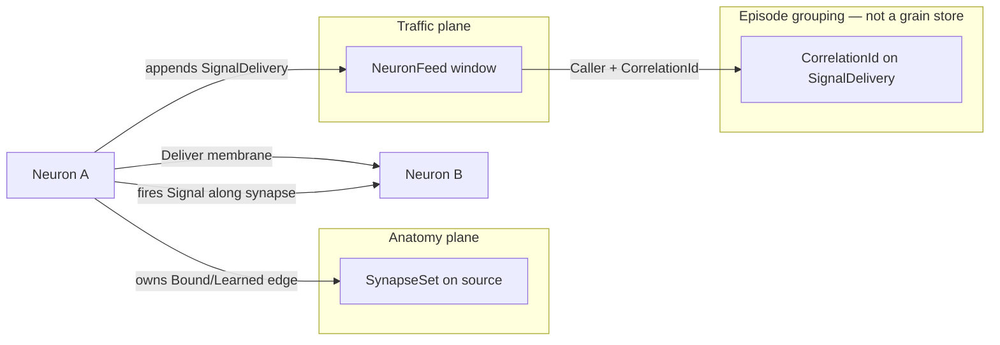
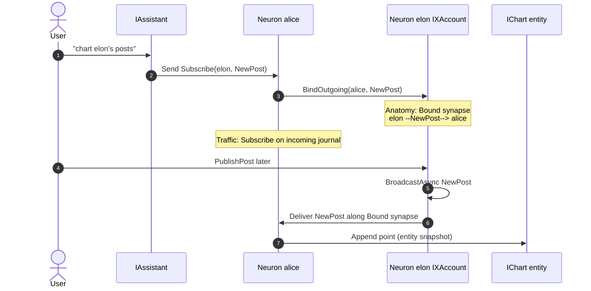
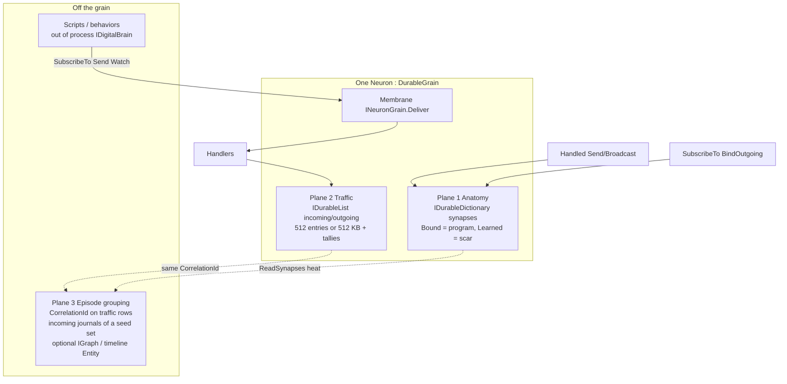

# Neuron, Synapse, Signal — Research Architecture (Three Planes)

| Field | Value |
|---|---|
| **Title** | Neuron / Synapse / Signal: many small researches, then a name for the architecture |
| **Author** | TBD |
| **Date** | 2026-09-04 |
| **Status** | Draft (owner-ratified: grain call filters are membrane, not graph writers) |
| **Kind** | Research architecture paper (not an implementation spec to ship synapse v2 next week) |
| **Product sentence** | A personal assistant whose durable graph a user (or the assistant) programs with typed C#. **A neuron fires a signal along a synapse.** |

This paper is a stack of numbered researches (R1–R17). Each follows **Question → Code today → Conclusion → Not decided yet.** DurableGrain constraints are called out where they bind (especially R2–R3); later researches fold hosting into Code today. The synthesis names the architecture. Key Decisions list only what this paper actually settles. Open Questions are for the owner. The PR plan is incremental and mostly **does not** rewrite the graph until those questions close.

---

## Overview

DigitalBrain already has a durable, typed graph: neurons are Orleans `DurableGrain`s, synapses are values on the source neuron, signals are payloads, and journals are a sliding window of deliveries. Recent work (commit `fd01b595`) made `IHandle<T>` a capability and made broadcast **synapse-only**. The remaining confusion is not missing code — it is ontology. People (including a future self-programming assistant) collapse four different things into the word “synapse”: the edge, the firing, the Orleans log, and the chat turn.

The proposed architecture is **three planes: two stores on the grain, plus a grouping key** (and an optional off-grain projection). Episode is **not** a third durable collection on the neuron.

1. **Anatomy** — `SynapseSet` (`IDurableDictionary<string, Synapse>` keyed `"synapses"`). Who *may* fire `T` from A to B. Lives on the source grain.
2. **Traffic** — `NeuronFeed` incoming/outgoing (`IDurableList<byte[]>` compacted to **512 entries or 512 KB**). What *did* fire, recently. Lives on the same grain, separate collection.
3. **Episode** — `CorrelationId` already on `SignalDelivery` **rows**. Groups a fan-out. Reconstruct edges from **incoming** journals of a **seed set** (`Caller` → journal owner + type); the envelope has **no Target**, so one source’s outgoing feed is not an edge list. Optionally project later to an `IGraph` / timeline Entity. Not a new grain type in v1.

Do **not** treat synapses as events. Do **not** make synapses grains. Do **not** put lifetime traffic on the grain. Visualization and “last time I did this” read anatomy + the traffic window + an optional projection entity.

---

## Background & Motivation

The owner asked for *many small researches* because the graph is extremely powerful and it is not yet clear how synapse should evolve (Innate / Discovered / Hebbian weight / `IsBlocking` vs keep Bound/Learned). They are circling:

- Relations between neuron / synapse / signal.
- How this sits on Orleans `DurableGrain`.
- The hypothesis “synapse is an event, like event sourcing.”
- The ~512 KB journaling limit (already implemented on the **traffic** feed, not on synapses).
- A limited list of synapses *during an execution*.
- Metadata while a neuron is working (datetime, which signals went from where).
- A timeline / 3D graph of *their* DigitalBrain — last connections highlighted — “it would be literally my expertise.”
- Agents more productive seeing last uses; memory of how we work.
- Subscribe/unsubscribe is extremely amazing — keep that power.
- User asks the assistant; that starts a durable execution that mostly **follows synapses**. “When the user asked to do this last time I did this?”
- Self-evolving, self-programming system.

Current product language is already precise in [`CONTEXT.md`](../../../CONTEXT.md). The substrate already implements most of the split this paper names. The risk is a refactor that *un-splits* them (synapse-as-event in the 512 KB feed, or synapse-as-grain).

Pain points today:

- `SynapseKind` still has Innate and Discovered on the wire; the router never consults them as distinct routing policies after synapse-only broadcast.
- `Weight` orders and prunes Learned; it does not decide *who* `BroadcastAsync` reaches.
- `IsBlocking` is a constructor invariant (`Innate` only) and is never read on the hot path.
- There is **no owner-wide neuron registry**. `IDigitalBrain.Get<T>(name)` is an address, not a catalog. A brain-wide 3D graph has a discovery problem.
- `IGraph` / kit 3D graph is a **snapshot entity** the assistant draws; it is not a live projection of `SynapseSet`.
- Nested `IDigitalBrain.RequestAsync` deadlocks `BrainNeuron.Send` (serialized turns on the owner root).

---

## Goals & Non-Goals

### Goals

- Name the ontology so synapse cannot be confused with signal, delivery, journal entry, Orleans log, or grain.
- Show that DurableGrain is **not** domain event sourcing.
- Keep Subscribe/Unsubscribe as the self-programming primitive.
- Give visualization and agent memory a data plane they can actually read without blowing 512 KB.
- Recommend a conservative next step: observe and project, do not rewrite anatomy.

### Non-Goals (this paper)

- Shipping a synapse v2 rewrite, a synapse event store, or synapse grains.
- Deleting `Weight` / `Innate` / `Discovered` / `IsBlocking` from the wire (owner must say so).
- A second runtime, a grants catalog, or a JSON capability bus (already rejected in CONTEXT.md).
- A new inference engine in the kernel that “walks all synapses” for an execution.
- Replacing `ChatTurnWorker`, `ExecutionNeuron` as per-turn working memory, or kit entities.
- Vector-store-as-the-memory-of-how-we-work (the graph + journals *are* that memory).

---

## Researches

Each research follows: **Question → Code today → Conclusion → Not decided yet.** DurableGrain is explicit in R2–R3; elsewhere it is part of Code today when it matters.

---

### R1. Ontology: neuron / synapse / signal / delivery / journal / execution

**Question.** Biology uses one word for many layers. What are the DigitalBrain counterparts, and why do people hear “synapse is an event”?

**Code today.**

| Word | Biology (loose) | DigitalBrain | Type / home |
|---|---|---|---|
| Neuron | Cell body | Durable actor | `Neuron : DurableGrain, INeuron, INeuronGrain, INeuronQuery` in [`src/Kernel/DigitalBrain/Neuron/Neuron.cs`](../../../src/Kernel/DigitalBrain/Neuron/Neuron.cs) |
| Membrane | What may enter the cell | `Deliver` | `INeuronGrain.Deliver` — signal **into this** neuron |
| Synapse | Directed connection | Typed weighted edge on the **source** | `Synapse` value in [`Synapse.cs`](../../../src/Kernel/DigitalBrain.Contracts/Synapses/Synapse.cs); `SynapseSet` |
| Signal | Neurotransmitter payload | Typed immutable message | `abstract record Signal` — **no** id/correlation |
| Firing / AP | This spike at time t | `SignalDelivery` | Envelope: `SignalId`, `CorrelationId`, `CausationId`, `Caller`, `Sequence`, `Timestamp`, `Principal` |
| Recent spikes | Short-term trace | Journal | `NeuronFeed` of `SignalDelivery` |
| Anatomy | Connectome | `SynapseSet` | Durable dict, not a log |
| This thought | One episode | Correlation / chat turn | `CorrelationId` on the **envelope** (grouping key, not a store); reconstruct from incoming journals of a seed set |

The sentence that forbids collapse: **a neuron fires a signal along a synapse.**

People confuse synapse with event because both are “something happened between A and B.” Precise split:

- **Synapse = anatomy.** Who *may* fire `T` from A to B. Survives silence. Bound does not decay. Learned decays. Not sequence-numbered.
- **Delivery = traffic.** This firing at `t`, with causation and correlation. Sequence-numbered. Compacted away.
- **Journal records traffic. SynapseSet records anatomy.** The Reqnroll feature [`journal-and-state.feature`](../../../tests/DigitalBrain.Substrate.Tests/Features/journal-and-state.feature) already pins: “Learning a route does not add a synapse record to the traffic journal.”

**DurableGrain constraint.** One grain hosts **both** stores (`NeuronRuntime.Bind`). That does not make them one concept. Orleans will persist both; the domain must not. `CorrelationId` is a field on traffic rows, not a third collection.

**Conclusion.** Keep five words: neuron, synapse, signal, delivery, journal. Execution/episode is a *grouping key* on deliveries (`CorrelationId`), reconstructed from **incoming** journals of a seed set — not a sixth grain type and not `Record()` keyed by correlation. Membrane (`Deliver`) ≠ edge (`Synapse`) ≠ payload (`Signal`).

**Not decided yet.** Whether UI copy says “connection” vs “synapse”; whether an episode is ever materialized as an Entity.



---

### R2. DurableGrain is not event sourcing (and not quite CQRS)

**Question.** Orleans.Journaling `DurableGrain` looks like “journaling.” Is a synapse an event? Can we rebuild the graph by replaying the neuron journal?

**Code today.** `Neuron` extends `DurableGrain` ([`Neuron.cs`](../../../src/Kernel/DigitalBrain/Neuron/Neuron.cs)). Hosting is `builder.AddJournalStorage()` + `UseJsonJournalFormat` in [`DigitalBrainRuntime.Add`](../../../src/Kernel/DigitalBrain/Hosting/DigitalBrainRuntime.cs). State is **durable collections**, bound in [`NeuronRuntime.Bind`](../../../src/Kernel/DigitalBrain/Neuron/NeuronRuntime.cs):

| Key | Collection | Domain job |
|---|---|---|
| `"synapses"` | `IDurableDictionary<string, Synapse>` | Anatomy |
| `"incoming"` / `"outgoing"` | `IDurableList<byte[]>` | Serialized `JournalEntry` window |
| `"incoming.tally"` / `"outgoing.tally"` | `IDurableDictionary<string, long>` | Counts that **survive** compaction |
| `"incoming.sequence"` / `"outgoing.sequence"` | `IDurableValue<long>` | Monotonic sequence |

Contrast:

| | Event sourcing (`JournaledGrain<TState,TEvent>`) | DigitalBrain `DurableGrain` |
|---|---|---|
| Source of truth | The event log; state is a fold | Current collection contents (dict/list/value) |
| Domain events | First-class, retrievable (`RetrieveConfirmedEvents`) | **Not exposed.** Infra log of *collection ops* (set key, add bytes, remove-at-0) |
| Rebuild neuron | Replay all events | Orleans replays **ops** to rebuild collections; you cannot replay the *domain* journal to rebuild synapses |
| Lossiness | Full history (until snapshot+truncate of *events*) | Domain journal **lossy by design** (512 / 512 KB). Synapse dict is current anatomy, not a history of binds |

`docs/JOURNALS.md` already names the vocabulary collision: three things called “journal.” The feature file is blunter: “Orleans journaling preview (DurableGrain operation log) gets blamed for domain size.”

**What would break if synapses were events in the same 512 KB feed.**

1. **Anatomy eviction.** A busy `NewPost` stream would compact away `Subscribe`/`Bind` records. The graph would forget standing wiring.
2. **You cannot rebuild SynapseSet from the window.** Window is traffic, not binds; even if you logged binds, the window is lossy. Tallies survive (`JournalSnapshot.Tallies`) but they are counts per CLR type name, not edges.
3. **Scripts that `WatchJournalAsync` for `NewPost` would see graph-churn events** unless every watcher filtered (R3).
4. **Hebbian `Record` on every handled send** would write a “synapse event” per fire — the feed would be *mostly* weight updates. v2 substrate **D4’s rationale** (not D4’s decision — that one named four *traffic* planes: Signal, Internal event, Broadcast, Direct call) already warned: “The 512-entry traffic journal would be evicted by its own weight bookkeeping.” Anatomy-on-the-source is **D7** (synapse is not a grain).

**Quantify the 512 / 512 KB cap** ([`NeuronFeed`](../../../src/Kernel/DigitalBrain/Neuron/NeuronFeed.cs)):

```csharp
private const int MaxRetainedEntries = 512;
private const int MaxRetainedBytes = 512 * 1024; // 524,288 bytes
```

- Compaction: `while (count > 512 || (bytes > 512KB && count > 1)) RemoveAt(0)`.
- **At least one entry is always kept**, even if that single serialized `JournalEntry` exceeds 512 KB.
- **Two feeds per neuron** (incoming and outgoing) ⇒ up to **1024 entries / 1 MB** of *domain* retained bytes, plus tallies, plus the synapse dict, plus Orleans’s own op log of those mutations.
- Bytes are Orleans `Serializer<JournalEntry>` array lengths, not UTF-16 JSON. A small `Announced("hello")` delivery is on the order of a few hundred bytes (envelope: two GUIDs, optional causation, `NeuronId` caller, sequence, timestamp, optional `PrincipalId`, plus payload). **512 × ~0.5–1 KB ≈ 256–512 KB** — the two caps bite together for small signals. One fat payload (mail body, file bytes wrongly on a `Signal`) hits the **byte** cap after far fewer than 512 fires.
- Tallies: `JournalSnapshot.TotalRecorded` and per-type `JournalTally` **outlive** the window. You can know “this neuron has seen 400 `NewPost`s” after the 400th has been compacted.
- Synapse dict: **not** under 512/512KB. Unbounded except grain storage. A `Synapse` is a small record struct (two `NeuronId`s, `string` signal type, `double`, `DateTimeOffset`, enum, `long`, `bool`) — roughly **0.2–0.5 KB** serialized. **100 Bound edges ≈ 20–50 KB**; **1,000 ≈ 200–500 KB**. That is expertise-graph sized. A Learned edge per HTTP call would be grain bloat (**high severity**, R13).

**Orleans infra vs the owner’s “512 KB journaling limit.”** The owner believes Orleans journaling is ~512 KB; the code already has **both** 512 entries **and** 512 KB — on `NeuronFeed`, as a **product window**, not as Orleans’s documented DurableGrain cap. Production hosting is **Azure Blob** journals (`AzureOrleansJournalHosting.AddAzureBlobJournal` / `AddAzureBlobJournalStorage` on connection `journal`), not Azure Table. Blob journals append and compact as an **op log of collection mutations**; that is infrastructure, and its exact compaction thresholds are a hosting concern, not the product number. DigitalBrain chose 512/512KB so the **domain** list stays small enough that the infra log of `Add` + `RemoveAt(0)` does not become the product. Do not replace “Orleans is 512 KB” with a Table EGT story this host does not use.

**Conclusion.** Treating synapses as events in the feed is a category error. DurableGrain persists *state collections*. The domain journal is a compacted observation window. Event sourcing would make deliveries (or binds) the source of truth; we deliberately made **current SynapseSet** the source of truth for wiring, and a **lossy window** the source of truth for “what just happened.”

**Not decided yet.** Physical compaction policy of the Orleans op log (hosting). Whether a *separate* long-term traffic projection exists outside the grain (R4).

---

### R3. Two stores on one neuron: anatomy vs traffic

**Question.** Why must SynapseSet and NeuronFeed stay separate? When should subscribe appear in a journal?

**Code today.**

Anatomy mutation:

- `SubscribeToAsync` (in-neuron) → `BindFromAsync` → `INeuronGrain.BindOutgoing` on the **source** → `SynapseSet.Bind` → `WriteStateAsync`. **No journal append.**
- Script path: `NeuronReference.SubscribeToAsync` → `subscriber.SendAsync(new Subscribe(source, typeof(T).Name))` ([`NeuronReferenceExtensions.cs`](../../../src/Kernel/DigitalBrain.Contracts/NeuronReferenceExtensions.cs)). That **is** a `Deliver` to the **subscriber**. `DispatchDeliveryAsync` appends incoming after `DispatchAsync` **returns without throwing** (any `DeliveryOutcome`, including `Unhandled` — not Handled-only). Then `HandleAsync(Subscribe)` calls `BindFromAsync` (silent on the source). `Record(Learned)` is the Handled-only path (`SignalSender`). Outgoing is appended in `RecordOutgoingAsync` **before** deliver, so Unhandled Sends still journal outgoing.
- `SendAsync` / `BroadcastAsync` that **Handled** → `SynapseSet.Record(..., Learned)` **and** outgoing/incoming journal entries for the payload.

Pinned by tests:

- [`journal-and-state.feature`](../../../tests/DigitalBrain.Substrate.Tests/Features/journal-and-state.feature): learned route does **not** add a synapse record to the traffic journal; synapse count 1 and outgoing count 1 after one `NewPost`.
- [`SignalRoutingTests.SubscribeThenBroadcast_ReachesOnlyBoundReceivers`](../../../tests/DigitalBrain.Substrate.Tests/SignalRoutingTests.cs): Bound edges appear on the source via `ReadSynapses`; broadcast audience is those edges.

**If we mixed synapse mutations into the signal journal:**

| Failure | Why |
|---|---|
| (a) Blow the 512 KB window with graph churn | Every `Record` (Hebbian) on every handled send is a write. Busy sources would compact *payload* history to make room for weight stamps. |
| (b) Script noise | Behaviors watch journals (`BehaviorScriptWorker` ← `IBehaviors` outgoing `BehaviorAdmitted`; user scripts `WatchJournalAsync` on `IXAccount` for `NewPost`). Subscribe noise would fire chart scripts unless every watcher filtered by CLR type (they already *can*, but the default “something happened” would lie). |
| (c) Confuse “I subscribed” with “elon posted” | Same feed, different ontology. CONTEXT.md: Journal is how scripts notice something happened; Synapse is anatomy, not traffic. |

**When SHOULD subscribe appear in a journal?**

| Path | Subscriber incoming | Source outgoing | Source SynapseSet |
|---|---|---|---|
| `Neuron.SubscribeToAsync` / `BindOutgoing` | no | no | Bind (Bound) |
| Script `SubscribeToAsync` → `Send(Subscribe)` to subscriber | **yes, `Subscribe` signal** | no | Bind (Bound) |
| Handled `Send`/`Broadcast` of `T` | `T` on target incoming | `T` on source outgoing | Record (Learned) |

That is already a coherent product:

- Scripts that care that *they* subscribed can see `Subscribe` on **their** incoming journal (the protocol signal).
- The source’s expertise shape changes **without** a fake `NewPost`.
- UI “last connections” for *traffic* still comes from deliveries of `T`, not from bind ops.

**Conclusion.** Keep the two stores. Do not log `Synapse` values into `NeuronFeed`. Optional future: a dedicated **anatomy journal** (not the signal feed) if audit of binds is required — that is a fourth store, not a merge. Default: Bind is silent; Subscribe-as-signal is the script-visible protocol on the subscriber.

**Not decided yet.** Whether the source should also emit a typed `SynapseBound` *signal* (would be traffic *about* anatomy — still not storing `Synapse` in the feed). Owner taste.

---

### R4. The 512 / 512 KB window as a product feature, not a bug

**Question.** The owner wants (i) while this neuron is working, metadata of which signals went from where, (ii) a timeline / 3D graph of the whole brain, (iii) last connections highlighted. Does that require lifetime traffic on the grain?

**Thesis.** The journal window **is** the highlight / recency plane. The synapse table **is** the durable expertise shape. Visualization needs **both**. Do not put the whole lifetime of every firing on the grain.

**Code today.**

- Window: last 512 or 512 KB of `SignalDelivery` per feed; `Timestamp`, `Caller`, `Signal` type/payload, `CorrelationId`.
- Beyond the window: **tallies** (`JournalTally` by `Type.FullName`, with a frozen key for `DigitalBrainActivated`) and `TotalRecorded` / `LastSequence` / `EarliestRetainedSequence` on `JournalSnapshot`. Reads past retention return `ResetSnapshot` and empty `Delta` ([`NeuronFeed.Read`](../../../src/Kernel/DigitalBrain/Neuron/NeuronFeed.cs)).
- Anatomy recency: `Synapse.LastFiredAt`, `FireCount` (updated only on **Handled** `Record` / potentiation). Bound edges also keep `LastFiredAt`/`FireCount` when they fire (Bind preserves counts; `Record`/`Potentiate` increments). `All()` orders by decayed `WeightAt`.

**Three options for longer history:**

| Option | What | Fits 512 KB grain? | “Last time I did this?” |
|---|---|---|---|
| (1) Accept the window | Recency = last N deliveries + synapse `LastFiredAt` | Yes | Last *recent* episode, plus last fire stamp on the edge even after deliveries compact |
| (2) Project off-grain | Entity (`IGraph`, timeline chart) or a dedicated projection grain/storage | Yes — entities are `IPersistentState` snapshots, not on the graph ([`IEntity`](../../../src/Kernel/DigitalBrain.Contracts/Entities/IEntity.cs), [`JOURNALS.md`](../../../docs/JOURNALS.md) rule 1) | UI timeline / 3D highlight without grain bloat |
| (3) Tallies-only beyond window | Already exists | Yes | “This neuron has seen 400 NewPosts” — not *which* post, not *to whom* |

**Recommendation.**

- **Highlight / “what just happened”** → traffic window (option 1). This is the working-set metadata while a neuron is working.
- **Stable graph shape** → SynapseSet (`Kind`, `SignalType`, `LastFiredAt`, `FireCount`).
- **Brain-wide lifetime timeline** → option 2, an Entity projection (kit `IGraph` already exists as a *drawn* snapshot; a *live* brain projection is a new writer, not a kernel journal expansion).
- **“Last time I did this”** as *agent memory* → query synapses by `LastFiredAt` + scan remaining **incoming** journals of a seed set for matching `CorrelationId` / signal type (`Caller` → this neuron). If that is not enough (compacted), **do not** un-compact the grain; project (option 2) or accept tallies (option 3). `LastFiredAt` is not correlation-scoped.

**Conclusion.** 512/512KB is the product’s short-term memory. Treating it as a bug to “fix” by storing lifetime traffic on `DurableGrain` will recreate the chart-explosion failure mode the feature file warns about.

**Not decided yet.** Whether “last time I did this” is a journal query tool, a new Entity, or both (Open Questions).

---

### R5. Execution-scoped working set vs lifetime graph

**Question.** “During an execution there would be a list of synapses between neurons, still limited.” Is that SynapseSet, the journal, or a third thing?

**It is a grouping of traffic, not a third store on the grain.**

| Plane | Where it lives | Limited by | Meaning |
|---|---|---|---|
| Lifetime graph | Source `SynapseSet` | Grain storage; *should* stay an expertise graph | Bound = program; Learned = scar of a successful send |
| Traffic window | This neuron’s `NeuronFeed` | Product cap 512 / 512 KB | Recent physiology |
| Execution trace | `CorrelationId` on traffic **rows**; optional Entity later | Naturally small (one turn’s fan-out) | The path this turn actually took: assistant → behaviors → gmail → chart |

**Code today — correlation groups a fan-out; it does not record an edge list.**

- `SignalDelivery` has `Caller`, not `Target` ([`SignalDelivery.cs`](../../../src/Kernel/DigitalBrain.Contracts/Signals/SignalDelivery.cs)).
- `SynapseSet.Record` does **not** store `CorrelationId`. `LastFiredAt` is anatomy and is **not** correlation-scoped.
- `SignalDelivery.Create`: `correlation ?? cause?.CorrelationId ?? CorrelationId.New()`.
- `SignalSender.BroadcastAsync` uses **one** `CorrelationId` for every receiver ([`SignalSender.cs`](../../../src/Kernel/DigitalBrain/Neuron/SignalSender.cs)); test `Broadcast_JournalsOneOutgoingEntryPerReceiver` asserts a single distinct correlation for two outgoing entries — same caller (self), still **no receiver id** on those outgoing envelopes.
- `ReplyAsync` stamps `handling.CorrelationId`.
- `DigitalBrainClientTransport.SendRequestAsync` waits on the **owner root incoming journal** for a response with the **same** `CorrelationId` and response CLR type. That reconstructs a **reply**, not a synapse list.

**Actual algorithm for episode edges** (while the window still holds the deliveries):

```text
for each neuron N in a seed set (known names, module singletons, BFS from Bound edges — R15):
  for each incoming delivery D on N where D.CorrelationId == thisTurn:
    edge := (source: D.Caller, target: N, T: type of D.Signal)
    optionally join SynapseSet on Caller for Kind / LastFiredAt / FireCount / heat
```

Outgoing journals of a broadcaster tell you *that* a fan-out happened (N copies, one correlation); they do **not** name who received. After compaction, `LastFiredAt` on anatomy is not “this correlation.” Q9’s snapshot is how you **remember targets the envelope never stored**.

**What is an “execution” in this repo (do not invent a second runtime).**

- CONTEXT.md: no second runtime. Behaviors are admitted C# scripts that watch journals and send typed signals.
- Chat: Flutter → `Get<IChat>().RequestAsync(SendMessage)` → `ChatTurnWorker.RunAsync` ([`ARCHITECTURE.md`](../../../docs/ARCHITECTURE.md), [`ChatTurnWorker.cs`](../../../src/Modules/UI/DigitalBrain.Modules.UI/Chat/ChatTurnWorker.cs)). Worker starts `IExecution` (`ExecutionNeuron`) as **per-turn working memory**, not as an automation engine that walks synapses.
- `ExecutionNeuron` ([`ExecutionNeuron.cs`](../../../src/Modules/Execution/Execution/ExecutionNeuron.cs)): `StartExecution` / `ReadExecution`, durable `ExecutionState`, `IExecutionContext` entity for prompt blocks. It does **not** store a list of synapses. Lifecycle signals (`ExecutionLifecycle`) go to **its** outgoing journal.
- Nested `IDigitalBrain.RequestAsync` from a neuron turn **deadlocks** `BrainNeuron.Send` (serialized turns). Hop count 1 is a **proposed** assistant-turn policy in [`2026-09-04-mcp-specialist-agents-design.md`](./2026-09-04-mcp-specialist-agents-design.md); it is **not** substrate code and is **not** ratified here.

So: an execution is **not** a new kernel concept in v1. It is **one correlation** (chat turn / script `Send`) grouping deliveries that still sit in seed-set **incoming** windows.

That list is bounded by fan-out, not by the lifetime graph. It does **not** need a new grain. If the UI wants it after compaction, project it onto an Entity when the turn completes (R4 option 2 / Q9).

**Conclusion.** Do not add an execution-synapse grain. Do not store the episode on `SynapseSet`. Do not imply `Record()` is correlation-keyed. Reconstruct edges from incoming journals of a seed set; optionally snapshot to `IGraph` / a timeline entity.

**Not decided yet.** Whether chat turns write that snapshot automatically, or only when the assistant/user asks to “show what just ran.”

---

### R6. Subscribe/unsubscribe as the self-programming primitive

**Question.** The owner called this extremely amazing. How does it program the graph? What must stay type-safe?

**Code today.**

`IHandle<T>` = compile-time **capability** to receive `T` ([`IHandle.cs`](../../../src/Kernel/DigitalBrain.Contracts/Neurons/IHandle.cs)). A Bound synapse = **who actually receives T from this source**. Broadcast is synapse-only ([`SignalRouter.Resolve`](../../../src/Kernel/DigitalBrain/Neuron/SignalRouter.cs)): iterate `SynapseSet.For(signalType)`, never self, never “all default IHandle types.” Proven: `Broadcast_WithoutSynapsesReachesNobodyEvenWhenTypesHandleTheSignal`.

Subscribe:

```csharp
await Brain.Get<ITimeline>("alice")
    .SubscribeToAsync<IXAccount, NewPost>(elonId);
```

Constraints on the extension method: `TSelf : INeuron, IHandle<TSignal>`, `TSource : INeuron`, and `source` must be `NeuronId.For<TSource>(...)`. On the grain: `RequireSameOwner`, `CanHandle(signalType)` via `IHandle<>` interface names ([`Neuron.RequireSubscription`](../../../src/Kernel/DigitalBrain/Neuron/Neuron.cs)).

Unsubscribe removes the dict key (`SynapseSet.Unbind`). Bind and Record share `KeyFor(target, signalType)`, so there is **no leftover Learned scar** after Unsubscribe. Broadcast stops (`Unsubscribe_RemovesBoundSynapseAndBroadcastStops`). Today, Broadcast does **not** reach unsubscribed targets.

Always-on vs once:

- **Bound** (`SubscribeTo`): GitHub PR webhook analogue — standing SOP, no decay (`WeightAt` returns stored weight for Bound/Innate; `IsPrunedAt` is false).
- **Send without prior edge**: one-shot. If Handled, a **Learned** edge appears (decays, prunes below floor). That scar **is** reachable by later `BroadcastAsync` of the same `T` until prune — it is *not* an Unsubscribe leftover. If the product wants “no scar,” that is Open Question 5 (alternative D).
- **Broadcast**: only along existing synapses still in the dict (Bound, or unpruned Learned/Discovered). Not along keys `Unbind` already removed.

**Self-programming.** The program **is** the graph. An assistant with tools (`Get`, `SubscribeTo`, `Publish`/`Send`, `AdmitBehavior`) changes anatomy in response to English. Next execution does not “walk” the new edges; the next `Publish`/`Broadcast` **is heard** by whoever is now Bound.

`AdmitBehavior` → `IBehaviors.HandleAsync` → outgoing `BehaviorAdmitted` → `BehaviorScriptWorker` compiles C# **outside the silo** and runs against `IDigitalBrain`. Scripts may themselves `SubscribeTo`. That is the loop. There is no grants catalog and no JSON capability bus (CONTEXT.md).

**What must stay type-safe.** `SendAsync`/`PublishAsync` only compile when `TNeuron : IHandle<TSignal>`. Subscribe only compiles when the subscriber `IHandle`s T. Grain still re-checks `CanHandle` so a forged `Subscribe` signal cannot bind a type the neuron cannot receive.

**What must not happen.** Assistant emitting free-form `{target, method, args}` JSON. `IHandle` is the capability; synapses are not a service mesh.

**Conclusion.** Keep Subscribe/Unsubscribe as the central programming verb. Bound is the program. Learned is an optional scar. Broadcast remains synapse-only.

**Not decided yet.** May the assistant `SubscribeTo` on the owner’s behalf without an extra confirm? (Open Questions.)



---

### R7. Hebbian weight, Innate, Discovered, `IsBlocking` — product vs leftover

**Question.** After synapse-only broadcast, does weight still route? Are Innate/Discovered/blocking trash?

**Code today.**

`SynapseKind` ([`SynapseKind.cs`](../../../src/Kernel/DigitalBrain.Contracts/Synapses/SynapseKind.cs)): Innate, Bound, Learned, Discovered.

| Kind | Created by | Decays? | Product use |
|---|---|---|---|
| Innate | Nowhere in product paths | No | Comment: “IHandle is capability, not an innate edge.” Unused in `SynapseSet.Bind`/`Record`. Tests only. |
| Bound | `SubscribeTo` / `Bind` | No | **Product program** |
| Learned | `SignalSender` after `DeliveryOutcome.Handled` | Yes, half-life 14d, floor 0.05 | Scar of a successful send |
| Discovered | Nowhere in router | Fastest (initial weight 0.10) | Ranked-discovery spec said similarity must **not** auto-create synapses. Tests seed Discovered; router treats it as “an edge in the dict.” |

`SignalRouter.Resolve`: all non-pruned synapses of that `signalType`, unique targets, never self. **Weight does not include/exclude** (except `IsPrunedAt` for non-Bound/Innate). Order in `For()` is decayed weight descending — relevant if a caller sliced “top K”; **Broadcast sends to all.**

`IsBlocking`: constructor throws unless `Kind == Innate` (spec D10). **Never read** by `SignalRouter` or `SignalSender`. Grep hits: `Synapse.cs` + tests.

`WeightAt` / `Potentiate` / `SynapseOptions`: still live. `Record` always potentiates. Bind of an existing Learned **promotes to Bound** and may bump weight to `InnateWeight` (1.0).

**Read of this after synapse-only broadcast:**

- Weight is **not** a router. It is heat: order, prune of Learned, viz, maybe agent memory.
- Innate was IHandle-as-edge. That design is dead. Keeping the enum value on the wire is serialization compatibility, not product.
- Discovered was tier-3 similarity. Not in the router. Creating Discovered edges automatically is still rejected by the discovery spec.
- Blocking is unused membrane policy.

**Recommendation (this paper).** Keep **Bound vs Learned** as the only *product* kinds. Keep `fireCount` + `lastFiredAt` as recency for viz/agents. Treat `weight` as optional heat until discovery is real. **Do not delete from the wire in this paper’s first PRs** without owner say-so.

**Not decided yet.** Keep Hebbian weight on the wire, or Bound/Learned + lastFiredAt/fireCount only? Physical prune of below-floor Learned (today: read/routing exclusion only; comment in `SynapseSet`).

---

### R8. Visualization: timeline and 3D graph

**Question.** What data does a Flutter/kit graph need, where does it read, and how does the UI know the set of neurons?

**What the widget needs.**

- **Nodes:** `NeuronId` (type, owner, name). Optional: grain type as cluster, display name.
- **Edges:** `Synapse` (typed, kind, `lastFiredAt`, `fireCount`, optional weight-as-heat).
- **Highlight (two independent signals):** (a) deliveries still in the traffic window for this `CorrelationId` (episode heat; needs a seed set of **incoming** journals — R5); and/or (b) `LastFiredAt` newer than a UI threshold. `LastFiredAt` is anatomy and **survives compaction**; it is not “within the journal window.”
- **Timeline:** `SignalDelivery.Timestamp` + `Caller` + signal type, from `ReadJournal` (no payload by default).

**Where to read today.**

- Per neuron: `INeuronQuery.ReadSynapses` + `ReadJournal` ([`INeuronQuery.cs`](../../../src/Kernel/DigitalBrain.Contracts/Neurons/INeuronQuery.cs)), `[ReadOnly]` `[AlwaysInterleave]` so viz does not stall serialized turns.
- Scripts/assistant: `NeuronReference.GetSynapsesAsync` / `ReadJournalAsync`. `IDigitalBrain.GetSynapsesAsync()` is the **owner root** (`IBrainNeuron` / `sessionneuron`) — `FacadeAndNeuronReferenceQueriesUseImplicitSubjects` asserts that root list is empty with **no** subscribe. `SubscribeTo_FromNeuronReference_WritesBoundSynapseOnSource` proves Bound lands on the **source**, not on the session neuron. **The brain-wide graph is not on `sessionneuron`.**

**A brain-wide 3D graph cannot live inside one neuron’s 512 KB.** It is a projection:

| Approach | How | Pros | Cons |
|---|---|---|---|
| UI fan-out | Client knows seeds, `ReadSynapses` each, BFS | No new kernel type; uses existing query | Discovery: isolated neurons invisible; N round-trips |
| Projection grain | Owner-root aggregator | One read | New grain, must subscribe to every neuron’s anatomy changes (no such event today — Bind is silent) |
| Kit `IGraph` entity | Assistant/`show_graph` writes `GraphState` | Already shipped: [`IGraph`](../../../src/Modules/UI/DigitalBrain.Modules.UI.Contracts/Graph/IGraph.cs), [`GraphEntity`](../../../src/Modules/UI/DigitalBrain.Modules.UI/Graph/GraphEntity.cs), 3D kit ([`2026-09-03-kit-graph-3d-design.md`](./2026-09-03-kit-graph-3d-design.md)) | **Drawn snapshot**, not live connectome. `KitToolSource.show_graph` takes string node ids and `source>target` edges — **does not call `ReadSynapses`.** |

**Discovery problem.** `Get<TNeuron>(name)` creates an **address** (`NeuronId.For<TNeuron>(owner, name)`). Orleans activates the grain on first `Deliver`/`BindOutgoing`. There is **no registry, no ListNeurons**. Known neurons are:

1. Named in scripts/tools (`"elon"`, `"assistant"`, `"default"`).
2. Appearing as `Synapse.Source`/`Target` once you have a seed.
3. Appearing as `SignalDelivery.Caller` in a journal window.
4. Implicit module singletons (`IBehaviors`, `IBrainNeuron` session, `IChat`).

Implication: “visualize my whole brain” is **enumerate-from-seeds + BFS on SynapseSet**, or a **new** owner-scoped index (Open Question). Do not scan grain storage from the product API.

**Conclusion.** Viz reads anatomy + traffic window. Kit graph is a valid **projection target** (Entity, off the grain) once a writer exists that pulls `ReadSynapses`. Do not host the whole-brain mesh on a neuron.

**Not decided yet.** Fan-out vs projection grain vs kit entity as the *product* brain map (Open Questions).

---

### R9. Agent memory of how we work

**Question.** “Agents more productive seeing last uses, memory about how to work.” Is that a vector store?

**No.** Vector memory already exists as a **module** (`VectorMemoryNeuron`, Qdrant, namespaces). It is for embeddings the owner stores. Bolting “how we work” there would duplicate the graph.

The graph + journals **are** the memory:

| Memory | Store | Agent use |
|---|---|---|
| Standing SOP | Bound synapses | “Always chart elon’s posts” |
| “Last time this path worked” | Learned + `LastFiredAt` + `FireCount` | Rank suggestions; heat on the 3D graph |
| Recent episodes | Journal window | “What just happened this afternoon” |
| Volume | Tallies | “This neuron has seen 400 NewPosts” |
| This turn | `CorrelationId` on incoming deliveries of a seed set | Reconstruct edges (`Caller` → this neuron); not from one outgoing feed |

Assistant tools that fit the existing grain split: `read_journal` / synapses via `INeuronQuery` / `IGrainFactory` **in-silo**, not nested `IDigitalBrain.RequestAsync`. Scripts use `Brain.Get<T>().ReadJournalAsync` / `GetSynapsesAsync` / `SubscribeToAsync`.

**Nested `RequestAsync` deadlocks `BrainNeuron.Send`.** The owner root stays in `Send` for the whole `Deliver`; a second `Send` on the same grain is a serialized-turn deadlock (`NeuronConcurrency.RequireSerializedTurns`). Cite: `DigitalBrainClientTransport.SendResultAsync` → `Brain().Send` → `BrainNeuron.Send` → `SendAsync` → `INeuronGrain.Deliver` and waits. Chat already avoids this: `ChatTurnWorker` starts `IExecution` via `IGrainFactory` (`GetGrain<IExecution>` / `IChatKernel`), and `SendMessage` `ReplyAsync`s `TurnAccepted` then detaches so `BrainNeuron.Send` does not hold the LLM turn ([`ARCHITECTURE.md`](../../../docs/ARCHITECTURE.md)). ExtraTools must not regress onto `IDigitalBrain`. Hop count 1 (`_specialistHopsThisTurn`) is **proposed** in the specialist-agents spec, not substrate law; this paper does not ratify it.

**Conclusion.** Give agents **read** tools on synapses + journals + tallies. Do not add a parallel “agent memory” store for graph expertise. Vector memory stays for documents/capabilities search, not for the connectome.

**Not decided yet.** Exact tool shapes (`list_synapses`, `last_fires`, `show_correlation`) and whether they may mutate (R6 confirm question).

---

### R10. Self-evolving loop (careful)

**Question.** User English → assistant tools → synapses change → next execution follows those synapses → journals show what happened → reinforce or unsubscribe. How powerful / how dangerous?

**Loop (already possible with current verbs):**

```text
English
  → IAssistant (tools on the graph)
  → SubscribeTo / AdmitBehavior / Publish
  → SynapseSet mutates (Bound) and/or a behavior process starts
  → later Publish/Broadcast is heard by new subscribers
  → journals + LastFiredAt show outcomes
  → assistant or a behavior Unbind / AdmitBehavior again
```

**Constraints that must not be relaxed.**

- Type-safe `IHandle<T>` (compile + grain `CanHandle`).
- Owner-scoped `NeuronId` (`RequireSameOwner` on bind and on `BrainNeuron` proxy reads).
- No grants catalog, no synapse grains, no unbounded journal, no second runtime.
- No nested `IDigitalBrain` / `BrainNeuron.Send` from a still-open neuron turn (deadlock).
- Behaviors are **C# not English**.
- `AdmitBehavior` records `BehaviorAdmitted`; the worker runs source **out of process**.

Hop count 1 is **not** in this list. It is a proposed assistant-turn policy in another spec; this paper’s kernel invariant is the deadlock, not `_specialistHopsThisTurn`.

**What “follow synapses” means.** Executions do **not** magically walk all synapses. They `Publish`/`Broadcast`/`Send` as neurons already do; the graph shapes **who hears**. A “last time I did this” lookup is journal/tally/`ReadSynapses`, not a new inference engine in the kernel.

A planner that BFS-walks SynapseSet to invent a multi-hop tool sequence would:

- Re-enter `BrainNeuron.Send` (deadlock) or invent a second runtime.
- Treat Learned scars as permissions.
- Risk loops (A broadcasts T to B, B admits a behavior that subscribes C, C publishes T…).

**Danger (severity).**

| Risk | Severity | Mitigation |
|---|---|---|
| Assistant rewires production always-on edges from a misunderstood utterance | High | Confirm policy (Open Question); prefer admitting a **behavior** the owner can read |
| Subscribe loops / fan-out storms | High | Same-owner only; broadcast never self; no nested `BrainNeuron.Send`; no auto-Discovered edges |
| Learned edges accumulate until the dict is huge | Medium | Expertise-graph discipline; later physical prune (R13) |
| Self-programming without type checks (JSON bus) | High | Already rejected |
| Treating journals as the program | High | Anatomy vs traffic (R3) |

**Conclusion.** The loop is the product. The kernel remains a small deterministic substrate. Reinforcement is `Record` on Handled (heat) and human/assistant `SubscribeTo`/`UnsubscribeFrom` (program). Do not add kernel-side graph walking.

**Not decided yet.** Confirm-on-mutate; whether Learned should auto-promote to Bound after N fires (almost certainly no — that would turn scars into SOPs without consent).

---

### R11. `INeuronGrain` vs `ISynapse` (closed)

**Question.** Rename `INeuronGrain` to `ISynapse`?

**No. Closed.**

- Cardinality: **one neuron, many synapses.**
- `INeuronGrain.Deliver` is the **membrane** (signal into this neuron).
- `BindOutgoing` / `UnbindOutgoing` mutate **this** neuron’s synapse table (source anatomy).
- Scripts never call `INeuronGrain`; they `Publish` / `SubscribeTo` through `IDigitalBrain`.
- `Synapse.cs` comment: “never as a grain of its own: an edge per grain does not survive the first million edges.”

Renaming the membrane interface to `ISynapse` would teach the next reader that a neuron *is* a synapse. That is the confusion this paper exists to kill.

**Conclusion.** Do not rename. `INeuron` = product marker + `IHandle<Subscribe/Unsubscribe>`. `INeuronGrain` = Orleans delivery + bind. `INeuronQuery` = observation. `Synapse` = value.

**Not decided yet.** Nothing. This research is closed.

---

### R12. Signal vs `SignalDelivery` (keep)

**Question.** Collapse payload and envelope? Is `Subscribe` a special case?

**Keep the split.** Analogous to `INeuron` vs `INeuronGrain`: product vs plumbing.

- `Signal` — typed immutable payload. Modules own records (`NewPost`, `AdmitBehavior`, `Subscribe`).
- `SignalDelivery` — identity, causation, correlation, ownership, sequence, timestamp, principal. Created in `SignalDelivery.Create`; rides `Deliver`.

`Subscribe` as a **signal** is the **protocol for scripts** (Send to the subscriber so it journals and then binds). In-neuron `SubscribeToAsync` binds **directly** (no self-Send). Both are correct; they are two admission paths to the same anatomy write.

**Conclusion.** Do not put envelope fields on `Signal`. Do not make `Subscribe` a non-signal magic RPC in the script SDK — the typed `SubscribeToAsync` helper is the SDK; the signal is the on-graph protocol.

**Not decided yet.** Whether Bind-direct should also append a `Subscribe` to the subscriber journal for uniform script observability (today in-neuron bind is silent on journals).

---

### R13. DurableDictionary growth and physical prune (load-bearing)

**Question.** SynapseSet is unbounded except grain storage. Prune is read-time. What blows the grain if we are careless?

**Code today.** `SynapseSet.All`/`For`: filter `IsPrunedAt`; **no `Remove`**. Comment: “Slice 1 pruning is read/routing exclusion. Physical reclamation belongs to a later storage-maintenance decision.” Dead Learned keys remain in `IDurableDictionary` forever, still in the Orleans op log / snapshot.

**Load.**

- Expertise graph: tens to low hundreds of Bound edges per specialist source (elon → timelines, gmail → behaviors) is fine.
- Scar per handled Send: a chatty helper that `Send`s to many one-off names could grow **without bound**.
- Compact of the **traffic** list (`RemoveAt(0)` every overflow) writes Orleans ops continuously; that is already bounded in *domain* size but the infra log relies on DurableGrain compaction. Mixing an ever-growing synapse dict **plus** 512-entry lists on one grain is the actual storage risk, not the 512 KB *domain* cap alone.

**Conclusion.** Product rule: SynapseSet is an **expertise graph, not every HTTP call.** Learned must remain prunable **and** (later) physically reclaimed. Do not log Learned into the traffic feed as a substitute for prune (that is worse). First PRs: do not implement reclamation until the owner wants it; document the risk.

**Not decided yet.** Reminder-driven physical prune vs prune-on-write vs never (rely on Unbind only).

---

### R14. Kit `IGraph` is a snapshot entity, not the live brain (load-bearing)

**Question.** We already have a 3D graph. Is the research done?

**No.** [`GraphState`](../../../src/Modules/UI/DigitalBrain.Modules.UI.Contracts/Graph/GraphState.cs) is `Title` + `GraphNodeState` (string Id/Label/Kind/Cluster) + `GraphEdgeState` (string ids, optional dotted). No `NeuronId`, no `SynapseKind`, no `lastFiredAt`, no signal type. `show_graph` invents a name `graph-{guid}` and `Render`s whatever strings the model passed.

This is the **right kind of place** to put a brain-wide projection (Entity, not neuron journal) and the **wrong current schema** for a live connectome.

**Conclusion.** Reuse the kit **mount** (card + surface + 3D navigator). Do not pretend `show_graph` is DigitalBrain anatomy. A later PR may add a writer that maps `Synapse` → `GraphEdgeState` (signal type in the edge id, kind as dotted/cluster, heat as a future field) after the owner picks fan-out vs projection (R8).

**Not decided yet.** Schema extension vs a distinct `IBrainMap` entity.

---

### R15. How neurons become known (no registry)

**Question.** If visualization fans out `ReadSynapses`, what is the seed set?

**Code today.** `DigitalBrainClient.Get<TNeuron>(name)` returns `NeuronReference` with `Id = NeuronId.For<TNeuron>(owner, name)`. No activation until `Send`/`Deliver`/`BindOutgoing`/`Read*`. `IDigitalBrain.GetSynapsesAsync()` is the **session** neuron’s dict (usually empty). Module neurons have conventional names (`"default"`, `"assistant"`, `"session"`).

**Conclusion.** There is no `ListNeurons`. Whole-brain viz is either:

- seed from known module instances + BFS on edges + journal `Caller`s in the window, or
- an explicit index the owner/assistant maintains (Entity), or
- a new kernel registry (expensive, easy to get wrong, not required to start).

**Not decided yet.** Whether to add a tiny owner-scoped **name index** (type+name on first activate). That is a real product decision; this paper does not add it.

---

### R16. `ExecutionNeuron` is not the episode plane

**Question.** We already have `IExecution`. Put the synapse list there?

**Code today.** `ExecutionNeuron` is chat-turn working memory: workload, prompt blocks, status, `IExecutionContext` deltas. ARCHITECTURE.md: “Chat turns still use `ExecutionNeuron` as per-turn working memory, not as an automation engine.” Historical durable-runs / Activity specs are superseded for product language; do not revive “Activity grain = synapse list.”

**Conclusion.** `CorrelationId` on `SignalDelivery` **groups** the episode; it is not a stored edge list (`Caller` only, no `Target`). `ExecutionNeuron` may *reference* an `ExecutionId` that you also stamp into payloads if chat needs it; do not overload it as SynapseSet. If a turn snapshot is needed for the 3D “this request” highlight, write an Entity at the end of `ChatTurnWorker` (optional, later) — that is how you remember **targets the envelope never stored**.

**Not decided yet.** Auto-snapshot vs on-demand.

---

### R17. Grain call filters may wrap the membrane; they must not write the graph

**Question.** Can Orleans `IIncomingGrainCallFilter` / `IOutgoingGrainCallFilter` auto-populate journals, Bound/Learned, or heat?

**Code today.** Population is on the signal path, not the RPC path:

- Outgoing journal: `SignalSender.RecordOutgoingAsync` **before** `Deliver`.
- Incoming journal: `Neuron.DispatchDeliveryAsync` after dispatch (any non-throwing outcome).
- Learned/heat: `SignalSender` after `DeliveryOutcome.Handled`, on the **source** `SynapseSet`.
- Bound: `BindOutgoing` / `UnbindOutgoing` (Subscribe/Unsubscribe).

`DeliverAsync` forks: same-neuron awaited send calls `_deliverLocally` (in-process) so a serialized `DurableGrain` does not `Deliver` itself. Incoming and outgoing filters **do not run** on that path. Filters run on grain **proxy** calls only. Incoming `context.Grain` is the **receiver**; anatomy lives on the **source**. Outgoing filters are silo/client DI, see the **target**, and also run on Orleans system methods. `ReadJournal` / `ReadSynapses` are `[AlwaysInterleave]` — a filter that writes durable state there breaks turns. Subscribe is an explicit `Bind`, not something inferred from `Deliver(Announced)`.

**Conclusion (owner-ratified 2026-09-04).** It is possible to use filters in this architecture. It is **not** possible to move graph population onto them without breaking subscribe, self-send, or serialized turns. Allowed: incoming filter as **membrane** (owner/auth, `VerifiedActor`, tracing) around `Deliver` / `BindOutgoing` / `UnbindOutgoing`, skipping `INeuronQuery`. `SignalSender` remains the only writer of journals and synapses. Local self-delivery keeps sharing `DispatchDeliveryAsync`.

**Not decided yet.** Whether to *implement* that membrane filter (ownership hole on raw grain `ReadSynapses`). The constraint is decided; the PR is optional.

---

## Synthesis — the architecture has a name: Three Planes

Not one store. Not event sourcing. Not a mesh of synapse grains.



1. **Anatomy (`SynapseSet`)** — who is wired to whom for which `T`. Bound = program. Learned = scar of a successful send. Lives on the source DurableDictionary. Unbounded-ish (grain storage); must stay small in practice (expertise graph, not every HTTP call).
2. **Traffic (`Journal` / `NeuronFeed`)** — what actually fired, last 512 or 512 KB. Recency, highlight, script triggers, “what just happened.” Tallies survive.
3. **Episode (`CorrelationId` grouping / optional Entity)** — this user request’s path. **Not a third store on the grain.** `CorrelationId` lives on traffic rows. Reconstruct edges from **incoming** journals of a **seed set** (`Caller` → this neuron + type); outgoing copies of a broadcast do not name receivers. After compaction, snapshot to an Entity if the UI still needs the target list. Not a new grain type in v1.

`INeuronGrain` remains membrane. `Synapse` remains a value. `Signal` remains payload.

**Do not** implement a synapse event store on the journal. **Do not** make synapses grains. **Do not** put lifetime traffic on the grain. Visualization and “last time” read anatomy + traffic window + optional projection entity.

This paper’s proposed design is **this naming plus a conservative next step**, not a big-bang rewrite.

---

## Proposed Design (conservative next step)

1. **Ratify three planes in CONTEXT.md / JOURNALS.md language** (already almost there). Add one sentence: executions follow synapses by *who hears Broadcast/Send*, not by walking.
2. **Keep Subscribe/Unsubscribe, synapse-only broadcast, IHandle-as-capability** (already shipped).
3. **Observation path for viz/agents** using existing `INeuronQuery` — no new persistence.
4. **Optional** kit-graph writer that *reads* synapses (after owner answers R8).
5. **Do not** delete `Weight`/`Innate`/`Discovered`/`IsBlocking` until the owner answers R7.
6. **Orleans call filters are membrane, not graph writers** (R17, owner-ratified). Do not `Record` / `AppendIncoming` / `Bind` from a filter.

No API break is required to think clearly. The grain already has the two stores; the refactor risk is *forgetting* that, or treating `CorrelationId` as a third collection.

---

## API / Interface Changes

**None required to adopt the architecture.** Current surfaces already match:

| Surface | Role |
|---|---|
| `INeuron` | Marker + `IHandle<Subscribe/Unsubscribe>` |
| `INeuronGrain` | `Deliver`, `BindOutgoing`, `UnbindOutgoing` |
| `INeuronQuery` | `ReadJournal`, `ReadSynapses`, `Watch`/`Unwatch` |
| `IDigitalBrain` / `NeuronReference` | `Get`, `SendAsync`, `SubscribeToAsync`, journals, synapses |
| `IHandle<T>` | Capability |
| `Synapse` | Anatomy value |
| `Signal` / `SignalDelivery` | Payload / envelope |

**Possible later additions (not in first PRs):**

- Script helper: `ReadSynapses` BFS utility **client-side**.
- `IGraph` schema fields for kind/heat (R14).
- In-silo assistant tools: `list_synapses`, `read_journal` via `IGrainFactory` (never nested `Brain.Send`).

**Before/after for the closed rename (do not do this):**

```csharp
// WRONG
public interface ISynapse { Task<DeliveryOutcome> Deliver(...); }

// RIGHT (current)
public interface INeuronGrain : INeuron
{
    Task<DeliveryOutcome> Deliver(SignalDelivery delivery, CancellationToken cancellationToken = default);
    Task BindOutgoing(NeuronId subscriber, string signalType);
    Task UnbindOutgoing(NeuronId subscriber, string signalType);
}
```

---

## Data Model Changes

**None in v1 of this paper’s PRs.** Current model:

```text
Synapse(source, target, signalType, weight, lastFiredAt, kind, fireCount, isBlocking)
JournalEntry(sequence, delivery)
SignalDelivery(signal, signalId, correlationId, causationId, caller, sequence, timestamp, principal?)
```

**Migration.** Not applicable. If the owner later drops `weight` from the wire, that is an Orleans serializer/`[Id(n)]` compatibility project — **not scheduled**.

**If we ever project episodes:** new `Entity` state (e.g. extend `GraphState` or a timeline record). Entities use `IPersistentState`, not `NeuronFeed`. No journal migration.

---

## Alternatives Considered

### (A) Synapse-as-event in the journal

Put bind/unbind/potentiate into `NeuronFeed` and fold to rebuild the graph.

- **For:** One “everything that happened” stream; familiar event-sourcing story.
- **Against:** Window is 512/512KB and **lossy**. Fold would be wrong after compaction. Hebbian events would evict `NewPost`. Scripts would mix anatomy with traffic. DurableGrain is not `JournaledGrain`. Feature tests already forbid this.
- **Verdict:** Reject.

### (B) Synapse-as-grain

One grain per edge (`ISynapseGrain`).

- **For:** Independent lifecycle, easy “list edges” if you had a directory.
- **Against:** “An edge per grain does not survive the first million edges” (`Synapse.cs`). Activation tax, turn-per-fire, no atomic source-side broadcast resolution. Cardinality inversion vs R11.
- **Verdict:** Reject. Closed.

### (C) Three planes (this paper)

Anatomy dict + traffic window + correlation/optional entity.

- **For:** Matches the code, CONTEXT.md, JOURNALS.md, and `journal-and-state.feature`. Viz and agents have a place to read. Self-programming stays `SubscribeTo`.
- **Against:** Whole-brain viz needs discovery (R15). “Last time” older than the window needs an Entity or acceptance of `LastFiredAt`/tallies.
- **Verdict:** **Adopt.**

### (D) Collapse Learned into journal-only; SynapseSet holds only Bound

Send would not `Record` Learned. Recency only from the traffic window.

- **For:** SynapseSet stays a pure program (standing SOP). No scar bloat (R13). Weight/Learned become unnecessary.
- **Against:** After compaction, last successful **one-shot Send** (no prior `SubscribeTo`) disappears from anatomy; Broadcast would only follow Bound edges. Today, `SignalSender` `Record`s a Learned scar after `DeliveryOutcome.Handled`, and later Broadcast of the same `T` **does** reach those never-Bound targets until prune. Unsubscribe is **not** this trade-off: `Unbind` removes the dict key; there is no leftover scar. Heat for viz/`LastFiredAt` on non-Bound paths also disappears.
- **Verdict:** **Viable product alternative; owner must choose.** Not adopted silently. If chosen, it is a small `SignalSender` change plus tests — still not a graph rewrite.

---

## Security & Privacy Considerations

| Threat | Severity | Mitigation |
|---|---|---|
| Cross-owner bind | High | `RequireSameOwner` on Bind/Unbind and `BrainNeuron` proxy |
| Subscribe to a type the neuron cannot handle | High | `IHandle` compile-time + `CanHandle` |
| Assistant silently rewires always-on webhooks | High | Open Question: confirm vs admit-behavior-only |
| Nested graph calls deadlock / re-enter session neuron | High | No nested `IDigitalBrain` / `BrainNeuron.Send` from a still-open Deliver; chat-worker uses `IGrainFactory` |
| Journal payloads (mail, chat) in viz | Medium | Existing untrusted-content screening on chat path; viz should default to **type + ids + timestamps**, not raw payload |
| Unbounded Learned dict | Medium | Expertise-graph rule; later physical prune |
| Forged `INeuronGrain` from scripts | Low | Scripts use `IDigitalBrain` only; grain interfaces are silo |

Privacy: journals contain payloads. A 3D graph should display **topology and recency**, not message bodies. Tallies leak volume-by-type (usually acceptable).

---

## Observability

**Already present.**

- `SignalTelemetry` activity `"handle"` with receiver, signal name, correlation tags ([`Neuron.DispatchDeliveryAsync`](../../../src/Kernel/DigitalBrain/Neuron/Neuron.cs)).
- `ReplyDropped` / `WatcherDropped`.
- Journal watchers for scripts and SSE.

**Add later (not blocking):**

- Metric: synapse dict count per neuron (gauge) — grain-bloat early warning.
- Metric: feed retained bytes / entries (the 512/512KB occupancy).
- Metric: prune-excluded vs physically-present keys (once R13 is chosen).
- Alert: synapse count > N (e.g. 1,000) on a single source.

Logs should say **Bind** vs **Deliver**, never “synapse event.”

---

## Rollout Plan

This is a research ratification, not a feature flag.

1. Land this document (no runtime change).
2. Optional comment/CONTEXT one-liners so the next reader does not rename `INeuronGrain`.
3. Optional read-only viz/agent tools.
4. Kind/weight cleanup **only after** Open Questions.

**Rollback.** Docs and read-only tools rollback by revert. No data migration. Do not schedule wire-shape changes in the same train as viz.

---

## Risks

| Risk | Severity | Mitigation |
|---|---|---|
| Confusing anatomy with traffic in the next refactor | High | Three-plane name; tests in `journal-and-state.feature` stay green |
| Grain bloat (Learned + fat signals) | High | Window already caps traffic; expertise-graph rule; metric later |
| Self-programming loops | High | Type-safe subscribe; no nested `BrainNeuron.Send`; no auto-Discovered; confirm policy |
| Assistant rewriting the graph unsafely | High | Open Question; prefer admitted C# the owner can read |
| Visualization needing a registry | Medium | Seed + BFS; kit entity projection; do not scan storage |
| Treating DurableGrain as event sourcing | High | R2; do not add `RetrieveConfirmedEvents`-style domain APIs |
| Big-bang synapse rewrite | High | PR plan is document-first |

---

## Open Questions

The owner must answer these. This paper does **not** silently pick.

1. **Keep Hebbian `weight` on the wire, or Bound/Learned + `lastFiredAt`/`fireCount` only?** Weight does not route after synapse-only broadcast. It is heat + Learned prune.
2. **Is “last time I did this” a journal query, a new Entity projection, or something agents get as tools?** Recommendation: tools over journal + synapses first; Entity if the UI timeline must outlive 512/512KB.
3. **Brain-wide graph: UI fan-out vs a projection grain vs kit graph entity?** Kit mount exists; live connectome writer does not.
4. **May the assistant `SubscribeTo` on the owner’s behalf without an extra confirm, or is graph mutation always a behavior the owner admits?**
5. **Alternative D:** SynapseSet holds only Bound; Learned is journal-only (or omitted). Scar vs pure program. Trade-off is **one-shot Send** (Broadcast would no longer reach never-Bound Learned targets), **not** Unsubscribe leftovers.
6. **Physical reclamation** of pruned Learned keys (R13) — now, later, never?
7. **Seed set for whole-brain viz** — module conventions + BFS, or a new name index (R15)?
8. **Should in-neuron `SubscribeToAsync` journal a `Subscribe` on the subscriber** for uniform observability with the script path (R12)?
9. **Auto-write an episode snapshot** at the end of `ChatTurnWorker` onto `IGraph` / timeline (R5/R16)? A snapshot is how you remember **targets** `SignalDelivery` never stored (`Caller` only). Without it, reconstruction needs a seed set of incoming journals still holding that `CorrelationId`.

---

## Key Decisions

Only what this paper actually decides. Everything else is Open Questions or already shipped.

1. **Three planes, not one store: two stores on the grain + a grouping key.** Anatomy = `SynapseSet`. Traffic = `NeuronFeed` window. Episode = `CorrelationId` on traffic rows (reconstruct edges from **incoming** journals of a **seed set**; optional later Entity). Episode is **not** a third collection on the neuron. Rationale: matches code and tests; forbids synapse-as-event, lifetime traffic on the grain, and treating correlation as stored edges (`SignalDelivery` has no `Target`; `Record` is not correlation-keyed).
2. **`Synapse` is a value on the source, never a grain, never an event.** Rationale: cardinality; million-edge failure; R2/R11.
3. **`INeuronGrain` is the membrane. Do not rename to `ISynapse`.** Rationale: one neuron, many synapses; Deliver ≠ edge.
4. **`Signal` is payload; `SignalDelivery` is envelope.** Rationale: R12; identity/causation/correlation/ownership do not belong on module payloads.
5. **Do not implement a synapse event store on the journal.** Rationale: 512/512KB is lossy physiology; anatomy would evict; scripts would mix Subscribe with NewPost.
6. **Do not put lifetime traffic on the grain.** Rationale: product window is a feature; longer history is an Entity/projection (R4).
7. **Keep Subscribe/Unsubscribe as the self-programming primitive; broadcast stays synapse-only.** Rationale: already shipped; owner’s “extremely amazing”; IHandle is capability, Bound is who hears.
8. **Executions do not walk the graph.** They Send/Publish/Broadcast; the graph shapes who hears. “Last time I did this” is query, not a kernel planner. Rationale: no second runtime; nested `IDigitalBrain` / `BrainNeuron.Send` from a still-open Deliver **deadlocks** (serialized turns). Hop count 1 is another spec’s assistant-turn proposal, not this paper’s kernel law.
9. **Innate / Discovered / `IsBlocking` / weight are not deleted in this paper’s first PRs.** Rationale: wire compatibility; owner must answer Q1.
10. **Conservative implementation: document, then optional read path, then cleanup after answers.** Rationale: the graph is already powerful; the failure mode is a confused rewrite.
11. **Grain call filters may exist; they must not populate the graph.** Incoming/outgoing filters are allowed as membrane (auth, principal, trace). They must not write `SynapseSet` or `NeuronFeed`. Rationale: owner-ratified R17 — moving population onto filters breaks subscribe (wiring is `Bind`, not inferred from `Deliver`), self-send (`_deliverLocally` skips the proxy), or serialized turns (writes on `[AlwaysInterleave]` reads; nested `GetGrain` from a filter on Deliver). `SignalSender` stays the only journal/synapse writer.

---

## References

- [`CONTEXT.md`](../../../CONTEXT.md) — product sentence and naming.
- [`docs/JOURNALS.md`](../../../docs/JOURNALS.md) — traffic journal vs synapse vs DurableGrain vs memory.
- [`docs/ARCHITECTURE.md`](../../../docs/ARCHITECTURE.md) — chat loop, `ChatTurnWorker`, `ExecutionNeuron` as working memory, scripts out of process.
- [`tests/DigitalBrain.Substrate.Tests/Features/journal-and-state.feature`](../../../tests/DigitalBrain.Substrate.Tests/Features/journal-and-state.feature) — three stores, three jobs.
- [`2026-09-02-digitalbrain-v2-neuron-substrate-design.md`](./2026-09-02-digitalbrain-v2-neuron-substrate-design.md) — D1/D7/D10; anatomy vs physiology quote.
- [`2026-09-03-kit-graph-3d-design.md`](./2026-09-03-kit-graph-3d-design.md) — kit 3D graph as **entity snapshot**.
- [`2026-09-04-mcp-specialist-agents-design.md`](./2026-09-04-mcp-specialist-agents-design.md) — nested `BrainNeuron.Send` deadlock; hop count 1 is **that** spec’s assistant-turn proposal, not substrate code.
- [`2026-09-04-scripted-behaviors-design.md`](./2026-09-04-scripted-behaviors-design.md) — behaviors as C# outside the silo.
- Code: `INeuron`, `INeuronGrain`, `IHandle`, `Synapse`, `SynapseKind`, `Signal`, `SignalDelivery`, `Subscribe`, `NeuronReferenceExtensions`, `Neuron`, `SynapseSet`, `SignalRouter`, `SignalSender`, `NeuronFeed`, `NeuronRuntime`, `SynapseOptions`, `BrainNeuron`, `BehaviorsNeuron`, `IDigitalBrain`, `IGraph`, `ExecutionNeuron`, `ChatTurnWorker`.

---

## PR Plan

Each PR independently reviewable. **Do not rewrite the graph until researches conclude and the owner answers Open Questions.** Do **not** schedule deleting `weight` / `Innate` / `Discovered` / `IsBlocking` until that answer exists.

### PR 1 — Document the three-plane architecture

- **Title:** `docs: three-plane neuron/synapse/signal research (anatomy, traffic, episode)`
- **Files/components:** `docs/superpowers/specs/2026-09-04-neuron-synapse-signal-research.md` (this file). Optional one-paragraph pointer from `CONTEXT.md` or `docs/JOURNALS.md` *if* the owner wants in-tree discoverability — otherwise this file alone.
- **Dependencies:** none.
- **Description:** Land the researches. No runtime change. No serializer change. Establishes vocabulary for later PRs.

### PR 2 — Guardrail comments only (optional, tiny)

- **Title:** `docs: membrane vs synapse comments on INeuronGrain and SynapseSet`
- **Files/components:** `INeuronGrain.cs`, `Synapse.cs`, `NeuronFeed.cs`, `SignalRouter.cs` — short factual comments already mostly present; add “not an event store” / “512 KB is the traffic window, not synapse storage” where a future rename would hurt.
- **Dependencies:** PR 1.
- **Description:** Zero behavior change. Makes R11/R2 locally obvious. Skip if comments are already sufficient.

### PR 3 — Read-only “last connections” dump (optional viz read path)

- **Title:** `feat: script/query helper to read synapses + recent journal for known neurons`
- **Files/components:** Helper in **`DigitalBrain.Contracts`** (namespace `DigitalBrain.Abstractions`; that is the project — do not invent a `DigitalBrain.Abstractions` assembly). Tests in Scripting or Substrate. **No** new grain. Uses `NeuronReference.GetSynapsesAsync` / `ReadJournalAsync` (already proxied through `IBrainNeuron.ReadNeuronSynapses` / `ReadNeuronJournal` with `RequireSameOwner`).
- **Dependencies:** PR 1.
- **Description:** Glue, not a new plane. Seed list is an argument (`IReadOnlyList<NeuronId>` / named `Get<T>` handles the caller already has). Does not BFS the whole brain unless the owner picks that in Q3. Does **not** claim “execution edges” from one outgoing feed (`SignalDelivery` has no `Target`).
- **Shape (default: no payloads):**
  ```csharp
  public sealed record NeuronGraphDump(
      NeuronId Neuron,
      IReadOnlyList<Synapse> Synapses, // kind, lastFiredAt, fireCount, signalType, weight as heat
      IReadOnlyList<JournalTrace> Incoming,
      IReadOnlyList<JournalTrace> Outgoing);

  public sealed record JournalTrace(
      long Sequence,
      DateTimeOffset Timestamp,
      NeuronId Caller,
      string SignalType,
      CorrelationId CorrelationId);
      // Signal payload omitted unless an explicit includePayloads flag
  ```
  `static Task<IReadOnlyList<NeuronGraphDump>> DumpAsync(IDigitalBrain brain, IReadOnlyList<NeuronId> seeds, CancellationToken ct)` (or equivalent over `NeuronReference`s). Outgoing traces show fan-out **count** and correlation, not receivers.

### PR 4 — Kit graph writer from anatomy (optional, after Q3)

- **Title:** `feat: project ReadSynapses into IGraph for 3D highlight`
- **Files/components:** UI module (`KitToolSource` or a dedicated tool), possibly `GraphState` fields; Flutter kit only if schema must carry kind/heat.
- **Dependencies:** PR 1; **owner answer to Open Question 3**.
- **Description:** Maps neurons/synapses to the existing kit mount. Highlight = (a) deliveries still in the window for this correlation on **incoming** journals of the seed set, and/or (b) `LastFiredAt` newer than a UI threshold (anatomy; independent of retention). **Not** lifetime traffic on the grain. Skip entirely if the owner prefers UI fan-out with no entity.

### PR 5 — Assistant tools: list synapses / read journal (optional, after Q2/Q4)

- **Title:** `feat: in-silo assistant tools for synapses and journals`
- **Files/components:** AI module ExtraTools; `IGrainFactory` → `INeuronQuery` / `IBehaviors`. **Must not** call `IDigitalBrain.RequestAsync` from a neuron turn (deadlock).
- **Dependencies:** PR 1; specialist-agents hop-count work if that ships first; **owner answers Q2 and Q4**.
- **Description:** Agents see last uses. Mutation tools (`SubscribeTo`) only if Q4 allows, else read-only.

### PR 6 — Kind/weight cleanup (only after Q1 and Q5)

- **Title:** TBD — either `refactor: document Bound/Learned as product kinds` (comments/tests only) **or** a wire change the owner explicitly requested.
- **Files/components:** `SynapseKind`, `Synapse`, `SynapseSet`, `SignalSender`, tests.
- **Dependencies:** PR 1; **written owner decision on Open Questions 1 and 5**.
- **Description:** Default if the owner delays: **no PR**. If they choose “heat only,” stop using weight in any new code but keep `[Id(3)]` on the wire. If they choose alternative D, stop `Record(Learned)` and add tests that Send does not grow SynapseSet. **Do not delete Innate/Discovered/IsBlocking/Weight in this PR unless the owner’s answer is an explicit wire break.**

### PR 7 — Physical prune of Learned (only after Q6)

- **Title:** `feat: reclaim pruned Learned synapses from the durable dictionary`
- **Files/components:** `SynapseSet`, tests, maybe a maintenance path on activate (not a timer — neurons forbid `RegisterTimer` interleaving).
- **Dependencies:** PR 1; **owner answer to Q6**.
- **Description:** Today prune is read-time exclusion. This PR is storage maintenance, not routing. Not scheduled until Q6.

**Out of scope for this train:** synapse grains, synapse event store, `ListNeurons` registry (unless Q7), `INeuronGrain` rename, second runtime, JSON capability bus, **moving `Record` / journal append onto `IIncomingGrainCallFilter` / `IOutgoingGrainCallFilter`**. An optional later PR may add an incoming **membrane** filter (owner/auth/trace only); it is not scheduled until someone wants the raw-grain ownership hole closed.
