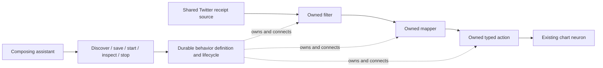

# DigitalBrain v2 behaviors

DigitalBrain now owns behavior composition. The NewProgrammingModel concepts are implemented on DigitalBrain's existing durable neurons, pending-work journals, commands, reminders and snapshot announcement outbox. Existing recipes, direct graph operations, specialist tools and Flutter routes remain available.

## What the assistant can do

The workspace assistant has `behavior_catalog`, `behavior_save`, `behavior_start`, `behavior_stop`, `behavior_read` and `behavior_list`. The neuron-based assistant and MCP clients use the same `IBehavior` through `describe` and `call` on `behavior:<name>`.

1. Discover capabilities and the target integration's method schemas.
2. Construct a definition with roles, registered capabilities, configuration and payload contracts.
3. Save it. Incompatible contracts, ownership or configuration are rejected before resource setup.
4. Start it and inspect the returned lifecycle status. Command acceptance alone is not success.
5. Read diagnostics to see failed contract checks, invalid model responses and uncertain actions.
6. Stop it to remove its subscriptions and disable its processors. Shared state and other owners' connections survive.

For example: “When Elon Musk posts something containing rocket, add that post to my chart.” A saved graph can connect `twitter:elonmusk` → filter → mapper → existing `ui.chart/append` action. The existing chart remains a real UI artifact. A semantic version can place a structured decision neuron before the filter. Internal events use the same composition with a named plain source.

Run the deterministic assistant and internal-event demonstrations in [EXAMPLES.md](EXAMPLES.md).

## Definition and capability rules

- Shared source roles name an existing registered neuron type; their configuration is empty. Registered source schemas (including Twitter's `Posted`) are authoritative. Plain signal sources use a caller-declared contract that processors enforce on actual delivery.
- Owned role identities are derived from the behavior, run and role. Retries reuse identities; a deliberate new run gets fresh processors so queued events from an old run cannot execute under new configuration.
- Each processor has one input and at most one output contract. Use branches and dedicated processors to express multiple routes. A connection carries the same signal type and compatible payload schema at both ends.
- A filter preserves data; a mapper uses a JSON template with `$input.required.field` references and `$signalId`. Mapping references require explicit, nonnullable object parents. Configuration contains no C# or arbitrary expressions.
- An action calls a method already registered in DigitalBrain's descriptor table. Its input matches that method's arguments **without the runtime-injected command id**. The existing command path records caller, causation and outcome. Action outputs are the method's declared result, which may be an accepted-work receipt.
- A decision uses a directly configured chat client. Function-invocation middleware and model function-call responses are refused. The existing conversational assistant retains its tools.

## Durability and recovery

Definitions and the behavior index are durable. Start/stop run as existing queued work. The lifecycle persists its intent before remote changes and repeats idempotent ownership/configuration operations after interruption. Configuration precedes upstream connection setup. In-progress lifecycle commands reserve the definition against conflicting changes.

Processors commit outputs with their snapshots using the existing announcement outbox. Mutating action ids derive from the processor and triggering signal. A repeated input or recovered action does not receive a fresh command id. When an attempted action lacks a safely recoverable outcome, its processor records the failed input, error and action identity; later inputs remain queued. No automatic uncertain-action replay is offered. Inspect the target command journal and processor diagnostics before deciding how to reconcile the external effect; stopping the behavior preserves its processor state.

Stopping disables future processing but cannot undo an action that already completed. The runtime does not promise a cross-provider transaction or universal exactly-once effects.

## Compatibility and limits

Existing storage keys and signal aliases are retained. No production storage is rewritten or deleted. Existing `RecipeNeuron` instructions and their direct module calls continue to work. Historical documentation about the removed C# handler runtime is not the v2 contract.

Schema compatibility is a conservative proof for the supported JSON Schema subset. Unknown validation keywords are rejected; some recursive or complex schemas require an explicit simpler contract. Current limits include 64 nodes, 256 connections and existing 64 KB command/signal limits. The behavior directory retains at most 4096 definitions. These are explicit limits, not claims that arbitrary workflows can always be composed.

Twitter/X receipt handling and its 4096-post deduplication window are documented in [TWITTER.md](TWITTER.md). A live X feed still requires an authenticated provider adapter, account access and receipt delivery. Tests simulate provider receipts; they do not configure or contact X.

See [PLAN.md](PLAN.md) for the execution plan and [research](research) for three independent Grok CLI planning outputs. The validation record distinguishes executed tests from external integration prerequisites.
