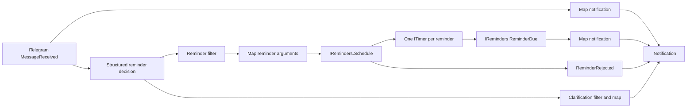

# Telegram Mini App and reminder behavior

## What is included

DigitalBrain's Telegram module accepts private-chat text updates from a bot and exposes a Flutter Mini App at `/telegram/app/`. The Mini App lists incoming messages, clarification requests, scheduled reminders and due notifications. Dismiss and cancel use durable typed commands.

The reusable UI primitive is `INotification` / `NotificationNeuron` plus Flutter `UiNotificationCard`. It is independent of Telegram and can be targeted by other behaviors.



One saved `behavior:telegram-reminders-{userId}` contains these paths. Shared resources are `telegram:{userId}`, `reminders:telegram-{userId}` and `notification:telegram-{userId}`. Mappers and decision processors belong to the behavior. The decision has no tools and cannot choose a target account or reminder identity. Reminder IDs derive from durable signals. The default graph installs before the first accepted receipt; subsequent receipts reuse its command identities and do not restart a manually stopped graph.

## Semantics

- “Remind me in ten minutes to call Alice” creates a one-off reminder when its structured decision has a valid future deadline.
- “Remind me to call Alice” asks for a time in the notification inbox.
- Ordinary conversation creates an incoming notification and schedules nothing.
- A request outside the supported time range produces a refusal notification. Normal business refusals do not pause later reminder requests. Clarification notifications use bounded fixed text rather than trusting arbitrary model text as UI content.
- Dates use the server-configured Telegram timezone, UTC by default. Daylight-saving ambiguity, missing dates, past requests and recurring schedules ask for clarification.
- Each reminder uses its own existing Time timer. `ITimer.ScheduleAt` preserves the absolute deadline if processing is delayed or the silo restarts. The older relative `Schedule` method remains available.
- Notifications are durable UI entries, not operating-system push alerts or outgoing Telegram reminder messages. `/start` returns the Mini App launch button through Telegram's webhook response.
- Other owner-authenticated clients can read the same Notification neuron through `/ui/notifications/{name}` or its typed descriptor; the Flutter card is reusable outside the Mini App.
- Cancelling is durably accepted before the read model catches up. A reminder that already fired cannot be undone by cancelling afterward.

## Configuration

### Local Aspire onboarding

Start the AppHost with `aspire start --apphost src/Aspire/DigitalBrain.AppHost/DigitalBrain.AppHost.csproj --non-interactive`. Open its dashboard and enter the **telegram-bot-token** secret parameter from BotFather. Aspire generates and persists a separate webhook secret. Do not put the bot token in chat, source control, Flutter, or a command line.

The AppHost builds a missing Mini App bundle, starts a restricted gateway and a Cloudflare quick tunnel, and supplies the resulting HTTPS origin to the kernel. The runtime checks `getMe`, verifies that the public route reaches this kernel and its built assets, registers `setWebhook` with `drop_pending_updates: false`, installs the Mini App menu button, and confirms `getWebhookInfo`. Only then does connection status become `Connected`.

Send `/start` to the bot, open **Open reminders**, then send a private message such as “Remind me in ten minutes to call Alice.” The incoming message installs the user's default behavior and enters the existing durable pipeline. Reminder decisions require the configured AI provider to be available.

The owner-authenticated endpoint `/agent/connections/telegram` reports setup state, sanitized errors, bot username, verification time and the last accepted message time. `Connected` means provider registration was verified; `lastMessageAt` is separate evidence that an incoming receipt reached DigitalBrain.

Cloudflare is needed only when this local machine lacks a public HTTPS endpoint. For a stable endpoint set **AppHost** `Telegram:PublicUrl=https://your-public-host` and route it to `telegram-gateway`. Set `Telegram:Enabled=false` to omit local onboarding. See [hosting configuration](../../src/Modules/Telegram/Aspire.Hosting/README.md) for executable paths and restart behavior. Quick tunnels are for development; restart the AppHost after a tunnel restart so the new URL is registered. Production requires a stable HTTPS origin or named tunnel.

### Standalone kernel / deployment

Set these environment variables on the kernel host (secret values belong in the deployment's secret store). Route the public origin through the Telegram gateway:

```text
DigitalBrain__Telegram__BotToken=<bot token>
DigitalBrain__Telegram__WebhookSecret=<random webhook secret>
DigitalBrain__Telegram__AutoConfigure=true
DigitalBrain__Telegram__PublicUrl=https://your-public-host
DigitalBrain__Telegram__TimeZone=Europe/Prague
# Optional direct AI provider/model selection; otherwise use existing AI defaults:
DigitalBrain__Telegram__DecisionProvider=<configured provider>
DigitalBrain__Telegram__DecisionModel=<configured model>
```

Configure a direct model client capable of structured JSON output. Function-invocation middleware is intentionally refused for graph decisions. Missing/invalid model output pauses that processor and is visible in behavior diagnostics; it does not schedule guessed reminders.

With `AutoConfigure=true`, registration and the menu button are automatic. To retain externally managed registration, omit it (default false), set `MiniAppUrl` explicitly, and configure the webhook with the matching `secret_token` and `allowed_updates: ["message"]`. Registration does not erase pending updates or unregister the bot on shutdown.

Telegram routes authenticate themselves through the existing module HTTP surface before the owner Basic-auth gate. All other kernel routes keep their existing authentication. Webhooks require the configured secret; Mini App requests require signed `Telegram.WebApp.initData` with a one-hour lifetime. The server derives the user ID from the signature, and accepts private human chat messages only. No bot token is sent to Flutter. Reopen the app when its signed session expires.

## Build and run

```powershell
# In src/Modules/UI/Flutter/telegram:
flutter pub get
flutter test --no-pub
flutter build web --release --base-href /telegram/app/ --no-pub
# Then from the repository root:
dotnet build DigitalBrain.slnx -p:CodeGraphRefresh=false
```

The silo project copies the built web bundle to `telegram-app` in build/publish output. The release workflow builds it before publishing the kernel container. Local Docker builds also require this Flutter build before building the image. To serve another build directory, set `DigitalBrain__Telegram__MiniAppRoot` to its absolute path. No separate Flutter server or duplicate Orleans host is required.

Without bot configuration the provider endpoints are disabled. The source and behavior can still be exercised through the deterministic tests, without an external bot or model account:

```powershell
dotnet test tests/DigitalBrain.Tests/DigitalBrain.Tests.csproj -p:CodeGraphRefresh=false -- --filter-class '*Telegram*'
dotnet test tests/DigitalBrain.Tests/DigitalBrain.Tests.csproj -p:CodeGraphRefresh=false -- --filter-class '*ReminderFacts'
```

## Retention and recovery

- Telegram receipt deduplication retains the most recent 4096 update IDs per user.
- Notification inbox retains 512 entries and 4096 seen event IDs. A redelivery beyond that retained history may appear again.
- Reminder collections retain 1024 lifetime IDs, including cancelled/delivered entries, and reject new IDs at capacity. Existing reminders remain inspectable; this iteration has no archive/reset UI.
- A stopped behavior removes its subscriptions. Already scheduled timers remain Time resources; stop does not cancel them. Use the Mini App's cancel action to cancel a scheduled reminder.
- Original provider receipt and all subsequent work use DigitalBrain's existing journals, snapshots, reminders and announcement outbox. No second durability subsystem was added.

## References

Telegram contracts follow the official [Bot API](https://core.telegram.org/bots/api) and [Mini App authentication documentation](https://core.telegram.org/bots/webapps#validating-data-received-via-the-mini-app), retrieved via Context7. The `ino/clients/Telegram` reference informed same-origin hosting and the launch button. `E:/projects/TripRadar/src/Aspire/Hosting` informed secret parameters, bot identity resolution and local HTTPS onboarding. DigitalBrain uses a restricted gateway, bounded tunnel discovery and no localhost fallback. See also [Cloudflare quick tunnels](https://developers.cloudflare.com/cloudflare-one/connections/connect-networks/do-more-with-tunnels/trycloudflare/).
