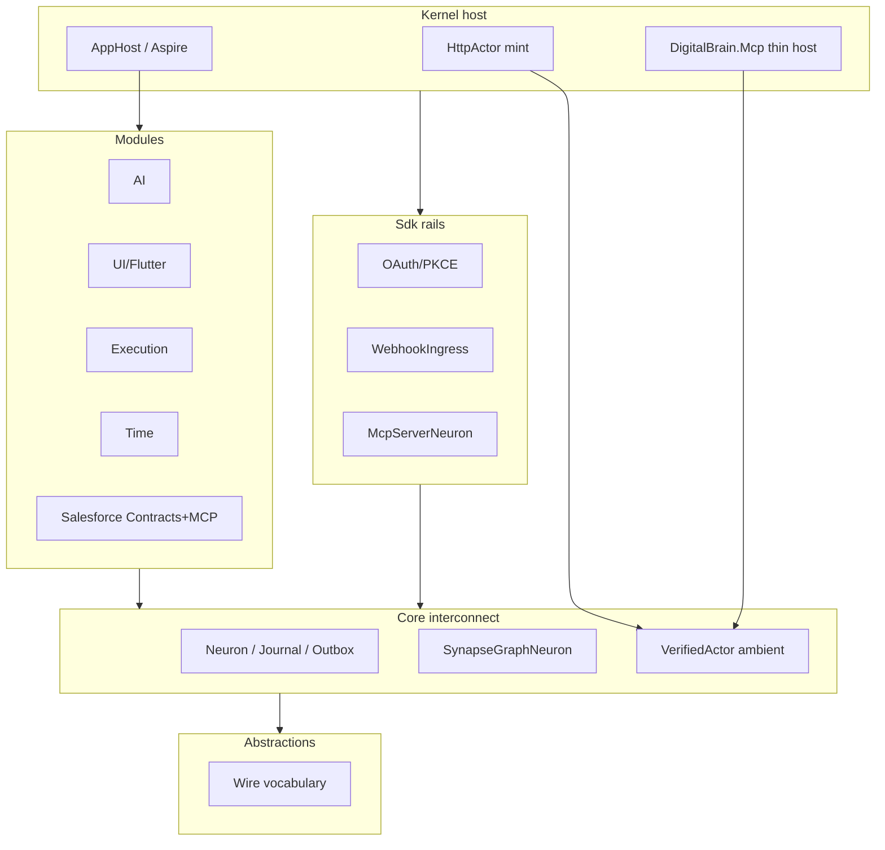
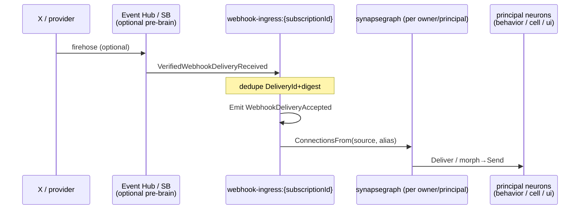

# DigitalBrain — Final Architecture (proposal for approval)

**Status:** Architect/CoS proposal **v1.4.1** for Vlad to **approve as a whole** (doc only — GRILL-VOCAB R3 surgical cleared; Contract/Edge/ConnectionGraph; no product code)
**Date:** 2026-08-12 (PT)  
**Tip baseline:** `stage1-outcome-rail` @ `aa5dfb35`  
**Annexes (tip honesty, not acceptance theater):**  
`plans/ABSTRACTIONS-CORE-KERNEL-INVENTORY.md` v1.2.1 · `/workspace/report-extract/CODEGRAPH-HONESTY.md` · `/workspace/report-extract/BRIEFING.md` · `plans/RATIFIED-PRODUCT-DEFINITION.md` · `CLAUDE.md` kernel traps · **Kernel Engineer Appendix K** · **`plans/VOCABULARY.md`** (product English authority with §2)  
**Authority after signature:** this document. Ontology/vocabulary is §2 (+ VOCABULARY.md). Trivia forks are collapsed into Architect recommendations — do not re-quiz.

---

## 0. How to read / approval meaning

| If you… | Then… |
|---|---|
| **Approve** | Eng Desk may schedule spine seams that implement **this** package. Inventory v1.2.1 remains the tip-honesty annex. Product Grill keeps **GREEN ≠ GRILL**. |
| **Correct in-place** | Mark the row / paragraph; Architect revises once; no micro yes/no forks. |
| **Reject a section** | Say which heading dies and what replaces it — still one package, not a quiz. |

**Reading rules**

1. Brain/Cortex HTML scenario scores (`percentCarried` / “as asked”) are **TARGET readings**, never tip acceptance.
2. `dotnet build -warnaserror` green is necessary, never sufficient.
3. Folder `src/Kernel/**` ≠ ownership. Ownership is §3 (layers); vocabulary is §2.
4. Production source @ tip is behavioral truth until a seam lands under stabilize-and-strangle.
5. **LIVE MCP NOT RUN — seam not ratified.** Alice/bob/operator Enter remains an illegal residual (§10, §14).

Approving this document means: *this is THE architecture, with named limitations, for the next strangle waves.*

---

## 1. Product shape (living graph OS)

DigitalBrain is a **personal / small-team operating system** — a living **ConnectionGraph** (tip: `ISynapseGraph`) the owner and assistant clarify → ratify → **rewire and program** while it runs.

| Horizon | Shape |
|---|---|
| **Near-term** | Seriously usable chat + voice + runtime UI (surfaces, dashboards, mini-apps) |
| **Differentiator** | Turing-complete expressivity **in the network** (neurons + contracts + edges + cells + behaviors) — not in any single cell evaluator |
| **Scale ceiling (this generation)** | ~**thousands of users** / private Azure RG installs — **not** millions SaaS / Entra multitenancy |
| **Later (out of ship bar; substrate must not forbid)** | Personalization via life data + fine-tune |
| **Quality bar** | Extremely clean .NET / Orleans / Aspire / Flutter |

**Proof journey (still the honesty bar from RATIFIED-PRODUCT-DEFINITION):** deploy Kernel + Flutter to Azure, HTTPS, username/password, admin invites a second user, private chat + private Google/Salesforce credentials, assistant builds a surface, “Publish to workspace” is visible to the friend’s assistant **without transferring credentials**.

**Canonical self-programming choreography**

```text
intent → find_capabilities → get_neurons → fire(db.connect + morph)
      → fire(source trigger)
      → data flows source → graph/relay → targets
      → UI / MCP / timers / webhooks observe Contracts
      → model is NOT on the data path
```

---

## 2. Ontology (Contract / Edge / ConnectionGraph — tip @ aa5dfb35)

> **§2 + `plans/VOCABULARY.md` win** over casual wording elsewhere.  
> **Teaching sentence:** Neurons Emit/Send **Contracts** (tip: `Synapse` payloads) along **Edges** (tip: Connections / `SynapseConnection`) in the **ConnectionGraph** (tip: `ISynapseGraph`).  
> Bare product noun **Synapse** is **forbidden**. Tip type names appear only as glosses (`tip: Synapse`).  
> Footnote: wire **Contract** ≠ Salesforce / module **Contracts assembly** (project of interfaces + types).

### 2.0 Pocket card (product English — zero Synapse rows)

| Term | IS | IS NOT |
|---|---|---|
| **Neuron** | Logical compute / durable Orleans grain; journal + journal-is-outbox + single-threaded turns. **All graph endpoints are Neurons.** | An edge; a payload; “the AI” |
| **Contract** | Typed **fact/payload** on the wire (tip type `Synapse` / `RequestSynapse<T>` + Orleans `[Alias]`) | An edge; a Neuron; a Credentials binding |
| **ContractAlias** | Stable string id of a Contract type (`ui.note`, `db.connect`, …) | An Edge identity |
| **Request Contract** | Tool-facing request/reply Contract (tip: `RequestSynapse<TReply>`) | Ordinary fire-and-forget Contract |
| **Edge** | Durable directed link (tip: `SynapseConnection`): Source --[ContractAlias (+ optional Morph)]--> Target | A Contract; a Neuron |
| **Connection** | **Synonym** for Edge (allowed everywhere) | — |
| **ConnectionGraph** | **Product name** for the living graph of Edges (RATIFIED) | Tip rename already done |
| **Morph** | Optional transform hanging on an **Edge** (declarative `to:alias{…}` or `ISynapseTransform`) | A Neuron; a Contract |
| **Cell** | `ICell : INeuron` — Neuron subtype, grain `"cell"`, `cell:{owner}/{kind}@{name}` | A second substrate |
| **Kind** | Cell program (tip e.g. `CalculatorKind` + KindRegistry) | A Behavior |
| **Behavior** | Tip: `BehaviorNeuron` (**a Neuron**, not a Cell Kind). TARGET: approved C# for residual I/O | An Edge; a Contract |
| **Schedule** | Time module `ISchedule` **Neuron** — Emits Contracts on ticks | An Edge; credentials |
| **Integration** | External **credentials** (OAuth/token slot) | An Edge |

**Vlad alignment (honest):** Biology “synapse ≈ connection” is right. We still **do not** overload bare product **Synapse** = edge — tip type `Synapse` already means payload (Kernel veto). Payloads = **Contracts**. Edges = **Edge/Connection**. Graph = **ConnectionGraph**.

```text
Neuron --Emit/Send(Contract)--> outbox --Deliver--> Neuron
              ^
   Edge(ContractAlias [+ Morph]) chooses receivers via ConnectionGraph
```

### 2.0b Vocabulary bridge (mandatory — tip honesty)

| Product English | Tip type / API | Wire / grain | Notes |
|---|---|---|---|
| Contract | `Synapse`, `RequestSynapse<T>` | per-type `[Alias("…")]` permanent once data exists | Product English **now**; C# rename later (L3 appendix) |
| ContractAlias | `SynapseAlias`, `[Alias]` | alias strings permanent | |
| Edge / Connection | `SynapseConnection`; Connect/Disconnect | `db.synapse-connection`, `db.connect*` stay | Do **not** call edge “Synapse” in product prose |
| ConnectionGraph | `ISynapseGraph`, `SynapseGraphNeuron` | grain `synapsegraph:…` sensitive | Product name; tip API lags |
| Morph | `Transform` on connection | transform strings are data | Morph **on Edge** |
| Delivery envelope | `SynapseDelivery` | `db.synapse-delivery` | Carries a Contract |
| Contract schema id | `ContractId` on capability descriptors | — | Tip already says “Contract” for payload identity |

### 2.1 Neuron

**IS:** Durable logical compute unit (`INeuron` : `IGrainWithStringKey`). Base `Core/Neuron/Neuron.cs`. Owns journals + outbox; **journal-is-outbox** = one `WriteStateAsync` per turn. Single-threaded (`NeuronConcurrency`). **Every graph Source/Target is a Neuron** (chat, ingress, cell, relay, mcp, schedule, …).

**Verbs:** `Send` / `Emit` / `Reply` / `FlushOutboxAsync`; client **`Fire`** = directed **or** emit (no target ⇒ emit semantics).

**IS NOT:** reentrant “for scale”; free to await own Send without flush; an Edge or a Contract type.

### 2.2 Contract (tip: `Synapse`)

**IS:** Typed fact/payload — tip `abstract record Synapse`. Wire name = Orleans `[Alias("…")]` / tip `SynapseAlias.Of` (e.g. `db.connect`, `ui.note`, `db.route-outcome`). Carried in tip `SynapseDelivery` (+ Principal, correlation, depth).

**Request Contract:** tip `RequestSynapse<TReply>` — **only these** materialize as assistant model tools.

**IS NOT:** an Edge. Never call a payload a connection.

**Disambiguation:** wire **Contract** (this section) ≠ module **Contracts assembly** (Salesforce/Google project of neuron interfaces + types).

### 2.3 Edge / Connection / ConnectionGraph

**IS:** Durable tip `SynapseConnection` edge on tip `ISynapseGraph` / `SynapseGraphNeuron`:  
`Source --[ContractAlias (+ optional Morph)]--> Target`  
APIs: `Connect` / `Disconnect` / `ConnectionsFrom` (tip name; product: EdgesFrom). Morph validated **at Connect** time.

**Product name:** **ConnectionGraph**. Tip type/grain naming stays `ISynapseGraph` / `synapsegraph:…` until a deliberate rename seam.

**Phrase:** living **ConnectionGraph of Edges**. Forbidden product phrases: “synapse graph”, “synapse graph of facts”, bare Synapse, “ConnectionGraph of Contracts” (graph is of Edges, not Contracts).

### 2.4 Emit vs Send vs Fire

| Verb | Semantics |
|---|---|
| **Emit** | Receivers = rare opt-in `[Broadcast]` ghosts **∪** EdgesFrom(self, ContractAlias) (tip: `ConnectionsFrom`) → per-receiver outbox → Deliver (or **relay** if Morph) |
| **Send** / directed **Fire** | Directed to one NeuronId; **never** consults the ConnectionGraph |
| **Fire** (no target) | Emit semantics |

**Trap (tip truth):** Broadcast catalog = **`[Broadcast]` only**, not every `IHandle<T>`. Wire aliases permanent once data exists.

### 2.5 Cell ⊂ Neuron

**IS:** `ICell : INeuron`, grain type `"cell"`, address `cell:{owner}/{kind}@{name}`. **One compiled grain**; Kind-driven apply/snapshot. Tip Kind example: `CalculatorKind`. Still journal/outbox/turns.

**IS NOT:** a second substrate. **Turing-completeness stays in the network** (neurons + edges + cells + behaviors), not inside one cell.

### 2.6 Kind / Morph / Behavior / Schedule / Integration

- **Kind** = Cell program.  
- **Morph** = Edge Transform (declarative `to:alias{…}` or DI `ISynapseTransform`) via `ConnectionRelayNeuron`.  
- **Behavior (tip)** = `BehaviorNeuron` — a **Neuron**, not a Cell Kind. **TARGET:** approved single-file C# / worker for residual I/O.  
- **Schedule** = Time `ISchedule` **Neuron** — ticks Emit Contracts the ConnectionGraph routes.  
- **Integration** = credentials / OAuth token slots — **never** an Edge.

### 2.7 Walkthrough — webhook → UI note

```text
1) Provider HTTP → Sdk verify → Neuron webhook-ingress:{subscriptionId}
2) Ingress Emit(WebhookDeliveryAccepted|domain Contract)
3) ConnectionGraph EdgesFrom(ingress, ContractAlias)     // tip: ConnectionsFrom
   e.g. Source=ingress → Target=chat:alice/main
        Morph=to:ui.note{…}   (validated at Connect)
4) Ingress outbox stages deliveries                      // journal-is-outbox
5) If Morph: ConnectionRelayNeuron → Send(ui.note Contract) → chat Neuron
6) Chat handles ui.note → transcript / surface
7) Flutter observes journal/SSE (observer only)

Optional Edge → cell:owner/calculator@alerts
   → CellApply (Neuron turn) → Schedule Neuron later Emits → another ui.note via Edges
```

**Chat `Fire`:** session Neuron fires a Contract → Emit or directed Send → same EdgesFrom/outbox/Deliver path. After wire-up, model is **not** on the data path.

### 2.8 Forbidden confusions

1. Edge/Connection ≠ Contract  
2. Contract ≠ Neuron  
3. Cell ⊂ Neuron  
4. Integration ≠ Edge  
5. Behavior ≠ Kind  
6. Fan-out = Emit→Edges (+ rare Broadcast), never Streams/EH as brain bus  
7. Docs that say “every IHandle enrolls broadcast” are **wrong** — cite `[Broadcast]`  
8. Bare product **Synapse** (either meaning) — use Contract or Edge + tip gloss  
9. Product phrase **“synapse graph”** — say **ConnectionGraph**

### 2.9 Appendix — Future L3 rename (fantasy, not present vocabulary)

Optional later code world: C# `Synapse`→`Contract`, `SynapseConnection`→`Synapse` (biology). **Cost L3/L4** (serializers, journals, every Contracts assembly). **Not** current product English. Do not teach L3 as today’s language.

---

## 3. Layer ownership (what Core is / is not; Sdk; Kernel host; Modules; MCP)

> **Folder `src/Kernel/**` is a solution layout, not an ownership claim.**

### 3.1 Abstractions — wire vocabulary only

**Owns (tip type inventory — product English in parentheses):** tip `Synapse` / `RequestSynapse` / `SynapseDelivery`(+Principal) (**Contract** / **Request Contract** / delivery envelope) · `INeuron` / `IHandle` / `ISessionNeuron` · `SettledDeliveryFailure` / `NeuronAuthorizationException` · Graph family (tip `ISynapseGraph`, Connect/Disconnect/Connected/Disconnected, tip `SynapseConnection` = **Edge**, `RouteOutcome*` / `Unrouted`) · journal observe contracts · identity ids + `ActorContext` DTO · capability descriptors/facts · cell apply/snapshot contracts · Workspace + Grants contracts · OAuth **path constants**.

**Does not own:** Orleans ambient, DI, HTTP, product chat types, MAF/`ChatMessage`.

Wire aliases permanent once data exists: `db.*`, `ui.*`, `chat.*`, `probe.*`.

**Tip truth (trap 8):** broadcast catalog enrollment = opt-in `[Broadcast]` only (`Abstractions/Messaging/BroadcastAttribute.cs`). CLAUDE/UA “IHandle enrolls” is **wrong** — cite code until docs-only fix.

### 3.2 Core — runtime interconnect only

**Owns:** `Neuron*` / Journal / Outbox / Turn / Pipeline / Concurrency / DeliveryPolicy · tip `SynapseGraphNeuron` (**ConnectionGraph** host) · `ConnectionRelayNeuron` + transforms · Broadcast\* · `VerifiedActor` ambient + drain re-enter · CapabilityInvocation + reification filters (`FrameworkInterfaces` = `INeuron`, `ISessionNeuron`, tip `ISynapseGraph`) · `DigitalBrainRuntime` + `ModuleAssemblies` **hooks** (not product catalogs).

**Core is NOT:** chat UI, Conversation, `ui.*`, Salesforce/Gmail product, Behavior Studio host, frozen `ChatMessage` / MAF types, AppHost module catalogs.

**Tip honesty — Core leakage (classify, then move — no sneak cleanup PR):**  
`Core/Behavior`, `Core/Cell`, `Core/Library`, `Core/Corpus`, `Core/Repository`, `Core/Workspace`, `Core/Grants`, `Core/Registry` (CODEGRAPH filesystem inventory).

### 3.3 Sdk — shared capability rails

**Owns:** `IMcp*` + list/call · OAuth/PKCE (`McpAuthorization*`, `DurableMcpTokenCache`, `PrincipalTokenSlot`) · durable payload protection · `WebhookIngressNeuron` / `VerifiedWebhookDeliveryReceived` / Accepted|Duplicate|Conflict.

Modules invent **no** parallel OAuth/webhook stacks.

### 3.4 Kernel host — trust + composition edge

**Owns:** ASP.NET Identity cookie + Azure Tables · `HttpActor` (HTTP→`ActorContext` mint) · PrincipalChat/Surface/Scoped · `MapOAuthCallback` (host-only one-shot codes) · `DigitalBrainHost` · AppHost brain/kernel/mcp/scripting resources (UI **ports** AppHost) · WorkspaceMembershipGateway.

**Not host:** UI vocabulary, Salesforce Contracts/impl, AI/Memory/Time/Execution product, Conversation domain.

Live auth today = `Kernel/Auth/**`. Empty `DigitalBrain.Auth/` is residue — do not resurrect as a Security package.

### 3.5 Modules

AI · UI (`ui.*` + Flutter) · Time · Memory · Google · Salesforce (**Contracts permanent**) · Execution · Introspection · (Stage-2: Conversations).

Authz via `VerifiedActor.Current` / `NeuronAuthorizationException` only — **never mint principals**.

### 3.6 DigitalBrain.Mcp — thin northbound host (cleanup target)

Today mixes operator tools with product verbs and **spoofs** `alice|bob|operator` via `VerifiedActor.Enter` (CodeGraph). **Decision:** becomes a thin authenticated host adapter over Sdk + module tools. Details §10.

### 3.7 Dual catalog (must die by design)

Tip: `AppHost.cs` `AddModule<>` **and** `ProductModules.Assemblies` — hand-aligned. **Decision:** one composition catalog generating Aspire projections + silo `ModuleAssemblies`.



---

## 4. Runtime interconnect (Neuron, journal-is-outbox, Emit vs Send, graph, cells, outcome rail)

### 4.1 Primitives (tip loci)

> **Canonical definitions: §2.** Compact index only.

| Primitive | Meaning | Tip path |
|---|---|---|
| **Neuron** | Logical compute / grain; journal+outbox; all graph endpoints | `INeuron`, `Core/Neuron/Neuron.cs` |
| **Contract** | Typed fact/payload + ContractAlias — **never** an edge | tip `Synapse` @ `Abstractions/Messaging/Synapse.cs` |
| **Request Contract** | Tool-facing request/reply Contract | tip `RequestSynapse<T>` / `SynapseCapabilityTool` |
| **Edge** / **Connection** | Durable link on **ConnectionGraph** | tip `SynapseConnection` on `ISynapseGraph` / `SynapseGraphNeuron` |
| **Cell** | `ICell : INeuron` grain `cell`, `cell:{owner}/{kind}@{name}` | `ICell`, `Core/Cell/*`, tip `CalculatorKind` |
| **Morph** | Transform on an **Edge** | `ConnectionRelayNeuron`, `ISynapseTransform` |
| **Journal / Outbox** | journal-is-outbox (delivers Contracts) | `NeuronJournal`, `NeuronOutbox` |

### 4.2 Journal-is-outbox (frozen — defend vs Streams)

A turn’s inbound cause + outbound Contracts + outbox entries commit in **one** `WriteStateAsync`. Delivery is at-least-once; receiver dedupe by tip `SynapseId` ⇒ effectively once.

**Why Streams never replace this (Appendix K / ratified §2.7):** Azure Queue streams are at-least-once, not rewindable, not FIFO under failure — **weaker** than the durable journal/outbox. Moving interconnect onto Streams breaks the atomic audit/replay boundary and reintroduces dual-write / reorder bugs the kernel traps already paid for. Streams/PubSub stay **provisioned-only** (`WithStreaming` + `PubSubStore`) until J5 proves non-use under Aspire telemetry, then may be deleted — **never** promoted to the bus.

Observers (UI/SSE/MCP) use **journal Watch/Read** (`IJournalObserver`), not Streams.

### 4.3 Emit vs Send vs Fire

| Verb | Semantics |
|---|---|
| tip `EmitAsync(synapse)` (arg = **Contract**) | Sender-blind fan-out: rare opt-in `[Broadcast]` ghosts **∪** EdgesFrom (tip: `ISynapseGraph.ConnectionsFrom`) |
| tip `SendAsync(receiver, synapse)` (arg = **Contract**) | Directed; **never** consults the ConnectionGraph |
| Client `FireAsync` | Emit without target; directed with receiver / `Get<T>(name)` |

Sanctioned fan-out path (Appendix K):

```text
Emit(Contract)
  → receivers = [Broadcast] ghosts (rare) ∪ EdgesFrom (tip: ConnectionsFrom)
  → per-receiver outbox entries on emitter
  → Deliver → target
       or ConnectionRelayNeuron morph → Send(adapted Contract)
```

### 4.4 Kernel invariants (do not rediscover)

1. No await own Send mid-turn without `FlushOutboxAsync`.
2. Zero-receiver Emit creates no outbox unless `Unrouted` staged — silent loss is a product bug.
3. Settled failures: `[SettledDeliveryFailure]` / `NeuronAuthorizationException` — no 1000×/30min theater.
4. Never emit mid-`DrainAsync`; outcome recursion guard mandatory.
5. Depth bounded (cycle brake).
6. Only Request Contracts (tip `RequestSynapse<TResponse>`) become model tools.
7. Keyword god-switches banned.

### 4.5 Outcome rail (tip vs TARGET)

| | Tip @ aa5dfb35 | TARGET / debt |
|---|---|---|
| Facts | `db.route-outcome`, `db.unrouted` present | Keep |
| Addressing | Journaled into **emitter incoming** post-drain (`StageIncomingOutcome`); not delivered | v2: inbox dual-address + caller once A18 keys exist |
| FixPath | **Absent** — Reason-only on `RouteOutcome` | Add FixPath for LLM-correctable text |
| Multi-hop | Refusal on hop sender; `SystemTools.fire` often timeout-blind | Close with Reason+FixPath surfacing |

### 4.6 Cells

See **§2.5**. `ICell : INeuron` — one compiled `"cell"` grain; Kind-driven apply/snapshot (tip `CalculatorKind` + KindRegistry). Not a second substrate. Turing-completeness remains **in the network**.


---

## 5. Identity & tenancy (principals, VerifiedActor placement, workspace)

### 4.1 VerifiedActor placement (one-row truth)

| Concern | Owner | Tip path / rule |
|---|---|---|
| **Mint** (HTTP→ActorContext) | Kernel host | `Kernel/Auth/Surfaces/HttpActor.cs` (+ Identity cookie). Only trusted edge mints. |
| **Ambient** (RequestContext) | Core | `Core/Identity/VerifiedActor.cs` — `Current` / `Enter` API |
| **Re-enter** on drain/deliver | Core | `NeuronTurnCoordinator.DeliverAsync` from `SynapseDelivery.Principal` |
| **MCP today** | **Spoof residual** | `DigitalBrain.Mcp/*Tools` Enter with `alice\|bob\|operator` — **illegal**; bypasses HttpActor. Local `fix/mcp-auth-principal` **unproven / not tip**. |

**Boundary sentence (Appendix K5):** Core enforces and propagates verified principals; only Kernel/Sdk host edges mint them; MCP is either an authenticated client of the brain (northbound) or a principal-keyed integration rail (outbound) — **never a second identity universe.**

Modules/Sdk must not mint. Enter-at-trusted-edge only after mint is real (cookie/OAuth), never from tool string enums.

### 4.2 Workspace & roles

- One deployment ≈ one workspace (personal = one member). Roles: Owner/Admin, Builder, Viewer.
- Workspace = security boundary (per-dashboard ACLs deferred).
- Installation-local Identity (no Entra). HTTPS beyond localhost.
- Durable commands persist actor stamp — `RequestContext` alone does not survive reminders/retries.

### 4.3 Principal partition (A18 — required before multi-user honesty)

**Decision:** Principal immutable on `SynapseDelivery` / outbox; product grains principal-scoped (`chat:{principal}/main`, MCP slots `(serverKey, PrincipalId)`, surfaces scoped). Owner-scoped corpus/inbox/registry/graph treated as **defect** until partitioned or grant-gated.

Cross-principal **Connect refuses by default**. Grants = Read|Watch with revoke + `EvictWatchers`.

### 4.4 Conversation (Stage-2 extract)

Target: `UI → Conversations ← AI`. Tip Chat remains until then. Exactly one `role:responder` binding per Conversation; default **auto-bind per conversation** so concurrency works. Turns = Execution adapters; FIFO one-active per conversation; cancel is versioned, not undo. HTTP/SSE observers only.

**A19:** `WaitingPolicyDeadline` must **not** cancel Execution blockers that are user-action (OAuth/browser trip).

---

## 6. Integrations & webhooks (MCP catalog; OAuth; X/Elon multi-subscriber fan-out)

### 5.1 Naming

- **Connection** = in-brain graph edge.
- **Integration** = external system account (per-user OAuth by default).

### 5.2 MCP catalog surface (outbound)

- Grain `mcp` / instance = server key (`mcp:…`) via Sdk `McpServerNeuron`.
- **Live `tools/list` IS the surface** — `db.mcp.list-tools` / `db.mcp.call-tool`.
- `McpServerDefinition` DI-registered (Gmail, Salesforce, …).
- **All catalog tools callable** — no product destructive-approval middleware (ratified). Safety = verified principal + per-principal protected tokens + journal audit + `OutcomeUncertain` after non-idempotent external start.
- `FireRowsAs`: validate **all rows before first emit**; summary reply; opt-in broadcast only; graph routes shaped `ui.*` (etc.).
- Salesforce **Contracts** remain the permanent module boundary even while runtime tools arrive via MCP.
- Gmail typed path deleted only after official Gmail MCP parity.

### 5.3 OAuth/PKCE rail (Sdk)

- Keyed `(serverKey, PrincipalId)`.
- Bounded, expiring, one-shot host-only callback (`MapOAuthCallback`).
- Tokens protected (`StateProtectionKey`); never journaled.
- No silent credential fallback; publish never transfers personal credentials.

### 5.4 Sanctioned webhook → Emit → graph fan-out (Appendix K2)



Tip path already correct-shaped: `WebhookIngressNeuron` (grain key = `SubscriptionId`) handles `VerifiedWebhookDeliveryReceived`, dedupes by `DeliveryId`+canonical digest, then **Emit**s `WebhookDeliveryAccepted` | `Duplicate` | `Conflict`. Subscribers attach via graph/morphs — Sdk rail, not Core.

### 5.5 Elon / X multi-subscriber pattern (Appendix K — concrete)

**Problem:** thousands of principals want “when @elonmusk posts, do X.”

| Do | Don’t |
|---|---|
| **Per-principal (or per-workspace) subscription** → own `webhook-ingress:{subscriptionId}` → Emit once → graph edges to **that principal’s** neurons (chat/note/automation/behavior). Fan-out cardinality stays inside one tenant’s graph. | One global ingress grain with N≈thousands of graph targets (outbox + `ConnectionsFrom` on that grain = bottleneck + blast radius). |
| If one upstream firehose: Event Hub/Service Bus **only as pre-brain ingress buffer** that fans into **many** per-principal `VerifiedWebhookDeliveryReceived` sends. | Orleans Streams / Azure PubSub topic as `ISynapseGraph` substitute. |
| Module emits a **generic vocabulary fact** (e.g. `x.post-created`) — not a case-specific god neuron. | N provider webhooks (one per user automation). |
| Automations = connections + (kinds\|behaviors) + grants. | Cross-tenant fan-out bus “for scale.” |

```text
X --1 subscription URL--> (optional EH/SB buffer)
        --> many VerifiedWebhookDeliveryReceived
              --> webhook-ingress:{principalSubscription}
                    --> Emit (Accepted / domain fact e.g. x.post-created)
                          --> per-principal ConnectionGraph
                                --> that principal's behaviors / cells / ui.*
```

Providers see **one** (or few) installation subscriptions; DigitalBrain multiplies **internally** via partitioned ingress grains + owner graphs — never via a second messaging product replacing the outbox.

---

## 7. Behaviors & kinds (proposed architecture)

**Proposed division of labor (R1 — approve with the whole):**

| Path | Use when | Mechanism |
|---|---|---|
| **Kinds + schedule + morph + cell** | Aggregation, thresholds, calendars, “calculator,” most automations expressible as data | One cell grain type; immutable content-hashed kind JSON; zone schedules; declarative `to:alias{…}` morphs; **no C# authored** |
| **C# Behaviors** (single-file .NET apps / OOP worker) | Residual I/O, multi-step research, repo review, anything needing real programming | Versioned approved revision + permission manifest; killable out-of-process worker; **no ambient authority**; effects via Execution client |

Turing-completeness is **in the network**, not the cell evaluator. Wave 0 lands kinds without deleting C# Behaviors. Behavior Studio waits for Behavior-host design (scripting capability) — no code before that session.

Library: publish → discover → **deliberate install** (arrives DISABLED); enable against installer credentials; no auto-propagate; no asymmetric cross-deployment signing this generation.

---

## 8. Assistant surface (3 tools; MAF/MEAI as inner engine)

### 7.1 Three tools forever (`Modules/AI/.../SystemTools.cs`)

1. `find_capabilities(intent)` — CapabilityIndex (keyword floor; embeddings enrich when present)
2. `get_neurons(type?)` — live instances + connections
3. `fire(contract, arguments, target?)` — bind, validate, send; return reply **or** RouteOutcome Reason(+FixPath)

No fourth admin tool. Kill creep: team/convene/ask_llama as constant tools. Graph verbs are ordinary contracts.

### 7.2 MAF / Microsoft.Extensions.AI

**Decision:** inner engine inside AI module (and thin helpers), **never** the product boundary.

- Direct agent loop for simple chat; optional MAF workflow **inside** a Behavior revision.
- Orleans-owned `IExecution` is the durable job system — no second framework; no MAF Durable Extension unless Orleans proves insufficient.
- **Do not freeze `ChatMessage` / MAF types into Core.** Tip smell: `DigitalBrain.Core.csproj` → `Microsoft.Extensions.AI.Abstractions` — keep minimal or push to AI; never expand.

---

## 9. UI (Flutter core/kit/shell; runtime surfaces/dashboards)

```text
shell → core → Kernel HTTP (cookie auth)
kit   = standalone widgets (never import core/shell)
```

Paths: `src/Modules/UI/Flutter/{core,kit,shell}`.

| Concern | Decision |
|---|---|
| Vocabulary | UI module owns `ui.chart-point`, `ui.node`/`ui.edge`, button, chat, surfaces, timer cards |
| Kit naming | Models plain (`GraphNode`); widgets `Kit*` (`KitGraph`, `KitChart`, `KitTimerPart`) |
| Surfaces | Durable declarative part lists; chat shows bound refs (`ui.view-card`), not payload dumps |
| Sharing | Personal-first; **Publish to workspace** = workspace-owned revision; grants Read\|Watch + EvictWatchers |
| Transport | HTTP/SSE **observers** of journals — disconnect never cancels Execution |
| Honest limit | No OS second-monitor windows; in-shell panes only |
| Open seams (Modules lane post-signoff) | SceneOpened → windowing; delivery-pulse for Brain Map edges |

---

## 10. Substrate & scale (Orleans; Azure storage; Aspire; EH/SB/PubSub seats)

### 9.1 Orleans under load — invariants ARE the scale model (Appendix K1)

Scale by **more grains** (principals, conversations, ingress subscriptions, graphs per owner) — **never** by making one hot neuron reentrant.

| Invariant | Scale consequence |
|---|---|
| Single-threaded turns (`NeuronConcurrency`) | Throughput = activation topology, not reentrancy hacks |
| Journal-is-outbox | Atomic audit; cost = per-turn blob journal IO on that neuron |
| Outbox + SynapseId dedupe | Effectively-once without Streams |
| Owner/principal partition | Natural multi-tenant key — not a global bus |

**Load practices (code-shaped):**

1. **Hot-grain avoidance:** never put all tenants’ subscribers as targets of one emitter — prefer per-principal/per-subscription ingress (§5.5).
2. **Graph lookup budget:** `DeliveryPolicy.ConnectionLookupTimeout` inside `DeliveryAttemptTimeout` (~45s) — treat as SLOs to re-measure under dual-silo, not magic constants.
3. **Retry storms:** non-settled failures retry ~50ms × 1000 / 30min — deterministic/auth/MCP errors **must** settle or ingress melts reminders/CPU.
4. **Flush discipline:** arm-then-observe uses `FlushOutboxAsync`; awaiting own Send without flush still starves.
5. **Broadcast:** opt-in `[Broadcast]` only — do not reopen “every IHandle enrolls.”
6. **Reification allowlist:** `FrameworkInterfaces` = INeuron / ISessionNeuron / ISynapseGraph only.
7. **Activation topology:** many small neurons > few god neurons (chat’s one-active-Execution-per-conversation is the pattern to copy).
8. **Graph wall:** tip single `synapsegraph:{owner}/graph` — partition / cache `ConnectionsFrom` before thousands-user load.

### 9.2 Aspire-wired Azure storage map (Appendix K3)

Already wired in `AddDigitalBrain` (local / Azurite = single storage account):

| Resource name | Azure type | Role |
|---|---|---|
| `storage` | Storage account | Fabric root |
| `clustering` | Tables | Orleans membership |
| `reminders` | Tables | Orleans reminders (outbox wakeup, timers, schedule catch-up) |
| `journal` | Blobs | Orleans journaling — **required**; host refuses start without `ConnectionStrings:journal` (`JournalStorageHosting`) |
| `streams` | Queues | Orleans stream provider `"DigitalBrain"` (~8 queues) — **not interconnect** |
| `pubsub` | Tables | Orleans `PubSubStore` for streams — **not product pubsub** |
| `DigitalBrain:Security:StateProtectionKey` | config / Key Vault | Durable payload protection (tokens) |

Also named in product composition (modules, not Core interconnect): Qdrant (`memory-qdrant`), Ollama/OpenAI, OAuth client secrets, Identity Azure Tables user store (`TableAccountDirectory` — **distinct** from Orleans reminder tables).

**Prod gaps to name (not silent):**

1. Journal blob retention / compaction / size SLO (`RouteOutcome` Reason already capped at 2048).
2. Whether clustering / reminders / journal / streams / pubsub share one account forever or split by blast radius + IO (journal blobs = hot durability path).
3. `docker-compose` smoke today sets `clustering`/`reminders`/`journal` only — streams/pubsub **not** in compose env (Aspire wires them; compose path must be honest for scale tests).
4. Identity tables vs Orleans tables — separate prefixes; never mix account rows with reminder rows.
5. StateProtectionKey in Key Vault; rotate without stranding protected token refs.
6. Multi-silo: reminder + journal consistency; `IOutboxWakeup` co-correct with failover.
7. Single-silo schedule honesty: ticks due while down → one phase-preserving **Recovered** tick (`CollapsedPeriods`), not infinite backfill.

### 9.3 Event Hub / Service Bus / “PubSub” — seats vs anti-patterns (Appendix K4)

| Seat | Legitimate? | Why |
|---|---|---|
| Pre-brain **ingress buffer** (EH/SB) → workers → `VerifiedWebhookDeliveryReceived` | **Yes** | Firehose/backpressure; brain still owns dedupe+Emit+graph |
| OOP Behavior/script **worker jobs** (SB queue) | **Yes** | Killable workers; effects re-enter via Execution client |
| Analytics/audit **export** after journal (EH) | **Yes (optional)** | Downstream only; never authoritative |
| Orleans `pubsub` tables / Azure Queue Streams provider | **Infra only** | Provisioned until J5 proof; never interconnect bus |
| Replace outbox with EH/SB | **Anti-pattern** | Loses journal-is-outbox atomicity + tip `SynapseId` dedupe |
| Dual-write Contract to bus AND outbox | **Anti-pattern** | Split brain, reorder, double side effects |
| Global SB topic as `ISynapseGraph` substitute | **Anti-pattern** | Bypasses owner graph, transforms, RouteOutcome, principal partition |
| Cross-tenant fan-out bus “for scale” | **Anti-pattern** | Violates workspace/principal boundary |

**Rule of thumb:** cloud messaging may touch the brain at **Sdk ingress/egress edges**; Core interconnect stays Neuron journals/outbox + owner graph.

### 9.4 Aspire / verification

AppHost composes silo + Azurite + module projections. Gate: `dotnet build DigitalBrain.slnx -warnaserror`; Flutter `flutter analyze lib`. No central test-suite restore this generation (module-owned frameworks later). SOURCE → GREEN → GRILL → GATE → COMMIT.

---

## 11. DigitalBrain.Mcp contract (what it exposes; auth residual honesty)

### 10.1 What it is for

Northbound **operator / Cursor / smoke** surface (`http://localhost:5000/mcp`, `.mcp.json`). Not the product identity model. Not a second login universe.

### 10.2 Tip tool surface (must migrate / thin)

| Tool family | Tip file | Destination |
|---|---|---|
| Chat send / button | `ChatTools.cs` | UI / Conversations module tools |
| Introspection journals | `IntrospectionTools.cs` | Introspection module |
| Library / Behavior / Repo | `LibraryBehaviorTools.cs` | OS modules after classify |
| Registry / Grants / Charts | `RegistryTools.cs` | Registry/Grants hosts |
| Time / Cell / Corpus | `TimeTools.cs` | Time / Cell modules |

After product tools leave: **thin host** over Sdk rails + module-exported tools.

### 10.3 Auth residual honesty (must stay loud)

| Residual | Status |
|---|---|
| Fixed `alice\|bob\|operator` + `VerifiedActor.Enter` | Tip @ aa5dfb35 **spoof** — CodeGraph Enter-caller list |
| Live MCP / Aspire principal probe | **LIVE MCP NOT RUN — seam not ratified** |
| `fix/mcp-auth-principal` | Exists in some checkouts — **unproven / not tip** |
| `McpAuthorizationNeuron` hardcodes grain `"chat"` + `main` | Conversation extract landmine |
| Northbound auth parity with `HttpActor` | **Required before “thousands of users”** (Appendix K5/K6) |

**Decision:** authenticate caller → mint real `ActorContext` → `VerifiedActor.Enter` → Fire. Demo principal enums die on the production path.

---

## 12. Hard limits & non-goals

**Non-goals / honest limits**

- Not multi-tenant hyperscale SaaS; not IntoChat/Entra dependency; not passkey-first (for now).
- Not a second workflow/job framework beside Execution; MAF edges never mirrored as Connections.
- Not a runtime assembly loader into the credentialed silo (RCE).
- Not Orleans Streams as interconnect.
- Not federation / asymmetric cross-deployment signing / per-dashboard ACLs yet.
- Not OS second-monitor windows; not continuous 60Hz.
- Not auto-propagate installs across brains.
- Not central automated-test suite restore during this refit.
- Exact decimal money in `double` charts = permanent exclusion.
- Allow-list ≠ OS egress for Behavior workers — sandbox residual or “trusted compiled behaviors only” until jailed.
- Vector Memory / feedback retrieval / personal fine-tune rails later.

**Tip residuals that block “fully working” claims** (loud until closed — implementation order §12/§14):  
LIVE MCP principal probe · alice/bob/operator Enter · outcome FixPath/inbox incomplete · empty `DigitalBrain.Auth/` · `McpAuthorizationNeuron` chat+main · Core domain leakage · dual catalog · A18 owner-scoped stores · A19 WaitingPolicy vs OAuth park.

---

## 13. Migration order (Abstractions → Core → Kernel host → Modules; stabilize-and-strangle)

Chosen over big-bang rewrite and cosmetic consolidation.

```text
0. Vlad signs THIS document
1. Abstractions freeze (wire family, RouteOutcome+FixPath shape, Broadcast truth, connect-time cross-principal refuse)
2. Core interconnect harden (journal-is-outbox, outcome surfacing to fire, Principal on delivery, graph partition design)
3. Kernel host trust edge (HttpActor only mint; northbound MCP principal parity; dual catalog → one)
4. Sdk rails stabilize (OAuth/PKCE, webhook ingress, PrincipalTokenSlot unify)
5. A18 principal partition of corpus/inbox/registry/graph + grants
6. A19 WaitingPolicy vs OAuth blockers
7. Modules Stage-2+: Conversation extract; Chat/Time tools leave Mcp; kinds Wave-0; Behavior host design→code
8. Integrations: Gmail MCP parity; X module as first webhook consumer; FireRowsAs polish
9. Flutter surfaces / Brain Map pulses
10. J5 Streams/PubSub prove-non-use → delete provisioning
```

**Do not do yet:** folder/namespace cleanup PRs · modules ahead of Abstractions→Core · central tests · Streams interconnect · graph rename opportunistic · Behavior Studio pre-design · parallel OAuth/webhook in modules · citing scenario scores as tip proof · claiming live MCP ratified.

**Residuals to close after approval (implementation order):** A18 → MCP spoof death + live principal probe → A19 → FixPath/outcome visibility → Core eviction after classify → dual catalog unification.

---

## 14. Architect recommendations (former Vlad forks → proposed defaults)

These are **baked into this architecture**. Edit the row if you disagree; we do not re-quiz.

| # | Former fork | Proposed default |
|---|---|---|
| **R1** | Wave 0 / Turing-in-network | **Both:** kinds-as-data for data paths **and** residual single-file C# Behaviors for real I/O. Turing-completeness is in the network. |
| **R2** | Destructive MCP | **Keep ratified:** all catalog tools callable; **no** product approval middleware. Provider scopes + per-principal tokens + journal + OutcomeUncertain. |
| **R3** | A18 principal-on-delivery | **Required** before multi-user honesty: Principal on delivery/outbox; principal-scoped product grains; owner-scoped stores = defect until partitioned/grant-gated. |
| **R4** | A19 / 15s vs OAuth | WaitingPolicyDeadline **must not cancel** user-action Execution blockers. Fix the seam; don’t blindly lengthen 15s. |
| **R5** | Sharing wording | Discover + **deliberate install**; grants Read\|Watch + revoke; workspace-owned surface revisions for Publish; **Connect refuses cross-principal by default**. |
| **R6** | Behavior / Library / Corpus | **Not Core interconnect** — Modules / dedicated OS modules after classify. Contracts may stay in Abstractions. |
| **R7** | Workspace / Grants | **Kernel-OS boundary forever** (contracts Abstractions; neurons not Core interconnect). |
| **R8** | Outcome addressing | Keep tip journal-into-emitter as v1; **add FixPath**; fire surfaces Reason+FixPath; inbox dual-address as v2 after A18. |
| **R9** | DigitalBrain.Mcp | Thin authenticated host; kill demo principals; product tools leave. |
| **R10** | Integration vs PrincipalTokenSlot | Unify on Sdk `PrincipalTokenSlot` + Abstractions Integration descriptors. |
| **R11** | Graph / Elon scale | **Per-principal ingress grains** + partitioned graphs — **not** one global emitter with thousands of targets (Appendix K). |
| **R12** | Streams / EH / SB | Provisioned Streams only; EH/SB at ingress/worker/export edges only; never replace outbox. |
| **R13** | Broadcast docs | Docs-only: CLAUDE/UA → `[Broadcast]` opt-in; code already correct. |
| **R14** | Dual catalog | Single composition catalog for Aspire + silo. |
| **R15** | Core ME.AI dep | OK short-term minimal; **no ChatMessage freeze**; push out when convenient. |

---

## 15. Approval checklist

Vlad checks the box = the package is baseline.

- [ ] **§1 Product shape** — living ConnectionGraph OS; thousands not millions; chat+voice+runtime UI first.
- [ ] **§2 Ontology** — Contract / Edge / ConnectionGraph; tip glosses only for `Synapse*`; no product “synapse graph” / bare Synapse.
- [ ] **§3 Layer ownership** — Abstractions / Core interconnect / Sdk rails / Kernel host mint / Modules; Core leakage classified before move.
- [ ] **§4 Interconnect** — journal-is-outbox frozen; Emit vs Send; `[Broadcast]` opt-in; outcome rail v1 + FixPath path.
- [ ] **§5 Identity** — HttpActor-only mint; VerifiedActor ambient/re-enter; A18 principal partition; workspace roles.
- [ ] **§6 Integrations** — MCP live catalog; OAuth per principal; **Elon pattern = per-principal webhook-ingress → Emit → ConnectionGraph** (not global mega-emit; not N webhooks).
- [ ] **§7 Behaviors & kinds** — kinds/schedule/morph for data paths; C# Behaviors for residual I/O.
- [ ] **§8 Assistant** — three tools forever; MAF/MEAI inner engine only.
- [ ] **§9 UI** — Flutter core/kit/shell; surfaces durable; observers not cancelers.
- [ ] **§10 Substrate** — Orleans many-small-grains; Aspire storage map named; Streams ≠ interconnect; EH/SB edges only.
- [ ] **§11 Mcp contract** — thin host; spoof residual acknowledged; principal parity before scale claims.
- [ ] **§12 Hard limits** — accepted as written.
- [ ] **§13 Migration order** — Abstractions→Core→host→Modules; residuals A18 → MCP spoof → A19 → FixPath after signoff.
- [ ] **§14 Recommendations R1–R15** — accepted as defaults (or corrected in-place above).
- [ ] **Appendix K merge** — Streams ban + sanctioned fan-out + storage table + EH seats + MCP vs Core principals carried into §§5/9/10.

**Signature**

```text
Approved by: _______________________  Date: ________
Corrections attached: yes / no
```

After signature: Eng Desk queues one seam at a time under SOURCE→GREEN→GRILL→GATE→COMMIT. Product Grill veto remains. No production code from this draft alone.

---

*End of Final Architecture proposal. Annex: `plans/ABSTRACTIONS-CORE-KERNEL-INVENTORY.md` v1.2.1 · Kernel Engineer Appendix K (folded).*
