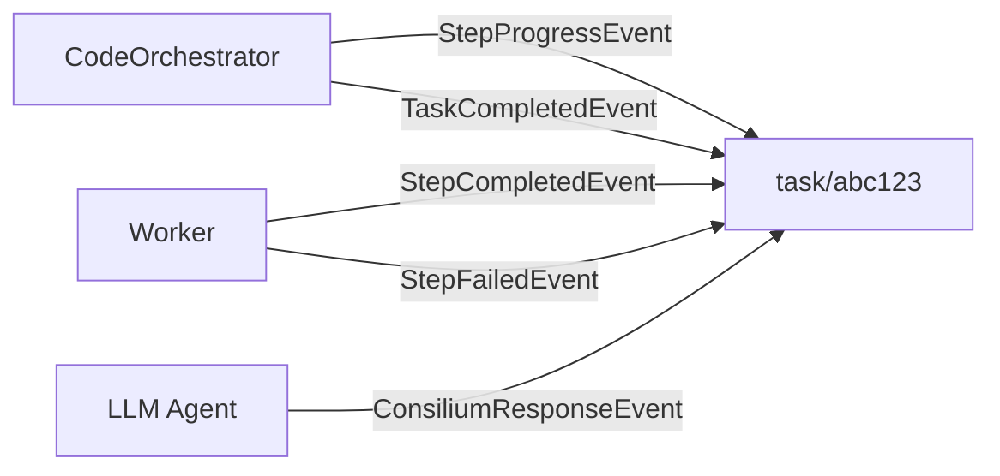
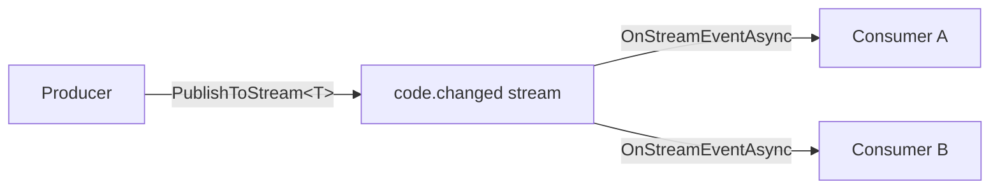
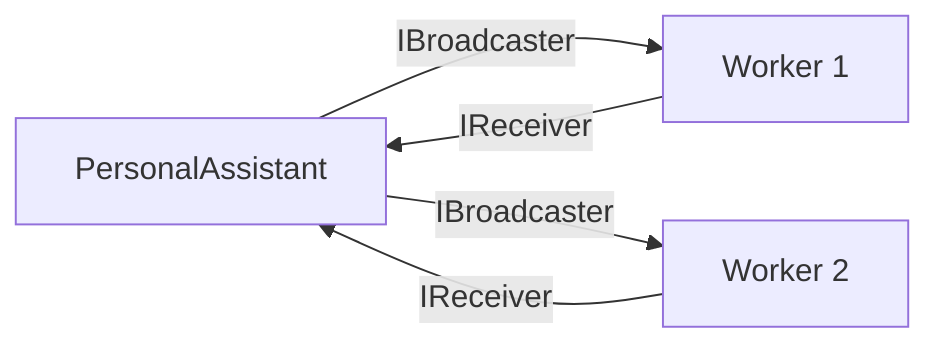
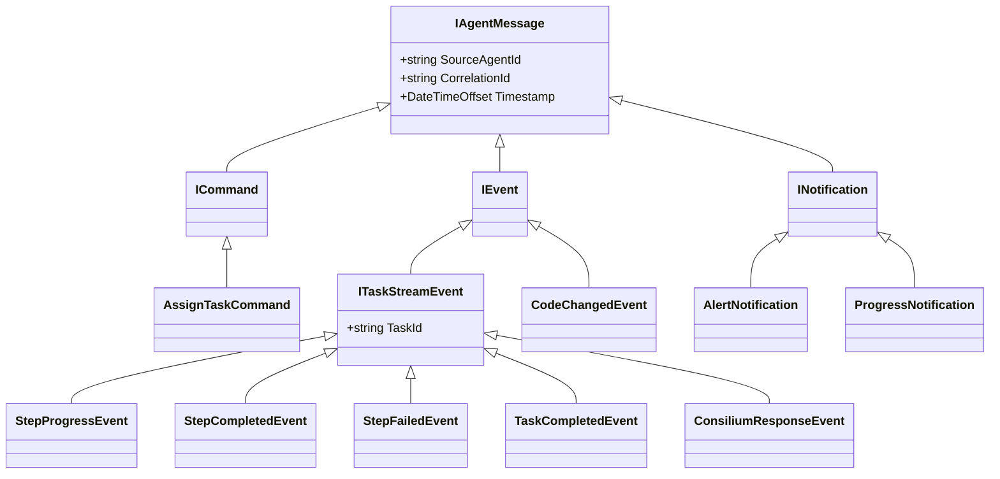

# Architecture

This page covers the v0.2.0 agent class hierarchy, communication patterns, orchestration pipeline, persistence, context providers, and the agent registry.

<ArchitectureDiagram />

## Three-Tier Hierarchy

```
DurableGrain (Orleans.Journaling)
  +-- Agent (IAW.Core) [abstract, partial]
        implements IAgent, IRemindable, ISelfDiagnosable
        5 constructor params
        |
        +-- LLM (IAW.Core) [abstract]
        |     Same 5 params, default Instructions
        |     11 agents: Sonnet46, Opus46, Claude45Haiku, Gpt4o,
        |     Gpt4oMini, Gpt52, Gpt53, Gemini31, GrokLatest, Llama32, Qwen25
        |
        +-- Memory (IAW.Core) [abstract]
        |     7 params (+memories, +embedder)
        |     5 agents: UserMemory, ProjectMemory, PatternMemory,
        |     EpisodeMemory, CodeMemory
        |
        +-- DynamicAgent (IAW.Core) [concrete, runtime-created]
        |
        +-- (domain agents extending Agent directly)
              PersonalAssistant, CodeOrchestrator, TaskSupervisor, Planning,
              Deployer, Notification, Reviewer, SelfImprovement,
              FileSystem, Shell, Git, Build, Aspire,
              Roslyn, DotNet, NuGet, GitHub, User, Knowledge
```

`Agent` is split across 8 partial files for maintainability:

| File | Concern |
|---|---|
| `Agent.cs` | Conversation (GetResponse, GetResponseStream, history) |
| `Agent.Events.cs` | Event publishing (PublishAsync, PublishToStream, PublishToTaskStream) |
| `Agent.Streams.cs` | Stream subscriptions (IStreamConsumer auto-wiring) |
| `Agent.Tools.cs` | Tool registration (built-in + DefineTools) |
| `Agent.Tracking.cs` | Tracking items (StartTrackingAsync, OnTrackingDueAsync) |
| `Agent.State.cs` | Workspace and state management |
| `Agent.Lifecycle.cs` | Metadata, capabilities, cancellation |
| `Agent.Observers.cs` | Observer subscribe/unsubscribe |

## Communication

Agents communicate through three channels, all with auto-logging to the durable event log and OpenTelemetry instrumentation.

### Task Streams

Task-scoped events flow through per-task Orleans streams at `StreamId.Create("agents", $"task/{taskId}")`. All events implement `ITaskStreamEvent` (which extends `IEvent` with `TaskId`).



Published via `PublishToTaskStream<TEvent>(taskId, evt, ct)`.

### Typed Pub/Sub

Global typed events flow through streams named by convention (PascalCase to dot.case with suffix stripped). `IStreamConsumer<T>` auto-subscribes on grain activation, `IStreamProducer<T>` declares publishing capability.



### Peer-to-Peer

Directed messaging between specific agents via `IReceiver<T>` (one-to-one) and `IBroadcaster<T>` (one-to-many fan-out).



## Orchestration

The orchestration pipeline decomposes natural-language task descriptions into executable agent scripts.

### CodeOrchestrator

`CodeOrchestratorAgent` (implements `ICodeOrchestrator`) manages task lifecycle with durable state:

```csharp
public interface ICodeOrchestrator : IAgent
{
    Task<string> CreateTask(string description, CancellationToken ct = default);
    Task<TaskState> GetTaskState(string taskId, CancellationToken ct = default);
    Task PauseTask(string taskId, CancellationToken ct = default);
    Task ResumeTask(string taskId, CancellationToken ct = default);
}
```

`TaskState` tracks the full task lifecycle:

```csharp
public record TaskState(
    string TaskId,
    string Description,
    OrchestrationStatus Status,    // Created, Running, Paused, Completed, Failed
    IReadOnlyList<StepRecord> Steps,
    DateTimeOffset CreatedAt,
    DateTimeOffset? CompletedAt);
```

### ScriptGenerator

`ScriptGenerator.Generate(plan, endpoint, port, workspace?)` turns an `OrchestrationPlan` into a runnable C# script. It uses `InterfaceCatalog.Discover()` to resolve grain interfaces and grain IDs for each step, generating code that connects to the Orleans cluster and invokes agents in order.

### OrchestrationCompiler

`OrchestrationCompiler.Compile(source)` validates generated scripts using Roslyn, checking for compilation errors without executing:

```csharp
var result = OrchestrationCompiler.Compile(scriptSource);
if (!result.Success)
    foreach (var error in result.Errors)
        Console.WriteLine(error);
```

### InterfaceCatalog

`InterfaceCatalog.Discover()` scans all loaded assemblies for `IAgent`-derived interfaces and their concrete implementations, building a catalog with each agent's `InterfaceName`, computed `GrainId`, and lists of produced/consumed/received message types. This catalog is the discovery backbone for `ScriptGenerator` and for injecting agent awareness into LLM prompts via `InterfaceCatalog.ToPromptString()`.

## Durable State

The `Agent` constructor accepts five durable state collections. `Memory` agents add two more. Orleans injects and persists these automatically via journaled grain storage:

| Parameter | Type | Storage Key | Tier |
|---|---|---|---|
| `state` | `IDurableDictionary<string, StateEntry>` | `agent-state` | Agent |
| `eventLog` | `IDurableList<AgentEvent>` | `agent-events` | Agent |
| `chatClient` | `IChatClient` | -- (DI) | Agent |
| `history` | `IDurableList<ChatMessage>` | `history` | Agent |
| `trackingItems` | `IDurableDictionary<string, TrackingItem>` | `tracking` | Agent |
| `memories` | `IDurableList<MemoryEntry>` | `memories` | Memory |
| `embedder` | `IEmbeddingGenerator<string, Embedding<float>>` | -- (DI) | Memory |

All durable collections survive grain deactivation and silo restarts. Mutations are committed via `WriteStateAsync()`.

## Persistence

### CosmosDB

Orleans grain state and journaled state (the five durable collections) persist to Azure CosmosDB in production. The Aspire AppHost configures this via `AddIAW().WithCosmosDB()`.

### Qdrant

Memory agents use Qdrant for vector similarity search. The `IEmbeddingGenerator<string, Embedding<float>>` produces embeddings that are stored alongside `MemoryEntry` records. Each Memory agent has its own `CollectionName` (e.g., `iaw-user-memory`, `iaw-code-memory`).

## Context Providers

Context providers implement `IAgentContextProvider` and inject additional context into agent prompts before LLM calls.

### MemoryContextProvider

Queries Memory agents for relevant context based on the current prompt:

```csharp
public class MemoryContextProvider(IGrainFactory grainFactory, string[] memoryAgentIds)
    : IAgentContextProvider
{
    public string Name => "Memory";

    public async Task<IReadOnlyList<string>> GetContextAsync(
        string agentId, string prompt, CancellationToken ct = default)
    {
        // For each memory agent, calls GetResponse("Search for memories relevant to: {prompt}")
        // Returns results prefixed with the memory agent ID
    }
}
```

This allows any agent to be augmented with long-term memory from one or more Memory agents without explicit coupling.

### TaskStreamContextProvider

Retrieves recent task-scoped events from the agent's event log:

```csharp
public class TaskStreamContextProvider(IGrainFactory grainFactory) : IAgentContextProvider
{
    public string Name => "TaskStream";

    public async Task<IReadOnlyList<string>> GetContextAsync(
        string agentId, string prompt, CancellationToken ct = default)
    {
        // Reads the agent's event log, filters for task events (payload contains "taskId"),
        // returns the 10 most recent entries as formatted strings
    }
}
```

This gives agents awareness of recent orchestration activity without subscribing to task streams directly.

## Typed Message Hierarchy

All inter-agent messages implement `IAgentMessage`:



## Tiered Context Management

Agent context is managed across three tiers, each with distinct latency, capacity, and lifecycle characteristics.

### L1: Active LLM Context

The token window currently being processed by the LLM. This is the `ChatMessage` list assembled from `Instructions`, context providers, and recent history before each `GetResponse` / `GetResponseStream` call. L1 is ephemeral -- it exists only for the duration of a single LLM invocation.

A **token estimation safety net** guards L1: before dispatching to the LLM, the framework estimates the token count of the assembled messages and trims oldest user/assistant turns (preserving the system prompt and any tool-result summaries) until the payload fits within the model's context window minus a reserved buffer for the response.

### L2: Compacted Durable History

The `IDurableList<ChatMessage>` persisted via Orleans journaled storage. L2 survives grain deactivation and silo restarts. Two mechanisms keep L2 from growing unbounded:

- **Post-task compaction** -- After a tool-call sequence completes (a task finishes, a multi-step tool exchange resolves), `ChatReducer` collapses the completed tool request/response pairs into a single summary message. The original messages are replaced in-place in the durable list, preserving causality while reclaiming token budget.
- **Haiku summarization** -- When a sub-agent returns a result to an orchestrating agent, the raw result is passed through Claude 4.5 Haiku to produce a concise summary before it enters the orchestrator's history. This prevents large tool outputs (build logs, code listings, search results) from consuming disproportionate context.

### L3: Vector Store (Long-Term Recall)

Qdrant-backed semantic memory via the `Memory` agent hierarchy. When L2 compaction discards detail, key facts and outcomes are extracted and stored as `MemoryEntry` records with embeddings. Any agent can later retrieve this information through the **Recall tool**, which performs a vector similarity search against one or more Memory agent collections (e.g., `iaw-episode-memory`, `iaw-code-memory`).

### Data Flow Between Tiers

```
User prompt
  |
  v
[L3 Recall] -- vector search retrieves relevant past results
  |
  v
[L2 History] -- recent compacted history loaded
  |
  v
[L1 Context] -- assembled, token-estimated, trimmed if needed
  |
  v
LLM call
  |
  v
Response persisted to L2, key facts extracted to L3
Tool exchanges compacted in L2 by ChatReducer
```

## Dual Orchestration Modes

The framework supports two orchestration modes, selected automatically by `PersonalAssistantAgent` based on task complexity.

### Mode 1: LLM Delegation

For simple or single-domain tasks. The orchestrating agent (typically `PersonalAssistant`) uses its LLM to decide which sub-agent to call, dispatches via `IAgent.GetResponse()`, and returns the result directly. No code generation is involved.

**When used**: Single-step tasks, Q&A, lookups, tasks involving one or two agents with no interdependencies.

```
User --> PersonalAssistant --> SubAgent.GetResponse() --> Response
```

### Mode 2: Code Orchestration

For complex, multi-step tasks. `CodeOrchestratorAgent` generates a standalone C# script that connects to the Orleans cluster, invokes agents in sequence or parallel, and handles control flow (conditionals, retries, error handling). The script is compiled with Roslyn via `OrchestrationCompiler`, then executed out-of-process.

**When used**: Multi-agent workflows, tasks requiring conditional logic, parallel fan-out, error recovery, or stateful coordination across many steps.

```
User --> PersonalAssistant --> CodeOrchestrator
           |
           v
     ScriptGenerator produces C# file
           |
           v
     OrchestrationCompiler validates via Roslyn
           |
           v
     Script executes out-of-process against the cluster
           |
           v
     Results streamed back via task stream events
```

The workspace folder (configured via `.WithWorkspace(path)` in the Aspire AppHost) holds generated scripts and any intermediate artifacts. Scripts are retained for debugging and audit.

## AI Integration

The `Agent` base class uses `Microsoft.Extensions.AI` for LLM abstraction.

On activation, the `Agent` base class:
1. Creates an `AIAgent` from the `IChatClient`
2. Configures it with `Instructions` as the system prompt
3. Registers all tools (built-in + custom from `DefineTools()`)
4. Attaches a `DurableChatHistoryProvider` backed by the durable `history` list
5. Creates a session for conversation continuity

`GetResponse` and `GetResponseStream` delegate to the `AIAgent`, which manages tool calling loops, history management, and response generation.

## Tools System

Every agent gets four built-in tool classes:

| Class | Tools | Requires Workspace |
|---|---|---|
| `WorkspaceTools` | `SetWorkspace`, `GetWorkspace` | No |
| `FileTools` | `ReadFileAsync`, `WriteFileAsync`, `ListFiles`, `SearchCode` | Yes |
| `ShellTools` | `RunDotnetAsync`, `RunShellAsync` | Yes |
| `WebTools` | `FetchUrlAsync` | No |

`FileTools` and `ShellTools` are only registered when a workspace path is set. `WebTools` blocks requests to localhost and private IPs (SSRF protection).

Custom tools are added by overriding `DefineTools()`.

## Agent Registry

`AgentRegistrationStartupTask` runs as an Orleans `IStartupTask`. It scans all loaded assemblies for concrete `Agent` subclasses and registers each one in the `AgentRegistryGrain`:

```csharp
var registry = grainFactory.GetGrain<IAgentRegistryGrain>("global");
var allAgents = await registry.GetAllAsync();
var matches = await registry.QueryAsync(new AgentQuery(
    Capabilities: ["code-review"],
    Subscribes: ["CodeChangedEvent"]
));
```

Each `AgentRegistration` includes the agent type name, display name, kind (Static/Dynamic), capabilities, published event types, and subscribed event types.

## Observability

The `AgentTelemetry` class provides built-in telemetry under the `"IAW"` source:

- **ActivitySource**: `"IAW"` -- traces for `agent.activate`, `agent.publish`, `agent.publish_typed`, `agent.publish_task_stream`, `agent.handle_stream_event`
- **Counters**: `agents.events.published`, `agents.events.handled`, `agents.activations`, `agents.messages.sent`, `agents.conversations.errors`
- **Histograms**: `agents.events.handle_duration`, `agents.conversations.duration`

All telemetry integrates with the .NET Aspire dashboard via OpenTelemetry.
