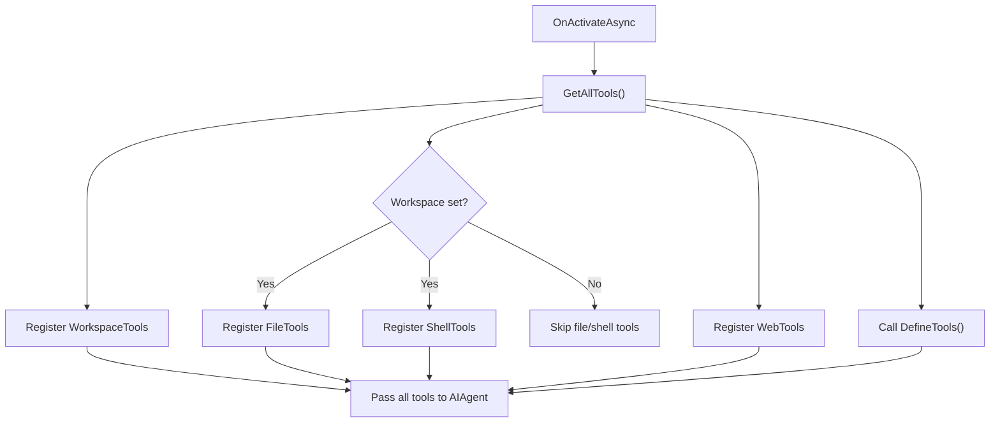

# Tools Behavior

Agents come with four built-in tool classes and support custom tools via `DefineTools()`. Tools are registered with the LLM on activation and can be called by the AI during conversation.

## Built-in Tools

### WorkspaceTools

Available on every agent. Manages the workspace directory that FileTools and ShellTools operate in.

| Tool | Description |
|---|---|
| `SetWorkspace(path)` | Set the workspace directory (must be absolute) |
| `GetWorkspace()` | Get the current workspace path |

```csharp
await agent.SetWorkspaceAsync("/path/to/project", ct);
```

### FileTools

Available when a workspace path is set. All file operations are sandboxed to the workspace directory.

| Tool | Description |
|---|---|
| `ReadFileAsync(path)` | Read a file (absolute or workspace-relative) |
| `WriteFileAsync(path, content)` | Create or overwrite a file |
| `ListFiles(directory, pattern)` | List files matching a glob pattern |
| `SearchCode(pattern, directory, fileFilter)` | Search for a regex pattern in files |

Security features:
- Paths outside the workspace are rejected with `InvalidOperationException`
- Excluded directories: `.git`, `.vs`, `.idea`, `bin`, `obj`, `node_modules`, `TestResults`, `packages`
- Results are capped at 500 entries

### ShellTools

Available when a workspace path is set. Executes commands in the workspace directory.

| Tool | Description |
|---|---|
| `RunDotnetAsync(arguments, workingDirectory?)` | Run a `dotnet` CLI command |
| `RunShellAsync(command, workingDirectory?)` | Run a shell command (cmd.exe on Windows, /bin/sh on Linux) |

Security features:
- Commands timeout after 120 seconds
- Output is truncated at 8,000 characters
- Working directory defaults to workspace

### WebTools

Available on every agent. Fetches content from URLs with SSRF protection.

| Tool | Description |
|---|---|
| `FetchUrlAsync(url)` | Fetch content from a URL |

Security features:
- Only `http` and `https` schemes allowed
- Blocked hosts: `localhost`, `127.0.0.1`, `::1`, `169.254.169.254`, etc.
- DNS resolution check: blocks URLs that resolve to private IPs
- Response truncated at 50,000 characters

::: warning
WebTools performs DNS resolution to check for private IP addresses. This prevents SSRF attacks where a public hostname resolves to an internal address.
:::

## Custom Tools

Override `DefineTools()` to add custom tools. Each tool method needs a `[Description]` attribute:

```csharp
using System.ComponentModel;
using Microsoft.Extensions.AI;

protected override IReadOnlyList<AITool> DefineTools() =>
[
    AIFunctionFactory.Create(SearchDocuments),
    AIFunctionFactory.Create(GetDocument)
];

[Description("Search indexed documents by keyword")]
static string[] SearchDocuments([Description("Search query")] string query) =>
    [$"doc-1: Getting Started with IAW", $"doc-2: Agent Behaviors Guide"];

[Description("Get a document by ID")]
static string GetDocument([Description("Document ID")] string documentId) =>
    $"Document {documentId}: Sample content.";
```

### Parameter Descriptions

Use `[Description]` on parameters to help the LLM understand what to pass:

```csharp
[Description("Create a GitHub issue in the specified repository")]
private async Task<string> CreateIssue(
    [Description("Repository in owner/repo format")] string repository,
    [Description("Issue title")] string title,
    [Description("Issue body in markdown")] string body,
    [Description("Labels to apply")] string[]? labels = null)
{
    // Implementation
    return $"Created issue: {title}";
}
```

### Instance vs Static Methods

Both instance and static methods work as tools:

```csharp
// Static -- no access to agent state
[Description("Calculate fibonacci number")]
static long Fibonacci(int n) => n <= 1 ? n : Fibonacci(n - 1) + Fibonacci(n - 2);

// Instance -- can access agent state, call other agents, publish events
[Description("Save a note to agent memory")]
private async Task<string> SaveNote(string key, string content)
{
    State[key] = new StateEntry(key, content);
    await WriteStateAsync(AgentCancellation);
    await PublishAsync("note.saved", new Dictionary<string, object>
    {
        ["key"] = key
    }, AgentCancellation);
    return $"Note saved with key: {key}";
}
```

## Tool Registration Flow

On `OnActivateAsync`, the agent builds the complete tool list:



::: tip
Tools are registered once at activation time. If you set a workspace path after activation, the FileTools and ShellTools won't be available until the grain is reactivated. Set the workspace before the first conversation turn.
:::

## Tool Discovery via Reflection

Built-in tool classes use reflection-based discovery. Any public method with a `[Description]` attribute is registered:

```csharp
private static void RegisterToolMethods(List<AITool> tools, object toolSource)
{
    var methods = toolSource.GetType().GetMethods(
        BindingFlags.Public | BindingFlags.Instance | BindingFlags.DeclaredOnly);
    foreach (var method in methods)
    {
        if (method.GetCustomAttributes(typeof(DescriptionAttribute), false).Length > 0)
            tools.Add(AIFunctionFactory.Create(method, toolSource));
    }
}
```

This means you can create your own tool classes and register them in `DefineTools()`:

```csharp
public class DatabaseTools
{
    [Description("Query the database")]
    public async Task<string> QueryAsync(string sql) { ... }

    [Description("List all tables")]
    public string[] ListTables() { ... }
}

protected override IReadOnlyList<AITool> DefineTools()
{
    var dbTools = new DatabaseTools();
    var tools = new List<AITool>();
    // Register all methods with [Description]
    foreach (var method in typeof(DatabaseTools).GetMethods())
    {
        if (method.GetCustomAttribute<DescriptionAttribute>() is not null)
            tools.Add(AIFunctionFactory.Create(method, dbTools));
    }
    return tools;
}
```
