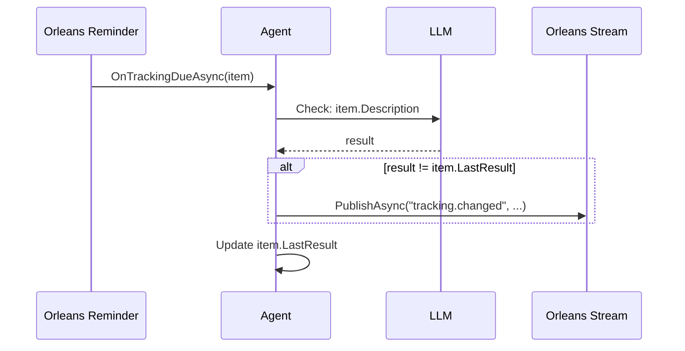

# Tracking Behavior

Agents can schedule recurring LLM-powered checks using the tracking system. When a tracked item's result changes, the agent automatically publishes a `tracking.changed` event.

## Overview

Tracking lets an agent monitor things over time: a website's status, a CI pipeline, a Slack channel, or any other data source. Each tracking item:

1. Has a description and check interval
2. Is checked by the LLM using the agent's tools
3. Publishes a change event when the result differs from the last check

## TrackingItem

```csharp
[GenerateSerializer]
public record TrackingItem(
    [property: Id(0)] string Id,
    [property: Id(1)] string Description,
    [property: Id(2)] TimeSpan Interval,
    [property: Id(3)] DateTimeOffset CreatedAt,
    [property: Id(4)] DateTimeOffset? LastCheckAt,
    [property: Id(5)] string? LastResult);
```

## Starting Tracking

### Programmatic

```csharp
var item = new TrackingItem(
    Id: "website-status",
    Description: "Check if https://example.com is responding",
    Interval: TimeSpan.FromMinutes(5),
    CreatedAt: DateTimeOffset.UtcNow,
    LastCheckAt: null,
    LastResult: null);

await agent.StartTrackingAsync("website-status", item, TimeSpan.FromMinutes(5), ct);
```

### Via LLM Tools

The tracking system registers three built-in tools that the LLM can call during conversation:

| Tool | Description |
|---|---|
| `StartTracking` | Start tracking something on a schedule |
| `StopTracking` | Stop tracking by ID |
| `ListTracking` | List all active tracking items |

Example conversation:

> **User**: Track the build status every 30 minutes
>
> **Agent**: *calls StartTracking("Check build pipeline status", 30)* -- Tracking started with ID: a1b2c3d4 -- checking every 30 minutes

## OnTrackingDueAsync

When a tracking item is due for a check, `OnTrackingDueAsync` runs. The default implementation:

1. Creates a prompt from the tracking item description
2. Calls the LLM with the agent's tools (so it can use FileTools, WebTools, etc.)
3. Compares the result to `LastResult`
4. If changed, publishes a `tracking.changed` event
5. Updates the tracking item with the new result

```csharp
protected virtual async Task OnTrackingDueAsync(TrackingItem item, CancellationToken ct)
{
    var prompt = $"Check on this tracking item and report: {item.Description}";
    // ... calls LLM with tools ...

    if (item.LastResult is not null && result != item.LastResult)
    {
        await PublishAsync("tracking.changed", new Dictionary<string, object>
        {
            ["TrackingId"] = item.Id,
            ["Description"] = item.Description,
            ["PreviousResult"] = item.LastResult,
            ["CurrentResult"] = result
        }, ct);
    }
}
```

### Custom Override

Override `OnTrackingDueAsync` for custom tracking logic:

```csharp
protected override async Task OnTrackingDueAsync(TrackingItem item, CancellationToken ct)
{
    // Call the base implementation for LLM-powered check
    await base.OnTrackingDueAsync(item, ct);

    // Then publish a typed event
    await PublishTypedAsync(new HealthCheckEvent(
        this.GetPrimaryKeyString(),
        Guid.NewGuid().ToString(),
        DateTimeOffset.UtcNow,
        item.Description,
        true,
        null), ct);
}
```

## Stopping Tracking

```csharp
await agent.StopTrackingAsync("website-status", ct);
```

Or the LLM can call the `StopTracking` tool during conversation.

## Accessing Tracking Items

Inside the agent, access the tracking dictionary directly:

```csharp
foreach (var kvp in TrackingItems)
{
    var item = kvp.Value;
    Console.WriteLine($"[{item.Id}] {item.Description} (every {item.Interval.TotalMinutes}min)");
}
```

## Example: Infrastructure Monitor

```csharp
using Core.AI;
using Core.AI.Models;
using Core.Communication;
using Core.Communication.Messages;
using Core.Contracts;
using IAW.Core;
using Microsoft.Extensions.AI;

public interface IInfraMonitorAgent : IAgent, ITrackableAgent;

public class InfraMonitorAgent(
    [AgentState] AgentDurableState durableState,
    [Llm<Claude45Haiku>] IChatClient chatClient)
    : Agent(durableState, chatClient),
      IInfraMonitorAgent,
      IStreamProducer<HealthCheckEvent>
{
    protected override string Instructions =>
        "You monitor infrastructure health. Check service endpoints and report issues.";

    protected override string DisplayName => "Infrastructure Monitor";

    public async Task PublishToStreamAsync(HealthCheckEvent evt, CancellationToken ct)
    {
        await PublishTypedAsync(evt, ct);
    }

    protected override async Task OnTrackingDueAsync(TrackingItem item, CancellationToken ct)
    {
        await base.OnTrackingDueAsync(item, ct);
        await PublishToStreamAsync(new HealthCheckEvent(
            this.GetPrimaryKeyString(),
            Guid.NewGuid().ToString(),
            DateTimeOffset.UtcNow,
            item.Description,
            true,
            null), ct);
    }
}
```

## Change Detection Flow


