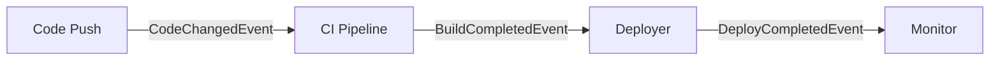
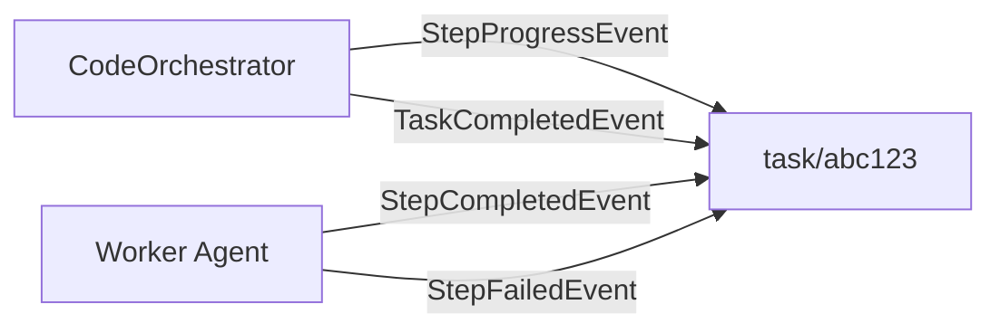
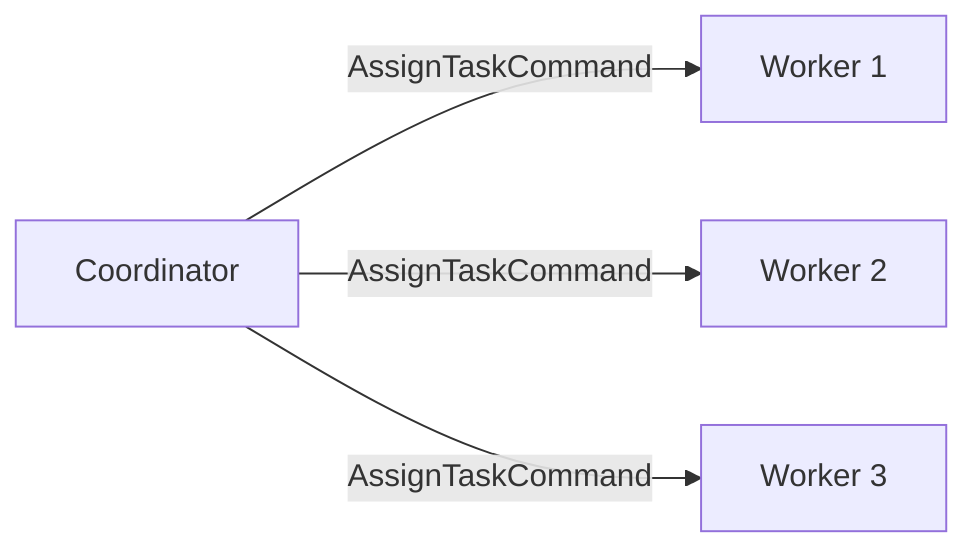
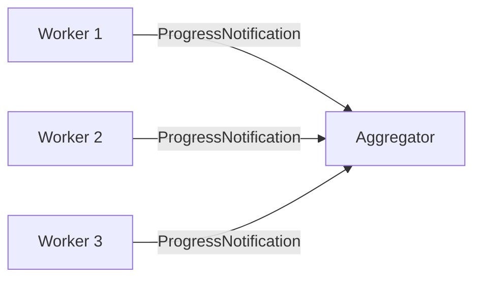

# Events & Streams

Agents communicate through typed events and Orleans streams. All events implement `IEvent`, which extends `IAgentMessage` with three required properties. This page covers event types, publishing methods, task streams, and auto-logging.

## Event Hierarchy

All inter-agent events share a common base:

```csharp
public interface IAgentMessage
{
    string SourceAgentId { get; }
    string CorrelationId { get; }
    DateTimeOffset Timestamp { get; }
}

public interface IEvent : IAgentMessage;
```

Every concrete event is a `[GenerateSerializer]` record implementing `IEvent`:

```csharp
[GenerateSerializer]
public record CodeChangedEvent(
    [property: Id(0)] string SourceAgentId,
    [property: Id(1)] string CorrelationId,
    [property: Id(2)] DateTimeOffset Timestamp,
    [property: Id(3)] string[] FilePaths,
    [property: Id(4)] string? CommitSha = null) : IEvent;
```

### ITaskStreamEvent

Task-scoped events extend `IEvent` with a `TaskId` for correlation within an orchestration task:

```csharp
public interface ITaskStreamEvent : IEvent
{
    string TaskId { get; }
}
```

Five built-in task stream events are provided:

| Event | Key Properties | Purpose |
|---|---|---|
| `StepProgressEvent` | `TaskId`, `StepDescription`, `Output?` | Report in-progress work |
| `StepCompletedEvent` | `TaskId`, `StepIndex`, `Output`, `Duration` | Mark a step as done |
| `StepFailedEvent` | `TaskId`, `StepIndex`, `Error`, `Exception?` | Record step failure |
| `TaskCompletedEvent` | `TaskId`, `Success`, `Summary?` | Signal task completion |
| `ConsiliumResponseEvent` | `TaskId`, `ModelId`, `Response`, `Confidence` | Collect LLM consilium votes |

## Publishing Events

### PublishToStream&lt;T&gt;

The primary method for publishing typed events. It logs the event to the durable event log, publishes it on the Orleans stream, and increments telemetry counters:

```csharp
await PublishToStream(new CodeChangedEvent(
    SourceAgentId: this.GetPrimaryKeyString(),
    CorrelationId: Guid.NewGuid().ToString(),
    Timestamp: DateTimeOffset.UtcNow,
    FilePaths: ["src/Agent.cs", "src/Tools.cs"],
    CommitSha: "abc123"), ct);
```

The stream name is derived automatically from the type name: `CodeChangedEvent` publishes to stream `code.changed`.


### PublishToTaskStream

For task-scoped events implementing `ITaskStreamEvent`, use `PublishToTaskStream`. It publishes to a task-specific stream at `StreamId.Create("agents", $"task/{taskId}")`:

```csharp
await PublishToTaskStream(taskId, new StepProgressEvent(
    SourceAgentId: this.GetPrimaryKeyString(),
    CorrelationId: correlationId,
    Timestamp: DateTimeOffset.UtcNow,
    TaskId: taskId,
    StepDescription: "Running build...",
    Output: null), ct);
```

Task streams allow consumers to subscribe to events for a specific orchestration task rather than a global event type.

### PublishAsync (Untyped)

For simple, ad-hoc events that do not warrant a dedicated type:

```csharp
await PublishAsync("orchestration.created", new Dictionary<string, object>
{
    ["TaskId"] = taskId,
    ["Description"] = description
}, ct);
```

This creates an `AgentEvent` record and publishes it to `StreamId.Create("agents", "orchestration.created")`.

## Consuming Events

### IStreamConsumer&lt;TEvent&gt;

Auto-subscribes to an Orleans stream on grain activation. When an event arrives, `OnStreamEventAsync` is called:

```csharp
using Core.Communication;
using Core.Messages;
using Orleans.Streams;

public class ReviewAgent : Agent, IStreamConsumer<CodeChangedEvent>
{
    public async Task OnStreamEventAsync(CodeChangedEvent evt, StreamSequenceToken? token)
    {
        var files = string.Join(", ", evt.FilePaths);
        await GetResponse($"Review: {files}. Commit: {evt.CommitSha}", AgentCancellation);
    }
}
```

::: tip
`IStreamConsumer<T>` auto-subscribes during `OnActivateAsync`. You do not need to manually subscribe to streams.
:::

### IStreamProducer&lt;TEvent&gt;

Declares that an agent can publish a specific typed event. Implement `PublishToStreamAsync` and delegate to `PublishToStream<T>`:

```csharp
public class BuildAgent : Agent, IStreamProducer<BuildCompletedEvent>
{
    public async Task PublishToStreamAsync(BuildCompletedEvent evt, CancellationToken ct)
    {
        await PublishToStream(evt, ct);
    }
}
```

### IReceiver&lt;TMessage&gt;

Accept directed messages from other agents:

```csharp
public class WorkerAgent : Agent, IReceiver<AssignTaskCommand>
{
    public async Task<MessageReceipt> ReceiveAsync(AssignTaskCommand cmd, CancellationToken ct)
    {
        var result = await GetResponse($"Execute task: {cmd.Description}", ct);
        return new MessageReceipt(true, this.GetPrimaryKeyString(), DateTimeOffset.UtcNow, null);
    }

    public Task<bool> CanReceiveAsync(CancellationToken ct) => Task.FromResult(true);
}
```

### IBroadcaster&lt;TMessage&gt;

Fan-out a message to all registered receivers:

```csharp
public class CoordinatorAgent : Agent, IBroadcaster<AssignTaskCommand>
{
    private readonly HashSet<string> _receivers = [];

    public async Task<BroadcastResult> BroadcastAsync(AssignTaskCommand message, CancellationToken ct)
    {
        var delivered = 0;
        var failed = new List<string>();
        foreach (var id in _receivers)
        {
            try
            {
                var agent = GrainFactory.GetGrain<IAgent>(id);
                await agent.GetResponse($"Task: {message.Description}", ct);
                delivered++;
            }
            catch { failed.Add(id); }
        }
        return new BroadcastResult(_receivers.Count, delivered, failed.Count, [.. failed]);
    }

    public Task RegisterReceiverAsync(string receiverId)
    {
        _receivers.Add(receiverId);
        return Task.CompletedTask;
    }

    public Task UnregisterReceiverAsync(string receiverId)
    {
        _receivers.Remove(receiverId);
        return Task.CompletedTask;
    }

    public Task<IReadOnlyList<string>> GetReceiversAsync()
        => Task.FromResult<IReadOnlyList<string>>([.. _receivers]);
}
```

## Stream Name Resolution

Type names are converted to stream names by:
1. Stripping the suffix (`Event`, `Command`, or `Notification`)
2. Converting PascalCase to dot.case

| Type | Stream Name |
|---|---|
| `CodeChangedEvent` | `code.changed` |
| `BuildCompletedEvent` | `build.completed` |
| `StepProgressEvent` | `step.progress` |
| `TaskCompletedEvent` | `task.completed` |
| `AssignTaskCommand` | `assign.task` |
| `AlertNotification` | `alert` |

The conversion is handled by `Agent.EventTypeToStreamName()`.

## Auto-Logging

All publishing methods automatically log events to the durable event log and increment OpenTelemetry counters. Each method creates an `Activity` under the `"IAW"` source:

| Method | Activity Name | Tags |
|---|---|---|
| `PublishAsync` | `agent.publish` | `event.name` |
| `PublishToStream<T>` | `agent.publish_typed` | `event.name`, `event.type` |
| `PublishToTaskStream<T>` | `agent.publish_task_stream` | `event.type`, `task.id` |

LLM calls are also auto-logged. Every `GetResponse` call records an `LlmCall` event in the event log with `prompt_length` and agent source ID. Streaming calls record `LlmStreamCall`.

## Stream Patterns

### Pipeline Pattern

Chain agents where each consumes one event type and produces another:



```csharp
public class CIPipelineAgent : Agent,
    IStreamConsumer<CodeChangedEvent>,
    IStreamProducer<BuildCompletedEvent>
{
    public async Task OnStreamEventAsync(CodeChangedEvent evt, StreamSequenceToken? token)
    {
        var result = await GetResponse(
            $"Build and test: {string.Join(", ", evt.FilePaths)}", AgentCancellation);
        var success = !result.Contains("error", StringComparison.OrdinalIgnoreCase);

        await PublishToStreamAsync(new BuildCompletedEvent(
            this.GetPrimaryKeyString(), evt.CorrelationId, DateTimeOffset.UtcNow,
            success, evt.CommitSha, result), AgentCancellation);
    }

    public async Task PublishToStreamAsync(BuildCompletedEvent evt, CancellationToken ct)
        => await PublishToStream(evt, ct);
}
```

### Task Stream Pattern

Orchestration tasks use `PublishToTaskStream` so subscribers can follow a single task's progress:



Any consumer subscribing to `StreamId.Create("agents", "task/abc123")` receives all events for that task, regardless of which agent published them.

### Fan-Out Pattern

One agent broadcasts to many receivers:



Use `IBroadcaster<T>` with `RegisterReceiverAsync` to manage the receiver list, then call `BroadcastAsync`.

### Fan-In Pattern

Multiple agents report to one aggregator:



The aggregator implements `IReceiver<ProgressNotification>` and collects results from multiple sources.

## Event Log

Query the durable event log:

```csharp
var events = await agent.GetEventLog(ct);
foreach (var evt in events)
{
    Console.WriteLine($"{evt.Timestamp}: {evt.EventName} from {evt.SourceAgentId}");
}
```

## Active Subscriptions

Query which streams an agent is subscribed to:

```csharp
var subs = await agent.GetActiveSubscriptions(ct);
// Returns: ["code.changed", "build.completed", ...]
```

This is determined by scanning the agent's `IStreamConsumer<T>` interfaces at runtime.
