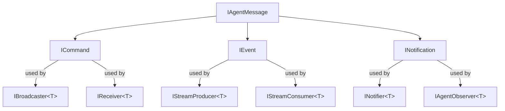

# Message Types

IAW uses a typed message hierarchy for all inter-agent communication. Every message implements `IAgentMessage` and falls into one of three categories: commands, events, or notifications.

## IAgentMessage

The base interface for all messages:

```csharp
public interface IAgentMessage
{
    string SourceAgentId { get; }
    string CorrelationId { get; }
    DateTimeOffset Timestamp { get; }
}
```

Every message carries the ID of the agent that created it, a correlation ID for tracing, and a timestamp.

## Commands (ICommand)

Commands are directed requests sent to a specific agent. They represent work to be done.

```csharp
public interface ICommand : IAgentMessage;
```

### Built-in Command

**AssignTaskCommand** -- assign a task to an agent:

```csharp
[GenerateSerializer]
public record AssignTaskCommand(
    [property: Id(0)] string SourceAgentId,
    [property: Id(1)] string CorrelationId,
    [property: Id(2)] DateTimeOffset Timestamp,
    [property: Id(3)] string Description,
    [property: Id(4)] string? WorkspacePath = null) : ICommand;
```

### Using with IBroadcaster/IReceiver

Commands are typically used with `IBroadcaster<T>` (sender) and `IReceiver<T>` (recipient):

```csharp
// Sender broadcasts a command to all registered receivers
var result = await coordinator.BroadcastAsync(new AssignTaskCommand(
    "coordinator", Guid.NewGuid().ToString(), DateTimeOffset.UtcNow,
    "Review pull request #42", "/src/project"), ct);

// Receiver accepts the command
public async Task<MessageReceipt> ReceiveAsync(AssignTaskCommand cmd, CancellationToken ct)
{
    await GetResponse($"Working on: {cmd.Description}", ct);
    return new MessageReceipt(true, this.GetPrimaryKeyString(), DateTimeOffset.UtcNow, null);
}
```

## Events (IEvent)

Events are broadcast via Orleans streams. They represent something that happened.

```csharp
public interface IEvent : IAgentMessage;
```

### Built-in Events

| Event | Stream Name | Key Fields |
|---|---|---|
| `CodeChangedEvent` | `code.changed` | `FilePaths`, `CommitSha` |
| `BuildCompletedEvent` | `build.completed` | `Success`, `CommitSha`, `Output` |
| `TestResultEvent` | `test.result` | `Passed`, `TotalTests`, `FailedTests`, `Summary` |
| `DeployCompletedEvent` | `deploy.completed` | `Success`, `Environment`, `Version` |
| `HealthCheckEvent` | `health.check` | `ServiceName`, `Healthy`, `ResponseTimeMs` |
| `AgentActivatedEvent` | `agent.activated` | `AgentType` |
| `StateChangedEvent` | `state.changed` | `Key`, `OldValue`, `NewValue` |

### Using with Streams

Events are published via `PublishTypedAsync` and consumed via `IStreamConsumer<T>`:

```csharp
// Producer
await PublishTypedAsync(new CodeChangedEvent(
    this.GetPrimaryKeyString(), correlationId, DateTimeOffset.UtcNow,
    ["src/Agent.cs"], "abc123"), ct);

// Consumer (auto-subscribed on activation)
public async Task OnStreamEventAsync(CodeChangedEvent evt, StreamSequenceToken? token)
{
    // Process the event
}
```

## Notifications (INotification)

Notifications use the Orleans observer pattern for push delivery to subscribed clients.

```csharp
public interface INotification : IAgentMessage;
```

### Built-in Notifications

| Notification | Key Fields |
|---|---|
| `AlertNotification` | `Severity`, `Message` |
| `ProgressNotification` | `Step`, `Status`, `Progress` |
| `ReviewRequestNotification` | `FilePath`, `Description` |

### Using with INotifier/IAgentObserver

```csharp
// Agent that sends notifications
public class MonitorAgent : Agent, INotifier<AlertNotification>
{
    public async Task NotifyAsync(AlertNotification notification, CancellationToken ct)
    {
        // Push to observers
    }
}

// Observer interface
public interface IAgentObserver<TEvent> : IGrainObserver where TEvent : INotification
{
    void OnEvent(TEvent evt);
    void OnError(Exception ex);
}
```

## Creating Custom Messages

### Custom Command

```csharp
using Core.Communication.Messages;

[GenerateSerializer]
public record DeployCommand(
    [property: Id(0)] string SourceAgentId,
    [property: Id(1)] string CorrelationId,
    [property: Id(2)] DateTimeOffset Timestamp,
    [property: Id(3)] string Environment,
    [property: Id(4)] string Version,
    [property: Id(5)] string[] Services) : ICommand;
```

### Custom Event

```csharp
[GenerateSerializer]
public record MetricsCollectedEvent(
    [property: Id(0)] string SourceAgentId,
    [property: Id(1)] string CorrelationId,
    [property: Id(2)] DateTimeOffset Timestamp,
    [property: Id(3)] string ServiceName,
    [property: Id(4)] double CpuPercent,
    [property: Id(5)] long MemoryBytes) : IEvent;
```

### Custom Notification

```csharp
[GenerateSerializer]
public record IncidentNotification(
    [property: Id(0)] string SourceAgentId,
    [property: Id(1)] string CorrelationId,
    [property: Id(2)] DateTimeOffset Timestamp,
    [property: Id(3)] string IncidentId,
    [property: Id(4)] string Severity,
    [property: Id(5)] string Description) : INotification;
```

## Serialization Requirements

All message types must:

1. Use `[GenerateSerializer]` attribute (required by Orleans)
2. Use `[property: Id(n)]` on each property (sequential, starting from 0)
3. Implement one of `ICommand`, `IEvent`, or `INotification`
4. Include the three base properties: `SourceAgentId`, `CorrelationId`, `Timestamp`

::: warning
Forgetting `[GenerateSerializer]` or `[Id(n)]` will cause Orleans serialization failures at runtime. The grain won't activate properly.
:::

## Message Flow Summary


