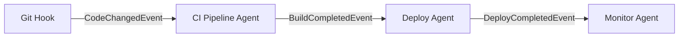
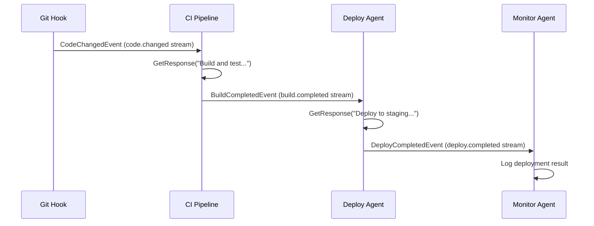

# Use Case: CI/CD Pipeline Agent

Build an agent that listens for code changes, runs builds and tests, and publishes results. Demonstrates the pipeline stream pattern with `IStreamConsumer` and `IStreamProducer`.

## Architecture



The CI pipeline agent:
- Implements `IStreamConsumer<CodeChangedEvent>` to auto-subscribe to code changes
- Implements `IStreamProducer<BuildCompletedEvent>` to publish build results
- Uses `ShellTools` to run actual build commands

## Agent Code

```csharp
using Core.AI;
using Core.AI.Models;
using Core.Communication;
using Core.Communication.Messages;
using Core.Contracts;
using IAW.Core;
using Microsoft.Extensions.AI;
using Orleans.Streams;

public interface ICIPipelineAgent : IAgent;

public class CIPipelineAgent(
    [AgentState] AgentDurableState durableState,
    [Llm<Claude45Haiku>] IChatClient chatClient)
    : Agent(durableState, chatClient),
      ICIPipelineAgent,
      IStreamConsumer<CodeChangedEvent>,
      IStreamProducer<BuildCompletedEvent>
{
    protected override string Instructions =>
        "You are a CI/CD pipeline agent. When code changes arrive, " +
        "run builds and tests, then publish results. " +
        "Use shell tools to execute dotnet build and dotnet test.";

    protected override string DisplayName => "CI/CD Pipeline";

    public async Task OnStreamEventAsync(
        CodeChangedEvent evt, StreamSequenceToken? token)
    {
        var files = string.Join(", ", evt.FilePaths);
        var result = await GetResponse(
            $"Build and test the project. Changed files: {files}", AgentCancellation);

        var success = !result.Contains("error", StringComparison.OrdinalIgnoreCase);

        await PublishToStreamAsync(new BuildCompletedEvent(
            SourceAgentId: this.GetPrimaryKeyString(),
            CorrelationId: evt.CorrelationId,
            Timestamp: DateTimeOffset.UtcNow,
            Success: success,
            CommitSha: evt.CommitSha,
            Output: result), AgentCancellation);
    }

    public async Task PublishToStreamAsync(
        BuildCompletedEvent evt, CancellationToken ct)
    {
        await PublishTypedAsync(evt, ct);
    }
}
```

## Pipeline Stream Wiring

The pipeline works because of stream name convention:

1. `CodeChangedEvent` maps to stream `code.changed`
2. `BuildCompletedEvent` maps to stream `build.completed`
3. `DeployCompletedEvent` maps to stream `deploy.completed`

Each agent subscribes to its input stream and publishes to its output stream.

### Deploy Agent (downstream)

```csharp
public class DeployAgent(
    [AgentState] AgentDurableState durableState,
    [Llm<Claude45Haiku>] IChatClient chatClient)
    : Agent(durableState, chatClient),
      IStreamConsumer<BuildCompletedEvent>,
      IStreamProducer<DeployCompletedEvent>
{
    protected override string Instructions =>
        "You deploy successful builds to the staging environment.";

    public async Task OnStreamEventAsync(
        BuildCompletedEvent evt, StreamSequenceToken? token)
    {
        if (!evt.Success)
        {
            await PublishAsync("deploy.skipped", new Dictionary<string, object>
            {
                ["reason"] = "Build failed",
                ["commitSha"] = evt.CommitSha ?? "unknown"
            }, AgentCancellation);
            return;
        }

        var result = await GetResponse(
            $"Deploy commit {evt.CommitSha} to staging", AgentCancellation);

        await PublishToStreamAsync(new DeployCompletedEvent(
            this.GetPrimaryKeyString(),
            evt.CorrelationId,
            DateTimeOffset.UtcNow,
            true,
            "staging",
            evt.CommitSha), AgentCancellation);
    }

    public async Task PublishToStreamAsync(
        DeployCompletedEvent evt, CancellationToken ct)
        => await PublishTypedAsync(evt, ct);
}
```

## Triggering the Pipeline

### From an HTTP Webhook

```csharp
app.MapPost("/webhook/push", async (IGrainFactory grains, PushPayload payload) =>
{
    var agent = grains.GetGrain<ICIPipelineAgent>("ci-pipeline");

    // Publish a CodeChangedEvent to trigger the pipeline
    var evt = new AgentEvent(
        "code.changed", "webhook", Guid.NewGuid().ToString(),
        DateTimeOffset.UtcNow,
        new Dictionary<string, object>
        {
            ["FilePaths"] = payload.ChangedFiles,
            ["CommitSha"] = payload.CommitSha
        });
    await agent.PublishToStreamAsync(evt, default);

    return Results.Accepted();
});

record PushPayload(string[] ChangedFiles, string CommitSha);
```

### From Another Agent

```csharp
// Any agent that implements IStreamProducer<CodeChangedEvent>
await PublishTypedAsync(new CodeChangedEvent(
    this.GetPrimaryKeyString(),
    Guid.NewGuid().ToString(),
    DateTimeOffset.UtcNow,
    ["src/Agent.cs", "src/Tools.cs"],
    "abc123"), ct);
```

## Testing

```csharp
[Fact]
public async Task CIPipeline_SubscribesAndPublishes()
{
    var ct = TestContext.Current.CancellationToken;
    var agent = _cluster.GrainFactory.GetGrain<ICIPipelineAgent>("ci-test");

    var metadata = await agent.GetMetadataAsync(ct);

    Assert.Contains("CodeChangedEvent", metadata.Subscribes);
    Assert.Contains("BuildCompletedEvent", metadata.Publishes);
}

[Fact]
public async Task CIPipeline_ActiveSubscriptionsIncludeCodeChanged()
{
    var ct = TestContext.Current.CancellationToken;
    var agent = _cluster.GrainFactory.GetGrain<ICIPipelineAgent>("ci-subs");

    var subs = await agent.GetActiveSubscriptionsAsync(ct);

    Assert.Contains("code.changed", subs);
}
```

## Full Pipeline Diagram


