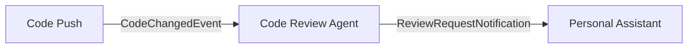

# Use Case: Code Review Bot

Build an agent that automatically reviews code when changes are pushed. It subscribes to `CodeChangedEvent` via streams and uses the LLM to analyze files.

## Architecture



The code review agent:
- Implements `IStreamConsumer<CodeChangedEvent>` to auto-subscribe to code change events
- Uses built-in `FileTools` to read the changed files
- Asks the LLM to review for bugs, security issues, and style problems

## Agent Code

```csharp
using Core.AI;
using Core.AI.Models;
using Core.Communication;
using Core.Communication.Messages;
using Core.Contracts;
using IAW.Core;
using Microsoft.Extensions.AI;
using Orleans.Streams;

public interface ICodeReviewAgent : IAgent;

public class CodeReviewAgent(
    [AgentState] AgentDurableState durableState,
    [Llm<Claude45Haiku>] IChatClient chatClient)
    : Agent(durableState, chatClient),
      ICodeReviewAgent,
      IStreamConsumer<CodeChangedEvent>
{
    protected override string Instructions =>
        "You are a code review agent. When code changes arrive, analyze them " +
        "for bugs, style issues, and security vulnerabilities. " +
        "Use the file tools to read the actual file contents before reviewing.";

    protected override string DisplayName => "Code Review Bot";

    public async Task OnStreamEventAsync(CodeChangedEvent evt, StreamSequenceToken? token)
    {
        var fileList = string.Join(", ", evt.FilePaths);
        var prompt = $"Review these changed files: {fileList}. Commit: {evt.CommitSha}. " +
                     "Read each file and provide a detailed review.";
        await GetResponse(prompt, AgentCancellation);
    }
}
```

## How It Works

1. **Auto-subscription**: Because `CodeReviewAgent` implements `IStreamConsumer<CodeChangedEvent>`, it automatically subscribes to the `code.changed` stream on activation.

2. **Event arrives**: When another agent (like a CI pipeline or git hook) publishes a `CodeChangedEvent`, the `OnStreamEventAsync` callback fires.

3. **LLM review**: The agent asks the LLM to review the files. If a workspace is set, the LLM can use `FileTools.ReadFileAsync` to read the actual file contents.

4. **History persisted**: The review conversation is stored in durable history, so you can query it later.

## Publishing Code Change Events

Trigger reviews from another agent or an HTTP endpoint:

```csharp
app.MapPost("/webhook/push", async (IGrainFactory grains, PushEvent push) =>
{
    var agent = grains.GetGrain<IAgent>("ci-trigger");
    await agent.PublishToStreamAsync(new AgentEvent(
        "code.changed", "webhook", Guid.NewGuid().ToString(),
        DateTimeOffset.UtcNow,
        new Dictionary<string, object>
        {
            ["FilePaths"] = push.Files,
            ["CommitSha"] = push.CommitSha
        }), default);
    return Results.Accepted();
});

record PushEvent(string[] Files, string CommitSha);
```

## Testing

```csharp
[Fact]
public async Task CodeReviewAgent_SubscribesToCodeChanged()
{
    var ct = TestContext.Current.CancellationToken;
    var agent = _cluster.GrainFactory.GetGrain<ICodeReviewAgent>("review-test");

    var subs = await agent.GetActiveSubscriptionsAsync(ct);

    Assert.Contains("code.changed", subs);
}

[Fact]
public async Task CodeReviewAgent_HasCorrectMetadata()
{
    var ct = TestContext.Current.CancellationToken;
    var agent = _cluster.GrainFactory.GetGrain<ICodeReviewAgent>("review-meta");

    var metadata = await agent.GetMetadataAsync(ct);

    Assert.Equal("Code Review Bot", metadata.DisplayName);
    Assert.Contains("CodeChangedEvent", metadata.Subscribes);
}
```

## Extending

Add `IStreamProducer<TestResultEvent>` to publish review results that other agents can consume:

```csharp
public class CodeReviewAgent : Agent,
    IStreamConsumer<CodeChangedEvent>,
    IStreamProducer<TestResultEvent>
{
    public async Task PublishToStreamAsync(TestResultEvent evt, CancellationToken ct)
        => await PublishTypedAsync(evt, ct);
}
```

This creates a pipeline: code changes trigger reviews, which trigger further actions downstream.
