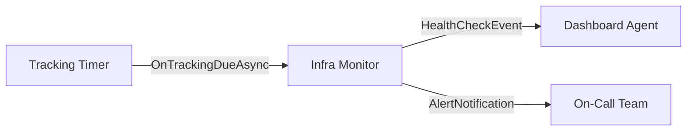

# Use Case: Infrastructure Monitor

Build an agent that periodically checks service health and publishes results to a stream. Combines the tracking behavior with stream production.

## Architecture



The infrastructure monitor:
- Implements `ITrackableAgent` to advertise tracking capability
- Implements `IStreamProducer<HealthCheckEvent>` to publish health check results
- Overrides `OnTrackingDueAsync` to run LLM-powered checks and publish results

## Agent Code

```csharp
using Core.AI;
using Core.AI.Models;
using Core.Communication;
using Core.Communication.Messages;
using Core.Contracts;
using IAW.Core;
using Microsoft.Extensions.AI;

public interface IInfraMonitorAgent : IAgent, ITrackableAgent;

public class InfraMonitorAgent(
    [AgentState] AgentDurableState durableState,
    [Llm<Claude45Haiku>] IChatClient chatClient)
    : Agent(durableState, chatClient),
      IInfraMonitorAgent,
      IStreamProducer<HealthCheckEvent>
{
    protected override string Instructions =>
        "You monitor infrastructure health. Check service endpoints and report issues. " +
        "Use the web tools to fetch health check URLs and analyze responses.";

    protected override string DisplayName => "Infrastructure Monitor";

    public async Task PublishToStreamAsync(HealthCheckEvent evt, CancellationToken ct)
    {
        await PublishTypedAsync(evt, ct);
    }

    protected override async Task OnTrackingDueAsync(TrackingItem item, CancellationToken ct)
    {
        // Run the LLM-powered check (uses WebTools to fetch URLs)
        await base.OnTrackingDueAsync(item, ct);

        // Publish a health check event to the stream
        await PublishToStreamAsync(new HealthCheckEvent(
            this.GetPrimaryKeyString(),
            Guid.NewGuid().ToString(),
            DateTimeOffset.UtcNow,
            item.Description,
            true,
            null), ct);
    }
}
```

## Setting Up Monitoring

Start tracking services via conversation or programmatically:

### Via Conversation

```bash
curl -X POST http://localhost:5000/monitor/ask \
  -H "Content-Type: application/json" \
  -d '{"prompt": "Track the API health at https://api.example.com/health every 5 minutes"}'
```

The LLM will call the built-in `StartTracking` tool to create a tracking item.

### Programmatic

```csharp
var monitor = grainFactory.GetGrain<IInfraMonitorAgent>("infra-monitor");

await monitor.StartTrackingAsync("api-health", new TrackingItem(
    Id: "api-health",
    Description: "Check https://api.example.com/health",
    Interval: TimeSpan.FromMinutes(5),
    CreatedAt: DateTimeOffset.UtcNow,
    LastCheckAt: null,
    LastResult: null), TimeSpan.FromMinutes(5), ct);
```

## Change Detection

When `OnTrackingDueAsync` runs:

1. The LLM uses `WebTools.FetchUrlAsync` to check the URL
2. The result is compared to `item.LastResult`
3. If changed, a `tracking.changed` event is published automatically
4. A `HealthCheckEvent` is published to the `health.check` stream

Any agent implementing `IStreamConsumer<HealthCheckEvent>` will receive these events.

## HTTP Endpoints

```csharp
app.MapPost("/monitor/ask", async (IGrainFactory grains, ChatRequest request) =>
{
    var agent = grains.GetGrain<IInfraMonitorAgent>("infra-monitor");
    var response = await agent.GetResponse(request.Prompt, default);
    return new { response };
});

app.MapGet("/monitor/events", async (IGrainFactory grains) =>
{
    var agent = grains.GetGrain<IInfraMonitorAgent>("infra-monitor");
    return await agent.GetEventLogAsync(default);
});

app.MapGet("/monitor/state", async (IGrainFactory grains) =>
{
    var agent = grains.GetGrain<IInfraMonitorAgent>("infra-monitor");
    return await agent.GetStateAsync(default);
});
```

## Testing

```csharp
[Fact]
public async Task InfraMonitor_HasTrackingCapability()
{
    var ct = TestContext.Current.CancellationToken;
    var agent = _cluster.GrainFactory.GetGrain<IInfraMonitorAgent>("monitor-test");

    var caps = await agent.GetCapabilitiesAsync(ct);

    Assert.True(caps.HasTimers);
}

[Fact]
public async Task InfraMonitor_PublishesHealthCheck()
{
    var ct = TestContext.Current.CancellationToken;
    var agent = _cluster.GrainFactory.GetGrain<IInfraMonitorAgent>("monitor-pub");

    var metadata = await agent.GetMetadataAsync(ct);

    Assert.Contains("HealthCheckEvent", metadata.Publishes);
}
```

## Consuming Health Check Events

Create a dashboard agent that aggregates health data:

```csharp
public class HealthDashboardAgent : Agent,
    IStreamConsumer<HealthCheckEvent>
{
    public async Task OnStreamEventAsync(HealthCheckEvent evt, StreamSequenceToken? token)
    {
        State[$"health:{evt.ServiceName}"] = new StateEntry(
            $"health:{evt.ServiceName}",
            new { evt.Healthy, evt.ResponseTimeMs, evt.Timestamp });
        await WriteStateAsync(AgentCancellation);
    }
}
```
