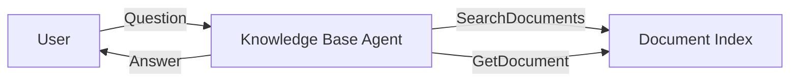

# Use Case: Knowledge Base Agent

Build an agent that answers questions from indexed documents using custom tools.

## Architecture



The knowledge base agent:
- Defines custom tools for searching and retrieving documents
- Uses the LLM to synthesize answers from tool results
- Stores no special state -- relies on tool outputs

## Agent Code

```csharp
using System.ComponentModel;
using Core.AI;
using Core.AI.Models;
using Core.Contracts;
using IAW.Core;
using Microsoft.Extensions.AI;

public interface IKnowledgeBaseAgent : IAgent;

public class KnowledgeBaseAgent(
    [AgentState] AgentDurableState durableState,
    [Llm<Claude45Haiku>] IChatClient chatClient)
    : Agent(durableState, chatClient), IKnowledgeBaseAgent
{
    protected override string Instructions =>
        "You are a knowledge base agent. Answer questions using the indexed documents " +
        "available through your tools. Always search before answering. Cite document IDs.";

    protected override string DisplayName => "Knowledge Base";

    protected override IReadOnlyList<AITool> DefineTools() =>
    [
        AIFunctionFactory.Create(SearchDocuments),
        AIFunctionFactory.Create(GetDocument),
        AIFunctionFactory.Create(ListCategories)
    ];

    [Description("Search indexed documents by keyword. Returns matching document summaries.")]
    static string[] SearchDocuments([Description("Search query")] string query) =>
    [
        $"doc-001: Getting Started with IAW (category: guides)",
        $"doc-002: Agent Behaviors Guide (category: guides)",
        $"doc-003: Stream Patterns (category: architecture)",
        $"doc-004: Testing Best Practices (category: testing)"
    ];

    [Description("Get the full content of a document by its ID")]
    static string GetDocument([Description("Document ID like doc-001")] string documentId) =>
        documentId switch
        {
            "doc-001" => "# Getting Started\nIAW agents extend the Agent base class...",
            "doc-002" => "# Agent Behaviors\nCompose behaviors via typed interfaces...",
            "doc-003" => "# Stream Patterns\nPipeline, fan-out, and fan-in...",
            "doc-004" => "# Testing\nUse TestCluster for unit tests...",
            _ => $"Document {documentId} not found."
        };

    [Description("List all document categories")]
    static string[] ListCategories() =>
        ["guides", "architecture", "testing", "reference"];
}
```

## How It Works

1. **User asks a question**: The agent receives a prompt via `GetResponse`.
2. **LLM searches**: The LLM calls `SearchDocuments` to find relevant documents.
3. **LLM reads**: The LLM calls `GetDocument` to get full content.
4. **LLM synthesizes**: The LLM produces an answer citing the documents.
5. **History persisted**: The conversation is stored for follow-up questions.

The LLM handles the search-read-answer loop automatically because the tools are registered in `ChatOptions.Tools`.

## Real Implementation

Replace the static tool methods with actual data access:

```csharp
[Description("Search indexed documents by keyword")]
private async Task<string[]> SearchDocuments(
    [Description("Search query")] string query)
{
    // Use a vector database, Elasticsearch, or any search backend
    var results = await _searchClient.SearchAsync(query, maxResults: 10);
    return results.Select(r => $"{r.Id}: {r.Title} (score: {r.Score:F2})").ToArray();
}

[Description("Get the full content of a document by its ID")]
private async Task<string> GetDocument(
    [Description("Document ID")] string documentId)
{
    var doc = await _documentStore.GetAsync(documentId);
    return doc?.Content ?? $"Document {documentId} not found.";
}
```

## HTTP Endpoints

```csharp
app.MapPost("/kb/ask", async (IGrainFactory grains, ChatRequest request) =>
{
    var agent = grains.GetGrain<IKnowledgeBaseAgent>("knowledge-base");
    var response = await agent.GetResponse(request.Prompt, default);
    return new { response };
});

app.MapGet("/kb/history", async (IGrainFactory grains) =>
{
    var agent = grains.GetGrain<IKnowledgeBaseAgent>("knowledge-base");
    return await agent.GetHistory(default);
});

app.MapPost("/kb/clear", async (IGrainFactory grains) =>
{
    var agent = grains.GetGrain<IKnowledgeBaseAgent>("knowledge-base");
    await agent.ClearHistoryAsync(default);
    return Results.Ok();
});
```

## Testing

```csharp
[Fact]
public async Task KnowledgeBase_HasTools()
{
    var ct = TestContext.Current.CancellationToken;
    var agent = _cluster.GrainFactory.GetGrain<IKnowledgeBaseAgent>("kb-test");

    var caps = await agent.GetCapabilitiesAsync(ct);

    Assert.True(caps.HasTools);
}

[Fact]
public async Task KnowledgeBase_AnswersQuestions()
{
    var ct = TestContext.Current.CancellationToken;
    var agent = _cluster.GrainFactory.GetGrain<IKnowledgeBaseAgent>("kb-conv");

    var response = await agent.GetResponse("What is IAW?", ct);

    Assert.False(string.IsNullOrEmpty(response));
}
```
