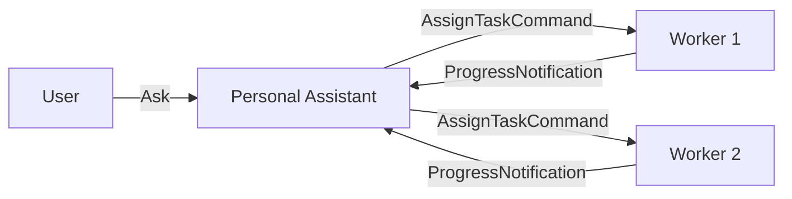

# Use Case: Personal Assistant

Build an agent that decomposes tasks, delegates to other agents via broadcasting, and collects progress updates. Combines `IBroadcaster<T>` and `IReceiver<T>`.

## Architecture



The personal assistant:
- Implements `IBroadcaster<AssignTaskCommand>` to delegate tasks to workers
- Implements `IReceiver<ProgressNotification>` to collect progress updates
- Uses the LLM to decompose complex tasks and summarize results

## Agent Code

```csharp
using Core.AI;
using Core.AI.Models;
using Core.Communication;
using Core.Communication.Messages;
using Core.Contracts;
using IAW.Core;
using Microsoft.Extensions.AI;

public interface IPersonalAssistantAgent : IAgent;

public class PersonalAssistantAgent(
    [AgentState] AgentDurableState durableState,
    [Llm<Claude45Haiku>] IChatClient chatClient)
    : Agent(durableState, chatClient),
      IPersonalAssistantAgent,
      IReceiver<ProgressNotification>,
      IBroadcaster<AssignTaskCommand>
{
    protected override string Instructions =>
        "You are a personal assistant. Decompose tasks and delegate to the engineering team.";

    protected override string DisplayName => "Personal Assistant";

    private readonly HashSet<string> _receivers = [];

    // IReceiver<ProgressNotification> -- accept progress updates
    public async Task<MessageReceipt> ReceiveAsync(
        ProgressNotification notification, CancellationToken ct)
    {
        await GetResponse(
            $"Progress update from {notification.SourceAgentId}: " +
            $"{notification.Step} -- {notification.Status}", ct);

        return new MessageReceipt(
            true, this.GetPrimaryKeyString(), DateTimeOffset.UtcNow, null);
    }

    public Task<bool> CanReceiveAsync(CancellationToken ct)
        => Task.FromResult(true);

    // IBroadcaster<AssignTaskCommand> -- delegate tasks
    public async Task<BroadcastResult> BroadcastAsync(
        AssignTaskCommand message, CancellationToken ct)
    {
        var delivered = 0;
        var failed = new List<string>();

        foreach (var id in _receivers)
        {
            try
            {
                var agent = GrainFactory.GetGrain<IAgent>(id);
                await agent.GetResponse($"Task assigned: {message.Description}", ct);
                delivered++;
            }
            catch
            {
                failed.Add(id);
            }
        }

        return new BroadcastResult(
            _receivers.Count, delivered, failed.Count, [.. failed]);
    }

    public Task RegisterReceiverAsync(string receiverId)
    {
        _receivers.Add(receiverId);
        return Task.CompletedTask;
    }

    public Task UnregisterReceiverAsync(string receiverId)
    {
        _receivers.Remove(receiverId);
        return Task.CompletedTask;
    }

    public Task<IReadOnlyList<string>> GetReceiversAsync()
        => Task.FromResult<IReadOnlyList<string>>([.. _receivers]);
}
```

## Registering Workers

Before broadcasting, register worker agents as receivers:

```csharp
var pa = grainFactory.GetGrain<IPersonalAssistantAgent>("personal-assistant");

// Cast to IBroadcaster to register receivers
var broadcaster = (IBroadcaster<AssignTaskCommand>)pa;
await broadcaster.RegisterReceiverAsync("code-review-agent");
await broadcaster.RegisterReceiverAsync("build-agent");
await broadcaster.RegisterReceiverAsync("deploy-agent");
```

## Delegating Tasks

```csharp
var result = await broadcaster.BroadcastAsync(new AssignTaskCommand(
    SourceAgentId: "personal-assistant",
    CorrelationId: Guid.NewGuid().ToString(),
    Timestamp: DateTimeOffset.UtcNow,
    Description: "Review and deploy the latest changes",
    WorkspacePath: "/src/project"), ct);

Console.WriteLine($"Delivered to {result.Delivered}/{result.TotalReceivers} agents");
```

## Sending Progress Updates

Worker agents send progress updates back:

```csharp
var pa = grainFactory.GetGrain<IPersonalAssistantAgent>("personal-assistant");
var receiver = (IReceiver<ProgressNotification>)pa;

var receipt = await receiver.ReceiveAsync(new ProgressNotification(
    SourceAgentId: "code-review-agent",
    CorrelationId: correlationId,
    Timestamp: DateTimeOffset.UtcNow,
    Step: "Code Review",
    Status: "Completed",
    Progress: 1.0f), ct);

Console.WriteLine($"Accepted: {receipt.Accepted}");
```

## HTTP Endpoints

```csharp
app.MapPost("/assistant/ask", async (IGrainFactory grains, ChatRequest request) =>
{
    var agent = grains.GetGrain<IPersonalAssistantAgent>("personal-assistant");
    var response = await agent.GetResponse(request.Prompt, default);
    return new { response };
});

app.MapPost("/assistant/delegate", async (IGrainFactory grains, TaskRequest request) =>
{
    var agent = grains.GetGrain<IPersonalAssistantAgent>("personal-assistant");
    var broadcaster = (IBroadcaster<AssignTaskCommand>)agent;
    var result = await broadcaster.BroadcastAsync(new AssignTaskCommand(
        "personal-assistant", Guid.NewGuid().ToString(), DateTimeOffset.UtcNow,
        request.Description, request.WorkspacePath), default);
    return result;
});

record TaskRequest(string Description, string? WorkspacePath);
```

## Testing

```csharp
[Fact]
public async Task PersonalAssistant_CanReceiveProgress()
{
    var ct = TestContext.Current.CancellationToken;
    var agent = _cluster.GrainFactory.GetGrain<IPersonalAssistantAgent>("pa-test");

    var metadata = await agent.GetMetadataAsync(ct);

    Assert.Contains("ProgressNotification", metadata.Subscribes);
    Assert.Contains("AssignTaskCommand", metadata.Publishes);
}
```
