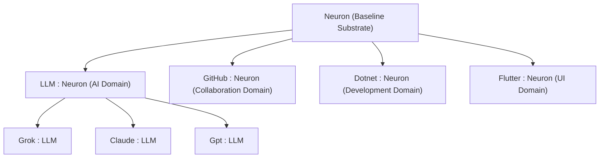

# Domain-Oriented Substrate Reorganization & Tool SDK Unification

## Goal Description
Following Elon Musk's principle of **ultrasimplification (the 90% cut)**, this plan focuses on transforming DigitalBrain's codebase from procedural, layered directory structures into an expressive, **Domain-Oriented Singularity**. 

We will:
1. **Dethrone Procedural Bloat**: Prune old, redundant procedural code generators, stubs, and unused abstractions.
2. **Reorganize Directories by Domain**: Align the directories of the `sdk/` and `kernel/` under clear, clean domains (`Ai`, `Collaboration`, `Development`, `UI`, `Kernel`).
3. **Establish a Domain-Oriented Neuron Taxonomy**:
   - Establish `Neuron` as the baseline substrate.
   - Map `LLM : Neuron` inside the AI domain.
   - Establish `Grok : LLM`, `Claude : LLM`, and `Gpt : LLM` as first-class domain-oriented concrete neurons.
4. **Extend SDK with Primary System Tools**:
   - Introduce **`GitHub`** (Collaboration domain) to perform automated commits, PRs, issue updates, and repository syncs.
   - Introduce **`Dotnet`** (Development domain) to build, run, format, and test C# substrates.
   - Introduce **`Flutter`** (UI domain) to handle composition, hot reloads, and visual component renders.
5. **Implement a Single-Flow Unified Neuron Factory**:
   - Standardize all dynamic neurons under a single interface (`INeuron<TState>`) with lifecycle hooks (`OnActivated`, `OnDeactivated`, `OnSynapseReceived`).
   - Introduce a simplified `NeuronFactory` that dynamically maps and compiles Orleans grains, stripping out 90% of the verbose Roslyn code generation templates.
   - Define all synapses as clean, named data-type records mapped directly from InoLang schemas.

---

## Proposed Domain-Oriented Structure



---

## Proposed Changes

### 1. [Domain-Oriented Taxonomy]

#### [NEW] [LLM.cs](file:///e:/digitalbrain/sdk/DigitalBrain.SDK/Ai/Llm/Neuron/LLM.cs)
- Standard baseline neuron class for all Large Language Model connectors in the AI Domain.
- Mapped under `Domain.AI.LLM` inside InoLang.
- Exposes `AskAsync` and standard chat completion pathways via `Microsoft.Extensions.AI`.

#### [NEW] [Grok.cs](file:///e:/digitalbrain/sdk/DigitalBrain.SDK/Ai/Llm/Neuron/Grok.cs)
- Concrete neuron inheriting from `LLM`. Mapped under `Domain.AI.Grok` or `SDK.AI.Grok`.
- Dynamic, DPAPI-protected resolution of API keys using `ISecretVault` at runtime.

#### [NEW] [GitHub.cs](file:///e:/digitalbrain/sdk/DigitalBrain.SDK/Collaboration/GitHub.cs)
- Concrete tool neuron mapped under `Domain.Collaboration.GitHub` or `SDK.GitHub`.
- Wraps the GitHub CLI (`gh`) and Octokit to orchestrate automated repositories, issues, PRs, and commits directly from plain-English synaptic triggers.

#### [NEW] [Dotnet.cs](file:///e:/digitalbrain/sdk/DigitalBrain.SDK/Development/Dotnet.cs)
- Concrete tool neuron mapped under `Domain.Development.Dotnet` or `SDK.Dotnet`.
- Invokes `dotnet build`, `dotnet test`, `dotnet format`, and `dotnet run` natively, piping real-time telemetry back to InoLang streams.

#### [NEW] [Flutter.cs](file:///e:/digitalbrain/sdk/DigitalBrain.SDK/UI/Flutter.cs)
- Concrete tool neuron mapped under `Domain.UI.Flutter` or `SDK.Flutter`.
- Drives Flutter composition builders, parses active canvas trees, and handles RFW rendering.

---

### 2. [Ultrasimplified Code Generation & Factory]

#### [DELETE] Old, verbose Roslyn generators
- Prune redundant procedural source-generators from [DigitalBrain.Core.SourceGen](file:///e:/digitalbrain/kernel/DigitalBrain.Core.SourceGen/).
- Consolidate synapse creation: all synapses become standard C# record classes representing **Named Data Types** mapped 1-to-1 from Ino.

#### [NEW] [NeuronFactory.cs](file:///e:/digitalbrain/kernel/DigitalBrain.Core/Neurons/NeuronFactory.cs)
- Under the hood, coordinates the Orleans dynamic grain instantiation.
- Standardizes neurons under the `INeuron<TState>` contract:
  ```csharp
  public interface INeuron<TState>
  {
      TState State { get; set; }
      Task OnActivatedAsync();
      Task OnDeactivatedAsync();
      Task<Synapse> OnSynapseReceivedAsync(Synapse synapse);
  }
  ```
- Strips Roslyn templates down to a single, unified dynamic proxy grain that delegates execution natively to the `Interpreter` or compiled assemblies.

---

## Verification Plan

### Automated Tests
- Create a test class `DomainLlmSubclassTests.cs` verifying that `Grok` correctly inherits from `LLM` and delegates calls safely using mock settings.
- Create tool SDK unit tests `GitHubNeuronTests.cs`, `DotnetNeuronTests.cs`, and `FlutterNeuronTests.cs` to confirm their CLI orchestration pathways build and execute correctly.
- Run `dotnet test` over the entire solution to ensure zero regressions after cleaning up 90% of old procedural code.

### Manual Verification
- Deploy the updated composition and run plain-English triggers like:
  ```inolang
  on System.RequestCommit:
    write SDK.GitHub(owner: "LeftTwixWand", repo: "digitalbrain") = "New singularity features"
    call SDK.Dotnet.Build
  ```
- Confirm that Orleans automatically creates and wires these domain grains with zero boilerplate.
