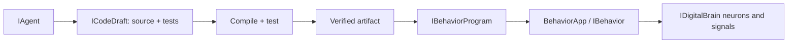

# Programmable C# behaviors

An agent authors one C# application source and a separate xUnit test source. Coding validates a pinned draft revision and seals the compiled payload. Behavior deploys that exact artifact in a separate Windows process. Editing a draft never changes the running deployment.



## Module ownership

* AI owns model selection, instructions, agent runs, native tools and MCP support. A behavior is not an LLM or another agent implementation.
* Coding owns drafts, revision checks, compiler diagnostics, tests, environment fingerprints and immutable artifacts. Existing solution-editing APIs remain available.
* Behavior owns desired state, deployments, generations, readiness, bounded logs, process supervision and rollback.
* IntoChat composes these through HTTP endpoints, `BehaviorAgentTools` and `ScopedBehaviorTools`.

`IBehavior.RunAsync(CancellationToken)` is the execution contract. Constructors can receive `IDigitalBrain` and host services. `BehaviorApp.RunAsync<T>` supplies a generation-scoped brain that owns the subscriptions opened through it.

## Enable local execution

IntoChat's AppHost accepts `IntoChat:BehaviorAuthoring:Root`. It configures sibling `coding` and `behaviors` directories beneath that root. The runtime also accepts:

```json
{
  "DigitalBrain": {
    "Coding": { "Execution": { "Root": "E:\\brain-runtime\\coding" } },
    "Behavior": { "Root": "E:\\brain-runtime\\behaviors" }
  },
  "IntoChat": {
    "BehaviorAuthoring": { "AllowActivation": true, "ModelProfile": "configured-profile" }
  }
}
```

For the desktop workspace assistant, set `IntoChat:Assistant:Model` to a configured model marker or model ID (for example `IGpt56Luna`). This selects the model for `/agent` independently of the AI module default; it does not provision a provider or credentials. A model declaring tool support still needs sufficient coding ability to author and repair a behavior.

Contract discovery works even when local execution is disabled. Start with `code_contracts` and `modules=[]`, then use installed module IDs from its response. Native behavior tools return expected validation/configuration failures as `isError=true` results so the assistant can repair arguments or explain the problem. Cancellation and infrastructure failures still stop the run.

The catalog includes the subscription API, signal constructors and a compilable bootstrap template (after replacing its type placeholders). `code_check_read` waits up to 20 seconds for a terminal validation result, while respecting cancellation; call it again if validation remains pending.

Install `CodingModule` and `BehaviorModule` in the same host. Roots are disabled unless configured. `AllowActivation` defaults to false; draft validation executes tests, while deployment/start/rollback additionally require activation policy. Host connection settings default to the silo's advertised gateway, cluster ID and service ID. Explicit `Gateways`, `ClusterId` and `ServiceId` can override them. Standalone examples must supply these settings or explicitly use `LocalDevelopment=true`.

The current worker backend requires Windows and the configured .NET SDK. The default SDK is pinned to the repository's `11.0.100-rc.1.26425.128`; generated test projects use the repository's xUnit 4.0.0/MTP package from the local NuGet cache. A private build directory has fixed SDK and package configuration. User source cannot inject file-app package/project directives.

`CodeExecutionOptions.ReferencePaths`, `TestReferencePaths` and `Modules` let the host set approved assemblies. The default uses managed host DLLs and discovers installed Time, Flutter, AI and Google contract assemblies. `code_contracts` reports installed module IDs, public neuron methods and signal properties, an environment hash, and a bootstrap example. Select module IDs for a focused catalog; `Truncated` indicates a response budget limit.

## Contracts and signals

| Contract | Operations |
| --- | --- |
| `ICodeDraft` | `Read`, `Save`, `Check`, `ReadCheck`, `CancelCheck` |
| `IBehaviorProgram` | `Read`, `Deploy`, `Start`, `Stop`, `Rollback`, `ReadLogs` |

`SaveCodeDraft` carries expected revision, operation ID, source, tests and selected module IDs. `CheckCodeDraft` pins a revision and operation ID; it returns promptly with an operation to poll. Only `Passed` checks carry an artifact reference. Zero user tests, skipped tests, test failures, timeouts or conformance failures cannot seal an artifact. Host conformance checks for an application entry point and an exported concrete `IBehavior`. Runtime subscription readiness is verified by the worker protocol.

`DeployBehavior` carries expected command revision, operation ID, artifact reference, nonsecret configuration JSON and optional agent run ID. `ChangeBehaviorState` and `RollbackBehavior` use the same optimistic concurrency and operation receipt rules. Repeating an identical committed command returns its original receipt; reusing its ID with different input fails. A receipt describes the accepted command; use `Read` for current execution state.

Signals are `CodeDraftSaved`, `CodeCheckChanged`, `BehaviorDeploymentChanged`, `BehaviorExecutionChanged` and `BehaviorLogAvailable`. These are live notifications. Persisted reads are authoritative after reconnect or a missed notification.

The following identities are intentionally separate:

* Draft revision: a source/test snapshot.
* Check operation ID: one validation attempt with pinned input.
* Artifact ID: SHA-256 of source/tests, environment, report and compiled payload manifest.
* Program revision: concurrency version for lifecycle commands.
* Deployment revision: retained artifact and configuration.
* Generation ID: one worker instance.

Artifacts hash every payload file, including dependencies. Validation checks that the complete payload and host references remain unchanged while tests run. Activation rechecks payload and current environment. It never rebuilds source. Rollback verifies the retained artifact before changing desired state and creates a new deployment revision using that artifact and its original configuration.

## Readiness, stop and recovery

`Deploy` and `Start` return pending state. `Running`/`Ready=true` requires the worker to connect and establish every declared subscription. A required subscription closing revokes readiness and ends the generation; live signals may have been missed. Signals are not a durable event queue, and restart does not imply replay or exactly-once effects.

The authenticated local pipe carries generation and sequence identifiers, heartbeat, readiness and stop. Workers enter a Windows Job Object atomically before executing. Closing the owner job kills descendants. Graceful stop has a deadline and then terminates the job. Replacement requires confirmed old-process exit; failure to confirm exit prevents replacement.

Normal completion becomes `Completed` and does not restart. Failure is inspectable and may retry three times with 1/2/4-second backoff. A new explicit command resets the retry budget. Startup marks previously active records interrupted, reconciles running intent with a new generation, and preserves stopped intent. Checks interrupted by host loss remain `Interrupted`; they are not silently resumed.

Storage uses atomic JSON replacement and lock files. One local host owns each execution root. This backend is for a single local runtime, not shared-disk multi-silo placement. Root ownership rejects overlapping hosts.

## Limits and trust boundary

Generated code and tests execute with the host OS user's privileges. Process containment, filtered environment, directives rejection and quotas are operational controls, not a hostile-code sandbox. Use trusted local authoring. Isolation for untrusted tenants requires another executor backend and restricted credentials/filesystem/network.

Only explicit gateway/control settings and an OS environment allowlist reach the child. Deployment configuration accepts string keys prefixed `Behavior__`, at most 32 KiB, and is persisted; do not put secrets there. Host process-control settings cannot be replaced by behavior configuration.

Defaults: source and tests each 128 KiB UTF-8; at most 32 selected modules; 128 draft saves and 256 checks per draft; two concurrent validators and 32 queued checks; two-minute build and test deadlines; 1 GiB artifact storage; 128 retained deployments and 1,024 command receipts per program; 30-second startup, 15-second stop, 5-second heartbeat and 20-second heartbeat-loss deadlines; 10 MiB / 10,000 retained log entries per program. Log reads return sequence and truncation information. Artifact quota checks are serialized across store instances. Artifacts are retained rather than automatically deleted; reaching limits fails explicitly. Create a new draft/program at its history limit; remove unused roots only while the host is stopped and after preserving artifacts needed for rollback. Disk quotas are per configured artifact/log store, not an OS-wide execution quota.

## Authoring and application integration

The product has one assistant runtime, `AgentNeuron`; behavior authoring is offered there as developer-mode agent tools. The programmable-behavior E2E keeps an author orchestration in its own test host to exercise the draft/check/deploy lifecycle: it uses `IAgent` with a contract catalog, a selected model profile and no activation tools, checks at most three candidates within ten minutes, feeds bounded diagnostics back for repair, and cancels an outstanding check on cancellation. Model prose is never accepted as test evidence.

Workspace neuron keys are derived from the authenticated application scope and a bounded logical ID. Native agent tools and MCP tools share the same scoped service and host policy. Generated C# still has the privileges described above; key scoping is not a code sandbox.

HTTP routes live under `/workspaces/{workspaceId}/behaviors`: draft read/save, check/start/read/cancel, program read/deploy/start/stop/rollback/logs. Mutation request contracts carry expected revision and operation IDs. MCP is at `/workspaces/{workspaceId}/behavior-mcp`, behind the application's existing authentication middleware.

The repository's `src/Modules/DigitalBrain/Behaviors/Samples/timer-report.cs` demonstrates the SDK bootstrap as a single file. It retains standalone SDK directives; managed draft source omits those directives because the host supplies references. The separate-process test contains a complete Timer-to-Flutter source and corresponding tests.

## Verification

Required suites use deterministic local model replies, real compilation and test execution, and a separate Aspire host and behavior worker. No live model or mail credentials are required. Unit suites cover revision receipts, pinned checks, environment/payload integrity, artifact quotas, compiler diagnostics, process containment, cancellation, authoring repair/refusal, scope, recovery and replacement. Behavior E2E checks actual timer-to-Flutter effects, update, stop, rollback and normal completion. Test names and assertions define the verified cases; process isolation does not establish a general security sandbox or exactly-once delivery.

Run the projects listed in `docs/superpowers/plans/2026-09-22-programmable-behaviors.md`. Actual results are recorded in `docs/superpowers/plans/2026-09-22-programmable-behaviors-verification.md`, including forced host loss and restart recovery. Optional live-model smoke testing uses an explicitly configured model profile and a private execution root; it is not part of deterministic CI.
